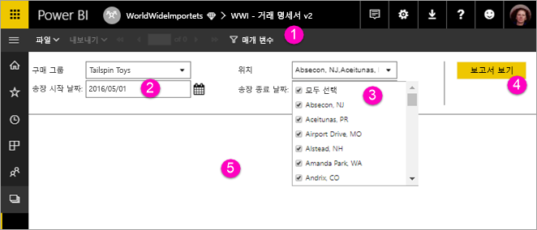

# Power BI 서비스에서 페이지를 매긴 보고서에 대한 매개 변수 보기

이 문서에서는 Power BI 서비스에서 페이지를 매긴 보고서에 대한 매개 변수를 조작하는 방법을 알아봅니다.  보고서 매개 변수는 보고서 데이터를 필터링하는 방법을 제공합니다. 매개 변수는 사용 가능한 값 목록을 제공하며 사용자는 하나 이상의 값을 선택할 수 있습니다. 매개 변수에 기본값이 있는 경우도 있고 보고서를 보려면 먼저 값을 선택해야 하는 경우도 있습니다.  

매개 변수가 있는 보고서를 보는 경우 보고서 뷰어 도구 모음에서 각 매개 변수를 표시하므로 대화형으로 값을 지정할 수 있습니다. 다음 그림은 **구매 그룹**, **위치**, **시작 날짜** 및 **종료 날짜**에 대한 매개 변수가 사용된 보고서의 매개 변수 영역을 보여 줍니다.  

## Power BI 서비스의 매개 변수 창

  
1.  **매개 변수 창** 보고서 뷰어 도구 모음에서 각 매개 변수에 대해 “필수” 또는 기본값과 같은 프롬프트를 표시합니다.    
  
2.  **송장 시작/종료 날짜 매개 변수** 두 개의 데이터 매개 변수에 기본값이 있습니다. 날짜를 변경하려면 텍스트 상자에 날짜를 입력하거나 달력에서 날짜를 선택합니다.  
  
3.  **위치 매개 변수** 위치 매개 변수는 값을 한 개, 여러 개 또는 모두 선택할 수 있도록 설정됩니다. 
  
4.  **보고서 보기** 매개 변수 값을 입력하거나 변경한 후 **보고서 보기**를 클릭하여 보고서를 실행합니다. 

5. **기본값** 모든 매개 변수에 기본값이 있으면 보고서를 처음 볼 때 자동으로 실행됩니다. 이 보고서의 일부 매개 변수에 기본값이 없으므로 값을 선택할 때까지 보고서가 표시되지 않습니다.  

## 다음 단계

[Power BI 서비스에서 페이지를 매긴 보고서에 대한 매개 변수 만들기](paginated-reports-parameters.md)
