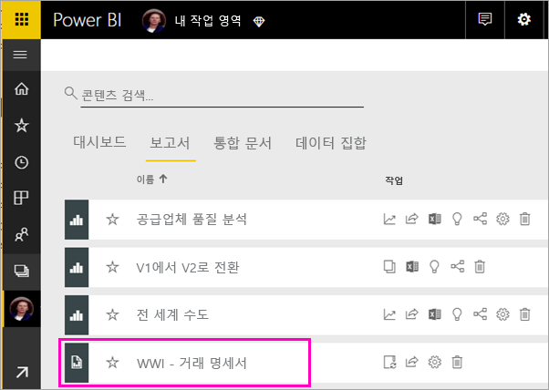
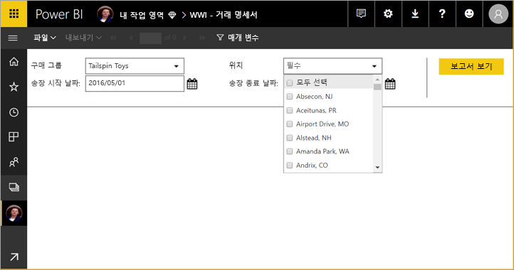
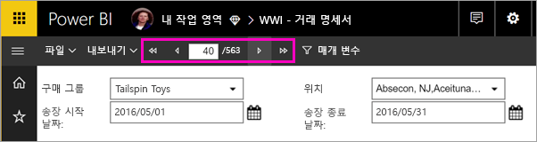
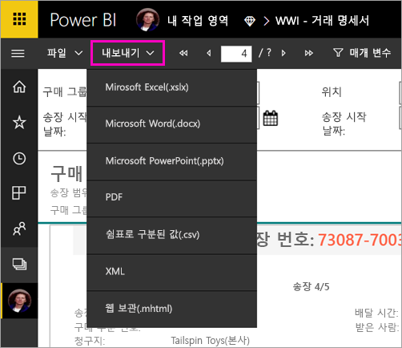

# Power BI 서비스에서 페이지를 매긴 보고서 보기

이 문서에서는 Power BI 서비스에 게시된 페이지를 매긴 보고서를 보는 방법을 알아봅니다. 페이지를 매긴 보고서는 보고서 작성기에서 만들어지고 프리미엄 용량의 작업 영역에 업로드된 보고서입니다. 작업 영역 이름 옆의 다이아몬드 아이콘  을 찾으세요. 

페이지를 매긴 보고서에는 고유한 아이콘이 있습니다. .

페이지를 매긴 보고서를 다음과 같은 여러 형식으로 내보낼 수도 있습니다. 

- Microsoft Excel
- Microsoft Word
- Microsoft PowerPoint
- PDF
- 쉼표로 구분된 값
- XML
- 웹 보관(.mhtml)

## 페이지를 매긴 보고서 보기

1. 작업 영역에서 페이지를 매긴 보고서를 선택합니다.

    

2. 이 예에서처럼 보고서에 매개 변수가 있는 경우 처음 열 때 보고서가 표시되지 않을 수 있습니다. 매개 변수를 선택한 후 **보고서 보기**를 선택하세요. 

     

    언제든 매개 변수를 변경할 수도 있습니다.

1. 페이지 맨 위에 있는 화살표를 선택하거나 상자에 페이지 번호를 입력하여 보고서를 페이징합니다.
    
   

4. 페이지를 매긴 보고서를 내보낼 형식을 찾으려면 **내보내기**를 선택합니다.

    

## 다음 단계

[Power BI Premium에서 페이지를 매긴 보고서란?](paginated-reports-report-builder-power-bi.md)
