# 보고서 페이지의 크기 변경(자습서)
[이전 문서 및 비디오](power-bi-report-display-settings.md)에서는 Power BI 보고서에서 페이지 표시를 제어하는 두 가지 방법으로 **보기** 및 **페이지 크기**에 대해 알아보았습니다. 이제 직접 해보겠습니다.

## 먼저, 페이지 보기 설정을 변경해보겠습니다.
1. 읽기용 보기나 편집용 보기에서 보고서를 엽니다. 이 예제에서는 [소매점 분석 샘플](sample-retail-analysis.md)의 "새 상점" 페이지를 사용합니다.  이 페이지는 **페이지에 맞춤** 설정을 사용하여 표시됩니다.  이 경우 페이지에 맞춤은 스크롤 막대 없이 보고서 페이지를 표시하지만 일부 세부 정보와 제목이 너무 작아서 읽을 수 없습니다.
   
   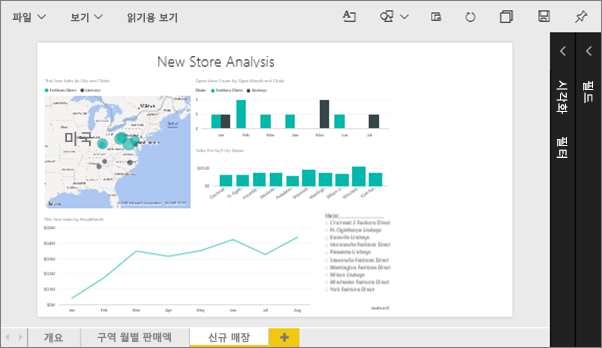
2. 캔버스에서 시각화를 선택하지 않았는지 확인합니다. **보기** 를 선택하고 표시 옵션을 검토합니다.

* 읽기용 보기에서 볼 수 있습니다.
  
     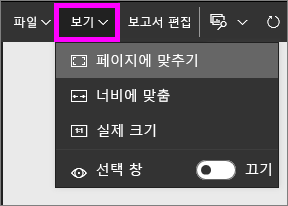
* 편집용 보기에서 볼 수 있습니다.
  
    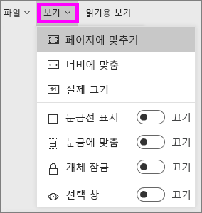

1. **실제 크기** 설정을 사용하면 페이지 모양이 어떻게 되는지 확인해보겠습니다.
   
   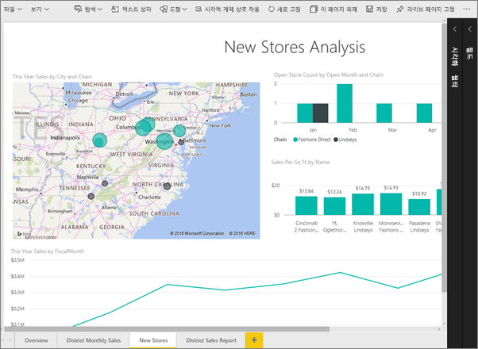
   
   그다지 좋지 않습니다. 대시보드에 스크롤 막대가 이제 두 개 있습니다.
2. **너비에 맞추기**로 전환합니다.
   
   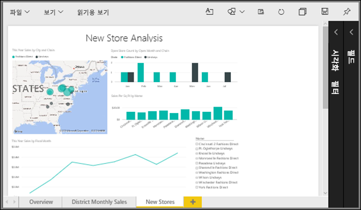
   
   이제 스크롤 막대가 있지만 세부 정보를 읽는 것이 더 쉬워졌으므로 모양이 향상되었습니다.

## 보고서 페이지의 기본 보기 변경
모든 Power BI 보고서는 **페이지에 맞추기** 보기가 기본으로 사용됩니다. 보고서 페이지를 항상 **실제 크기** 보기로 열려면 어떻게 해야 할까요?

1. 보고서의 **새 상점** 페이지에서 **실제 크기** 보기로 다시 전환합니다.
   
   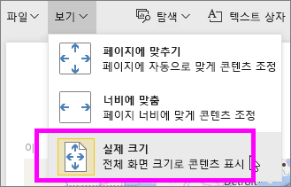
2. **파일 > 다른 이름으로 저장**을 선택하여 보고서를 다른 이름으로 저장합니다. 보고서의 복사본이 이제 2개 입니다. 원본 보고서에서는 **새 상점**이 기본 보기로 계속 열리지만 새 보고서에서는 **실제 크기** 보기로 열리게 됩니다. 실제로 살펴보겠습니다.
   
   
3. 위쪽 탐색 모음에서 현재 작업 영역의 이름을 선택하여 해당 작업 영역으로 돌아갑니다.  
   
   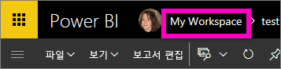
4. **보고서** 탭을 선택하고 방금 만든 새 보고서를 선택합니다(노란색 별표가 있음).
   
    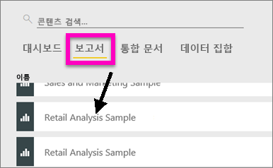
5. 보고서가 **실제 크기** 보기에서 열립니다.
   
   

## 이제 *페이지 크기* 설정을 살펴보겠습니다.
페이지 크기 설정은 [편집용 보기](service-interact-with-a-report-in-editing-view.md)에서만 사용할 수 있습니다. 편집용 보기에서 보고서를 열려면 해당 보고서에 대한 소유자 권한이 있어야 합니다. [샘플](sample-datasets.md) 중 하나에 연결한 경우 해당 보고서에 대한 소유자 권한이 있습니다.

1. 편집용 보기에서 [소매점 분석 샘플](sample-retail-analysis.md)의 "지역 월간 판매량" 페이지를 엽니다.
2. 캔버스에서 시각화를 선택하지 않았는지 확인합니다.  **시각화** 창에서 페인트 롤러 아이콘 을 선택합니다.
3. **페이지 크기** &gt; **형식**을 선택하여 페이지 크기 옵션을 표시합니다.
   
   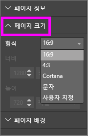
4. **Letter**를 선택합니다.  캔버스에서 816 x 1056픽셀(Letter 크기) 내에 맞는 콘텐츠만 캔버스의 흰색 부분에 남아 있습니다.
   
   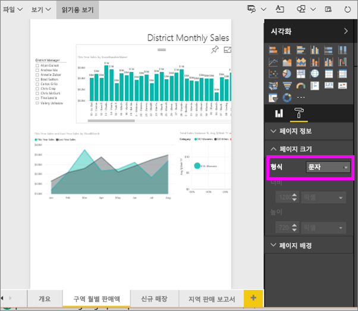
5. **보기** 를 "너비에 맞추기"로 변경하면 캔버스에 Letter 크기에 맞는 페이지 콘텐츠만 표시됩니다.
   
   
6. **페이지 크기** **16:9** 비율을 선택합니다.
   
   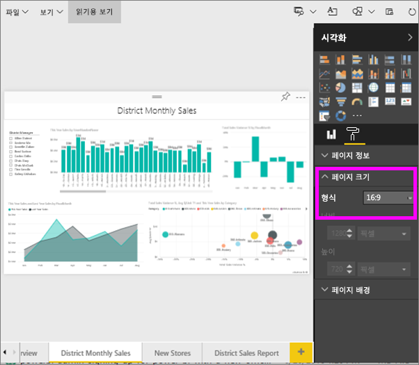
   
   보고서 페이지의 너비:높이를 16:9로 표시합니다. 실제 사용되는 픽셀 크기를 보려면 회색 표시된 너비 및 높이 필드 (1280x720)를 확인합니다. 보고서 캔버스 주위에는 빈 공간이 많은데 이전에 **보기**를 "너비에 맞추기"로 설정했기 때문입니다.
7. **페이지 크기** 옵션을 계속 탐색합니다.

## 페이지 보기 및 페이지 크기 함께 사용
페이지 보기 및 페이지 크기를 함께 사용하여 다른 응용 프로그램에 포함되는 경우 가장 잘 표시되는 보고서를 만듭니다.

이 연습에서는 너비가 500픽셀이고 높이가 750픽셀인 공간을 포함하는 응용 프로그램에 표시될 보고서 페이지를 만듭니다.

이전 단계에서 보고서 페이지가 너비 1280, 높이 720에 표시되는 것을 보았습니다. 따라서 시각적 개체를 모두 맞추려면 크기를 조정하고 정렬하는 작업을 많이 해야 합니다.

1. 현재 캔버스 영역의 절반 미만에 맞게 시각적 개체의 크기를 조정하고 이동합니다.
   
    
2. **페이지 크기** &gt; **사용자 지정**을 선택합니다.
3. 너비를 500으로 설정하고 높이를 750으로 설정합니다.
   
    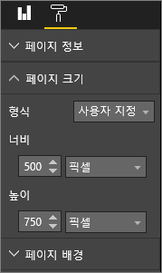
4. 보고서 페이지가 가장 잘 표시되도록 조정합니다. **보기 > 실제 크기**와 **보기 > 페이지에 맞추기**를 전환하면서 조정합니다.
   
    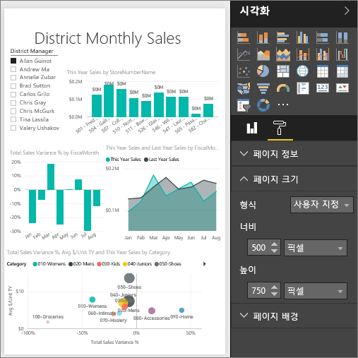

## 다음 단계
[Cortana에 대한 보고서 만들기](service-cortana-answer-cards.md)

[Power BI 보고서의 페이지 표시 설정](power-bi-report-display-settings.md)으로 돌아가기

[Power BI의 보고서](service-reports.md)에 대해 자세히 알아보기

궁금한 점이 더 있나요? [Power BI 커뮤니티를 이용하세요.](http://community.powerbi.com/)

