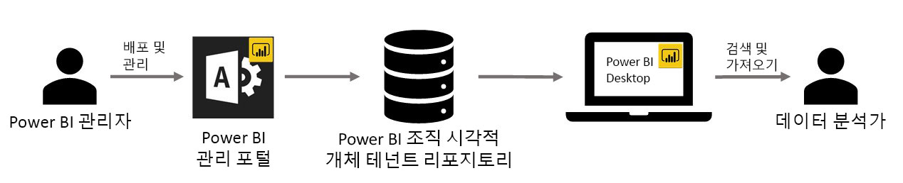

# Power BI의 조직 시각적 개체

Power BI에서 Power BI 시각적 개체를 사용하여 사용자에게 맞는 고유한 유형의 시각적 개체를 만들 수 있습니다. Power BI 시각적 개체는 Power BI에 포함된 수많은 시각적 개체로도 요구 사항이 충족되지 않을 때 개발자가 만듭니다.

일부 조직에서 Power BI 시각적 개체는 조직에 고유한 특정 데이터 또는 인사이트를 전달하는 데 필요하거나, 특별한 데이터 요구 사항이 있거나, 프라이빗 비즈니스 방법을 강조할 수 있기 때문에 훨씬 더 중요합니다. 이러한 조직은 Power BI 시각적 개체를 개발하고, 조직에서 공유하고, 적절하게 관리해야 합니다. Power BI Power BI 시각적 개체를 통해 조직은 이러한 작업을 수행할 수 있습니다.

다음 이미지는 Power BI에서 조직의 Power BI 시각적 개체가 관리자로부터 개발 및 유지 관리를 거쳐 마지막으로 데이터 분석까지 흐르는 프로세스를 보여 줍니다.

조직의 시각적 개체는 Power BI 관리자가 관리 포털에서 배포하고 관리합니다. 조직의 리포지토리에 배포되면 조직의 사용자는 쉽게 검색할 수 있고 조직의 Power BI 시각적 개체를 Power BI Desktop에서 바로 보고서로 가져올 수 있습니다.

사용자가 만든 보고서에서 조직의 Power BI 시각적 개체를 사용하는 방법을 자세히 알아보려면 [조직의 시각적 개체를 보고서로 가져오는 방법 자세히 알아보기](power-bi-custom-visuals.md)를 참조하세요.

## 조직의 Power BI 시각적 개체 관리

조직에서 조직의 Power BI 시각적 개체를 관리하고 배포하는 방법을 자세히 알아보려면 [조직의 Power BI 시각적 개체를 배포하고 관리하는 방법 자세히 알아보기](https://go.microsoft.com/fwlink/?linkid=866790)를 참조하세요.

> [!WARNING]
> 사용자 지정 시각적 개체에는 보안 또는 개인 정보 위험이 있는 코드가 포함될 수 있습니다. 조직의 리포지토리에 배포하기 전에 사용자 지정 시각적 개체의 작성자와 원본을 신뢰할 수 있는지 확인하세요.

## 고려 사항 및 제한 사항

알고 있어야 하는 여러 가지 고려 사항과 제한 사항이 있습니다.

관리자:

* 레거시 Power BI 시각적 개체(새 버전의 API를 기반으로 빌드되지 않은 Power BI 시각적 개체 등)는 지원되지 않습니다.

* 리포지토리에서 사용자 지정 시각적 개체를 삭제하면 삭제된 시각적 개체를 사용하는 기존 보고서는 렌더링을 중지합니다. 리포지토리에서 수행한 삭제 작업은 되돌릴 수 없습니다. 사용자 지정 시각적 개체를 일시적으로 사용하지 않도록 설정하려면 “사용 안 함” 기능을 사용합니다.

최종 사용자:

* 조직의 Power BI 시각적 개체는 조직 리포지토리에서 가져온 프라이빗 시각적 개체입니다. 모든 프라이빗 시각적 개체처럼 이 시각적 개체는 [PowerPoint에 내보내거나](https://docs.microsoft.com/power-bi/consumer/end-user-powerpoint) 사용자가 [보고서 페이지를 구독](https://docs.microsoft.com/power-bi/consumer/end-user-subscribe)할 때 받은 메일에 표시할 수 있습니다. Marketplace에서 직접 가져온 [인증된 Power BI 시각적 개체](https://docs.microsoft.com/power-bi/power-bi-custom-visuals-certified)만 이러한 기능을 지원합니다.

* AppSource Marketplace의 GlobeMap 시각적 개체, Visio 시각적 개체, PowerApps 시각적 개체 및 Map box 시각적 개체는 조직 리포지토리를 통해 배포된 경우 렌더링되지 않습니다.

## 문제 해결

문제 해결에 대한 자세한 내용은 [Power BI Power BI 시각적 개체 문제 해결](power-bi-custom-visuals-troubleshoot.md)을 방문하세요.

## FAQ

자세한 내용 및 질문과 대답은 [Power BI Power BI 시각적 개체에 대한 질문과 대답](power-bi-custom-visuals-faq.md#organizational-visuals)을 참조하세요.

궁금한 점이 더 있나요? [Power BI 커뮤니티를 이용](http://community.powerbi.com/)하세요.
