# Power BI의 사용자 지정 시각적 개체
Power BI 보고서를 만들거나 편집 할 때 사용할 수 있는 다양한 유형의 시각적 개체가 있습니다. 이러한 시각적 개체는 **시각화** 창에 표시됩니다. Power BI Desktop을 다운로드하거나 Power BI 서비스(app.powerbi.com)를 열면 이 시각적 개체 집합이 "사전 패키지 형태"로 제공됩니다.

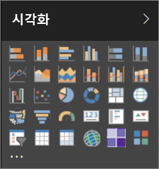

하지만 이 시각적 개체 집합에 국한되지 않으며, 타원을 선택하면 *사용자 지정 시각적 개체*라는 보고서 시각적 개체의 다른 원본이 열립니다.

사용자 지정 시각적 개체는 개발자가 사용자 지정 시각적 개체 SDK를 사용하여 만들어, 비즈니스 사용자가 비즈니스에 가장 적합한 방식으로 데이터를 표시할 수 있도록 합니다. 그런 다음, 보고서 작성자는 사용자 지정 시각적 개체 파일을 보고서로 가져오고 다른 Power BI 시각적 개체로 사용할 수 있습니다. 사용자 지정 시각적 개체는 Power BI에서 가장 중요하며 필터링, 강조 표시, 편집, 공유될 수 있습니다.

사용자 지정 시각적 개체는 다음 세 가지 배포 채널 형태로 있을 수 있습니다.
* 사용자 지정 시각적 개체 파일
* 조직의 시각적 개체
* 마켓플레이스 시각적 개체

## 사용자 지정 시각적 개체 파일

사용자 지정 시각적 개체는 제공되는 데이터 렌더링에 대한 코드가 포함된 패키지입니다. 누구나 사용자 지정 시각적 개체를 만들고 Power BI 보고서로 가져올 수 있는 단일 .pbiviz 파일로 패키지할 수 있습니다.

> [!WARNING]
> 사용자 지정 시각적 개체에는 보안 또는 개인 정보 관련 위험이 있는 코드가 포함될 수 있습니다. 보고서로 가져오기 전에 사용자 지정 시각적 개체의 작성자와 원본을 신뢰할 수 있는지 확인해야 합니다.
> 
> 

## 조직의 시각적 개체

Power BI 관리자는 사용자 지정 시각적 개체를 조직에 배포할 수 있습니다. 그러면 보고서 작성자는 관리자가 조직 내에서 사용할 수 있도록 승인한 사용자 지정 시각적 개체를 쉽게 검색하고 사용할 수 있습니다. 이로써 관리자는 조직에 배포할 특정 사용자 지정 시각적 개체를 선택할 수 있을 뿐만 아니라 이러한 시각적 개체를 쉽게 관리(업데이트 버전, 사용/사용 안 함 등)할 수 있습니다. 보고서 작성자의 경우, 해당 시각적 개체 업데이트를 원할하게 지원할 수 있을 뿐만 아니라 조직에 고유한 시각적 개체를 쉽게 찾을 수 있습니다.

조직의 사용자 지정 시각적 개체에 대한 자세한 내용은 [조직의 시각적 개체](power-bi-custom-visuals-organization.md)를 참조하세요.

## 마켓플레이스 시각적 개체

Microsoft뿐만 아니라 커뮤니티 회원들이 공공 이익을 위해 사용자 지정 시각적 개체에 기여하고 [AppSource](https://appsource.microsoft.com/en-us/marketplace/apps?product=power-bi-visuals) 마켓플레이스에 게시했습니다. 이러한 시각적 개체는 다운로드하여 Power BI 보고서에 추가할 수 있습니다. 이러한 모든 사용자 지정 시각적 개체는 Microsoft에서 기능과 품질을 테스트하고 승인했습니다.

AppSource란? 간단히 말해서, Microsoft 소프트웨어에 대한 앱, 추가 기능 및 확장을 찾을 수 있는 곳입니다. [AppSource](https://appsource.microsoft.com/en-us/)는 전보다 효율적이고, 멋지고, 통찰력 있게 작업할 수 있도록 도와주는 솔루션을 수백만 명의 Office 365, Azure, Dynamics 365, Cortana 및 Power BI 제품 사용자와 연결해 줍니다.

### 인증 시각적 개체

Power BI 인증 시각적 개체는 품질에 대해 추가로 엄격한 테스트를 거친 마켓플레이스 시각적 개체이며, [메일 구독](https://docs.microsoft.com/power-bi/service-report-subscribe), [PowerPoint로 내보내기](https://docs.microsoft.com/power-bi/service-publish-to-powerpoint) 등과 같은 추가적인 시나리오에서도 지원됩니다.
인증된 사용자 지정 시각적 개체 목록을 보거나 사용자 고유의 개체를 제출하려면 [인증된 사용자 지정 시각적 개체](https://docs.microsoft.com/power-bi/power-bi-custom-visuals-certified)를 참조하세요.

웹 개발자로서 고유한 시각화를 만들고 AppSource에 추가하는 데 관심이 있나요? [개발자 도구 시작하기](https://docs.microsoft.com/power-bi/service-custom-visuals-getting-started-with-developer-tools)를 참조하고 [AppSource에 사용자 지정 시각적 개체를 게시](https://appsource.microsoft.com/en-us/marketplace/apps?product=power-bi-visuals)하는 방법을 알아봅니다.

### 파일에서 사용자 지정 시각적 개체 가져오기

1. 시각화 창 아래쪽에서 줄임표(...)를 선택합니다.

    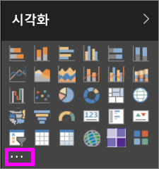

2. 드롭다운에서 **파일에서 가져오기**를 선택합니다.

    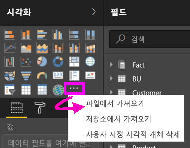

3. [파일 열기] 메뉴에서 가져올 .pbiviz 파일을 선택한 다음, [열기]를 선택합니다. 사용자 지정 시각적 개체의 아이콘은 시각화 창 맨 아래에 추가되어 이제 보고서에서 사용할 수 있습니다.

    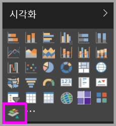

### 조직의 시각적 개체 가져오기

1. 시각화 창 아래쪽에서 줄임표(...)를 선택합니다.

    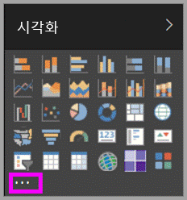

2. 드롭다운에서 [마켓플레이스에서 가져오기]를 선택합니다.

    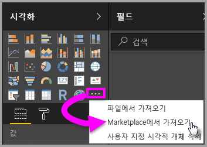

3. 상단 탭 메뉴에서 **내 조직**을 선택합니다.

    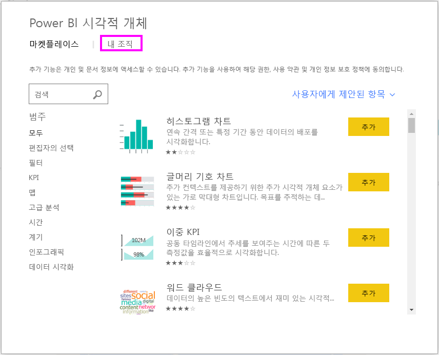

4. 목록을 스크롤하여 가져오려는 시각적 개체를 검색합니다.
    
    

5. **추가**를 선택하여 사용자 지정 시각적 개체를 가져옵니다. 사용자 지정 시각적 개체의 아이콘은 시각화 창 맨 아래에 추가되어 이제 보고서에서 사용할 수 있습니다.

    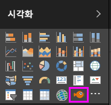
 
## Microsoft AppSource에서 사용자 지정 시각적 개체 다운로드 또는 가져오기
사용자 지정 시각적 개체는 Power BI 내에서 그리고 AppSource 웹 사이트에서 다운로드하고 가져올 수 있습니다.

### Power BI 내에서 사용자 지정 시각적 개체 가져오기

1. 시각화 창 아래쪽에서 줄임표(...)를 선택합니다.

    

2. 드롭다운에서 **마켓플레이스에서 가져오기**를 선택합니다.

    

3. 목록을 스크롤하여 가져오려는 시각적 개체를 검색합니다.

    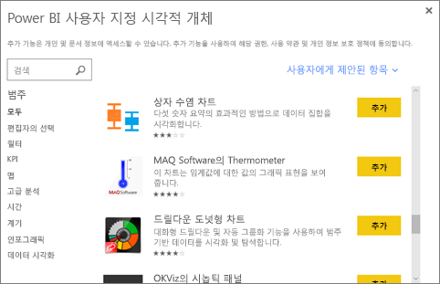

4. 시각적 개체 중 하나에 대해 자세한 알아보려면 해당 시각적 개체를 강조 표시하여 선택합니다.

    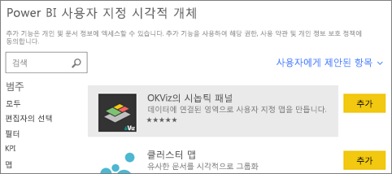

5. 세부 정보 페이지에서는 스크린샷, 비디오, 자세한 설명 등을 볼 수 있습니다.

    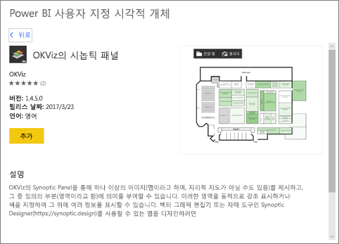

6. 아래쪽으로 스크롤하여 리뷰를 확인합니다.

    

7. [추가]를 선택하여 사용자 지정 시각적 개체를 가져옵니다. 사용자 지정 시각적 개체의 아이콘은 시각화 창 맨 아래에 추가되어 이제 보고서에서 사용할 수 있습니다.

    

### Microsoft AppSource에서 사용자 지정 시각적 개체 다운로드 및 가져오기

1. [Microsoft AppSource](https://appsource.microsoft.com)에서 시작하고 **앱**의 탭을 선택합니다. 

    

2. 이 작업을 수행하면 [앱 결과 페이지](https://appsource.microsoft.com/en-us/marketplace/apps)로 이동하여 각 범주에서 *Power BI 앱*을 비롯하여 각 범주의 상위 앱을 볼 수 있습니다. 그러나 사용자 정의 시각적 개체를 찾기 때문에 왼쪽 탐색 목록에서  **Power BI 시각적 개체**를 선택하여 결과를 좁히겠습니다.

    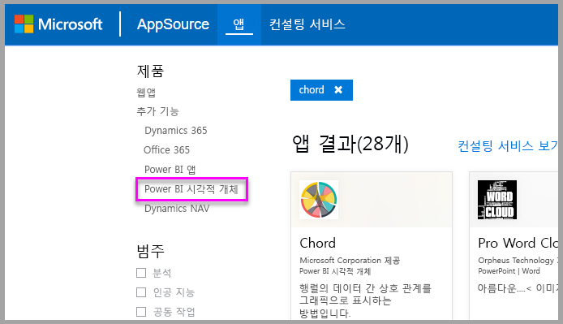

3. AppSource는 각 사용자 지정 시각적 개체에 대한 타일을 표시합니다.  각 타일에는 사용자 지정 시각적 개체의 스냅숏이 있고 간단한 설명과 다운로드 링크를 제공합니다. 자세한 내용을 보려면 타일을 선택합니다. 

    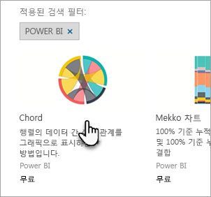

4. 세부 정보 페이지에서는 스크린샷, 비디오, 자세한 설명 등을 볼 수 있습니다. **지금 받기**를 선택하여 사용자 지정 시각적 개체를 다운로드한 다음 사용 약관에 동의합니다. 

    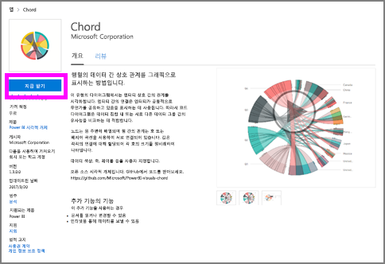

5. 링크를 선택하여 사용자 지정 시각적 개체를 다운로드합니다.

    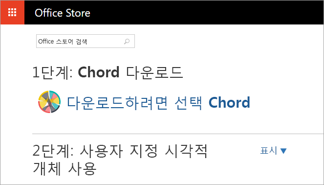

    다운로드 페이지에는 Power BI Desktop 및 Power BI 서비스로 사용자 지정 시각적 개체를 가져오는 방법에 대한 지침도 포함되어 있습니다.

    사용자 지정 시각적 개체가 포함되고 그 기능이 소개되어 있는 샘플 보고서를 다운로드할 수도 있습니다.

    

6. .Pbiviz 파일을 저장한 다음 Power BI를 엽니다.

7. .pbiviz 파일을 보고서로 내보내기(위의 [파일에서 사용자 지정 시각적 개체 가져오기](#import-a-custom-visuals-from-a-file) 섹션 참조)

## 고려 사항 및 문제 해결

- 사용자 지정 시각적 개체는 가져올 때 특정 보고서에 추가됩니다. 다른 보고서에서 시각적 개체를 사용하려는 경우 또한 해당 보고서로 가져와야 합니다. 사용자 지정 시각적 개체가 있는 보고서가 **이름으로 저장** 옵션을 사용하여 저장될 때 사용자 지정 시각적 개체의 복사본이 새 보고서와 함께 저장됩니다.

- **시각화** 창이 표시되지 않으면 보고서에 대한 편집 권한이 없다는 의미입니다.  사용자 지정 시각적 개체를 편집할 수 있는 보고서에만 추가할 수 있으며 사용자와 공유한 보고서에는 추가할 수 없습니다.

궁금한 점이 더 있나요? [Power BI 커뮤니티를 이용하세요.](http://community.powerbi.com/)
