# 보고서 필터 창 둘러보기
이 문서에서는 보고서 필터 창을 자세히 살펴봅니다. Power BI 보고서에 대한 편집용 보기 및 읽기용 보기에서 창이 표시됩니다.

Power BI에서 데이터를 필터링하는 다양한 방법이 있으며, [필터 및 강조 표시 정보](power-bi-reports-filters-and-highlighting.md)를 먼저 읽어보는 것이 좋습니다.

## 필터 작업
[편집용 보기 또는 읽기용 보기](service-reading-view-and-editing-view.md)에서 보고서를 열 수 있습니다. 편집용 보기에서 보고서 소유자는 [보고서에 필터를 추가](power-bi-report-add-filter.md)할 수 있으며 이러한 필터는 보고서와 함께 저장됩니다. 읽기용 보기에서 보고서를 보는 사람은 필터와 상호 작용할 수 있지만 보고서에 필터 변경 사항을 저장할 수 없습니다.

## 읽기용 보기의 필터
보고서가 읽기용 보기에서 열린 경우 필터 창은 보고서 캔버스의 오른쪽에 표시됩니다. 창이 표시되지 않는 경우 오른쪽 위 모서리의 화살표를 선택하여 확장합니다.

이 예제에서 6개의 필터가 있는 시각적 개체를 선택했습니다. 보고서 페이지에도 필터가 있으며, **페이지 수준 필터** 머리글 아래 나열되어 있습니다. 하나의 [드릴스루 필터](power-bi-report-add-filter.md)가 있으며 전체 보고서에도 필터가 있습니다. **FiscalYear**는 2013 또는 2014입니다.

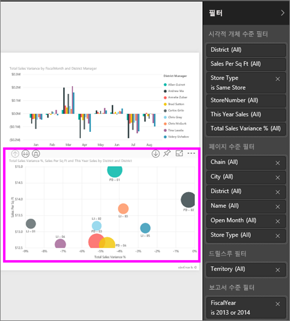

일부 필터는 필터 옆에 **All**이라는 단어가 있으며 이는 모든 값이 필터에 포함되고 있는 것을 의미합니다.  예를 들어 아래 스크린샷의 **Chain(All)**은 이 보고서 페이지가 모든 상점 체인에 대한 데이터를 포함한다는 것을 알려줍니다.  반면 **FiscalYear는 2013 또는 2014입니다**의 보고서 수준 필터는 보고서가 2013 및 2014년의 회계 연도에 대한 데이터만을 포함한다는 것을 알려줍니다.

이 보고서를 보는 모든 사용자가 이 필터와 상호 작용할 수 있습니다.

* 필터 옆의 화살표를 마우스로 가리키고 선택하여 필터의 세부 정보를 봅니다.
  
   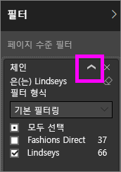
* 필터를 변경합니다. 예를 들어 **Lindseys**를 **Fashions Direct**로 변경합니다.
  
     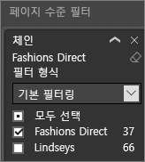
* 필터 이름 옆의 **x**를 선택하여 필터를 삭제합니다.
  
  필터를 삭제하면 목록에서 제거하지만 보고서에서는 해당 데이터가 삭제되지 않습니다.  예를 들어 **FiscalYear는 2013 또는 2014입니다** 필터를 삭제하는 경우 회계 연도 데이터는 보고서에 그대로 유지되지만 2013 및 2014를 표시하도록 더 이상 필터링되지 않습니다. 데이터가 포함하는 모든 회계 연도를 표시합니다.  그러나 필터를 삭제하면 목록에서 제거되므로 다시 수정할 수 없습니다. 더 나은 옵션은 지우개 아이콘 을 선택하여 필터를 지우는 것입니다.
  
  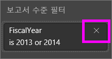

## 편집용 보기의 필터
보고서가 편집용 보기에서 열린 경우 필터 창은 **시각화 창**의 아래쪽 절반에 있는 보고서 캔버스의 오른쪽에 표시됩니다. 창이 표시되지 않는 경우 오른쪽 위 모서리의 화살표를 선택하여 확장합니다.

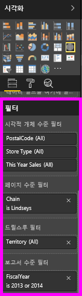.  

캔버스에서 선택한 시각적 요소가 없는 경우 필터 창에는 전체 보고서 페이지 또는 전체 보고서에 적용되는 필터 및 모든 드릴스루 필터만 표시됩니다(설정된 경우). 아래 예제에서는 선택한 시각적 요소가 없고 페이지 수준 또는 드릴스루 필터가 없지만 보고서 수준 필터는 있습니다.  

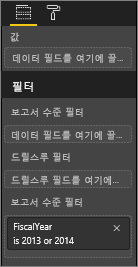  

캔버스에서 시각적 요소를 선택한 경우 해당 시각적 요소에 적용되는 필터도 표시됩니다.   

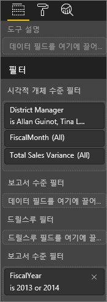

특정 필터에 대한 옵션을 표시하려면 필터 이름 옆의 아래쪽 화살표를 선택합니다.  아래 예제에서는 보고서 수준 필터가 2013 및 2014로 설정됩니다. 또한 다음은 **기본 필터링**의 예제입니다.  고급 옵션을 표시하려면 **고급 필터링**을 선택합니다.

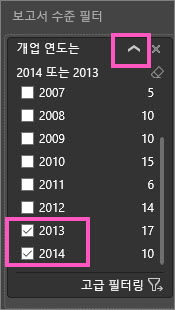

## 필터 지우기
 고급 또는 기본 필터링 모드에서 지우개 아이콘 을 선택하여 필터를 다시 설정합니다. 

## 필터 추가
* 편집용 보기의 필드 창에서 필드를 선택하고 적절한 필터 웰로 끌어 놓아 시각적 개체, 페이지, 드릴스루 또는 보고서에 필터를 추가합니다. 여기에서 **여기에 필드를 끌어 놓으십시오.**라는 단어가 표시됩니다. 필드가 필터로 추가되면 기본 필터링 및 고급 필터링 제어를 사용하여 미세 조정합니다(아래 설명 참조).

시각적 개체 수준 필터 영역으로 새 필드 끌어서 놓기는 해당 필드를 시각적 개체에 추가하지 않지만 이 새 필드와 함께 시각적 개체를 필터링할 수 있습니다. 아래 예제에서 **Chain**이 새 필터로 시각적 개체에 추가됩니다. 단순히 **Chain**을 필터로 추가하는 것은 기본 또는 고급 필터링 제어를 사용할 때까지 시각적 개체를 변경하지 않습니다.

    

* 시각화를 만드는 데 사용되는 모든 필드를 필터로 사용할 수도 있습니다. 먼저 시각적 개체를 선택하여 활성화합니다. 시각적 개체에서 사용 중인 필드는 시각화 창(편집용 보기에 있는 경우) 및 **시각적 수준 필터** 제목 아래의 필터 창에 나열됩니다.
  
   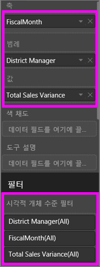  
  
   기본 필터링 및 고급 필터링 제어를 사용하여 이러한 필드를 미세 조정합니다(아래 설명 참조).

## 필터 종류: 텍스트 필드 필터
### 목록 모드
확인란을 선택/해제하여 값을 선택 또는 선택 취소합니다. **모두** 확인란은 모든 확인란의 상태를 켜기 또는 끄기로 전환하는 데 사용할 수 있습니다. 확인란은 해당 필드에 대해 사용 가능한 모든 값을 나타냅니다.  필터를 조정하면 선택 항목을 반영하도록 재작성이 업데이트됩니다. 

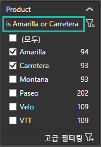

재작성에서 "is Amarilla or Carretera"라고 어떻게 말하는지 확인합니다.

### 고급 모드
**고급 필터링**을 선택하여 고급 모드로 전환합니다. 드롭다운 컨트롤 및 텍스트 상자를 사용하여 포함할 필드를 식별합니다. **And** 및 **Or**중에서 선택하여 복잡한 필터 식을 작성할 수 있습니다. 원하는 값을 설정했으면 **필터 적용** 단추를 선택합니다.  

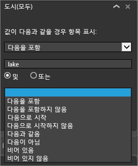

## 필터 종류: 숫자 필드 필터
### 목록 모드
값이 한정된 경우 필드 이름을 선택하면 목록이 표시됩니다.  확인란 사용에 대한 도움말은 위의 **텍스트 필드 필터** &gt; **목록 모드**를 참조하세요.   

### 고급 모드
값이 한정되지 않거나 범위를 나타내는 경우 필드 이름을 선택하면 고급 필터 모드가 열립니다. 드롭다운 및 텍스트 상자를 사용하여 표시할 값 범위를 지정합니다. 

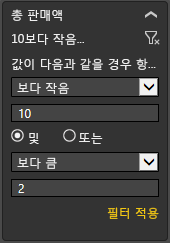

**And** 및 **Or**중에서 선택하여 복잡한 필터 식을 작성할 수 있습니다. 원하는 값을 설정했으면 **필터 적용** 단추를 선택합니다.

## 필터 종류: 날짜 및 시간
### 목록 모드
값이 한정된 경우 필드 이름을 선택하면 목록이 표시됩니다.  확인란 사용에 대한 도움말은 위의 **텍스트 필드 필터** &gt; **목록 모드**를 참조하세요.   

### 고급 모드
필드 값이 날짜 또는 시간을 나타내는 경우 날짜/시간 필터를 사용할 때 시작/끝 시간을 지정할 수 있습니다.  

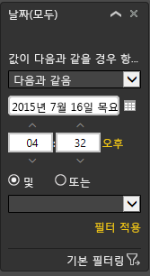

## 다음 단계
[필터 및 보고서에서 강조 표시](power-bi-reports-filters-and-highlighting.md)  
[필터로 조작 및 보고서 읽기용 보기에서 강조 표시](service-reading-view-and-editing-view.md)  
[보고서 편집용 보기에서 필터 만들기](power-bi-report-add-filter.md)  
[보고서 시각적 개체가 서로 교차 필터링 및 교차 강조 표시되는 방식 변경](service-reports-visual-interactions.md)

[Power BI의 보고서](service-reports.md)에 대해 자세히 알아보기  
[Power BI - 기본 개념](service-basic-concepts.md)

궁금한 점이 더 있나요? [Power BI 커뮤니티를 이용하세요.](http://community.powerbi.com/)

