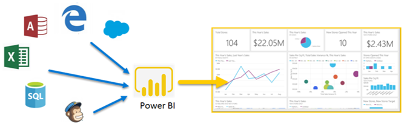
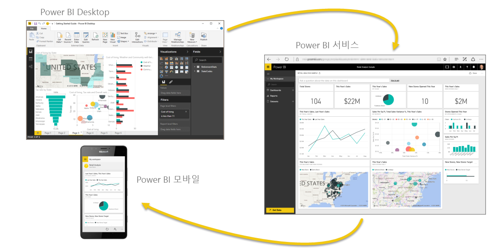
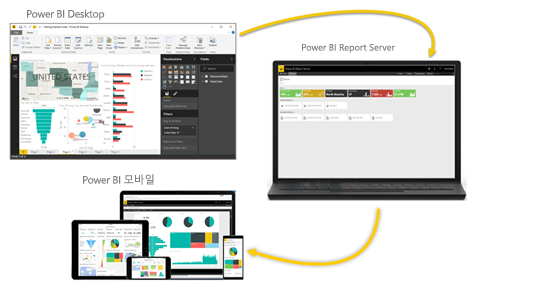

# Power BI란?
**Power BI**는 관련 없는 데이터 소스를 시각적으로 몰입도가 뛰어나고 일관된 대화형 정보로 변환하는 소프트웨어 서비스, 앱 및 커넥터의 컬렉션입니다. 데이터는 Excel 스프레드시트이거나 클라우드 기반 및 온-프레미스 하이브리드 데이터 웨어하우스의 컬렉션일 수 있습니다. **Power BI**를 사용하면 쉽게 데이터 원본에 연결하고, 중요한 항목을 시각화 및 검색하고, 원하는 모든 사람과 공유할 수 있습니다.

**Power BI**는 단순하고 빠르기 때문에 Excel 스프레드시트 또는 로컬 데이터베이스에서 빠른 정보를 생성할 수 있습니다. 하지만 **Power BI**는 강력하면서도 엔터프라이즈급이기 때문에 광범위한 모델링 및 실시간 분석뿐 아니라 사용자 지정 개발에 즉시 사용할 수 있습니다. 따라서 개인 보고서 및 시각화 도구라고 할 수 있습니다. 또한 그룹 프로젝트, 부서 또는 전체 기업의 분석 및 의사 결정 엔진으로도 사용할 수 있습니다.

## Power BI의 요소
Power BI는 **Power BI Desktop**이라는 Windows 데스크톱 애플리케이션, **Power BI 서비스**라는 온라인 SaaS(*Software as a Service*) Windows, iOS 및 Android 디바이스용 **모바일 앱**으로 구성됩니다.

이 세 가지 요소(**Power BI Desktop**, **서비스** 및 **모바일 앱**)는 직원들이 자신 또는 자신의 역할에 가장 효과적인 방식으로 비즈니스 인사이트를 생성, 공유 또는 소비하도록 설계되었습니다.

네 번째 요소 **Power BI Report Server**를 사용하면 Power BI Desktop에서 만든 Power BI 보고서를 온-프레미스 보고서 서버에 게시할 수 있습니다. [Power BI Report Server](#on-premises-reporting-with-power-bi-report-server)에 대해 자세히 알아보세요.

## Power BI와 사용자 역할을 일치시키는 방법
Power BI 사용 방법은 프로젝트 또는 팀에서 사용자의 역할에 따라 달라질 수 있습니다. 또한 다른 역할을 맡은 사람은 Power BI를 다른 방식으로 사용할 수도 있습니다.

예를 들어 여러분은 주로 **Power BI 서비스**를 사용할 수 있습니다. 하지만 숫자를 다루는 비즈니스 보고서를 작성하는 동료는 **Power BI Desktop**을 광범위하게 사용하여 보고서를 작성한 다음 여러분이 보는 Power BI 서비스에 이 보고서를 게시할 수 있습니다. 영업을 담당하는 또 다른 동료는 주로 Power BI 전화 앱을 사용하여 자신의 영업 할당량 관련 진행 상황을 모니터링하고 새로운 잠재 고객의 세부 정보를 확인할 수 있습니다.

개발자인 경우 Power BI API를 사용하여 데이터를 데이터 세트로 푸시하거나 대시보드와 보고서를 사용자 지정 애플리케이션에 포함할 수 있습니다. 새로운 시각적 개체에 대한 아이디어가 있나요? 직접 빌드하고 다른 사람과 공유합니다.  

달성하려는 목표 또는 지정된 프로젝트에서 맡은 역할에 따라 **Power BI**의 각 요소를 서로 다른 시점에 사용할 수도 있습니다.

**Power BI Desktop**을 사용하여 팀을 위해 고객 참여 통계 관련 보고서를 작성할 수도 있습니다. 서비스의 실시간 대시보드에서 재고 및 제조 진행 상황을 볼 수도 있습니다. Power BI 사용 방법은 상황에 가장 적합한 Power BI 도구나 서비스가 무엇이냐에 따라 다를 수 있습니다. 상황에 맞게 Power BI의 각 부분을 사용할 수 있어서 매우 유연하고 매력적입니다.

역할과 관련된 문서를 살펴보세요.
- [***‘디자이너용’***](desktop-what-is-desktop.md)Power BI
- [***‘소비자’***](consumer/end-user-consumer.md)용 Power BI
- [***‘개발자’***](developer/what-can-you-do.md)용 Power BI
- [***‘관리자용’***](service-admin-administering-power-bi-in-your-organization.md)Power BI

## Power BI의 작업 흐름
Power BI의 일반적인 작업 흐름은 먼저 데이터 원본에 연결하고 **Power BI Desktop**에서 보고서를 빌드합니다. 그런 다음 **Power BI Desktop**에서 이 보고서를 **Power BI 서비스**에 게시하고 공유하여 최종 사용자가 **서비스** 및 **모바일 디바이스**에서 보고서를 보고 조작할 수 있도록 합니다.
이 워크플로가 일반적이며 세 가지 주요 Power BI 요소가 서로를 어떻게 보완하는지를 보여줍니다.

다음은 [Power BI Desktop과 Power BI 서비스의 자세한 비교](service-service-vs-desktop.md)입니다.

그러나 클라우드로 이동할 준비가 되지 않았는데 보고서를 회사 방화벽 뒤에서 유지하려 한다면 어떻게 될까요?  계속 읽어보세요.

## Power BI Report Server를 사용하여 온-프레미스 보고
Power BI Report Server에서 제공하는 즉시 사용할 도구와 서비스의 범위에서 Power BI, 모바일 및 페이지가 매겨진 온-프레미스 보고서를 만들고, 배포하고 관리합니다.

Power BI Report Server는 방화벽 뒤에 배포한 다음, 웹 브라우저, 모바일 디바이스 또는 메일로 보는지에 관계없이 다양한 방법으로 적합한 사용자에게 보고서를 배달하는 솔루션입니다. 그리고 Power BI Report Server는 클라우드의 Power BI와 호환되므로 준비가 되면 클라우드로 이동할 수 있습니다. 

[Power BI Report Server](report-server/get-started.md)에 대해 자세히 알아보세요.

## 다음 단계
[로그인하고, 일부 데이터를 가져오고, Power BI 서비스 사용 방법을 알아봅니다.](service-the-new-power-bi-experience.md)   
[자습서: Power BI 서비스 시작](service-get-started.md)
[빠른 시작: Power BI Desktop에서 데이터에 연결](desktop-quickstart-connect-to-data.md)