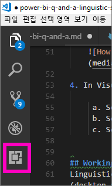
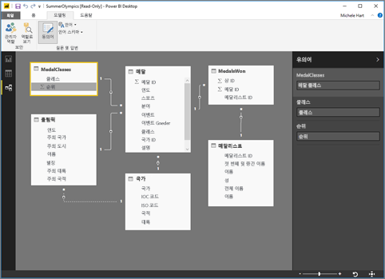

# <a name="edit-qa-linguistic-schema-and-add-phrasings-in-power-bi-desktop"></a>Power BI Desktop에서 질문 및 답변 언어 스키마 편집 및 관용구 추가 
일반적인 구 및 자연어를 사용하여 데이터에 대해 질문하는 것은 강력한 기능입니다. 데이터에서 응답할 때, 즉, Power BI의 질문 및 답변을 통해 수행할 때 훨씬 더 강력합니다. Power BI 질문 및 답변에 질문할 때 정확히 답변하는 것이 최선의 방법입니다. 

그러나 더 나은 질문 및 답변 상호 작용을 위해 답변을 향상시키는 방법이 있으며, 한 가지 방법으로 언어 스키마를 편집하는 것입니다. 

이러한 모든 것은 엔터프라이즈 데이터에서 시작됩니다.  더 나은 데이터 모델일수록 사용자가 좋은 품질의 답변을 더 쉽게 얻을 수 있습니다. 모델을 향상시키는 한 가지 방법은 데이터 집합의 테이블과 열 이름 간의 용어 및 관계를 정의하고 범주화하는 언어 스키마를 추가하는 것입니다. Power BI Desktop은 언어 스키마를 관리하는 곳입니다. 

## <a name="what-is-a-linguistic-schema"></a>언어 스키마란?
언어 스키마는 질문 및 답변에서 데이터 집합과 관련된 음성, 동의어 및 관용구를 포함하여 해당 데이터 집합 내의 개체에 대해 인식해야 하는 용어와 관용구를 설명합니다. 데이터 집합을 가져오거나 연결할 때 Power BI는 데이터 집합의 구조에 따라 언어 스키마를 만듭니다. 질문 및 답변에 질문할 때 데이터의 일치 항목과 관계를 찾아 질문의 의도를 파악합니다. 예를 들어 명사, 동사, 형용사, 관용구 및 기타 요소를 찾습니다. 그리고 어떤 열이 동사의 목적어인지와 같은 관계를 찾습니다. 

품사는 익숙할 것이지만(그렇지 않은 경우 아래 참조), 관용구는 새로운 용어일 수 있습니다.  관용구는 항목 간의 관계(또는 "문구")에 대해 설명하는 방법입니다. 예를 들어 고객과 제품 사이의 관계를 설명하기 위해 "고객이 제품을 구매합니다"라고 말할 수 있습니다. 또는 고객과 연령 사이의 관계를 설명하기 위해 "연령은 고객의 나이를 나타냅니다"라고 말할 수 있습니다. 또는 고객과 전화 번호 사이의 관계를 설명하기 위해 "고객에게 전화 번호가 있습니다"라고 간단히 말할 수 있습니다.

이러한 관용구는 다양한 형태와 크기로 제공됩니다. 일부는 데이터 모델의 관계와 직접 일치합니다. 일부는 열과 포함된 테이블을 관련시킵니다. 다른 관용구는 복잡한 관계에서 여러 테이블과 열을 함께 관련시킵니다. 모든 경우에서 일상적인 용어를 사용하여 항목의 관계를 설명합니다.

언어 스키마는 YAML 형식으로 저장됩니다. 이 형식은 인기 있는 JSON 형식과 관련이 있지만 더 유연하고 읽기 쉬운 구문을 제공합니다. 언어 스키마는 편집하고, 내보내고, Power BI Desktop으로 가져올 수 있습니다.

## <a name="prerequisites"></a>필수 조건
- [질문 및 답변을 위한 데이터 모델 향상](desktop-qna-in-reports.md)에 대한 문서를 아직 참조하지 않았으면 먼저 이 문서를 읽을 수도 있습니다. 여기에는 데이터 모델 설계 및 향상을 위한 다양한 팁과 동의어 추가에 대한 중요한 섹션이 포함되어 있습니다.  

- 질문 및 답변에는 두 가지 측면이 있습니다.  한 측면은 준비 또는 "모델링"입니다.  다른 한 측면은 질문하고 데이터를 탐색하거나 "소비"하는 것입니다. 일부 회사에서는 데이터 모델러 또는 IT 관리자라고 하는 직원이 데이터 집합을 조합하고, 데이터 모델을 만들고, Power BI에 데이터 집합을 게시할 수 있습니다.  직원의 또 다른 집합은 데이터를 온라인으로 "소비"하는 직원일 수 있습니다.  다른 회사에서는 이러한 역할을 결합할 수 있습니다. 

    이 항목은 데이터 모델러를 위한 것입니다. 이는 가능한 한 최상의 질문 및 답변 결과를 제공하기 위해 데이터 집합을 가져오고 최적화하는 사람들입니다. 

- [.yaml 및 .pbix 파일 샘플](https://go.microsoft.com/fwlink/?linkid=871858)    
- YAML 파일 편집기 - [Visual Studio Code](https://code.visualstudio.com/) 권장


### <a name="set-up-an-editor-for-yaml-files"></a>YAML 파일용 편집기 설정
Visual Studio Code를 사용하여 언어 스키마 YAML 파일을 편집하는 것이 좋습니다. Visual Studio Code는 YAML 파일에 대한 기본 지원 기능을 갖추고 있으며, 특히 Power BI 언어 스키마 형식의 유효성을 검사하도록 확장할 수 있습니다.
1. [Visual Studio Code](https://code.visualstudio.com/)를 설치합니다.    

2. 이전에 저장한 언어 스키마 샘플([YAML 파일](https://go.microsoft.com/fwlink/?linkid=871858)(SummerOlympics.lsdl.yaml))을 선택합니다.    
4. **Visual Studio Code** 및 **Always use this app to open .yaml files**(항상 이 앱을 사용하여 .yaml 파일을 엽니다)를 선택합니다.

    

4. Visual Studio Code에서 Red Hat 확장을 통해 YAML 지원을 설치합니다.    
    a. **확장** 탭(왼쪽의 마지막 탭) 또는 CTRL+SHIFT+X를 선택합니다.    
        
    b. "yaml"을 검색하고 목록에서 **YAML Support by Red Hat**(Red Hat에서 YAML 지원 설치)을 선택합니다.    
    c. **설치 > 다시 로드**를 차례로 선택합니다.


## <a name="working-with-linguistic-schemas"></a>언어 스키마 사용
Power BI Desktop의 [관계 보기](desktop-relationship-view.md)에서 언어 스키마를 편집하고, 가져오고, 내보낼 수 있습니다. 언어 스키마를 편집하는 한 가지 방법은 [**동의어** 창에서 동의어를 추가](desktop-qna-in-reports.md)하는 것입니다. YAML 파일을 열 필요가 없습니다.




 언어 스키마를 편집하는 또 다른 방법은 YAML 파일을 직접 내보내고 편집하는 것입니다.  언어 스키마 YAML 파일을 편집하는 경우, 테이블 열의 태그를 서로 다른 문법 요소로 지정하고 동료가 질문의 문구를 표현하는 데 사용할 수 있는 단어를 정의합니다. 예를 들어 동사의 주체와 객체가 되는 열을 진술합니다. 동료가 모델에서 테이블, 열 및 측정값을 참조하는 데 사용할 수 있는 대체 단어를 추가합니다. 


언어 스키마를 편집하려면 먼저 Power BI Desktop에서 열어야(내보내야) 합니다. YAML 파일을 동일한 위치에 다시 저장하면 가져오기로 간주됩니다.  그러나 다른 YAML 파일을 대신 가져올 수도 있습니다.  예를 들어 비슷한 데이터 집합이 있고 품사를 추가하고, 관계를 식별하고, 관용구를 만들고 동의어를 만드는 작업을 이미 많이 수행한 경우가 있습니다. 

질문 및 답변에서는 더 나은 답변, 자동 완성 및 질문 요약을 제공하기 위해 만든 향상된 모든 기능과 함께 이 모든 정보를 사용합니다.


## <a name="edit-a-linguistic-schema"></a>언어 스키마 편집
Power BI Desktop에서 언어 스키마를 처음 내보낼 때 파일의 대부분 또는 모든 내용이 질문 및 답변 엔진에서 자동으로 생성됩니다. 이렇게 생성된 엔터티, 단어(동의어), 관계 및 관용구는 **State: Generated** 태그로 지정되며, 대부분 정보 제공 목적으로 파일에 포함되지만, 사용자가 직접 변경하기 위한 유용한 시작점이 될 수 있습니다. 

> [!NOTE]
> 이 자습서에 포함된 YAML 파일 샘플은 이 자습서를 위해 특별히 준비되었으므로 **State: Generated** 또는 **State: Deleted** 태그가 포함되어 있지 않습니다. 이러한 태그를 보려면 관계 보기에서 편집되지 않은 .pbix 파일을 열고 언어 스키마를 내보냅니다.


언어 스키마 파일을 Power BI Desktop으로 다시 가져오면 **State: Generated**로 표시된 항목이 무시되므로(나중에 다시 생성됨), 생성된 내용 일부를 변경하려면 해당 **State: Generated** 태그도 제거해야 합니다. 마찬가지로 생성된 내용 일부를 제거하려면 언어 스키마 파일을 가져올 때 다시 생성되지 않도록 **State: Generated** 태그를 **State: Deleted**로 변경해야 합니다.

1. Power BI Desktop *관계 보기*에서 데이터 집합을 엽니다. 
2. **모델링** 탭을 선택하고, **언어 스키마 내보내기**를 선택합니다.
3. Visual Code(또는 다른 편집기)를 선택합니다.
4. YAML 파일을 편집하고 저장합니다.
5. Power BI Desktop에서 **관계 보기 > 모델링 탭 > 언어 스키마 > 언어 스키마 가져오기**를 차례로 선택합니다.
6. 편집한 YAML 파일을 저장한 위치로 이동하여 선택합니다. 성공 메시지를 사용하면 언어 스키마 YAML 파일을 성공적으로 가져왔는지 알 수 있습니다.

    

### <a name="add-phrasings-to-the-linguistic-schema"></a>언어 스키마에 관용구 추가
관용구는 항목 간의 관계(또는 "문구")에 대해 설명하는 방법입니다. 예를 들어 고객과 제품 사이의 관계를 설명하기 위해 "고객이 제품을 구매합니다"라고 말할 수 있습니다. 또는 고객과 연령 사이의 관계를 설명하기 위해 "연령은 고객의 나이를 나타냅니다"라고 말할 수 있습니다. 또는 운동 선수와 메달 사이의 관계를 설명하기 위해 "선수가 메달을 획득합니다"라고 말할 수 있습니다.

이러한 관용구는 다양한 형태와 크기로 제공됩니다. 일부는 의미 체계 모델의 관계와 직접 일치합니다. 일부는 열과 포함된 테이블을 관련시킵니다. 다른 관용구는 복잡한 관계에서 여러 테이블과 열을 함께 관련시킵니다. 모든 경우에서 일상적인 용어를 사용하여 항목의 관계를 설명합니다.

## <a name="where-do-phrasings-come-from"></a>관용구는 어디서 제공하나요?
Power BI는 모델의 구조 및 열 이름에 기반한 추측에 따라 많은 간단한 관용구를 언어 스키마에 자동으로 추가합니다. 예:
- 대부분의 열은 해당 열을 포함하면서 "제품에 설명이 있습니다"와 같은 간단한 관용구가 있는 테이블과 관련됩니다.
- 모델 관계는 "주문한 제품이 있습니다" 및 "제품이 주문되었습니다"와 같이 관계의 양방향에 대한 기본 관용구가 됩니다.
- 일부 모델 관계는 열 이름에 따라 "주문한 제품이 도시로 배송되었습니다"와 같이 더 복잡한 기본 관용구를 가져올 수 있습니다.

사용자는 질문 및 답변에서 추측할 수 없는 것에 대해 다양한 방법으로 설명할 수 있습니다. 이러한 관용구에 사용자가 직접 만든 관용구를 수동으로 추가할 수 있습니다.


## <a name="why-should-i-add-phrasings"></a>관용구를 추가해야 하는 이유는 무엇인가요?
관용구를 추가하는 첫 번째 이유는 새 용어를 정의하는 것입니다. 예를 들어 "나이가 가장 많은 고객을 나열하십시오"라고 요청할 수 있으려면 먼저 "나이가 많음"이라는 의미를 질문 및 답변에 가르쳐야 합니다. "연령은 고객의 나이를 나타냅니다"와 같은 관용구를 추가하면 됩니다.

관용구를 추가하는 두 번째 이유는 모호성을 해결하는 것입니다. 기본 키워드 검색은 단어에 둘 이상의 의미가 있을 때까지만 진행됩니다. 예를 들어, "시카고 도착 항공편"은 "시카고 출발 항공편"과 동일하지 않습니다. "항공편은 출발 도시에서 출발합니다" 및 "항공편은 도착 도시에 도착합니다" 관용구를 추가하지 않으면 질문 및 답변에서 해당 의미를 인식할 수 없습니다. 마찬가지로 질문 및 답변은 "고객이 직원에게서 자동차를 구입합니다" 및 "직원이 고객에게 자동차를 판매합니다"라는 관용구가 추가된 후에만 "John이 Mary에게 판매한 자동차"와 "John이 Mary에게서 구입한 자동차"의 차이를 인식합니다.

관용구를 추가하는 마지막 이유는 반환 문을 향상시키는 것입니다. 질문을 인식하는 방법에 따라 "구입한 고객과 제품을 표시합니다" 또는 "검토한 고객과 제품을 표시합니다"라고 말하는 경우 질문과 대답에서 사용자에게 "고객과 제품을 표시합니다"로 다시 에코하는 것보다 더 명확합니다. 사용자 지정 관용구를 추가하면 반환 문을 더 명확하고 모호하지 않게 할 수 있습니다.


## <a name="what-kinds-of-phrasings-are-there"></a>어떤 종류의 관용구가 있습니까?
다양한 종류의 관용구를 이해하려면 먼저 기본적인 몇 가지 문법 용어를 기억해야 합니다.
- *명사*는 사람, 장소 또는 사물입니다. 
    - 예: 자동차, 청소년, Marty, 유량 축전기
- *동사*는 존재물의 행위 또는 상태입니다. 
    - 예: 부화하다, 터뜨리다, 삼키다, 꺼내다
- *형용사*는 명사를 수식하는 설명이 포함된 단어입니다. 
    - 예: 강력한, 신기한, 금빛의, 훔친
- *전치사*는 명사 앞에 사용되어 이전의 명사, 동사 또는 형용사와 관계되는 단어입니다 
    - 예: of, for, near, from
-  *특성*은 어떤 것의 품질 또는 특징입니다.
-  *이름*은 사람, 동물, 장소 또는 사물이 알려지거나 참조되는 단어 또는 단어 집합입니다.   


## <a name="attribute-phrasings"></a>특성 관용구
특성 관용구는 질문 및 답변에서 자주 사용되는 요소이며, 하나가 다른 하나의 특성 역할을 합니다. 간단하고 직접적인 표현이며, 더 섬세하고 자세한 관용구가 정의되지 않은 경우 대부분의 힘든 작업을 수행합니다. 특성 관용구는 기본 동사 “have”를 사용하여 설명됩니다(“products have categories” 및 "host countries have host cities"). 또한 전치사 “of” 및 “for”(“categories of products”, “orders for products”)와 소유격(“John’s orders”)을 사용하는 질문도 자동으로 허용됩니다. 다음과 같은 종류의 질문에 사용되는 특성 관용구는 다음과 같습니다.
- 어떤 고객에게 주문이 있습니까?
- 국가별 주최 도시를 오름차순으로 나열하십시오.
- chai를 요청한 주문을 표시하십시오.
- 주문한 고객을 나열하십시오.
- 각 제품의 범주는 무엇입니까?
- Robert King의 주문량을 계산하십시오.    

Power BI는 테이블/열 포함 및 모델 관계에 따라 모델에 필요한 압도적인 다수의 특성 관용구를 생성합니다. 일반적으로 이는 직접 만들 필요가 없습니다.
다음 예제에서는 언어 스키마 내에서 특성 관용구를 표시하는 방법을 보여 줍니다.

```json
product_has_category:
  Binding: {Table: Products}
  Phrasings:
  - Attribute: {Subject: product, Object: product.category}
```
 
## <a name="name-phrasings"></a>이름 관용구
이름 관용구는 데이터 모델에 운동 선수 이름과 고객 이름과 같은 명명된 개체가 포함된 테이블이 있는 경우에 유용합니다. 예를 들어 "제품 이름은 제품에 대한 이름입니다"라는 관용구는 질문에 제품 이름을 사용하는 데 필수적입니다. 이름 관용구는 “named”도 동사로 허용합니다(예: “List customers named John Smith”). 하지만 다른 관용구와 함께 사용하는 경우 이름 값을 사용하여 특정 테이블 행을 참조할 수 있어야 합니다. 예를 들어 "chai를 구입한 고객"의 경우 질문 및 답변에서 "chai" 값이 단순히 제품 이름 열의 값이 아니라 제품 테이블의 전체 행을 참조한다고 나타낼 수 있습니다. 다음과 같은 종류의 질문에 사용되는 이름 관용구는 다음과 같습니다.    
- Robert King이라는 직원
- Ernst Handel이라는 사람
- Fernand De Montigny의 스포츠
- Mary라는 운동 선수의 수
- Robert King은 무엇을 구입했습니까?

모델의 이름 열에 합리적인 명명 규칙(예: “PrdNm”이 아닌 “Name” 또는 “ProductName”)을 사용하면 Power BI에서 모델에 필요한 이름 관용구의 대부분을 자동으로 생성하므로 일반적으로 직접 만들 필요가 없습니다.

다음 예제에서는 언어 스키마 내에서 이름 관용구를 표시하는 방법을 보여 줍니다.

```json
employee_has_name:
  Binding: {Table: Employees}
  Phrasings:
  - Name:
      Subject: employee
      Name: employee.name
```

 
## <a name="adjective-phrasings"></a>형용사 관용구
형용사 관용구는 모델에서 항목을 설명하는 데 사용되는 새 형용사를 정의합니다. 예를 들어 "행복한 고객은 6등급보다 높은 고객입니다" 관용구가 필요한 경우 "Des Moines 지역의 행복한 고객을 나열하십시오"와 같이 질문해야 합니다. 서로 다른 상황에서 사용할 수 있는 여러 가지 형태의 형용사 관용구가 있습니다.

*간단한 형용사 관용구*는 "단종된 제품은 D 상태에 있는 제품"과 같이 조건에 따라 새 형용사를 정의합니다. 다음과 같은 종류의 질문에 사용되는 단순한 형용사 관용구는 다음과 같습니다.
- 어떤 제품이 단종되었습니까?
- 단종된 제품을 나열하십시오.
- 금메달 수령자를 나열하십시오.
- 주문이 처리되지 않은 제품

다음 예제에서는 언어 스키마(product_is_discontinued) 내에서 간단한 형용사 관용구를 표시하는 방법을 보여 줍니다.

```json
Binding: {Table: Products}
  Conditions:
  - Target: product.discontinued
    Operator: Equals
    Value: true
  Phrasings:
  - Adjective:
      Subject: product
      Adjectives: [discontinued]
```

*측정 형용사 관용구*는 "길이는 강의 길이를 나타냅니다"와 "작은 국가 지역은 좁은 육지 면적을 가집니다"와 같이 형용사가 적용되는 정도를 나타내는 숫자 값에 따라 새 형용사를 정의합니다. 다음과 같은 종류의 질문에 사용되는 측정값 형용사 관용구는 다음과 같습니다.
- 긴 강을 나열하십시오.
- 어떤 강이 가장 깁니까?
- 농구에서 금메달을 획득한 가장 작은 국가 지역을 나열하십시오.
- Rio Grande 강은 얼마나 깁니까?

다음 예제에서는 언어 스키마(river_has_length) 내에서 측정 형용사 관용구를 표시하는 방법을 보여 줍니다.

 ```json
Binding: {Table: Rivers}
  Phrasings:
  - Adjective:
      Subject: river
      Adjectives: [long]
      Antonyms: [short]
      Measurement: river.length
```

*동적 형용사 관용구*는 "색으로 제품을 나타냅니다" 및 "이벤트에 이벤트 성별이 있습니다"와 같이 모델의 열 값에 따라 새 형용사를 정의합니다. 다음과 같은 종류의 질문에 사용되는 동적 형용사 관용구는 다음과 같습니다.
- 빨간색 제품을 나열하십시오.
- 어떤 제품이 녹색입니까?
- 여성에 대한 스케이팅 이벤트를 표시하십시오.
- 활성 중인 문제의 수를 계산하십시오.

다음 예제에서는 언어 스키마(product_has_color) 내에서 동적 형용사 관용구를 표시하는 방법을 보여 줍니다.
```json
Binding: {Table: Products}
  Phrasings:
  - DynamicAdjective:
      Subject: product
      Adjective: product.color
```

 
## <a name="noun-phrasings"></a>명사 관용구
명사 관용구는 모델에서 항목의 하위 집합을 설명하는 새 명사를 정의합니다. 몇 가지 유형의 모델 특정 측정 또는 조건이 포함되는 경우가 많습니다. 예를 들어, 올림픽 모델의 경우 메달 수령자, 수상 스포츠의 구기 종목, 단체 대 개인, 운동 선수의 연령 범주(청소년, 성인, 원로) 등에서 선수권 보유자를 구별할 수 있습니다. 영화 데이터베이스의 경우 "실패작은 순이익이 0 미만인 영화입니다"라는 명사 관용구를 추가하여 "연도별 실패작 수를 계산하십시오"와 같이 질문할 수 있습니다. 서로 다른 상황에서 사용할 수 있는 두 가지 형태의 명사 관용구가 있습니다.

*간단한 명사 관용구*는 "계약자는 상근 직원 = 거짓인 직원입니다" 및 "선수권 보유자는 메달 수가 5개를 초과하는 운동 선수입니다"와 같이 조건에 따라 새 명사를 정의합니다. 다음과 같은 종류의 질문에 사용되는 간단한 명사 관용구는 다음과 같습니다.

- 어떤 직원이 계약자입니까?
- 포틀랜드의 계약자 수를 계산하십시오.
- 2016년 선수권 보유자의 수

다음 예제에서는 언어 스키마(employee_is_contractor) 내에서 간단한 명사 관용구를 표시하는 방법을 보여 줍니다.

```json
Binding: {Table: Employees}
  Conditions:
  - Target: employee.full_time
    Operator: Equals
    Value: false
  Phrasings:
  - Noun:
      Subject: employee
      Nouns: [contractor]
```

*동적 명사 관용구*는 "직무는 직원의 하위 집합을 정의합니다"와 같이 모델의 열 값에 따라 새 명사의 집합을 정의합니다. 다음과 같은 종류의 질문에 사용되는 동적 명사 관용구는 다음과 같습니다.

- 시카고의 출납원을 나열하십시오.
- 어떤 직원이 커피 전문점 직원입니까?
- 1992년 심판을 나열하십시오.

다음 예제에서는 언어 스키마(employee_has_job) 내에서 동적 명사 관용구를 표시하는 방법을 보여 줍니다.

 ```json
Binding: {Table: Employees}
  Phrasings:
  - DynamicNoun:
      Subject: employee
      Noun: employee.job
```

## <a name="preposition-phrasings"></a>전치사 관용구
전치사 관용구는 전치사를 통해 모델의 항목과 관계되는 방식을 설명하는 데 사용됩니다. 예를 들어 "도시는 국가에 있습니다"라는 관용구는 "워싱턴의 도시 수를 계산하십시오"와 같은 질문에 대한 이해를 향상시킵니다. 일부 전치사 관용구는 열이 지리적 엔터티로 인식될 때 자동으로 만들어집니다. 다음과 같은 종류의 질문에 사용되는 전치사 관용구는 다음과 같습니다.

- 뉴욕의 고객 수를 계산하십시오.
- 언어학에 관한 책을 나열하십시오.
- 어느 도시에 John Galt가 있습니까?
- Stephen Pinker의 책은 몇 권입니까?
 
다음 예제에서는 언어 스키마(customers_are_in_cities) 내에서 전치사 관용구를 표시하는 방법을 보여 줍니다.

 ```json
Binding: {Table: Customers}
  Phrasings:
  - Preposition:
      Subject: customer
      Prepositions: [in]
      Object: customer.city
```

 
## <a name="verb-phrasings"></a>동사 관용구
동사 관용구는 동사를 통해 모델의 항목과 관계되는 방식을 설명하는 데 사용됩니다. 예를 들어 "고객이 제품을 구입합니다"라는 관용구는 "누가 치즈를 구입했습니까?" 및 "John은 무엇을 구입했습니까?"와 같은 질문에 대한 이해를 향상시킵니다. 동사 관용구는 모든 유형의 관용구 중 가장 유연하며, "직원이 고객에게 제품을 판매합니다"와 같이 셋 이상의 항목을 서로 관계시키는 경우가 많습니다. 다음과 같은 종류의 질문에 사용되는 동사 관용구는 다음과 같습니다.

- 누구가 누구에게 무엇을 판매했습니까?
- 어떤 직원이 John에게 chai를 판매했습니까?
- Mary는 얼마나 많은 고객에게 chai를 판매했습니까?
- Mary가 John에게 판매한 제품을 나열하십시오.
- 보스턴 직원이 시카고 고객에게 어떤 단종 제품을 판매했습니까?

동사 관용구는 전치사 관용구를 포함할 수 있으므로 "운동 선수는 시합에서 메달을 획득합니다" 또는 "고객은 제품에 대한 환불을 받습니다"와 같이 유연성을 높일 수 있습니다. 다음과 같은 종류의 질문에 사용되는 전치사 관용구가 포함된 동사 관용구는 다음과 같습니다.

- Visa 선수권 대회에서 얼마나 많은 운동 선수가 금메달을 획득했습니까?
- 어떤 고객에게 치즈에 대한 환불을 제공했습니까?
- Danell Leyva는 어떤 시합에서 동메달을 획득했습니까?

일부 동사 관용구는 열에 동사와 전치사가 모두 포함되어 있는 것으로 인식될 때 자동으로 만들어집니다.

다음 예제에서는 언어 스키마(customers_buy_products_from_salespeople) 내에서 동사 관용구를 표시하는 방법을 보여 줍니다.

```json
Binding: {Table: Orders}
  Phrasings:
  - Verb:
      Subject: customer
      Verbs: [buy, purchase]
      Object: product
      PrepositionalPhrases:
      - Prepositions: [from]
        Object: salesperson
```

## <a name="relationships-with-multiple-phrasings"></a>여러 관용구와의 관계
대부분의 경우 하나의 관계는 둘 이상의 방법으로 설명할 수 있습니다. 이 경우 단일 관계에서 둘 이상의 관용구를 가질 수 있습니다. 테이블 엔터티와 열 엔터티 사이의 관계에서 특성 관용구와 다른 관용구 둘 다를 갖는 것이 일반적입니다. 예를 들어 고객 이름과 고객 이름 사이의 관계에서 두 가지 유형의 질문을 모두 요청할 수 있도록 특성 관용구(예: "고객에게 이름이 있습니다") 및 이름 관용구(예: '고객 이름은 고객의 이름입니다')를 사용할 수 있습니다.

다음 예제에서는 언어 스키마(customer_has_name) 내에서 두 관용구와의 관계를 표시하는 방법을 보여 줍니다.

  ```json
Binding: {Table: Customers}
  Phrasings:
    - Attribute: {Subject: customer, Object: customer.name}
    - Name:
        Subject: customer
        Object: customer.name
```

또 다른 예로, "직원이 고객에게 제품을 판매합니다"라는 대체 관용구를 "고객이 직원으로부터 제품을 구입합니다" 관계에 추가하는 경우가 있습니다. 주어 및 간접 목적어의 "by" 및 "to" 변형은 질문 및 답변에서 자동으로 유추되므로 "직원이 **고객에게** 제품을 판매합니다" 또는 "제품은 **직원이** 고객에게 판매합니다"와 같은 변형을 추가할 필요가 없습니다.

## <a name="considerations-and-troubleshooting"></a>고려 사항 및 문제 해결
언어 스키마 형식을 따르지 않는 .lsdl.yaml 파일을 변경하면 다음과 같이 유효성 검사 오류 물결선을 표시하여 문제를 나타낼 수 있습니다. 


궁금한 점이 더 있나요? [Power BI 커뮤니티를 이용하세요.](http://community.powerbi.com/)
