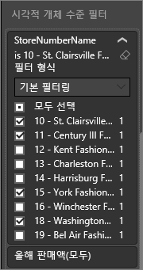
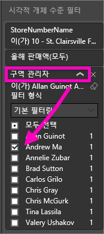

# Power BI 서비스 보고서에 필터 추가(편집용 보기)
> [!TIP]
> [Power BI 보고서에서 필터링과 강조 표시 정보](power-bi-reports-filters-and-highlighting.md)를 먼저 읽는 것이 좋습니다.

이 문서의 예제에서는 Power BI 서비스를 보여줍니다. 그러나 단계는 Power BI Desktop과 거의 동일합니다.
> 
> 

## 편집용 보기 및 읽기용 보기에서 보고서 필터 간의 차이는 무엇입니까
보고서는 [읽기용 보기](consumer/end-user-reading-view.md)와 [편집용 보기](service-interact-with-a-report-in-editing-view.md)의 두 가지 방식으로 조작할 수 있습니다.  또한 사용할 수 있는 필터링 기능은 현재 모드에 따라 달라집니다.

* 편집용 보기에서는 보고서, 페이지 및 시각적 개체 필터를 추가할 수 있습니다. 보고서를 저장하면 필터가 함께 저장됩니다. 읽기용 보기에서 보고서를 보는 사람들은 추가된 필터로 상호 작용할 수 있습니다.
* 읽기용 보기에서는 보고서에 이미 있는 보고서, 드릴스루, 페이지 및 시각적 필터를 사용하여 상호 작용할 수 있지만 새로운 필터를 추가할 수 없습니다. 하지만 모바일 앱에서 보고서를 확인하는 경우 및 보고서를 나갔다가 나중에 돌아오는 경우에도 필터 창의 변경 내용을 보고서와 함께 저장합니다.  

> [!NOTE]
> 이 문서는 보고서 **편집용 보기**에서 필터를 만드는 방법에 대해 설명합니다.  읽기용 보기에서 필터에 대한 자세한 내용은 [보고서 읽기용 보기에서 필터로 상호 작용](consumer/end-user-reading-view.md)을 참조하세요.

## Power BI *필터* 창에서 사용할 수 있는 필터
데스크톱 또는 Power BI 서비스를 사용하는지에 따라 필터 창이 보고서 캔버스의 오른쪽에 표시됩니다. 필터 창이 표시되지 않는 경우 오른쪽 위 모서리의 ">" 아이콘을 선택하여 확장합니다.

네 가지 필터가 있습니다.

- **페이지 필터**는 보고서 페이지의 모든 시각적 개체에 적용됩니다.     
- **시각적 필터**는 보고서 페이지의 단일 시각적 개체에 적용됩니다.    
- **드릴스루 필터**는 보고서의 단일 엔터티에 적용됩니다.    
- **보고서 필터**는 보고서의 모든 페이지에 적용됩니다.    

    

필터가 *유지*되기 때문에 보고서에서 다른 곳으로 이동할 때 Power BI에는 필터, 슬라이서 및 기타 데이터 보기 변경 내용이 그대로 유지됩니다. 따라서 보고서로 돌아 올 때 떠난 위치를 다시 선택할 수 있습니다. 필터 변경 사항을 유지하지 않으려면 위의 메뉴 모음에서 **기본값으로 다시 설정**을 선택합니다.

## 특정 시각화에 필터 추가(시각적 필터)
다음 2가지 방법으로 수행할 수 있습니다. 

* 시각화에서 이미 사용 중인 필드 필터링
* 시각화에서 사용하고 있지 않은 필드를 식별하고 직접 **비주얼 수준 필터** 버킷에 해당 필드 추가

### 시각화에 이미 있는 필드 필터링
1. [편집용 보기에서 보고서](consumer/end-user-reading-view.md)를 엽니다.
   
   
2. 시각화와 필터 창 및 필드 창을 엽니다(이미 열리지 않은 경우).
   
   
3. 시각적 개체를 선택하여 활성화합니다. 시각적 개체에서 사용 중인 모든 필드는 **필드** 창에 식별되며 **시각적 수준 필터** 제목 아래의 **필터** 창에도 나열됩니다.
   
   
4. 이 시점에서 시각화하여 이미 사용 중인 필드에 필터를 추가합니다. 
   
   * **시각적 수준 필터** 영역으로 아래로 스크롤하고 화살표를 선택하여 필터링할 필드를 확장합니다. 이 에에서는 **StoreNumberName**을 필터링합니다.
     
       
   * **기본**, **고급** 또는 **상위 N개** 필터링 컨트롤을 설정합니다([보고서 필터 사용 방법](consumer/end-user-report-filter.md) 참조). 이 예에서는 기본 필터링을 선택하고 10, 11, 15 및 18번 옆에 확인 표시를 남깁니다.
     
       
   * 시각적 개체가 바뀌면서 새 필터가 반영됩니다. 필터와 함께 보고서를 저장할 경우 보고서를 읽는 사용자는 읽기용 보기에서 필터를 사용하여 조작하면서 값을 선택하거나 지울 수 있습니다.
     
      
5. 이제 시각화 요소 수준 필터로 완전히 새로운 필드를 시각화에 추가해 보겠습니다.
   
   * 새 필터 창에서 새 시각적 수준 필터로 추가하려는 필드를 선택하고 **시각적 수준 필터 영역**으로 끌어 놓습니다.  이 예제에서는 **지역 관리자**를 **비주얼 수준 필터** 버킷으로 끌어가고 Andrew Ma만 선택합니다. 
     
      
   * **지역 관리자**는 시각화 자체에 추가되는 것이 *아닙니다*. 시각화는 여전히 **StoreNumberName** 축과 **올해 판매** 값으로 구성됩니다.  
     
      
   * 또한 이제 시각화 자체가 필터링되어 특정 매장에서 올해 Andrew의 판매만 표시합니다.
     
     

## 전체 페이지에 필터 추가(페이지 보기 필터)
1. [편집용 보기에서 보고서](consumer/end-user-reading-view.md)를 엽니다.
2. 시각화와 필터 창 및 필드 창을 엽니다(이미 열리지 않은 경우).
3. 필드 창에서 새 페이지 수준 필터로 추가하려는 필드를 선택하고 **페이지 수준 필터 영역**으로 끌어 놓습니다.  
4. 필터링할 값을 선택하고 **기본** 또는 **고급** 필터링 컨트롤을 설정합니다([보고서 필터 사용 방법](consumer/end-user-report-filter.md) 참조).
   
   이 필터의 영향을 받는 페이지의 모든 시각화는 변경 사항에 맞게 다시 그려집니다. 
   
   

필터와 함께 보고서를 저장할 경우 보고서를 읽는 사용자는 읽기용 보기에서 필터를 사용하여 조작하면서 값을 선택하거나 지울 수 있습니다.

## 드릴스루 필터 추가
Power BI 서비스 및 Power BI Desktop의 드릴스루를 사용하여 공급 업체, 고객 또는 제조업체와 같이 특정 엔터티에 초점을 맞춘 *대상* 보고서 페이지를 만들 수 있습니다. 이제 다른 보고서 페이지에서 사용자는 초점을 맞춘 페이지에 대한 해당 엔터티 및 드릴스루의 데이터 요소를 마우스 오른쪽 단추로 클릭할 수 있습니다.

### 드릴스루 필터 만들기
과정을 따르려면 편집용 보기에서 고객 수익성 샘플을 엽니다. 경영진 비즈니스 영역에 초점을 두는 페이지를 원하는 경우를 가정해 봅니다.   

1. 보고서에 새 페이지를 추가하고 이름을 **팀 경영진**으로 지정합니다. 드릴스루 *대상* 페이지가 됩니다.
2. 팀 경영진의 비즈니스 영역에 대한 주요 메트릭을 추적하는 시각화를 추가합니다.    
3. 드릴스루 필터 웰에 **경영진 > 경영진 이름**을 추가합니다.    
   
    
   
    Power BI는 보고서 페이지에 뒤로 화살표를 추가합니다.  뒤로 화살표를 선택하면 사용자는 *원본* 보고서 페이지(드릴스루로 선택했을 때 있었던 페이지)로 돌아갑니다. 뒤로 화살표는 읽기용 보기에서만 작동합니다.
   
     

### 드릴스루 필터 사용
드릴스루 필터의 작동 방식을 살펴보겠습니다.

1. **팀 성과 기록표** 보고서 페이지를 시작합니다.    
2. 사용자가 Andrew Ma이며 사용자의 데이터에 대해서만 필터링된 팀 경영진 보고서 페이지를 보려고 한다고 가정합니다.  왼쪽 위 영역형 차트에서 녹색 데이터 요소를 마우스 오른쪽 단추로 클릭하여 드릴스루 메뉴 옵션을 엽니다.
   
    
3. **드릴스루 > 팀 경영진**을 선택하여 **팀 경영진**이라는 보고서 페이지로 드릴스루합니다. 페이지가 필터링되어 마우스 오른쪽 단추로 클릭한 데이터 요소에 대한 정보를 표시합니다. 이 경우 Andrew Ma입니다. 드릴스루 필터 웰에 있는 필드만이 드릴스루 보고서 페이지에 전달됩니다.  
   
    

## 전체 보고서에 필터 추가(보고서 필터)
1. [편집용 보기에서 보고서](consumer/end-user-reading-view.md)를 엽니다.
2. 시각화와 필터 창 및 필드 창을 엽니다(이미 열리지 않은 경우).
3. 새 필터 창에서 새 보고서 수준 필터로 추가하려는 필드를 선택하고 **페이지 수준 필터 영역**으로 끌어 놓습니다.  
4. 필터링할 값을 선택합니다([보고서 필터를 사용하는 방법](consumer/end-user-report-filter.md) 참조).

    활성 페이지와, 보고서의 모든 페이지에서 시각적 개체가 바뀌면서 새 필터가 반영됩니다. 필터와 함께 보고서를 저장할 경우 보고서를 읽는 사용자는 읽기용 보기에서 필터를 사용하여 조작하면서 값을 선택하거나 지울 수 있습니다.

1. 뒤로 화살표를 선택하여 이전 보고서 페이지로 돌아갑니다.

## 고려 사항 및 문제 해결

- 시각적 수준 필터 및 페이지 수준 필터에서 서로 다른 결과를 반환할 수 있는 경우가 있습니다.  예를 들어 시각적 수준 필터를 추가하는 경우 Power BI에서 집계된 결과를 필터링합니다.  기본 집계는 Sum이지만 [집계 형식을 변경](service-aggregates.md)할 수 있습니다.  

    그러면 페이지 수준 필터를 추가하는 경우 Power BI에서 집계하지 않고 필터링합니다.  이는 한 페이지에 각각 다른 집계 형식을 활용할 수 있는 많은 시각적 개체가 포함될 수 있기 때문입니다.  따라서 각 데이터 행에 필터가 적용됩니다.

- 필드 창이 표시되지 않으면 보고서 [편집용 보기](service-interact-with-a-report-in-editing-view.md)에 있는지 확인하십시오.    
- 필터를 많이 변경하고 보고서 작성자 기본 설정으로 되돌리려는 경우 위의 메뉴 모음에서 **기본값으로 다시 설정**을 선택합니다.

## 다음 단계
 [보고서 필터를 사용하는 방법](consumer/end-user-report-filter.md)

  [필터 및 보고서에서 강조 표시](power-bi-reports-filters-and-highlighting.md)

[필터로 조작 및 보고서 읽기용 보기에서 강조 표시](consumer/end-user-reading-view.md)

[보고서 시각적 개체가 서로 교차 필터링 및 교차 강조 표시되는 방식 변경](consumer/end-user-interactions.md)

궁금한 점이 더 있나요? [Power BI 커뮤니티를 이용하세요.](http://community.powerbi.com/)

