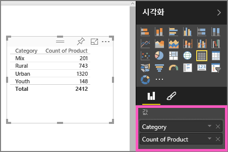
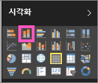

# 1부, Power BI 보고서에 시각화 추가
이 문서에서는 Power BI 서비스 또는 Power BI Desktop을 사용하여 보고서에 시각화를 만드는 방법을 간단히 소개합니다.  고급 내용을 보려면 [2부를 참조](power-bi-report-add-visualizations-ii.md)하세요. Amanda가 보여주는 보고서 캔버스에서 시각적 개체를 만들고, 편집하고, 서식을 지정하는 몇 가지 다양한 방법을 확인해 보세요. 그런 다음 직접 [영업 마케팅 샘플](sample-datasets.md)을 사용하여 자신만의 보고서를 만들어 보세요.

<iframe width="560" height="315" src="https://www.youtube.com/embed/IkJda4O7oGs" frameborder="0" allowfullscreen></iframe>

## 보고서를 열고 새 페이지 추가
1. [편집용 보기에서 보고서](service-reading-view-and-editing-view.md)를 엽니다. 이 자습서는 [영업 및 마케팅 샘플](sample-datasets.md)을 사용합니다.
2. 필드 창이 표시되지 않으면 화살표 아이콘을 선택하여 엽니다. 
   
   
3. [보고서에 빈 페이지를 추가](power-bi-report-add-page.md)합니다.

## 시각화 요소를 보고서에 추가
1. **필드** 창에서 필드를 선택하여 시각화를 만듭니다.  
   
   판매 > 판매 $와 같은 **숫자 필드부터 시작**합니다. Power BI에서 단일 열이 포함된 세로 막대형 차트가 만들어집니다.
   
   
   
   이름, 제품과 같은 **범주 필드부터 시작**합니다. Power BI에서 표가 생성되고 이 필드가 **값** 웰에 추가됩니다.
   
   
   
   지역 > 도시와 같은 **지리 필드부터 시작**합니다. Power BI 및 Bing Maps는 지도 시각화를 만듭니다.
   
   
2. 시각화를 만든 다음 해당 형식을 변경합니다. **제품 > 제품 수** 및 **제품 > 범주**를 선택하여 **값** 웰에 추가합니다.
   
   
3. 세고 막대형 차트 아이콘을 선택하여 세로 막대형 차트에 대한 시각화를 변경합니다.
   
   
4. 보고서에서 시각화를 만들 경우 [대시보드에 고정](service-dashboard-pin-tile-from-report.md)할 수 있습니다. 시각화를 고정하려면 핀 아이콘 를 선택합니다.
   
   
5. 이제 다음을 할 수 있습니다.
   
   [자습서: 2부, Power BI 보고서에 시각화 추가](power-bi-report-add-visualizations-ii.md)를 계속 읽습니다.
   
   보고서에서 [시각화로 조작](service-reading-view-and-editing-view.md)합니다.
   
   [시각화로 더 많은 작업을 할 수 있습니다](power-bi-report-visualizations.md).
   
   [보고서를 저장합니다](service-report-save.md).

## 다음 단계
[Power BI 보고서의 시각화](power-bi-report-visualizations.md)에 대해 자세히 알아보세요.

[Power BI의 보고서](service-reports.md)

궁금한 점이 더 있나요? [Power BI 커뮤니티를 이용하세요.](http://community.powerbi.com/)

