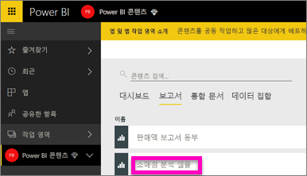
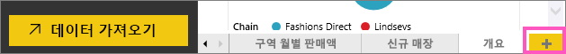
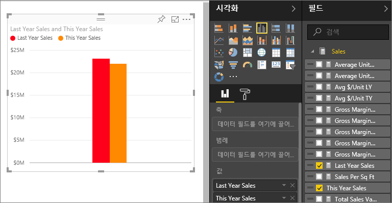
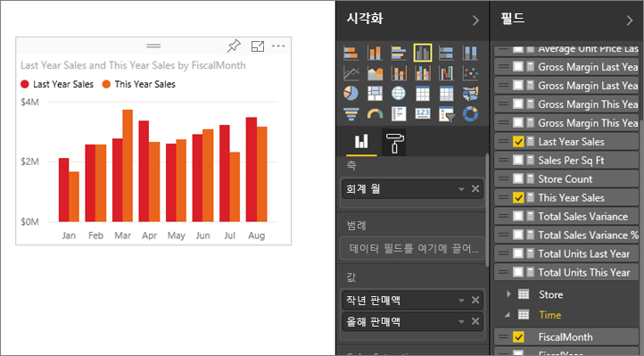
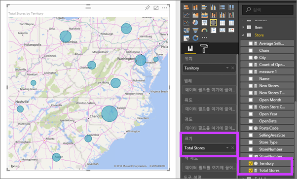
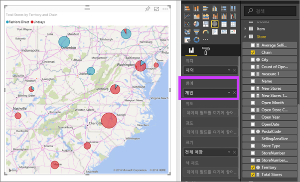

# 2부, Power BI 보고서에 시각화 추가(보고서)
[1부](power-bi-report-add-visualizations-ii.md)에서 필드 이름 옆의 확인란을 선택하여 기본 시각화를 만들었습니다.  2부에서는 끌어 놓기를 사용하는 방법과 **필드** 및 **시각화** 창을 완벽히 사용하여 시각화를 만들고 수정하는 방법에 대해 배웁니다.

### 필수 조건
- [1부](power-bi-report-add-visualizations-ii.md)
- Power BI 서비스 - Power BI 서비스 또는 Power BI Desktop을 사용하여 보고서에 시각화를 추가할 수 있습니다. 이 자습서에서는 Power BI 서비스를 사용합니다. 
- 소매점 분석 샘플

## 새 시각화 만들기
이 자습서에서는 소매점 분석 데이터 집합을 자세히 살펴보고 몇 가지 주요 시각화를 만듭니다.

### 보고서를 열고 새 페이지를 추가합니다.
1. 소매점 분석 샘플을 저장한 작업 영역을 엽니다. **소매점 분석 샘플**을 선택하여 보고서를 읽기용 보기로 엽니다.
   
   
2. **보고서 편집** 을 선택하여 편집용 보기에서 보고서를 엽니다.
   
   
3. 캔버스 맨 아래에 있는 노란색 더하기 아이콘을 선택하여 [새 페이지를 추가](power-bi-report-add-page.md)합니다.
   
   

### 올해와 작년의 매출을 비교하는 시각화를 추가합니다.
1. **매출** 표에서 **올해 매출** > **값** 및 **작년 매출**을 선택합니다. Power BI에 세로 막대형 차트가 만들어집니다.  이 기능에 대해 자세히 알아보겠습니다. 월별 매출이 어떻게 보이나요?  
   
   
2. 시간 테이블에서 **달**을 **축** 영역으로 끌어옵니다.  
   
3. 시각화를 영역형 차트로 [변경](power-bi-report-change-visualization-type.md)합니다.  선택할 수 있는 시각화 유형이 많습니다. 사용할 유형을 결정하려면 [각 유형 설명, 모범 사례에 대한 팁 및 자습서](power-bi-visualization-types-for-reports-and-q-and-a.md)를 참조하세요. 시각화 창에서 영역형 차트 아이콘을 선택합니다.
4. 줄임표를 선택하고 **월별로 정렬**을 선택하여 시각화를 정렬합니다.
5. 시각화를 선택하고 윤곽 원 중 하나를 클릭한 다음 끌어서 [시각화의 크기를 조정](power-bi-visualization-move-and-resize.md)합니다. 스크롤 막대가 보이지 않도록 넓게 만들고 다른 시각화를 추가할 만큼의 공간을 남겨둡니다.
   
   
6. [보고서를 저장합니다](service-report-save.md).

### 위치별 매출을 볼 수 있는 맵 시각화 추가
1. **매장** 표에서 **지역**을 선택합니다. Power BI는 해당 지역이 위치인 것을 인식하고 맵 시각화를 만듭니다.  
   
2. **총 매장**을 크기 영역으로 끌어 놓습니다.  
   
3. 범례를 추가합니다.  매장 이름별로 데이터를 보려면 **체인** 을 범례 영역으로 끌어 놓습니다.  
   

## 다음 단계
* 필드 창에 대한 자세한 내용을 보려면 [보고서 편집기... 둘러보기](service-the-report-editor-take-a-tour.md)를 참조하세요.   
* 시각화를 필터링하고 강조 표시하는 방법을 배우려면 [Power BI 보고서의 필터 및 강조 표시](power-bi-reports-filters-and-highlighting.md)를 참조하세요.  
* [Power BI 보고서의 시각화](power-bi-report-visualizations.md)에 대해 자세히 알아보세요.  
* 궁금한 점이 더 있나요? [Power BI 커뮤니티를 이용하세요.](http://community.powerbi.com/)

