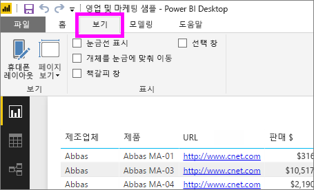
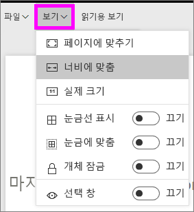
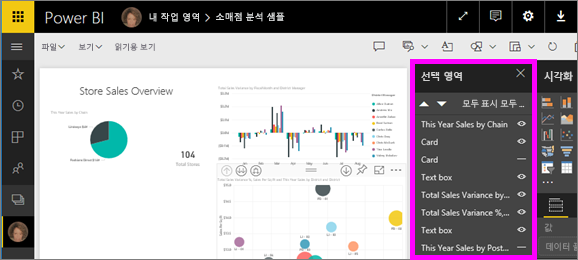
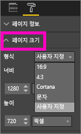

# Power BI 보고서의 페이지 표시 설정
보고서 레이아웃 픽셀을 완벽하게 유지하는 것이 어렵다는 것을 알고 있습니다. 화면에 표시된 보고서의 가로 세로 비율과 크기는 보는 사람마다 다르기 때문에 어려울 때도 있습니다 

기본 표시 뷰는 **페이지에 맞춤** 이고 기본 표시 크기는 **16:9**입니다. 다른 가로 세로 비율로 고정하거나 보고서를 다른 방식으로 조정하려는 경우 ***페이지 보기*** 설정과 ***페이지 크기*** 설정, 두 가지 도구가 유용합니다.

<iframe width="560" height="315" src="https://www.youtube.com/embed/5tg-OXzxe2g" frameborder="0" allowfullscreen></iframe>

## Power BI 서비스와 Power BI Desktop에서 페이지 보기 설정을 찾는 방법
페이지 보기 설정은 Power BI 서비스와 Power BI Desktop에서 사용할 수 있지만 인터페이스는 약간 다릅니다. 다음 두 섹션에서는 각 Power BI 도구에서 보기 설정을 찾을 수 있는 위치를 설명합니다.

### Power BI Desktop
보고서 보기에서 **보기** 탭을 선택하여 페이지 보기 설정과 전화 레이아웃 설정을 엽니다.

  

### Power BI 서비스(app.powerbi.com)
Power BI 서비스에서 보고서를 열고 상단 왼쪽 메뉴 모음에서 **보기**를 선택합니다.

페이지 보기 설정은 [읽기용 보기](service-interact-with-a-report-in-reading-view.md)와 [편집용 보기](service-interact-with-a-report-in-editing-view.md)에서 모두 사용할 수 있습니다. 편집용 보기에서 보고서 소유자는 개별 보고서 페이지에 페이지 보기 설정을 할당할 수 있으며 해당 설정은 보고서와 함께 저장됩니다. 동료가 이 보고서를 읽기용 보기로 열면 소유자의 설정에 따라보고서 페이지가 표시됩니다.  읽기용 보기에서 동료는 페이지 보기 설정의 *일부*를 변경할 수 있지만 보고서를 종료하면 변경 내용이 저장되지 않습니다.

##    페이지 보기 설정
*페이지 보기* 설정의 첫 번째 집합은 보고서 페이지를 브라우저 창과 상대적으로 제어합니다.  다음 중에서 선택합니다.

* **페이지에 맞춤** (기본값): 페이지에 맞게 콘텐츠 크기가 조정됩니다.
* **너비에 맞춤**: 페이지 너비에 맞게 콘텐츠 크기가 조정됩니다.
* **실제 크기**: 콘텐츠가 전체 크기로 표시됩니다.

*페이지 보기* 설정의 두 번째 집합은 보고서 캔버스에 있는 개체의 위치 지정을 제어합니다.

* **눈금선 표시**: 보고서 캔버스에서 개체를 배치할 때 도움이 될 수 있도록 눈금선을 켭니다.
* **눈금에 맞춤**: **눈금선 표시**와 함께 사용하여 보고서 캔버스에서 개체를 정확하게 배치하고 정렬합니다. 
* **개체 잠금**: 캔버스의 모든 개체를 잠가서 이동하거나 크기를 조정할 수 있게 합니다.
* **선택 창**: 선택 창은 캔버스의 모든 개체를 나열하며, 사용자가 표시하거나 숨길 항목을 결정할 수 있게 해줍니다.

    

## 페이지 크기 설정

*페이지 크기* 설정은 보고서 소유자만 사용할 수 있습니다. Power BI 서비스(app.powerbi.com)에서 이는 [편집용 보기](service-reading-view-and-editing-view.md)에서 보고서를 열 수 있다는 의미입니다. 이러한 설정은 보고서 캔버스의 표시 비율과 실제 크기를 조정합니다(픽셀 단위).   

* 4:3 비율
* 16:9 비율(기본값)
* Cortana
* 문자
* 사용자 지정(높이 및 너비(픽셀))

## 다음 단계
[Power BI 보고서에서 페이지 보기 및 페이지 크기 설정을 사용하는 방법에 대해 알아보세요](power-bi-change-report-display-settings.md).

[Power BI의 보고서](service-reports.md)에 대해 자세히 알아보기

[Power BI - 기본 개념](service-basic-concepts.md)

궁금한 점이 더 있나요? [Power BI 커뮤니티를 이용하세요.](http://community.powerbi.com/)

