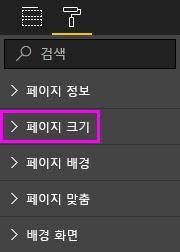

# Power BI 보고서의 페이지 표시 설정
이해 하 고 보고서 레이아웃 픽셀을 완벽 하 게 유지 것이 중요 합니다. 경우에 따라 어려울 수, 있으므로 사용자와 동료가 다른 가로 세로 비율과 크기를 사용 하 여 화면에서 해당 보고서를 볼 수 있습니다. 

기본 표시 뷰는 **페이지에 맞춤** 이고 기본 표시 크기는 **16:9**입니다. 다른 가로 세로 비율로 고정하거나 보고서를 다른 방식으로 조정하려는 경우: ***페이지 보기*** 설정 하 고 ***페이지 크기*** 설정 합니다.

<iframe width="560" height="315" src="https://www.youtube.com/embed/5tg-OXzxe2g" frameborder="0" allowfullscreen></iframe>

## Power BI 서비스 및 Power BI Desktop에서 페이지 보기 설정을 찾을 수 있는 위치
페이지 보기 설정은 Power BI 서비스와 Power BI Desktop에서 사용할 수 있지만 인터페이스는 약간 다릅니다. 다음 섹션에서는 각 Power BI 도구에서 보기 설정의 어디서 찾을 수 있는지 설명 합니다.

### Power BI Desktop
보고서 보기에서 **보기** 탭을 선택하여 페이지 보기 설정과 전화 레이아웃 설정을 엽니다.

  

### Power BI 서비스 (app.powerbi.com)
Power BI 서비스에서 선택한 보고서를 엽니다 **보기** 상단 왼쪽된 메뉴 모음에서.

페이지 보기 설정은 모두 사용할 수 있습니다 [읽기용 보기 및 편집용 보기](consumer/end-user-reading-view.md)합니다. 편집용 보기에서 보고서 소유자는 개별 보고서 페이지에 페이지 보기 설정을 할당할 수 있으며 해당 설정은 보고서와 함께 저장 됩니다. 동료가 이 보고서를 읽기용 보기로 열면 소유자의 설정에 따라보고서 페이지가 표시됩니다. 읽기용 보기에서 동료 들이 변경할 수 있습니다 *일부* 의 합니다 **페이지 보기** 보고서를 종료 하는 경우 설정 되지만 변경 내용이 저장 되지 않습니다.

## 페이지 보기 설정
보고서 페이지를 브라우저 창과 상대적으로 표시를 제어 하는 첫 번째 페이지 보기 설정 집합입니다. 다음 중에서 선택합니다.

* **페이지에 맞추기** (기본값): 페이지에 맞게 콘텐츠 크기가 조정 됩니다.
* **너비에 맞추기**: 콘텐츠는 페이지 너비 안에 맞도록 크기가 조정 됩니다.
* **실제 크기**: 콘텐츠가 전체 크기로 표시 됩니다.

두 번째 보고서 캔버스에서 개체의 위치 지정 페이지 보기 설정 컨트롤의 집합입니다. 다음 중에서 선택합니다.

* **눈금선 표시**: 있도록 눈금선을 켭니다 보고서 캔버스에서 개체를 배치 합니다.
* **눈금에 맞춤**: 사용 **눈금선 표시** 정확 하 게 배치 하 고 보고서 캔버스에서 개체를 정렬 합니다. 
* **개체 잠금**: 이동 하거나 크기 조정할 수 없습니다 있도록 캔버스의 모든 개체를 잠급니다.
* **선택 영역 창**: 합니다 **선택** 창 캔버스의 모든 개체를 나열 합니다. 표시 및 숨기기를 결정할 수 있습니다.

    

## 페이지 크기 설정

**페이지 크기** 설정은 보고서 소유자만 사용할 수 있습니다. Power BI 서비스 (app.powerbi.com)에서이 수 있다는 의미에서 보고서를 엽니다 [편집용 보기](consumer/end-user-reading-view.md)합니다. **페이지 크기** 설정이 합니다 **시각화** 창 및 컨트롤 표시 비율을 보고서 캔버스의 실제 크기 (픽셀).   

* 4:3
* 16:9(기본값)
* Cortana
* Letter
* 사용자 지정(높이 및 너비(픽셀))

## 다음 단계
[Power BI Desktop의 보고서 보기](desktop-report-view.md)

[페이지 보기 및 Power BI 보고서에서 페이지 크기 설정을 변경 합니다.](consumer/end-user-report-view.md)

[Power BI의 보고서](consumer/end-user-reports.md)에 대해 자세히 알아보기

[Power BI 서비스 소비자에 대 한 기본 개념](consumer/end-user-basic-concepts.md)

궁금한 점이 더 있나요? [Power BI 커뮤니티를 이용하세요.](http://community.powerbi.com/)

