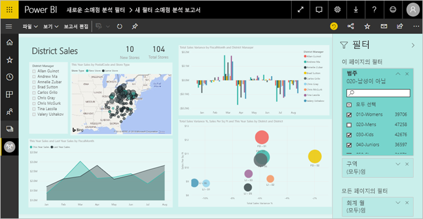
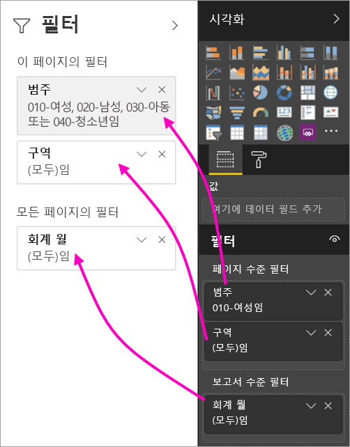
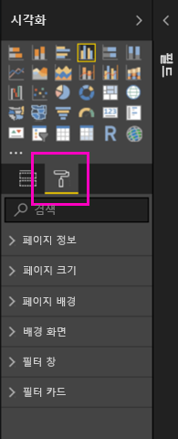
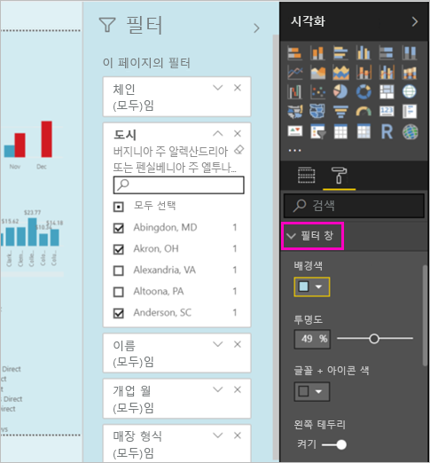
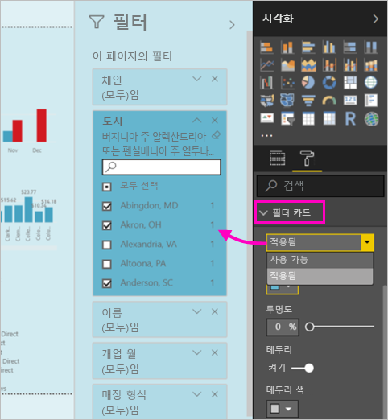
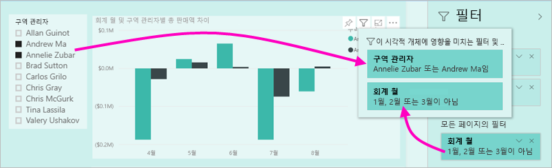

# Power BI 보고서의 새 필터 환경(미리 보기)

이 문서에서는 새 필터 환경을 설명합니다. Power BI의 필터에 새 기능과 새 디자인이 추가됩니다. Power BI Desktop 또는 Power BI 서비스에서 보고서를 디자인할 때 [필터] 창을 전체 보고서처럼 보이게 만들고 전체 보고서와 작동하도록 만들 수 있습니다. 새 환경에서 이전 [필터] 창은 필터 편집 창으로 작동하며 새 [필터] 창은 보고서 소비자에게만 표시됩니다. 
 

보고서 디자이너가 새 필터로 수행할 수 있는 작업은 다음과 같습니다.

- 소비자가 제공된 시각적 개체에 영향을 미치는 필터 또는 슬라이서를 정확히 알 수 있도록 시각적 머리글에 필터의 읽기 전용 보기를 표시합니다.
- 보고서의 일부로 느낄 수 있도록 필터 창에 서식을 지정하고 사용자 지정합니다.
- 소비자가 보고서를 열 때 기본적으로 [필터] 창이 열려 있는지 또는 축소되어 있는지 여부를 정의합니다.
- 보고서 소비자에게 표시하지 않으려는 전체 필터 창 또는 특정 필터를 숨깁니다.
- 새 필터 창의 표시 여부, 열린 상태 및 축소된 상태를 제어하고 책갈피를 지정합니다.
- 소비자가 편집할 수 없도록 필터를 잠급니다.

## 새 필터 환경 설정 

Power BI Desktop에서 새 환경을 사용하도록 설정합니다. 그런 다음, 거기나 Power BI 서비스(https://app.powerbi.com))에서 필터를 수정할 수 있습니다. 이 새 필터 환경은 미리 보기로 제공되므로 먼저 Power BI Desktop에서 사용하도록 설정해야 합니다. Power BI 서비스에서 보고서를 만들어 시작하면 새 필터를 사용할 수 없습니다.

### 모든 새 보고서에 대해 새 필터 설정

1. Power BI Desktop에서 **파일** > **옵션 및 설정** > **옵션** > **미리 보기 기능**을 선택하고 **새 필터 환경** 확인란을 선택합니다. 
2. Power BI Desktop을 다시 시작하여 모든 새 보고서에서 새 필터 환경을 봅니다.

Power BI Desktop을 다시 시작한 후에는 사용자가 만드는 모든 새 보고서에 대해 기본적으로 새 필터를 사용할 수 있습니다.  

### 기존 보고서에 대해 새 필터 설정

기존 보고서에 대해서도 새 필터를 사용하도록 설정할 수 있습니다.

1. 기존 보고서의 Power BI Desktop에서 **파일** > **옵션 및 설정** > **옵션**을 선택합니다.
2. **보고서 설정**에서 **업데이트된 필터 창을 사용하고 이 보고서의 시각적 머리글에 필터 표시**를 선택합니다.

## 새 필터 창 빌드

새 필터 창을 사용하도록 설정하면 현재 보고서 설정에 따라 기본적으로 서식이 지정된 보고서 페이지의 오른쪽에 새 필터 창이 표시됩니다. 이전 필터 분할 창은 이제 필터 편집 창으로 작동합니다. 새 필터 분할 창에는 보고서를 게시할 때 보고서 소비자에게 표시되는 내용이 표시됩니다. 새 창에서 기존 필터를 업데이트할 수 있지만 이전 필터 창을 사용하여 포함할 필터를 구성할 수 있습니다.

1. 먼저 보고서 소비자에게 필터 창이 표시될지 여부를 결정합니다. 표시하려면 [필터] 옆에 있는 눈 아이콘  을 선택합니다.

2. 새 필터 창 빌드를 시작하려면 관심 있는 필드를 시각적 개체, 페이지 또는 보고서 수준 필터로써 필터 편집 창으로 끌어옵니다. 새 [필터] 창에 표시됩니다.

    

보고서 캔버스에 시각적 개체를 추가할 때 Power BI는 시각적 개체에 각 필드에 대한 필터를 자동으로 추가합니다. Power BI는 읽기 전용 필터 창에 이러한 자동 필터를 추가하지 않습니다. 분명히 추가하려면 눈 아이콘을 선택해야 합니다.

 
## 필터 잠그기 또는 숨기기

개별 필터 카드를 잠그거나 숨길 수 있습니다. 필터를 잠그면 보고서 소비자가 필터를 볼 수 있지만 변경할 수는 없습니다. 필터를 숨기면 볼 수도 없습니다. 일반적으로 필터 카드 숨기기는 null 또는 예기치 않은 값을 제외하는 데이터 정리 필터를 숨겨야 하는 경우에 유용합니다. 

- 필터 편집 창에서 필터 카드의 **필터 잠금** 또는 **필터 숨기기** 아이콘을 선택하거나 선택 취소합니다.

   

필터 편집 창에서 이러한 설정을 켜거나 끄면 새 필터 창에 반영된 변경 내용이 표시됩니다. 숨겨진 필터는 시각적 개체의 필터 팝업에 표시되지 않습니다.

보고서 책갈피를 사용하여 이동하도록 필터 창 상태를 구성할 수도 있습니다. 창의 열기, 닫기 및 표시 여부 상태에 모두 책갈피를 지정할 수 있습니다.
 
## 새 필터 분할 창 서식 지정

새 환경에서는 이제 보고서의 모양과 느낌과 일치하도록 필터 창에 서식을 지정할 수 있습니다. 보고서의 각 페이지에 대해 필터 창의 서식을 다르게 지정할 수 있습니다. 다음은 서식을 지정할 수 있는 요소입니다. 

- 배경색
- 배경 투명도
- 필터 창 테두리 설정 또는 해제
- 필터 창 테두리 색

적용 여부(설정됨) 또는 가용성(해제됨)에 따라 필터 카드에 대해 이러한 요소의 서식을 지정할 수도 있습니다. 

- 배경색
- 배경 투명도
- 테두리: 설정 또는 해제
- 테두리 색

### 필터 창 및 카드의 서식 설정

1. 보고서에서 보고서 자체를 클릭하거나 배경(‘배경 화면’)을 클릭하고 **시각화** 창에서 **서식**을 선택합니다. 
    보고서 페이지, 배경 화면, 필터 창 및 필터 카드에 서식을 지정하는 옵션이 표시됩니다.

        

1. **필터 창**을 확장하여 배경, 아이콘 및 왼쪽 테두리의 색을 설정하여 보고서 페이지를 보완합니다.

    

1. **필터 카드**를 확장하여 **사용 가능** 및 **적용됨** 색과 테두리를 설정합니다. 사용 가능한 카드와 적용된 카드의 색을 다르게 만들면 적용되는 필터가 명확해집니다. 
  
    

## 읽기 모드에 시각적 개체의 필터 보기

읽기 모드에서 시각적 개체 위로 커서를 이동하면 시각적 개체에 영향을 주는 모든 필터, 슬라이서 등이 포함된 팝업이 표시됩니다. 팝업 서식 지정은 필터 창 서식 지정과 동일합니다. 

다음은 이 보기에서 표시하는 필터 유형입니다. 
- 기본 필터
- 슬라이서
- 교차 강조 표시 
- 교차 필터링
- 고급 필터
- 상위 N 필터
- 상대 날짜 필터
- 슬라이서 동기화
- 포함/제외 필터
- URL을 통해 전달된 필터

## 제공 예정

몇 달 안에 다음 개선 사항을 통합할 예정입니다.
- 필터 카드의 순서를 변경하는 기능
- 보고서 작성자용 단일 필터 창 환경 
- 추가 서식 옵션

새 필터 환경을 체험해 보세요. 이 기능에 대한 피드백을 제공하고 이 환경을 계속 개선할 방법을 알려주세요. 

## 다음 단계
[보고서 필터를 사용하는 방법](consumer/end-user-report-filter.md)

[필터 및 보고서에서 강조 표시](power-bi-reports-filters-and-highlighting.md)

[필터로 조작 및 보고서 읽기용 보기에서 강조 표시](consumer/end-user-reading-view.md)

[보고서 시각적 개체가 서로 교차 필터링 및 교차 강조 표시되는 방식 변경](consumer/end-user-interactions.md)

궁금한 점이 더 있나요? [Power BI 커뮤니티를 이용하세요.](http://community.powerbi.com/)

