# <a name="the-new-filter-experience-in-power-bi-reports"></a>Power BI 보고서의 새 필터 환경

Power BI의 필터에 새 기능과 새 디자인이 있습니다. 새 필터 환경을 선택하면 필터 창을 서식 지정하여 보고서의 나머지 부분과 비슷하게 할 수 있습니다. 필터를 잠그거나 숨길 수도 있습니다. 보고서를 디자인할 때 더 이상 시각화 창에서 이전 필터 창이 표시되지 않습니다. 단일 필터 창에서 모든 필터 편집 및 형식화를 수행합니다. 

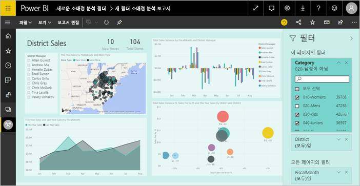

보고서 디자이너가 새 단일 필터 창에서 수행할 수 있는 작업은 다음과 같습니다.

- 필터링할 필드를 추가하고 제거합니다. 
- 필터 상태를 변경합니다.
- 보고서의 일부로 느낄 수 있도록 필터 창에 서식을 지정하고 사용자 지정합니다.
- 소비자가 보고서를 열 때 기본적으로 [필터] 창이 열려 있는지 또는 축소되어 있는지 여부를 정의합니다.
- 보고서 소비자에게 표시하지 않으려는 전체 필터 창 또는 특정 필터를 숨깁니다.
- 새 필터 창의 표시 여부, 열린 상태 및 축소된 상태를 제어하고 책갈피를 지정합니다.
- 소비자가 편집할 수 없도록 필터를 잠급니다.

새 필터 환경을 사용하면 보고서 소비자가 시각적 개체를 마우스로 가리켜 해당 시각적 개체에 영향을 미치는 모든 필터 또는 슬라이서의 읽기 전용 목록을 표시할 수도 있습니다.

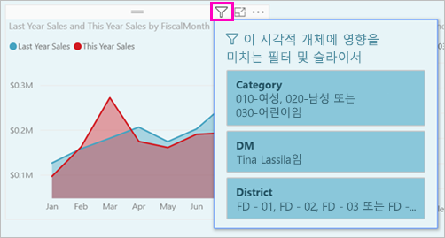

## <a name="turn-on-the-new-filter-experience"></a>새 필터 환경 설정 

새 보고서의 경우 새 필터 환경이 기본적으로 설정되어 있습니다. Power BI Desktop 또는 Power BI 서비스에서 기존 보고서에 대해 새 환경을 사용하도록 설정할 수 있습니다.

### <a name="turn-on-new-filters-for-an-existing-report-in-power-bi-desktop"></a>Power BI Desktop에서 기존 보고서에 대해 새 필터 켜기

1. 기존 보고서의 Power BI Desktop에서 **파일** > **옵션 및 설정** > **옵션**을 선택합니다.
2. 왼쪽 탐색 모음의 **현재 파일** 아래에서 **보고서 설정**을 선택합니다.
3. **필터링 환경** 아래 **업데이트된 필터 창을 사용하고 이 보고서의 시각적 개체 머리글에 필터 표시**를 선택합니다.

### <a name="turn-on-new-filters-for-an-existing-report-in-the-service"></a>서비스에서 기존 보고서에 대해 새 필터 켜기

**새 디자인**을 Power BI 서비스 에서 설정하면, 새 필터 환경이 자동으로 켜집니다. [Power BI 서비스의 새 디자인](service-new-look.md)에 대해 자세히 알아보세요.

새 디자인을 설정하지 않은 경우에도 다음 단계에 따라 새 필터 환경을 계속 볼 수 있습니다.

1. Power BI 서비스의 작업 영역 콘텐츠 목록에서 **보고서** 탭을 선택합니다.
2. 사용하도록 설정하려는 보고서를 찾고 해당 보고서의 **설정** 아이콘 을 선택합니다.
3. **필터링 환경** 아래 **업데이트된 필터 창을 사용하고 이 보고서의 시각적 개체 머리글에 필터 표시**를 선택합니다.

    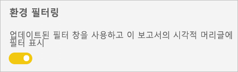

## <a name="view-filters-for-a-visual-in-reading-mode"></a>읽기 모드에 시각적 개체의 필터 보기

읽기 모드에서 시각적 개체의 필터 아이콘 위로 마우스를 올려놓으면 해당 시각적 개체에 영향을 주는 모든 필터, 슬라이서 등이 포함된 팝업 필터 목록이 표시됩니다. 팝업 필터 목록의 서식은 필터 창 서식과 동일합니다. 

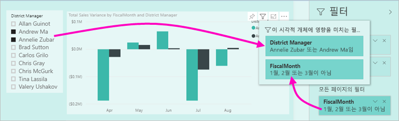

다음은 이 보기에서 표시하는 필터 유형입니다. 
- 기본 필터
- 슬라이서
- 교차 강조 표시 
- 교차 필터링
- 고급 필터
- 상위 N 필터
- 상대 날짜 필터
- 슬라이서 동기화
- 포함/제외 필터
- URL을 통해 전달된 필터

## <a name="build-the-new-filters-pane"></a>새 필터 창 빌드

새 필터 창을 사용하도록 설정하면 현재 보고서 설정에 따라 기본적으로 서식이 지정된 보고서 페이지의 오른쪽에 새 필터 창이 표시됩니다. 새 필터 창을 사용하여 포함할 필터를 구성할 수 있고 새 창에서 기존 필터를 업데이트할 수 있습니다. 새 필터 창에는 보고서를 게시할 때 보고서 소비자에게 표시되는 내용이 표시됩니다. 

1. 기본적으로 보고서 소비자는 필터 창을 볼 수 있습니다. 사용자가 볼 수 없도록 하려면 **필터** 옆의 눈에 보이는 아이콘을 선택합니다.

    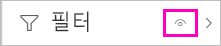

2. 새 필터 창 빌드를 시작하려면 관심 있는 필드를 시각적 개체, 페이지 또는 보고서 수준 필터로써 새 필터 창으로 끌어옵니다.

보고서 캔버스에 시각적 개체를 추가할 때 Power BI는 시각적 개체에서 각 필드에 대한 필터를 필터 창에 자동으로 추가합니다. 

## <a name="lock-or-hide-filters"></a>필터 잠그기 또는 숨기기

개별 필터 카드를 잠그거나 숨길 수 있습니다. 필터를 잠그면 보고서 소비자가 필터를 볼 수 있지만 변경할 수는 없습니다. 필터를 숨기면 볼 수도 없습니다. 일반적으로 필터 카드 숨기기는 null 또는 예기치 않은 값을 제외하는 데이터 정리 필터를 숨겨야 하는 경우에 유용합니다. 

- 새 필터 창에서 필터 카드의 **필터 잠금** 또는 **필터 숨기기** 아이콘을 선택하거나 선택 취소합니다.

   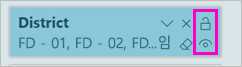

새 필터 창에서 이러한 설정을 켜거나 끄면 보고서에 반영된 변경 내용이 표시됩니다. 숨겨진 필터는 시각적 개체의 팝업 필터 목록에 표시되지 않습니다.

보고서 책갈피를 사용하여 이동하도록 새 필터 창 상태를 구성할 수도 있습니다. 창의 열기, 닫기 및 표시 여부 상태에 모두 책갈피를 지정할 수 있습니다.
 
## <a name="format-the-new-filters-pane"></a>새 필터 분할 창 서식 지정

새 환경에서는 보고서의 모양과 느낌과 일치하도록 필터 창에 서식을 지정할 수 있습니다. 보고서의 각 페이지에 대해 필터 창의 서식을 다르게 지정할 수 있습니다. 다음은 서식을 지정할 수 있는 요소입니다. 

- 배경색
- 배경 투명도
- 테두리 설정 또는 해제
- 테두리 색
- 제목 및 머리글 글꼴, 색 및 텍스트 크기

적용 여부(설정됨) 또는 가용성(해제됨)에 따라 필터 카드에 대해 이러한 요소의 서식을 지정할 수도 있습니다. 

- 배경색
- 배경 투명도
- 테두리: 설정 또는 해제
- 테두리 색
- 글꼴, 색 및 텍스트 크기
- 입력 상자 색

### <a name="format-the-filters-pane-and-cards"></a>필터 창 및 카드의 서식 지정

1. 보고서에서 보고서 자체를 클릭하거나 배경(‘배경 화면’)을 클릭하고 **시각화** 창에서 **서식**을 선택합니다.  
    보고서 페이지, 배경 화면, 필터 창 및 필터 카드에 서식을 지정하는 옵션이 표시됩니다.

1. **필터 창**을 확장하여 배경, 아이콘 및 왼쪽 테두리의 색을 설정하여 보고서 페이지를 보완합니다.

    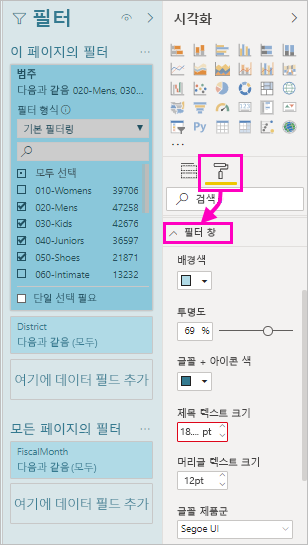

1. **필터 카드**를 확장하여 **사용 가능** 및 **적용됨** 색과 테두리를 설정합니다. 사용 가능한 카드와 적용된 카드의 색을 다르게 만들면 적용되는 필터가 명확해집니다. 
  
    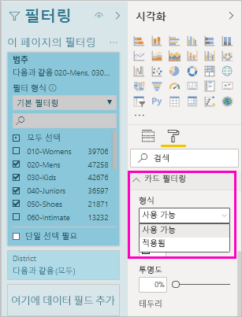

## <a name="theming-for-filter-pane"></a>필터 창에 대한 테마 설정
이제 필터 창의 기본 설정을 테마 파일로 수정할 수 있습니다. 시작하는 데 활용할 샘플 테마 코드 조각은 다음과 같습니다.

 
```
"outspacePane": [{ 

"backgroundColor": {"solid": {"color": "#0000ff"}}, 

"foregroundColor": {"solid": {"color": "#00ff00"}}, 

"transparency": 50, 

"titleSize": 35, 

"headerSize": 8, 

"fontFamily": "Georgia", 

"border": true, 

"borderColor": {"solid": {"color": "#ff0000"}} 

}], 

"filterCard": [ 

{ 

"$id": "Applied", 

"transparency": 0, 

"backgroundColor": {"solid": {"color": "#ff0000"}}, 

"foregroundColor": {"solid": {"color": "#45f442"}}, 

"textSize": 30, 

"fontFamily": "Arial", 

"border": true, 

"borderColor": {"solid": {"color": "#ffffff"}}, 

"inputBoxColor": {"solid": {"color": "#C8C8C8"}} 

}, 

{ 

"$id": "Available", 

"transparency": 40, 

"backgroundColor": {"solid": {"color": "#00ff00"}}, 

"foregroundColor": {"solid": {"color": "#ffffff"}}, 

"textSize": 10, 

"fontFamily": "Times New Roman", 

"border": true, 

"borderColor": {"solid": {"color": "#123456"}}, 

"inputBoxColor": {"solid": {"color": "#777777"}} 

}] 
```

## <a name="sort-the-filter-pane"></a>필터 창 정렬

사용자 지정 정렬 기능은 새 필터 창 환경의 일부입니다. 보고서 작성자는 필터를 끌어서 놓아 원하는 순서로 재정렬할 수 있습니다.


기본 정렬 순서는 필터의 사전순입니다. 사용자 지정 정렬 모드를 시작하려면 임의의 필터를 새 위치로 끌어 놓습니다. 적용되는 수준 내에서만 필터를 정렬할 수 있습니다. 예를 들어 시각적 개체 수준, 페이지 수준 또는 보고서 수준의 필터입니다.

## <a name="improved-filters-pane-accessibility"></a>개선된 필터 창 접근성

새 필터 창의 키보드 탐색이 개선되었습니다. 필터 창의 모든 부분을 탭으로 이동하고 키보드의 컨텍스트 키나 Shift+F10을 사용하여 상황에 맞는 메뉴를 열 수 있습니다.

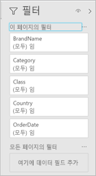

## <a name="rename-filters"></a>필터 이름 바꾸기
필터 창을 편집하는 경우 제목을 두 번 클릭하여 편집할 수 있습니다. 최종 사용자에게 보다 적합하도록 필터 카드를 업데이트하려면 이름 바꾸기가 유용합니다. 필터 카드의 이름을 바꾸면 필드 목록에 있는 필드의 표시 이름이 바뀌지 ‘않습니다’.  필터 카드에 사용된 표시 이름만 변경합니다.

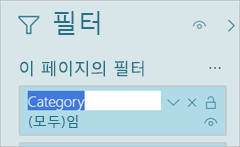

## <a name="restrict-changes-to-filter-type"></a>변경을 필터 유형으로 제한

보고서 설정의 필터링 환경 섹션에는 사용자가 필터 유형을 변경할 수 있는지 여부를 제어하는 옵션이 있습니다.

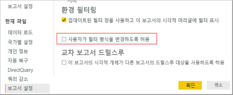

## <a name="next-steps"></a>다음 단계

새 필터 환경을 체험해 보세요. [Power BI Ideas 사이트](https://ideas.powerbi.com/forums/265200-power-bi)에서 이 기능에 대한 피드백을 제공하고 기능을 계속 개선할 방법을 알려주세요. 

- [보고서 필터를 사용하는 방법](consumer/end-user-report-filter.md)
- [필터 및 보고서에서 강조 표시](power-bi-reports-filters-and-highlighting.md)
- [Power BI의 다양한 종류의 필터](power-bi-report-filter-types.md)

궁금한 점이 더 있나요? [Power BI 커뮤니티를 이용하세요.](http://community.powerbi.com/)

