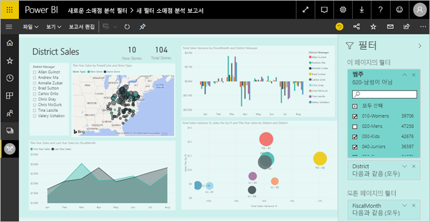
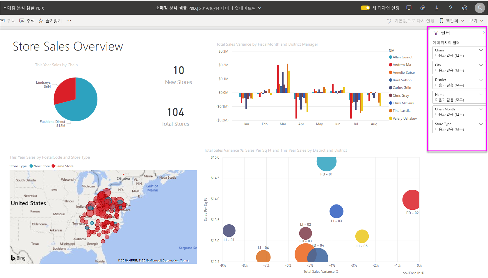
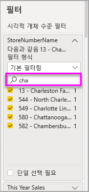
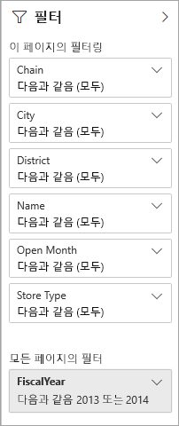
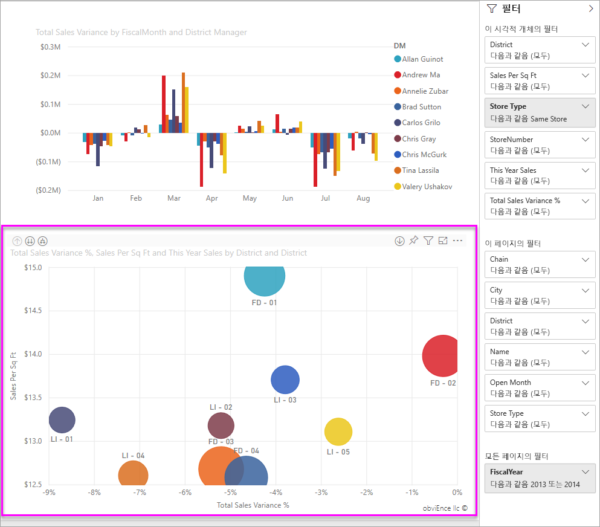
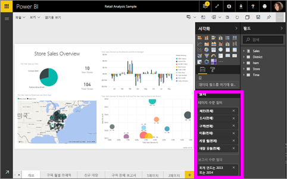

# Power BI 보고서의 필터 및 강조 표시
 이 문서에서는 Power BI 서비스의 필터링 및 강조 표시를 소개합니다. 환경은 Power BI Desktop과 거의 동일합니다. *필터*는 사용자가 집중하려는 데이터를 제외한 나머지를 모두 제거합니다. ‘강조 표시’는 필터링되지 않습니다.  데이터를 제거하지 않지만 표시되는 데이터의 하위 집합을 강조 표시합니다. 강조 표시되지 않은 데이터는 볼 수 있지만 흐리게 표시됩니다.

다양한 방법으로 Power BI에서 보고서를 필터링하고 강조 표시할 수 있습니다. 모든 해당 정보를 하나의 문서에 배치하는 것이 혼란스러울 수 있으므로 다음 섹션으로 구분했습니다.

* 필터 및 강조 표시에 대한 소개, 지금 읽고 있는 문서.
* Power BI Desktop 및 Power BI 서비스에 있는 보고서의 [편집용 보기에서 필터를 만들고 사용](power-bi-report-add-filter.md)하는 방법. 보고서에 대한 편집 권한이 있는 경우 보고서에서 필터를 만들고 수정 및 삭제할 수 있습니다.
* Power BI 서비스에 있는 보고서 읽기용 보기의 [사용자와 공유된 보고서에서 시각적 개체를 필터링 및 강조 표시](consumer/end-user-interactions.md)하는 방법. 수행할 수 있는 작업은 더 제한적이지만 여전히 다양한 필터링 및 강조 표시 옵션을 사용할 수 있습니다.  
* Power BI Desktop 및 Power BI 서비스의 [편집용 보기에서 사용할 수 있는 필터 및 강조 표시 컨트롤](power-bi-report-add-filter.md)에 대한 자세한 둘러보기. 이 문서에서는 날짜 및 시간, 숫자, 텍스트 등의 필터 형식을 자세히 살펴봅니다. 기본 및 고급 옵션의 차이점에 관해서도 설명합니다.
* 필터 및 강조 표시가 기본적으로 작동하는 방법을 알아본 후 [페이지 필터 및 상호 강조 표시에서 시각화 방식을 변경](service-reports-visual-interactions.md)하는 방법을 알아봅니다.

**알고 계십니까?** Power BI에는 새 필터 환경이 있습니다. [Power BI 보고서의 새 필터 환경](power-bi-report-filter.md)에 대해 자세히 알아보세요.

## 필터 창 소개

**필터** 창에서 필터를 적용하거나 보고서 자체에서 직접 [슬라이서를 선택](visuals/power-bi-visualization-slicers.md)하여 필터를 적용할 수 있습니다. 필터 창은 보고서에서 사용되는 테이블 및 필드와 있는 경우 적용된 필터를 보여 줍니다. 

네 가지 필터가 있습니다.

- **페이지 수준 필터**는 보고서 페이지의 모든 시각적 개체에 적용됩니다.     
- **시각적 개체 수준 필터**는 보고서 페이지의 단일 시각적 개체에 적용됩니다. 보고서 캔버스에서 시각적 개체를 선택한 경우 시각적 수준 필터만 표시됩니다.    
- **보고서 수준 필터**는 보고서의 모든 페이지에 적용됩니다.    
- **드릴스루 필터**는 보고서의 단일 엔터티에 적용됩니다.    

읽기용 또는 편집용 보기에서 페이지 수준, 시각적 개체 수준 및 보고서 수준 필터를 검색하여 원하는 값을 찾고 선택할 수 있습니다. 

필터 옆에 **모두**라는 단어가 있는 경우 이는 필드의 모든 값이 필터에 포함된다는 것을 의미합니다.  예를 들어 아래 스크린샷의 **체인(전체)** 은 이 보고서 페이지가 모든 상점 체인에 대한 데이터를 포함한다는 것을 의미합니다.  반면 **회계 연도는 2013 또는 2014**의 보고서 수준 필터는 보고서가 2013 및 2014년의 회계 연도에 대한 데이터만을 포함한다는 것을 알려 줍니다.

## 읽기용 또는 편집용 보기의 필터
보고서는 다음 두 가지 모드로 조작할 수 있습니다. [읽기용 보기](consumer/end-user-reading-view.md) 및 편집용 보기. 사용할 수 있는 필터링 기능은 현재 모드에 따라 달라집니다.

* 편집용 보기에서는 보고서, 페이지, 드릴스루 및 시각적 개체 필터를 추가할 수 있습니다. 보고서를 저장하는 경우 모바일 앱에서 여는 경우에도 필터를 보고서와 함께 저장합니다. 읽기용 보기에서 보고서를 보는 사람들은 사용자가 추가한 필터를 조작할 수 있지만 새 필터를 추가할 수 없습니다.
* 읽기용 보기에서 이미 보고서에 존재하는 필터를 조작하고 선택을 저장할 수 있습니다. 새 필터를 추가할 수 없습니다.

### 읽기용 보기의 필터
읽기용 보기에서만 보고서에 액세스할 수 있는 경우 [필터] 창은 다음과 유사하게 표시됩니다.

따라서 보고서의 이 페이지에는 6개의 페이지 수준 필터와 1개의 보고서 수준 필터가 있습니다.

각 시각적 개체는 시각적 개체의 모든 필드에 대한 필터를 포함할 수 있으며 보고서 작성자가 더 추가할 수 있습니다. 아래 이미지에서 거품형 차트에는 6개의 필터가 있습니다.

읽기용 보기에서 기존 필터를 수정하여 데이터를 검색합니다. 모바일 앱에서 보고서를 여는 경우에도 변경 내용을 보고서와 함께 저장합니다. [보고서 필터 창](consumer/end-user-report-filter.md)을 둘러볼 때 방법을 알아보세요.

보고서를 종료하면 필터가 저장됩니다. 필터링 실행을 취소하고 보고서 작성자가 설정한 기본 필터링, 분할, 드릴 및 정렬로 돌아가려면 위의 메뉴 모음에서 **기본값으로 다시 설정**을 선택합니다.

### 편집용 보기의 필터
보고서에 대한 소유자 권한이 있는 경우 편집용 보기에서 열면 **필터**는 사용할 수 있는 여러 개의 편집 창 중 하나인 것을 확인할 수 있습니다.

읽기용 보기에서는 보고서의 이 페이지에 6개의 페이지 수준 필터와 1개의 보고서 수준 필터가 있음을 알 수 있습니다. 그리고 거품형 차트를 선택하여 6개의 시각적 수준 필터가 적용된 것을 알 수 있습니다.

편집용 보기에서 필터와 강조 표시로 더 많은 작업을 수행할 수 있습니다. 주로 새 필터를 추가할 수 있습니다. [보고서에 필터를 추가](power-bi-report-add-filter.md)하는 방법 등을 알아보세요.

## 임시 강조 표시
시각적 개체에서 값 또는 축 레이블을 선택하여 페이지의 다른 시각적 개체를 강조 표시합니다. 강조 표시를 제거하려면 값을 다시 선택하거나 동일한 시각적 개체에서 빈 공간을 선택합니다. 강조 표시는 데이터 영향을 신속하게 살펴보는 흥미로운 방법입니다. 이러한 상호 강조 표시의 작동 방법을 미세 조정하려면 [시각적 상호 작용](service-reports-visual-interactions.md)을 참조하세요.

## 다음 단계

[Power BI 보고서의 새 필터 환경](power-bi-report-filter.md)

[보고서에 필터 추가(편집용 보기)](power-bi-report-add-filter.md)

[보고서 필터 둘러보기](consumer/end-user-report-filter.md)

[보고서 시각적 개체가 서로 교차 필터링 및 교차 강조 표시되는 방식 변경](consumer/end-user-interactions.md)

궁금한 점이 더 있나요? [Power BI 커뮤니티를 이용하세요.](https://community.powerbi.com/)

