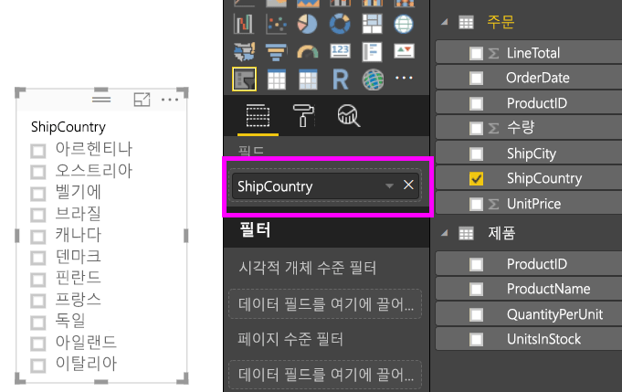
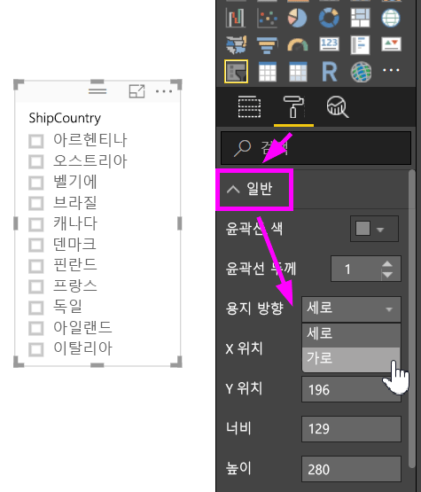
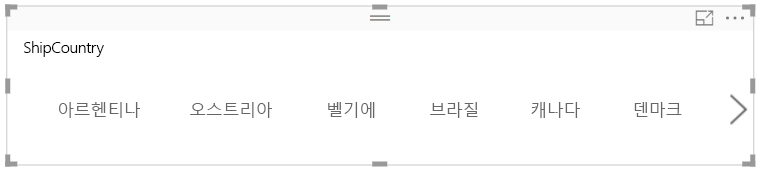
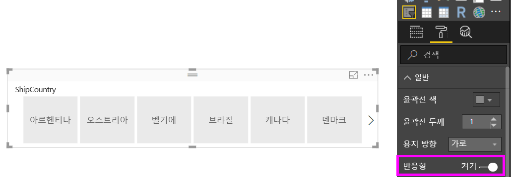
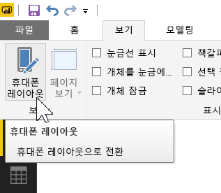
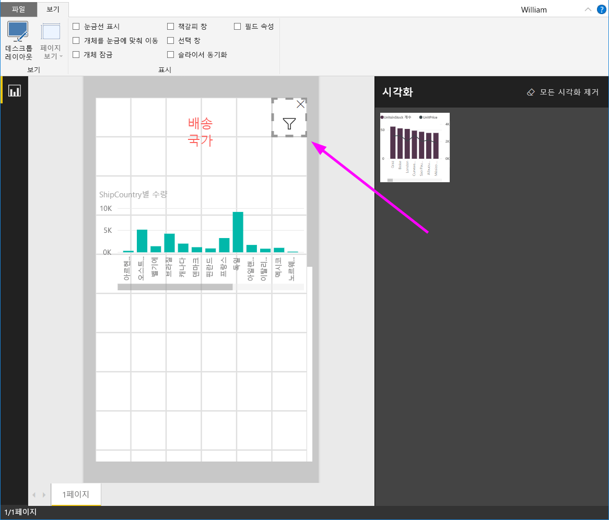

# Power BI에서 크기를 조정할 수 있는 반응형 슬라이서 만들기

반응형 슬라이서 크기를 보고서 공간에 맞게 조정합니다. 반응형 슬라이서를 사용하면 가로부터 정사각형 및 세로까지 다양한 크기와 모양으로 크기를 변경할 수 있으며, 사용자가 조작하는 대로 슬라이서의 값이 자동으로 다시 정렬됩니다. Power BI Desktop 및 Power BI 서비스에서 수평 슬라이서 및 날짜/범위 슬라이서를 반응형으로 만들 수 있습니다. 또한 날짜/범위 슬라이서는 손끝으로 손쉽게 변경할 수 있도록 터치 영역이 개선되었습니다. 반응형 슬라이서를 원하는 대로 작게 또는 크게 변경할 수 있습니다. 그러면 Power BI 서비스 및 Power BI 모바일 앱의 보고서에 잘 맞도록 자동으로 크기가 변경됩니다. 

## 슬라이서 만들기

동적 슬라이서를 만드는 첫 번째 단계는 기본 슬라이서를 만드는 것입니다. 

1. **시각화** 창에서 **슬라이서** 아이콘 을 선택합니다.
2. 필터링할 필드를 **필드**로 끌어옵니다.

    

## 가로 슬라이서로 변환

1. 선택한 슬러이서를 사용하여 **시각화** 창에서 **서식** 탭을 선택합니다.
2. **일반** 섹션을 확장한 다음 **방향**에서 **가로**를 선택합니다.

     

1.  더 많은 값을 표시하도록 더 넓게 표시할 수 있습니다.

     

## 반응형으로 전환 및 시험

이 단계는 쉽습니다. 

1. **서식** 탭의 **일반** 섹션에 있는 **방향** 바로 아래에서 **반응형**을 **켜기**로 밉니다.  

    

1. 이제 조작할 수 있습니다. 모서리를 끌어서 짧게, 높게, 넓게 및 좁게 만듭니다. 충분히 작게 만드는 경우 필터 아이콘만 표시됩니다.

    

## 휴대폰 보고서 레이아웃에 추가

Power BI Desktop에서는 보고서의 각 페이지에 대한 휴대폰 레이아웃을 만들 수 있습니다. 페이지에 휴대폰 레이아웃이 있는 경우 휴대폰에서 세로 보기로 표시됩니다. 그렇지 않은 경우 가로 보기로 봐야 합니다. 

1. **보기** 탭에서 **휴대폰 레이아웃**을 선택합니다.

     
    
1. 휴대폰 보고서에서 원하는 모든 시각적 개체를 그리드로 끌어 옵니다. 반응형 슬라이서를 끌 때 원하는 크기로 만듭니다. 이 경우에는 필터 아이콘입니다.

    

[Power BI 모바일 앱에 최적화된 보고서](desktop-create-phone-report.md) 만들기에 대한 자세한 내용을 읽어 보세요.

## 타일 또는 범위 슬라이서를 반응형으로 만들기

동일한 단계에 따라 시간 또는 범위 슬라이서를 반응형으로 만들 수 있습니다. **반응형**을 **켜기**로 설정한 후 다음과 같은 몇 가지를 확인할 수 있습니다.

- 시각적 개체는 캔버스에서 허용되는 크기에 따라 입력란의 순서를 최적화합니다. 
- 데이터 요소 표시는 캔버스에서 허용된 크기에 따라 슬라이서를 최대한 사용 가능하도록 최적화됩니다. 
- 슬라이더에서 새 라운드 핸들바는 터치 상호 작용을 최적화합니다. 
- 시각적 개체가 너무 작아서 유용하게 사용할 수 없는 경우 해당 위치에서 시각적 유형을 나타내는 아이콘이 됩니다. 이와 상호 작용하려면 두 번 탭하여 포커스 모드로 엽니다. 그러면 유용한 공간이 기능 손실 없이 보고서 페이지에 저장됩니다.

## 다음 단계

- [Power BI 서비스의 슬라이서](visuals/power-bi-visualization-slicers.md)
- 궁금한 점이 더 있나요? [Power BI 커뮤니티에 질문합니다.](http://community.powerbi.com/)