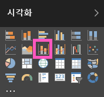

# Power의 콤보 차트(자습서)
Power BI 콤보 차트는 꺾은선형 차트와 세로 막대형 차트를 결합한 단일 시각화 요소입니다. 2개 차트를 하나로 결합하면 데이터를 더 빠르게 비교할 수 있습니다.

콤보 차트에는 하나 또는 두 개의 Y축이 있을 수 있습니다.

## 콤보 차트를 사용하는 경우
다음과 같은 경우 콤보 차트를 사용하는 것이 좋습니다.

* X축이 동일한 꺾은선형 차트와 세로 막대형 차트가 있는 경우
* 여러 값 범위와 여러 측정값을 비교하는 경우
* 두 측정값 간의 상관관계를 하나의 시각화에 보여주는 경우
* 하나의 측정값이 다른 측정값으로 정의된 목표를 충족하는지 확인하는 경우
* 캔버스 공간을 절약하려는 경우

### 필수 조건
콤보 차트는 Power BI 서비스 및 Power BI Desktop에서 사용할 수 있습니다. 이 자습서에서는 Power BI 서비스를 사용하여 콤보 차트를 만듭니다. 자습서를 따라 하려면 Power BI 서비스를 열고 "소매 분석" 샘플([아래 지침](#create))에 연결합니다.

## 기본, 단일 축, 콤보 차트 만들기
Will이 판매 및 샘플 마케팅을 사용하여 콤보 차트를 만드는 과정을 시청합니다.

<iframe width="560" height="315" src="https://www.youtube.com/embed/lnv66cTZ5ho?list=PL1N57mwBHtN0JFoKSR0n-tBkUJHeMP2cP" frameborder="0" allowfullscreen></iframe>

고유한 콤보 차트를 만들려면 Power BI 서비스에 로그인하고 **데이터 가져오기 \> 샘플 \> 소매 분석 샘플 > 연결 > 대시보드로 이동**을 선택합니다. 

1. "소매 분석 샘플" 대시보드에서 **Total Stores** 타일을 선택하여 "소매 분석 샘플" 보고서를 엽니다.
2. **보고서 편집** 을 선택하여 편집 보기에서 보고서를 엽니다.
3. [새 보고서 페이지를 추가합니다](power-bi-report-add-page.md).
4. 올해의 판매액 및 총 수익을 월별로 표시하는 세로 막대형 차트를 만듭니다.
   
    a.  필드 창에서 **판매액** \> **올해 판매액** > **값**을 선택합니다.
   
    b.  **판매액** \> **올해 총 수익**을 **값** 웰로 끌어다 놓습니다.
   
    c.  **시간** \> **회계 월**을 선택하여 **축** 웰에 추가합니다. 
   
    
5. 시각화의 오른쪽 위 모서리에 있는 줄임표(...)를 선택하고 **FiscalMonth 기준 정렬**을 선택합니다. 오름차순 또는 내림차순으로 정렬하려면 두 번 선택해야 할 수도 있습니다.

6. 세로 막대형 차트를 콤보 차트로 변환합니다. 세로 막대형 차트를 선택한 상태로 **시각화** 창에서 **꺾은선형 및 묶은 세로 막대형 차트**를 선택합니다.
   
    
7. **필드** 창에서 **판매액** \> **작년 판매액**을 **꺾은선형 값** 버킷으로 끌어다 놓습니다.
   
   
   
   콤보 차트가 다음과 같이 표시됩니다.
   
   

## 두 개의 축이 있는 콤보 차트 만들기
이 작업에서는 총 수익과 매출을 비교하겠습니다.

1. **월별** **작년의 총 수익률(%)**을 추적하는 새로운 꺾은선형 차트를 만듭니다.  1월에는 GM%가 35%였고, 4월에 45% 고점에 도달했으며, 7월에 감소하고, 8월에 다시 고점에 도달했습니다. 작년과 금년의 매출 패턴이 유사할까요?
   
   
2. **This Year Sales > Value** 및 **Last Year Sales**를 꺾은선형 차트에 추가합니다. **작년의 총 수익률(%)**의 눈금은 **Sales** 눈금보다 훨씬 작기 때문에 비교하기가 어렵습니다.      
   
   
3. 보다 쉽게 읽고 해석 가능한 시각적 개체를 만들려면 꺾은선형 차트를 꺾은선형 및 누적 세로 막대형 차트로 변환합니다.
   
   
4. **작년 총수익%**을 **세로 막대 값**에서 **꺾은선형 값**으로 끌어다 놓습니다. Power BI가 두 개의 축을 만들기 때문에 데이터 집합의 크기를 다르게 조정할 수 있습니다. 왼쪽은 판매액(달러)을 측정하고, 오른쪽은 백분율을 측정합니다.
   
       

## 축에 제목 추가
1. 페인트 롤러 아이콘 을 선택하여 서식 창을 엽니다.
2. 아래쪽 화살표를 선택하여 **Y축** 옵션을 확장합니다.
3. **Y축(열)**에 대해 **위치**를 **왼쪽**으로 설정하고, **제목**을 **켬**으로 설정하고, **스타일**을 **제목만 표시**로 설정하고, **디스플레이**를 **수백만**으로 설정합니다.
   
   
4. **Y축(열)** 아래에서 아래로 스크롤하여 **보조 표시**가 **켬**으로 설정되었는지 확인합니다. 이렇게 설정하면 콤보 차트에서 꺾은선형 차트의 서식을 지정할 수 있는 옵션이 표시됩니다.
   
   
5. **Y축(선)**에 대해 **위치**는 그대로 **오른쪽**으로 두고, **제목**을 **켬**으로 설정하고, **스타일**을 **제목만 표시**로 설정합니다.
   
   이제 콤보 차트에 이중 축과 제목이 표시됩니다.
   
   

6. 차트의 가독성을 높일 수 있도록 필요에 따라 텍스트 글꼴, 크기 및 색을 수정하고 기타 서식 옵션을 설정합니다.

여기서 다음과 같은 작업을 수행할 수 있습니다.

* [대시보드 타일로 콤보 차트를 추가합니다](service-dashboard-tiles.md).
* [보고서를 저장합니다](service-report-save.md).

## 교차 강조 표시 및 교차 필터링

콤보 차트에서 특정 세로 막대 또는 꺾은선을 강조 표시하면 보고서 페이지의 다른 시각화 요소가 교차 강조 표시 및 교차 필터링되며 그 반대의 경우도 마찬가지입니다. 이 기본 동작을 변경하려면 [시각적 상호 작용](visual-interactions.md)을 사용합니다.

## 다음 단계

[Power BI 보고서의 시각화 개요](power-bi-report-visualizations.md)

[Power BI의 시각화 유형](power-bi-visualization-types-for-reports-and-q-and-a.md)

[Power BI - 기본 개념](service-basic-concepts.md)

궁금한 점이 더 있나요? [Power BI 커뮤니티를 이용하세요.](http://community.powerbi.com/)

