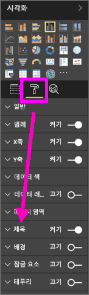
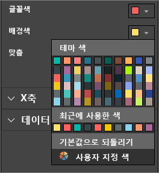
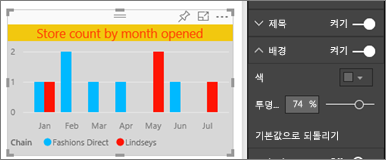
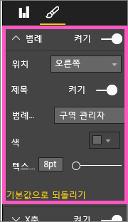
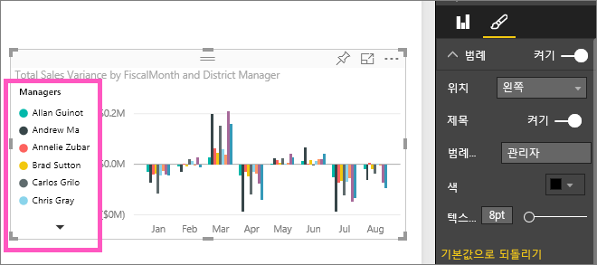

# 시각화 제목, 범례 및 배경 사용자 지정
이 자습서에서는 시각화를 사용자 지정하는 몇 가지 방법을 알아봅니다.   시각화를 사용자 지정하는 많은 옵션이 있으며 모두에 대해 자세히 알아보기 위한 가장 좋은 방법은 서식 지정 창(페인트 롤러 아이콘 선택)을 탐색하는 것입니다.  시작하기 위해 이 문서는 시각화 제목, 범례 및 배경을 사용자 지정하는 방법을 보여 줍니다.  

일부 시각화는 사용자 지정할 수 없습니다. [전체 목록을 확인](#list)하세요.  

Amanda가 보고서에서 시각화를 사용자 지정하는 비디오를 시청하세요(비디오에서 4시 50분으로 빨리 감기). 그런 다음 고유한 데이터를 사용하여 비디오 아래에 있는 지침을 따라서 직접 시도해 볼 수 있습니다.

<iframe width="560" height="315" src="https://www.youtube.com/embed/IkJda4O7oGs" frameborder="0" allowfullscreen></iframe>

### 필수 조건
- Power BI 서비스 또는 Power BI Desktop
- 소매점 분석 샘플

## 보고서의 시각화 제목 사용자 지정
과정을 따르려면 Power BI 서비스(app.powerbi.com)에 로그인하고 [편집용 보기](service-interact-with-a-report-in-editing-view.md)에서 [소매점 분석 샘플](sample-datasets.md) 보고서를 엽니다.

> [!NOTE]
> 시각화를 대시보드에 고정하면 대시보드 타일이 됩니다.  타일 자체도 [새 제목 및 부제, 하이퍼링크로 사용자 지정하고 크기를 조정](service-dashboard-edit-tile.md)할 수 있습니다.
> 
> 

1. 보고서의 "New Stores" 페이지로 이동하고 "Open Store Count by Open Month..." 세로 막대형 차트를 선택합니다.
2. 시각화 창에서 페인트 롤러 아이콘을 선택하여 서식 지정 옵션을 표시합니다.  **제목**을 선택하여 해당 섹션을 확장합니다.  
   
   
3. 켜기(또는 끄기) 슬라이더를 선택하여  **제목** 을 켜고 끕니다. 이 경우에는 **켜기**로 설정합니다.  
   
   
4. 텍스트 필드에서 **열린 월별 저장소 수** 를 입력하여 **제목 텍스트** 를 변경합니다.  
5. **글꼴 색** 을 주황색으로 변경하고 **배경색** 을 노란색으로 변경합니다.
   
   * 드롭다운을 선택하고 **테마 색**, **최근에 사용한 색**또는 **사용자 지정 색**에서 색을 선택합니다.
   * 색 창을 닫으려면 드롭다운을 선택합니다.  
     
   
   색 창에서 **기본값으로 되돌리기** 를 선택하면 언제든 기본 색으로 되돌릴 수 있습니다.
6. 텍스트 크기를 12로 늘립니다.
7. 차트 제목에 대한 마지막으로 사용자 지정 작업은 시각화의 가운데에 정렬하는 것입니다. 제목 위치는 왼쪽 맞춤으로 기본 설정됩니다.  
   
   
    이 시점에서 자습서의 열 차트 **제목**은 다음과 같아야 합니다.  
    
   
    지금까지 수행한 모든 제목 사용자 지정 작업을 되돌리려면 **제목**사용자 지정 창 맨 아래에 있는 **기본값으로 되돌리기** 를 선택합니다.  
    

## 시각화 배경 사용자 지정
동일한 세로 막대형 차트를 선택한 상태로 배경 옵션을 확장합니다.

1. 켜기(또는 끄기) 슬라이더를 선택하여 배경을 켜고 끕니다. 이 경우에는 **켜기**로 설정합니다.
2. 배경색을 74% 회색으로 변경합니다.
   
   * 드롭다운을 선택하고 **테마 색**, **최근에 사용한 색** 또는 **사용자 지정 색**에서 회색을 선택합니다.
   * 투명도를 74%로 변경합니다.   
     
   
   지금까지 수행한 모든 제목 배경 사용자 지정 작업을 되돌리려면 **배경**사용자 지정 창의 맨 아래에서 **기본값으로 되돌리기** 를 선택합니다.

## 시각화 범례 사용자 지정
1. **개요** 보고서 페이지를 열고 "회계 월 및 구역 관리자별 총 판매액 분산" 차트를 선택합니다.
2. 시각화 탭에서 페인트 브러시 아이콘을 선택하여 서식 창을 엽니다.  
3. **범례** 옵션을 확장합니다.
   
      
4. 켜기(또는 끄기) 슬라이더를 선택하여 범례를 켜고 끕니다. 이 경우에는 **켜기**로 설정합니다.
5. 범례를 시각화의 왼쪽으로 이동합니다.    
6. **제목** 을 **켜기** 로 전환하고 **범례 이름** 필드에 **관리자**를 입력하여 범례 제목을 추가합니다.
   
   
   지금까지 수행한 모든 범례 사용자 지정 작업을 되돌리려면 **범례**사용자 지정 창 맨 아래에 있는 **기본값으로 되돌리기** 를 선택합니다.

## 사용자 지정할 수 있는 시각화 유형
| 시각화 | 제목 | 배경 | 범례 |
|:--- |:--- |:--- |:--- |
| 영역 |예 |예 |예 |
| 막대 |예 |예 |예 |
| 카드 |예 |예 |해당 없음 |
| 여러 행 카드 |예 |예 |해당 없음 |
| 열 |예 |예 |예 |
| 콤보 |예 |예 |예 |
| 도넛 |예 |예 |예 |
| 등치 지역도 |예 |예 |예 |
| 깔때기 |예 |예 |해당 없음 |
| 계기 |예 |예 |해당 없음 |
| KPI |예 |예 |해당 없음 |
| 선 |예 |예 |예 |
| 맵 |예 |예 |예 |
| 행렬 |예 |예 |해당 없음 |
| 원형 |예 |예 |예 |
| 분산형 |예 |예 |예 |
| 슬라이서 |예 |예 |해당 없음 |
| 테이블 |예 |예 |해당 없음 |
| 텍스트 상자 |아니요 |예 |해당 없음 |
| 트리맵 |예 |예 |예 |
| 폭포 |예 |예 |예 |

## 다음 단계
[X축 및 Y축 사용자 지정](power-bi-visualization-customize-x-axis-and-y-axis.md)  
[색 및 축 속성 사용자 지정](service-getting-started-with-color-formatting-and-axis-properties.md)  
[Power BI - 기본 개념](service-basic-concepts.md)  
궁금한 점이 더 있나요? [Power BI 커뮤니티를 이용하세요.](http://community.powerbi.com/)

