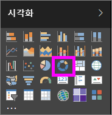
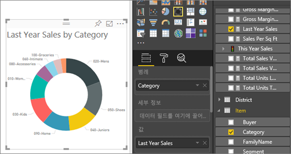

# Power BI의 도넛형 차트(자습서)
도넛형 차트는 전체에 대한 부분의 관계를 표시한다는 점에서 원형 차트와 비슷합니다. 가운데가 비어 있고 레이블 또는 아이콘이 들어갈 공간이 있다는 점만 다릅니다.

## 도넛형 차트 만들기
이러한 지침에서는 소매 분석 샘플을 사용하여 올해의 판매액을 범주별로 표시하는 도넛형 차트를 만듭니다. 이를 수행하려면 Power BI 서비스(app.powerbi.com) 또는 Power BI Desktop에 대한 [샘플을 다운로드](sample-datasets.md)합니다.

1. [빈 보고서 페이지](power-bi-report-add-page.md)에서 시작하고 **SalesStage** \> **영업 단계** 필드를 선택합니다. Power BI 서비스를 사용하는 경우 [편집용 보기](service-interact-with-a-report-in-editing-view.md)에서 보고서를 엽니다.

2. 필드 창에서 **Sales** \> **Last Year Sales**를 선택합니다.  
   
3. 시각화 창에서 도넛형 차트 아이콘 을 선택하여 가로 막대형 차트를 도넛형 차트로 변환합니다. **Values** 영역에 **Last Year Sales**가 없을 경우 끌어다 놓습니다.
     
   

4. **항목**\>**범주**를 선택하여 **범례** 영역에 추가합니다. 
     
    

5. 필요에 따라 [차트 텍스트의 크기와 색을 조정](power-bi-visualization-customize-title-background-and-legend.md)합니다. 

## 고려 사항 및 문제 해결
* 도넛형 차트 값을 더한 총합은 100%를 넘지 않아야 합니다.
* 범주가 너무 많으면 읽고 해석하기 어렵습니다.
* 도넛형 차트는 개별 섹션을 서로 비교하는 것보다는 특정 섹션을 전체와 비교하는 데 사용하는 것이 가장 좋습니다. 

## 다음 단계
[Power BI의 보고서](service-reports.md)

[Power BI의 시각화 유형](power-bi-visualization-types-for-reports-and-q-and-a.md)

[Power BI 보고서의 시각화](power-bi-report-visualizations.md)

[Power BI - 기본 개념](service-basic-concepts.md)

궁금한 점이 더 있나요? [Power BI 커뮤니티를 이용하세요.](http://community.powerbi.com/)

