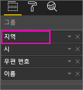
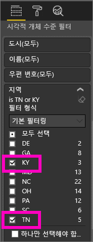
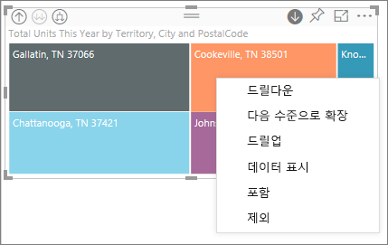
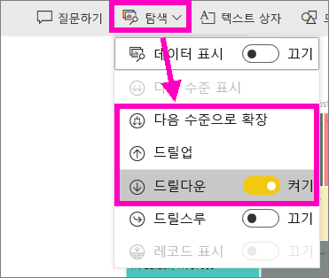
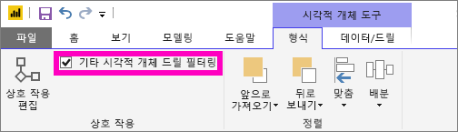
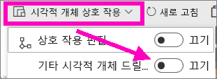
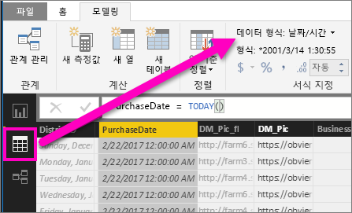

# Power BI에서 시각화 드릴 모드

## 드릴 시 계층 구조 필요
시각적 계층 구조가 있는 경우 추가 세부 정보를 드릴다운할 수 있습니다. 예를 들어 스포츠, 규칙 및 이벤트로 구성된 계층별로 올림픽 메달 개수를 표시하는 시각화를 할 수 있습니다. 기본적으로 시각화는 체조, 스키, 수상 운동 등 스포츠별로 메달 수를 표시하게 됩니다. 하지만 계층 구조가 있기 때문에 시각적 요소 중 하나를 선택하면(예: 바, 라인 또는 버블) 점점 더 자세한 그림을 표시하게 됩니다. 수영, 다이빙, 수구에 대한 데이터를 보려면 **수상 운동** 요소를 선택합니다.  스프링보드, 플랫폼, 싱크로나이즈드 다이빙 이벤트에 대한 세부 정보를 보려면 **다이빙** 요소를 선택합니다.

사용자가 소유한 보고서에 계층 구조를 추가할 수 있지만 사용자와 공유한 보고서에는 계층 구조를 추가할 수 없습니다.
Power BI 시각화에 계층 구조가 포함되어 있는 것이 확실한가요?  시각화를 마우스로 가리키고 상단 모서리에서 이러한 드릴 컨트롤이 보이면 시각화에 계층이 있는 것입니다.

    
   

날짜는 계층 구조의 고유 형식입니다. 시각화에 날짜 필드를 추가한 경우 Power BI에서 년, 분기, 월 및 일을 포함하는 시간 계층 구조를 자동으로 추가합니다. 자세한 내용은 [시각적 계층 구조 및 드릴 다운 동작](guided-learning/visualizations.yml?tutorial-step=18)을 참조하거나 아래 비디오를 시청 하세요.

  <iframe width="560" height="315" src="https://www.youtube.com/embed/MNAaHw4PxzE?list=PL1N57mwBHtN0JFoKSR0n-tBkUJHeMP2cP" frameborder="0" allowfullscreen></iframe>

> [!NOTE]
> Power BI Desktop을 사용하여 계층을 만드는 방법에 자히 알아보려면 [계층 만들고 추가하는 방법](https://youtu.be/q8WDUAiTGeU) 비디오를 시청하세요.
> 

## 필수 조건

1. Power BI 서비스에서 드릴에는 계층 구조를 포함한 시각화가 필요합니다. 
   
2. 과정을 따르려면 [소매점 분석 샘플을 열고](sample-datasets.md) **지역**, **도시**, **우편번호** 및 **이름**(그룹)별로 **올해 총 단위**(값)를 보여주는 트리맵을 만듭니다.  트리 맵에는 지역, 도시, 우편번호 및 도시 이름으로 구성된 계층 구조가 있습니다. 예를 들면 각 지역에 하나 이상의 도시가 있고 각 도시에 하나 이상의 우편 번호가 있습니다. 기본적으로 지역은 목록에서 첫 번째로 표시되기 때문에 시각화는 지역 데이터만 표시합니다.
   
   

2. 드릴 아이콘이 함께 작동하는 다양한 방법을 이해하는 것은 어렵습니다. 따라서 트리맵을 필터링하여 **KY** 및 **TN**이라는 작은 2개의 지역만을 표시합니다. 트리맵을 선택하고, **시각적 수준 필터** 아래에서 **영역**을 확장하고, **KY** 및 **TN**을 선택합니다.

        

   이제 트리 맵에 두 개의 영역만이 표시됩니다.

   

## 드릴 기능에 액세스하는 세 가지 방법
계층 구조를 포함하는 시각화를 위해 드릴다운, 드릴업 및 확장 기능에 액세스하는 몇 가지 옵션이 있습니다. 이 아티클에서는 아래 첫 번째 옵션을 사용하는 방법을 보여줍니다. 다운드릴 및 확장의 기본을 이해하면 모든 세 개의 메서드로 동일한 작업을 수행하게 됩니다. 시도해보고 가장 좋은 방법을 선택합니다.

- 시각화를 마우스로 가리켜서 아이콘을 확인하고 사용합니다.  

    

- 시각화를 마우스 오른쪽 단추로 클릭하여 메뉴를 표시하고 사용합니다.
    
    

- Power BI 메뉴 모음에서 **탐색** 단추를 선택합니다.

   

## 드릴 경로
### 드릴다운
시각화를 드릴하는 여러 가지 방법이 있습니다. ***드릴다운***을 사용하면 계층 구조의 다음 수준으로 이동합니다. 따라서 **영역** 수준으로 표시되는 경우 도시 수준, 우편 번호 및 이름 수준까지 드릴다운할 수 있습니다. 경로의 각 단계에서는 새 정보를 보여줍니다.

### 확장

***확장***은 현재 보기에 추가 계층 수준을 추가합니다. 따라서 **영역** 수준으로 표시되는 경우 트리맵에 도시, 우편 번호 및 이름 세부 정보를 확장하고 추가할 수 있습니다. 경로의 각 단계에서는 동일한 정보를 표시하고 한 가지 수준의 새로운 정보에 추가합니다.

한 번에 한 필드 또는 한 번에 모든 필드에서 드릴다운할지 아니면 확장할지를 선택할 수 있습니다. 

## 한 번에 모든 필드 드릴다운

1. KY 및 TN에 대한 데이터를 보여주는 최상위 수준의 트리맵에서 시작합니다. 핸들 중 하나를 선택하고 오른쪽으로 끌어서 트리맵을 넓힙니다. 

     .

2. ***한 번에 모든 필드***를 드릴다운하려면 시각화 왼쪽 위 모서리에 있는 양방향 화살표를 선택합니다.  이제 트리맵은 켄터키 및 테네시의 도시 데이터를 표시합니다. 

    
   
5. 우편 번호 수준의 계층으로 한 번 더 드릴다운합니다.

    

3. 다시 드릴업하려면 시각화 왼쪽 위에 있는 위쪽 화살표를 선택합니다. 

## 한 번에 한 필드 드릴다운
이 메서드는 시각화 자체의 오른쪽 위 모서리에 표시되는 드릴다운 아이콘을 사용합니다. 

1. 드릴다운 아이콘을 사용하여 를 설정합니다. 이제 ***한 번에 한 필드***를 드릴다운하는 옵션이 표시됩니다. 
   
   

   드릴다운을 사용하지 않는 경우 시각적 요소(예: 막대, 버블 또는 리프)를 선택하면 드릴다운하지 않지만 대신 보고서 페이지에서 다른 차트를 교차 필터링합니다.

2. **TN**에서 *리프*를 선택합니다. 이제 트리맵은 상점이 있는 테네시의 모든 도시를 표시합니다. 

    

2. 이 시점에 계속 테네시에 대해 드릴다운할 수 있습니다. 또는 특정 테네시 도시에 대해 드릴다운하거나 대신 확장할 수 있습니다(아래에서 **한 번에 모든 필드 확장** 참조). 한 번에 한 필드 드릴다운을 계속합니다.  **녹스빌, TN**을 선택합니다. 이제 트리맵은 녹스빌에 있는 상점의 우편 번호를 표시합니다. 

   

    드릴다운하고 다시 백업할 때 제목이 바뀌는 것을 인식합니다.  

## 모두 확장 및 한 번에 한 필드 확장
우편 번호만 보여주는 트리 맵은 많은 정보를 제공하지 않습니다.  따라서 계층 구조에서 한 수준 아래로 확장하겠습니다.  

1. 트리 맵이 활성되면 *아래로 확장* 아이콘을 선택합니다.  이제 트리맵은 계층 중 우편 코드 및 상점 이름이라는 2개의 수준을 표시합니다. 

    

2. 테네시에 대한 모든 4개 계층 수준의 데이터를 보려면 트리맵의 **영영 및 도시별 올해 총 단위** 두 번째 수준에 도달할 때까지 드릴업 화살표를 선택합니다. 

    

3. 드릴다운이 켜져 있는지 확인하고 , *아래로 확장* 아이콘을 선택합니다.  이제 트리맵은 도시 및 주만 표시하는 대신 추가 세부 정보인 미국 우편 번호도 보여줍니다. 

    

4. 한 번 더 *아래로 확장* 아이콘을 선택하여 트리맵에서 테네시의 모든 4개 계층 수준 세부 정보를 표시합니다. 리프를 마우스로 가리켜서 더 많은 세부 정보를 봅니다.

   

## 기타 시각적 개체 드릴 필터링
드릴 모드에서 작업할 때 드릴다운 및 확장이 페이지에서 다른 시각화에 영향을 미치는 방법을 결정할 수 있습니다. 

기본적으로 드릴은 보고서의 다른 시각적 개체를 필터링하지 않습니다. 하지만 Power BI Desktop 및 Power BI 서비스에서 이 기능을 사용할 수 있습니다. 

1. 바탕 화면에서 **형식** 탭을 선택하고, **기타 시각적 개체 드릴 필터링**의 확인란을 선택합니다.

    

2. 이제 계층 구조가 있는 시각적 요소에서 드릴다운(또는 드릴업이나 확장)할 때 해당 작업은 페이지에서 다른 시각적 개체를 필터링합니다. 

    

    

> [!NOTE]
> Power BI 서비스에서 이 기능을 사용하려면 위의 메뉴 모음에서 **시각적 개체 상호 작용 > 기타 시각적 개체 드릴 필터링**을 선택합니다.
>
> 

## 계층 구조 축 및 계층 구조 그룹 이해
계층 구조 축 및 계층 구조 그룹을 보려는 데이터의 세분성을 늘리거나 줄이는 데 사용할 수 있는 메커니즘으로 생각할 수 있습니다. 범주 및 하위 범주로 구성할 수 있는 데이터는 계층 구조를 가진 것으로 한정합니다. 물론 여기에 날짜와 시간이 포함됩니다.

**값** 웰에서 데이터 필드로 검사하려는 데이터와 함께 **축** 웰 또는 **그룹** 웰 중 하나에 추가할 하나 이상의 데이터 필드를 선택하여 계층 구조를 포함하도록 Power BI에서 시각화를 만들 수 있습니다. *드릴 모드* 아이콘이 시각화의 왼쪽 및 오른쪽 모서리에 표시되는 경우 데이터가 계층적인지 알 수 있습니다. 

기본적으로 두 가지 형식의 계층적 데이터를 고려하는 것이 좋습니다.
- 날짜 및 시간 데이터 - 날짜/시간 데이터 형식을 포함한 데이터 필드가 있으면 계층적 데이터입니다. Power BI는 [DateTime](https://msdn.microsoft.com/library/system.datetime.aspx) 구조로 값을 구문 분석할 수 있는 데이터 필드에 자동으로 계층 구조를 만듭니다. **축** 또는 **그룹**에 날짜/시간 필드를 하나 추가하기만 하면 됩니다.
- 범주 데이터 - 데이터가 하위 컬렉션을 포함하는 컬렉션에서 파생된 경우입니다. 또는 그렇지 않은 경우 공통 값을 공유하는 데이터 행이면 계층적 데이터입니다.

Power BI를 사용하면 하나 또는 모든 하위 집합을 확장할 수 있습니다. 데이터를 다운드릴하여 각 수준에서 단일 하위 집합을 보거나 동시에 각 수준에서 모든 하위 집합을 볼 수 있습니다. 예를 들어 계층 구조를 따라서 특정 연도에 대해 드릴다운하거나 각 연도 대한 모든 결과를 확인할 수 있습니다. 반대로 동일한 방식으로 드릴업할 수 있습니다.

다음 섹션에서는 가장 높은 보기, 중간 보기 및 가장 낮은 보기에서 드릴다운을 설명합니다.

### 계층적 데이터 및 시간 데이터
예를 들어 [소매 분석 샘플](sample-datasets.md)을 따라 **TotalSales**(값) 별로 **월**(축)을 보는 세로 막대형 누적 차트 시각화를 만듭니다.  

축 데이터 필드가 **월**인 경우라도 **축**에서 **연도** 범주를 생성합니다. Power BI가 읽어 온 모든 값에 대한 전체 날짜/시간 구조를 제공하기 때문입니다. 계층 구조의 상단에서는 연도에 대한 데이터를 표시합니다.

드릴다운 모드에서 차트에서 막대를 클릭하여 계층 구조의 한 수준 아래로 이동합니다. 분기의 데이터에 세 개의 막대 차트가 사용할 수 있다고 표시됩니다. 그런 다음, 왼쪽 상단 아이콘에서 **계층 구조의 한 수준 아래로 모두 확장**을 선택합니다. 다시 이 작업을 수행하여 계층 구조의 가장 낮은 수준으로 이동하면 각 월에 대한 결과를 보여줍니다.

시각화 외에도 각 보고서에 대해 렌더링된 데이터에 반영되는 계층 구조를 볼 수 있습니다. 다음 표에서는 단일 월 또는 모든 월에서 드릴다운한 보고서에 있는 **데이터 표시** 결과를 보여줍니다. 

데이터가 분기 및 연도 보고서에 대해 동일하지만 **값**에 지정된 수준으로 드릴다운한 후에 단일 보고서를 보다 구체적으로 만드는 방법 및 "모든 월" 보고서에 추가 데이터를 포함하는 방법을 확인할 수 있습니다.

|확장 모드|연도|분기|월|일|
| ---|:---:|:---:|:---:|---|
|단일|||||
|모두|||||

### 계층적 범주 데이터
컬렉션 및 하위 컬렉션에서 모델링된 데이터는 계층적입니다. 위치 데이터가 좋은 예입니다. 열이 국가, 주, 도시 및 우편 번호인 데이터 원본에 있는 테이블을 가정합니다. 동일한 국가, 주 및 도시를 공유하는 데이터는 계층적입니다.

예를 들어 [소매 분석 샘플](sample-datasets.md)을 따릅니다. **권역**, **도시**, **우편 번호** 및 **이름**(그룹)별 **올해 총 단위**(값)을 확인하는 세로 막대형 누적 차트 시각화를 만듭니다.  

드릴 다운 모드로 왼쪽 상단 아이콘에서 세 번 **계층 구조의 한 수준 아래로 모두 확장**을 선택합니다.
권역, 도시 및 우편 번호에 대한 결과를 보여주는 계층 구조의 최하위 수준에 있어야 합니다.

시각화 외에도 각 보고서에 대해 렌더링된 데이터에 반영되는 계층 구조를 볼 수 있습니다. 다음 표에서는 단일 지역 또는 모든 지역에 대해 드릴다운한 보고서에서 **데이터 표시** 결과를 보여줍니다. 드릴다운하면 단일 보고서를 보다 구체적으로 만드는 방법 및 "모든 지역" 보고서에 추가 데이터를 포함하는 방법을 확인할 수 있습니다.

| 확장 모드|지역|시|우편 번호|이름|
| ---|:---:|:---:|:---:|---|
|단일|||||
|모두|||||

## 고려 사항 및 제한 사항
* 시각화에 날짜 필드를 추가하여 계층을 만들지 않는 경우 "날짜" 필드는 실제로 날짜로 저장되지 않을 수 있습니다. 데이터 집합을 소유하는 경우 Power BI Desktop에서 *데이터* 보기에서 열고, 날짜를 포함하는 열을 선택하고 모델링 탭에서 **데이터 형식**을 **날짜** 또는 **날짜/시간**으로 변경합니다. 보고서를 사용자와 공유하는 경우 변경을 요청하려면 소유자에 게 문의합니다.  
  
  

## 다음 단계
[Power BI 보고서의 시각화](power-bi-report-visualizations.md)

[Power BI 보고서](service-reports.md)

[Power BI - 기본 개념](service-basic-concepts.md)

궁금한 점이 더 있나요? [Power BI 커뮤니티를 이용하세요.](http://community.powerbi.com/)

