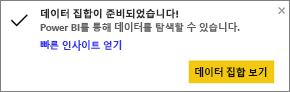
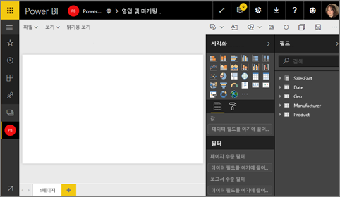
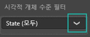
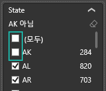
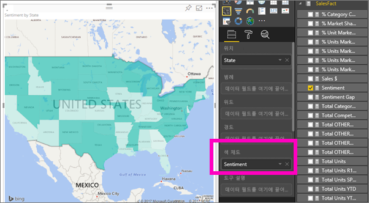
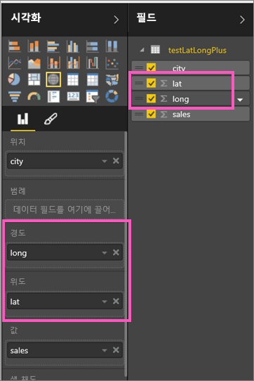

# Power BI의 등치 지역도(코로플레스)(자습서)
등치 지역도는 음영 또는 색조 또는 패턴을 사용하여 특정 값이 특정 지리 또는 지역을 기준으로 어떻게 다른지 표시합니다.  밝게(낮은 빈도/낮음)부터 어둡게(높은 빈도/높음)까지 다양한 음영으로 이러한 상대적 차이를 신속하게 표시합니다.    

## Bing에 전달되는 내용
Power BI는 Bing과 통합되어 기본 맵 좌표를 제공합니다(지오코딩이라는 프로세스). Power BI 서비스 또는 Power BI Desktop에서 맵 시각화를 만드는 경우 **위치**, **위도** 및 **경도** 버킷의 데이터(해당 시각화를 만드는 데 사용되는)가 Bing에 전송됩니다.

사용자 또는 사용자의 관리자는 지오코딩에 URL Bing을 사용할 수 있도록 방화벽을 업데이트해야 할 수 있습니다.  이러한 URL은 다음과 같습니다.
* https://dev.virtualearth.net/REST/V1/Locations
* https://platform.bing.com/geo/spatial/v1/public/Geodata
* https://www.bing.com/api/maps/mapcontrol

Bing에 전송되는 데이터에 대한 자세한 내용 및 지오코딩 성공을 높이기 위한 팁은 [맵 시각화를 위한 팁과 트릭](power-bi-map-tips-and-tricks.md)을 참조하세요.

## 등치 지역도를 사용하는 경우
다음과 같은 경우 등치 지역도를 사용하는 것이 좋습니다.

* 지도에 정량 정보를 표시하는 경우
* 공간 패턴과 관계를 표시하는 경우
* 데이터가 표준화된 경우
* 사회 경제 데이터로 작업하는 경우
* 정의된 영역이 중요한 경우
* 지리적 위치 분포에 대한 개요를 확인하려는 경우

### 필수 조건
- Power BI 서비스 또는 Power BI Desktop
- 영업 및 마케팅 샘플

작업을 수행하기 위해 자습서에서는 Power BI Desktop이 아니라 Power BI 서비스를 사용합니다.

## 기본 등치 지역도 만들기
이 비디오에서 Kim은 기본 지도를 만들고 등치 지역도로 변환합니다.

<iframe width="560" height="315" src="https://www.youtube.com/embed/ajTPGNpthcg" frameborder="0" allowfullscreen></iframe>

1. 사용자 고유의 등치 지역도를 만들려면 Power BI에 로그인하고 **데이터 가져오기 \> 샘플 \> 영업 및 마케팅 \> 연결**을 선택하여 [영업 및 마케팅 샘플을 다운로드](sample-datasets.md)합니다.
2. 성공 메시지가 나타나면 **데이터 집합 보기**를 선택합니다.

   
3. Power BI가 [편집용 보기](service-interact-with-a-report-in-editing-view.md)에서 빈 보고서 캔버스를 엽니다.

    
4. 필드 창에서 **지역** \> **상태** 필드를 선택합니다.    

   
5. 등치 지역도로 [차트를 변환](power-bi-report-change-visualization-type.md)합니다. **시/도**는 현재 **위치** 웰에 있습니다. Bing 지도는 **위치** 웰의 필드를 사용하여 지도를 만듭니다.  위치는 국가, 시/도, 지방, 구/군, 우편번호 등 다양한 유효한 위치가 될 수 있습니다. Bing 지도에서는 전 세계 여러 위치에 대한 등치 지역도 셰이프를 제공합니다. 위치 웰에 유효한 항목이 없으면 Power BI가 등치 지역도를 만들 수 없습니다.  

   
6. 미국 대륙만 표시하려면 지도를 필터링하세요.

   a.  시각화 창 아래쪽에서 **필터** 영역을 찾습니다.

   b.  **시/도** 를 마우스로 가리키고 확장 펼침 단추를 클릭합니다.  
   

   c.  **모두** 옆에 확인 표시를 표시하고 **AK**옆에 있는 확인 표시를 제거합니다.

   
7. **SalesFact** \> **감정**을 선택하여 **색 채도** 웰에 추가합니다. **색 채도** 웰의 필드는 지도 음영을 제어합니다.  
   
8. 등치 지역도는 녹색으로 채워지는데, 연한 녹색은 낮은 인지 수를 나타내고, 진한 녹색은 더 높고, 더 긍정적인 인지를 나타냅니다.  여기에 제가 강조 표시한 와이오밍(WY) 주는 인지가 74로 매우 양호합니다.  
   
9. [보고서를 저장합니다](service-report-save.md).

## 강조 표시 및 교차 필터링
필터 창 사용 방법에 대한 자세한 내용은 [보고서에 필터 추가](power-bi-report-add-filter.md)를 참조하세요.

보고서 페이지에서 다른 시각화 요소를 교차 필터링하는 등치 지역도에서 위치를 강조 표시하고 그 반대의 경우도 마찬가지입니다.

과정을 따르려면 등치 지역도를 *영업 및 마케팅* 보고서의 **감정** 페이지에 복사하여 붙여넣습니다.

1. 등치 지역도에서 시/도를 선택합니다.  이는 페이지의 다른 시각화 요소를 강조 표시합니다. 예를 들어 **텍사스**를 선택하면 인지가 74입니다. 텍사스는 Central District \#23에 있으며, 판매량의 대부분이 중재 및 편의 부문에서 발생합니다.   
   
2. 꺾은선형 차트에서 **아니요** 와 **예**사이를 전환합니다. 이는 VanArsdel 및 VanArsdel의 경쟁 대상에 대한 인지를 표시하도록 등치 지역도를 필터링합니다.  
   

## 고려 사항 및 문제 해결
지도 데이터는 모호해질 수 있습니다.  예를 들어 프랑스 파리가 있지만 텍사스 파리도 있습니다. 지리적 데이터는 구/군 이름 또는 시/도 이름별로 별도의 열에 저장될 것입니다. 따라서 Bing은 이 파리가 어디에 있는 파리인지 알려줄 수 없습니다. Power BI에는 데이터 집합에 위도 및 경도 데이터가 이미 있는 경우 지도 데이터를 명확하게 만들기 위한 특별한 필드가 있습니다. 위도 데이터가 포함된 필드를 시각화 \> 위도 영역으로 끌어다 놓기만 하면 됩니다.  경도 데이터의 경우에도 마찬가지입니다.  

Power BI Desktop의 데이터 집합을 편집할 수 있는 권한이 있는 경우 지도 모호성을 해결하는 도움말은 이 비디오를 시청하세요.

<iframe width="560" height="315" src="https://www.youtube.com/embed/Co2z9b-s_yM" frameborder="0" allowfullscreen></iframe>

위도 및 경도 데이터에 액세스할 수 없는 경우 [이 지침을 따라 데이터 집합을 업데이트하세요](https://support.office.com/article/Maps-in-Power-View-8A9B2AF3-A055-4131-A327-85CC835271F7).

지도 시각화에 대한 자세한 도움말은 [지도 시각화를 위한 팁과 힌트](power-bi-map-tips-and-tricks.md)를 참조하세요.

## 다음 단계
[대시보드 타일로 등치 지역도 추가(시각적 개체 고정)](service-dashboard-tiles.md)    
 [시각화를 보고서에 추가](power-bi-report-add-visualizations-i.md)  
 [Power BI의 시각화 유형](power-bi-visualization-types-for-reports-and-q-and-a.md)    
 [사용되는 시각화 유형 변경](power-bi-report-change-visualization-type.md)      
궁금한 점이 더 있나요? [Power BI 커뮤니티를 이용하세요.](http://community.powerbi.com/)
