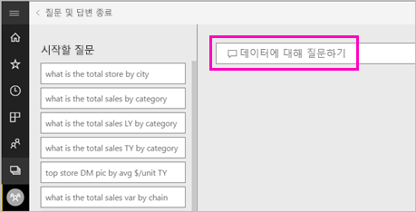
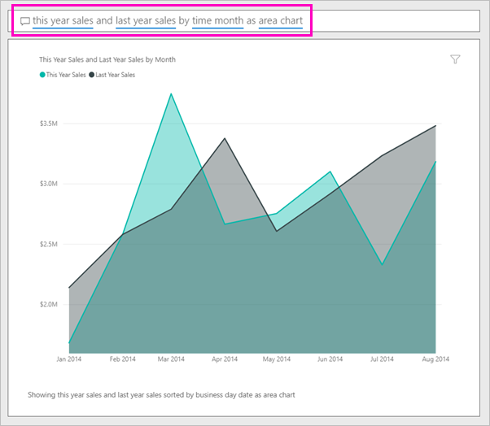

# Power BI q&a를 사용 하 여 시각적 개체 만들기

경우에 따라 자연어를 사용하여 질문을 하면 가장 빠르게 사용자 데이터로 답변을 받을 수 있습니다.  이 문서에 대해 살펴봅니다 동일한 시각화를 만드는 두 가지 방법: 먼저, 질문 및 답변에 질문 하 고 둘째, 보고서에서 작성 하는 고 합니다. Power BI 서비스 보고서에서 시각적 개체를 빌드를 사용 하는 것 이지만 프로세스 Power BI Desktop을 사용 하 여 거의 동일 합니다.

단계를 따르려면 편집할 수 있는 보고서를 사용해야 하므로 Power BI에 제공되는 샘플 중 하나를 사용하겠습니다.

## 질문 및 답변을 사용 하 여 시각적 개체 만들기

어떻게 해야 합니까 q&a를 사용 하 여이 꺾은선형 차트를 만들기에 대 한?

1. Power BI 작업 영역에서 **데이터 가져오기** \> **샘플** \> **소매점 분석 샘플** > **연결**을 선택하세요.

1. 소매점 분석 샘플 대시보드를 열고 질문 및 답변 상자에 커서를 놓고 **데이터에 대 한 질문**합니다.

    

2. 질문과 대답 상자에이 질문 같이 입력 합니다.
   
    **올해 판매액 및 작년 판매를 영역 차트로 월별**
   
    질문을 입력하면 질문 및 답변에서 답변을 표시하는 데 가장 적합한 시각화를 선택합니다. 그러면 질문을 수정할 때 시각화가 동적으로 변경됩니다. 또한 Q&A를 사용하면 제안, 자동 완성 및 맞춤법 수정을 통해 질문에 서식을 지정할 수 있습니다. 질문 및 답변 권장 작은 단어 변경: "올해 판매 및 작년 판매액 *시간 월* 영역형 차트로"입니다.  

    

4. 제안을 수락 문장의 선택 합니다. 
   
   질문 입력을 완료 하면 결과 대시보드에 표시 되는 동일한 차트입니다.
   
   

4. 대시보드로 차트를 고정하려면 고정 아이콘을 선택합니다.  을 탭합니다.

## 보고서 편집기에서 시각적 개체 만들기

1. 소매점 분석 샘플 대시보드로 다시 이동합니다.
   
2. 대시보드 "Last Year Sales and This Year Sales"에 대 한 동일한 영역 차트 타일이 포함  이 타일을 선택합니다. Q&a를 사용 하 여 만든 타일을 선택 하지 마세요 이 선택 하면 q&a가 열립니다. 원래 영역 차트 타일은 보고서에서 생성 되었으므로이 시각화를 포함 하는 페이지에 보고서가 열립니다.

    

1. **보고서 편집**을 선택하여 편집용 보기에서 보고서를 엽니다.  보고서의 소유자가 아닌 경우 편집용 보기에서 보고서를 여는 옵션이 없습니다.
   
    
4. 영역형 차트를 선택하고 **필드** 창의 설정을 검토합니다.  이러한 세 가지 값을 선택 하 여이 차트를 작성 하는 보고서 작성자 (**Last Year Sales** 하 고 **올해 판매액 > 값** 에서 **Sales** 테이블 및  **FiscalMonth** 에서 합니다 **시간** 테이블)에서 구성 하는 **축** 및 **값** 끌기.
   
    

    동일한 시각적 개체를 사용 하 여 끝난 것이 표시 됩니다. 이러한 방식으로 만드는 너무 복잡 하지 않습니다. 하지만 질문 및 답변을 사용 하 여 만들기 쉽습니다!

## 다음 단계

- [대시보드 및 보고서에서 질문 및 답변 사용](power-bi-tutorial-q-and-a.md)  
- [소비자에 대 한 질문과 대답](consumer/end-user-q-and-a.md)
- [Power BI의 질문 및 답변에서 데이터가 잘 작동하도록 설정](service-prepare-data-for-q-and-a.md)

궁금한 점이 더 있나요? [Power BI 커뮤니티를 이용하세요.](http://community.powerbi.com/)

