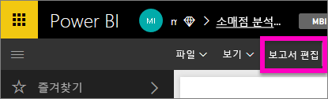
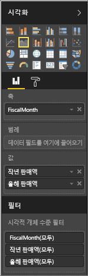
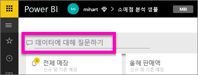
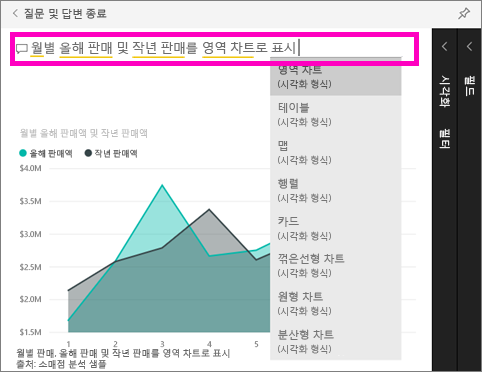

# Power BI 질문 및 답변 시작(빠른 시작)
## 소매 분석 샘플에 Power BI 질문 및 답변 사용
경우에 따라 자연어를 사용하여 질문을 하면 가장 빠르게 사용자 데이터로 답변을 받을 수 있습니다.  이 빠른 시작에서는 동일한 시각화를 만드는 2가지 방법, 즉 첫 번째로 보고서에서 작성하고 두 번째로 질문 및 답변에서 질문하는 방법을 살펴봅니다. Power BI 서비스를 사용할 예정이지만, 프로세스는 Power BI Desktop을 사용할 때와 거의 동일합니다.

단계를 따르려면 편집할 수 있는 보고서를 사용해야 하므로 Power BI에 제공되는 샘플 중 하나를 사용하겠습니다.

## 방법 1: 보고서 편집기 사용하기
1. Power BI 작업 영역에서 **데이터 가져오기** \> **샘플** \> **소매 분석 샘플** > **연결**을 선택하세요.
   
    
2. 대시보드에는 "Last Year Sales and This Year Sales"에 대한 영역 차트 타일이 포함되어 있습니다.  이 타일을 선택합니다. 
   
   * 이 타일이 질문 및 답변으로 생성된 경우 타일을 선택하면 질문 및 답변이 열립니다. 
   * 하지만 이 타일은 보고서에서 생성되었으므로 이 시각화를 포함하는 페이지에 열립니다.
3. **보고서 편집**을 선택하여 편집용 보기에서 보고서를 엽니다.  보고서의 소유자가 아닌 경우 편집용 보기에서 보고서를 여는 옵션이 없습니다.
   
    
4. 영역형 차트를 선택하고 **필드** 창의 설정을 검토합니다.  보고서 작성자는 3개 값(**시간 > 회계 월**, **영업 > 올해 판매액**, **영업 >지난해 판매액 >값**)을 선택하고 **축** 및 **값** 웰에서 구성하여 이 차트를 작성했습니다.
   
    

## 방법 2: 질문과 답변 사용하기
질문 및 답변을 사용하여 이와 동일한 꺾은선형 차트를 만들려면 어떻게 해야 합니까?

1. 소매점 분석 샘플 대시보드로 다시 이동합니다.
2. 자연어를 사용하여 질문 상자에 이와 같이 입력합니다.
   
   **월별 올해 판매 및 작년 판매를 영역 차트로 표시**
   
   질문을 입력하면 질문 및 답변에서 답변을 표시하는 데 가장 적합한 시각화를 선택합니다. 그러면 질문을 수정할 때 시각화가 동적으로 변경됩니다. 또한 질문 및 답변을 사용하면 제안, 자동 완성 및 맞춤법 수정을 통해 질문에 서식을 지정할 수 있습니다.
   
   질문 입력을 완료하면 보고서에서 본 것과 똑같은 차트가 생성됩니다.  하지만 이러한 방식으로 만들면 훨씬 더 빠릅니다!
   
   
3. 보고서 작업과 마찬가지, 질문 및 답변 내에서 시각화, 필터 및 필드 창에 대한 액세스 권한이 있습니다.  추가로 탐색하고 시각적 개체를 수정하려면 이들 창을 엽니다.
4. 대시보드로 차트를 고정하려면 고정 아이콘 을 선택합니다.

## 다음 단계
[Power BI의 질문 및 답변](power-bi-q-and-a.md)

[Power BI의 질문 및 답변에서 데이터가 잘 작동하도록 설정](service-prepare-data-for-q-and-a.md)

궁금한 점이 더 있나요? [Power BI 커뮤니티를 이용하세요.](http://community.powerbi.com/)

