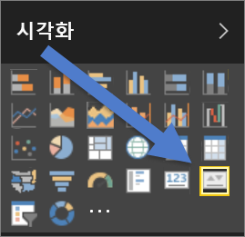
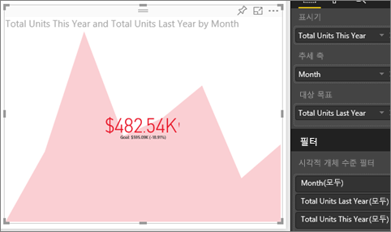

# KPI 시각적 개체(자습서)
KPI(핵심 성과 지표)는 측정 가능한 목표에 대해 만든 진행률의 정도를 알리는 시각적 신호입니다. KPI에 대한 자세한 내용은 [Microsoft Developer Network](https://msdn.microsoft.com/library/hh272050)를 참조하세요.

## KPI를 사용하는 경우
다음과 같은 경우 KPI를 사용하는 것이 좋습니다.

* 진행률 측정(앞 또는 뒤 개체 확인)
* 목표에 대한 거리 측정(초과 또는 미만 정도)   

## KPI 시각화 개체 요구 사항
KPI(핵심 성과 지표)는 특정 측정값을 기반으로 하며 정의된 대상에 대한 현재 값 및 메트릭의 상태를 평가할 수 있도록 디자인되었습니다. 따라서 KPI 시각적 개체는 값 및 *대상* 측정값 또는 값 및 임계값이나 목표로 계산되는 *기본* 측정값이 필요합니다.

> [!NOTE]
> 현재 KPI 데이터 집합에는 KPI에 대한 목표 값이 포함되어야 합니다. 데이터 집합에 포함되어 있지 않다면 목표가 들어 있는 Excel 시트를 데이터 모델 또는 PBIX 파일에 추가함으로써 목표를 생성할 수 있습니다.
> 
> 

## KPI를 만드는 방법
이를 수행하려면 Power BI에 로그인하고 **데이터 가져오기 > 샘플 > 소매 분석 샘플**을 선택합니다. 판매 목표에 대해 만든 진행률을 측정하는 KPI를 만듭니다.

또는 Will이 단일 메트릭 시각적 개체: 계기, 카드 및 KPI를 만드는 방법을 보여 주는 과정을 시청합니다.

<iframe width="560" height="315" src="https://www.youtube.com/embed/xmja6EpqaO0?list=PL1N57mwBHtN0JFoKSR0n-tBkUJHeMP2cP" frameborder="0" allowfullscreen></iframe>

1. **판매량 > 올해 총 단위**를 선택합니다.  표시기입니다.
2. **시간 > 월**을 추가합니다.  추세를 나타냅니다.
3. 중요: 차트를 **월**별로 정렬합니다. 시각적 개체를 KPI로 변환하고 나면 정렬할 수 있는 옵션이 없습니다.
4. 시각화 창에서 KPI 아이콘을 선택하여 시각적 개체를 KPI로 변환합니다.
   
    
5. 목표를 추가합니다. 지난해 판매량을 목표로 추가합니다. **지난해 총 단위**를 **목표 대상** 필드로 끌어옵니다.
   
    
6. 필요에 따라 페인트 롤러 아이콘을 선택하여 KPI의 형식을 지정하고 서식 창을 엽니다.
   
   * **표시기** - 표시기의 표시 단위 및 소수 자릿수를 제어합니다.
   * **추세 축** - **켜기**로 설정된 경우 추세 축은 KPI 시각적 개체의 배경으로 표시됩니다.  
   * **목표** - **켜기**로 설정된 경우 시각적 개체는 목표 및 목표에서의 거리를 백분율로 표시합니다.
   * **상태** - 일부 KPI는 높은 값에 *더 낫고* 일부는 낮은 값에 *더 낫다*고 간주됩니다. 예를 들어 수입 및 대기 시간입니다. 일반적으로 수익의 높은 값은 대기 시간의 높은 값(일반적으로 나쁨)에 비해 더 낫습니다. 이 토글을 사용하면 KPI 동작을 선택할 수 있습니다. 상태 선택은 기본적으로 **높을수록 좋습니다**.
7. KPI가 원하는 만큼 있으면 [대시보드에 고정](service-dashboard-pin-tile-from-report.md)합니다.

KPI는 모바일 장치에서 항상 사용할 수 있으므로 사용자는 비즈니스 하트비트에 계속 연결됩니다.

## 고려 사항 및 문제 해결
* KPI가 위이 것과 같아 보이지 않는다면 월별로 정렬할 필요가 있을 수도 있습니다. KPI에는 정렬 옵션이 없으므로, 시각적 개체를 KPI로 변환하기 *전에* 월별로 정렬해야 합니다.

## 다음 단계
[Power BI의 보고서](service-reports.md)

[Power BI 보고서의 시각화](power-bi-report-visualizations.md)

[Power BI - 기본 개념](service-basic-concepts.md)

궁금한 점이 더 있나요? [Power BI 커뮤니티를 이용하세요.](http://community.powerbi.com/)

