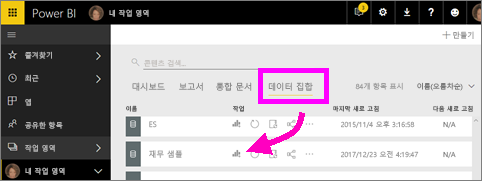
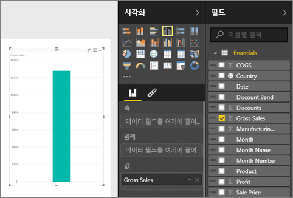
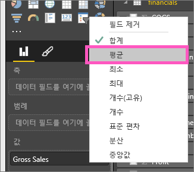
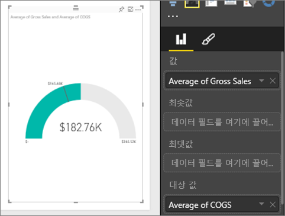
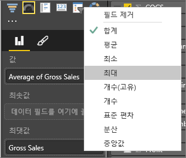
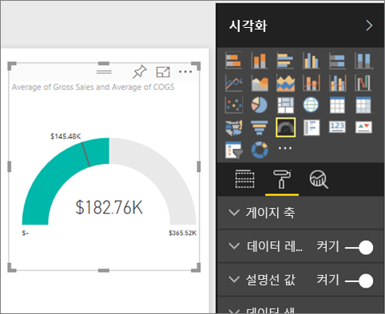
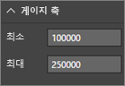
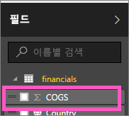
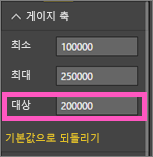

# Power BI의 방사형 계기 차트(자습서)
방사형 계기 차트는 원호 형태로 목표/KPI에 대한 진행률을 측정하는 단일 값을 표시합니다.  목표 또는 목표값은 선(바늘)으로 표시됩니다. 목표에 대한 진행률은 음영으로 표시됩니다.  진행률은 나타내는 값은 호의 내부에 굵게 표시됩니다. 모든 가능한 값은 최소(맨 왼쪽 값)에서 최대 (맨 오른쪽 값)까지 호를 따라 균등하게 분배됩니다.

아래 예제에서는 월별 판매 팀의 평균 판매량을 추적하는 자동차 소매점입니다. 목표는 140이며 검정색 바늘로 표시됩니다.  가능한 최소 평균 판매량은 0이고 최고 200까지 설정했습니다.  파란색 음영은 이번 달의 현재 평균인 약 120대임을 나타냅니다. 다행히 목표 달성을 위해 아직 몇 주가 남았습니다.

## 방사형 계기를 사용하는 경우
방사형 계기는 다음에 매우 적합합니다.

* 목표에 대한 진행률을 표시합니다.
* KPI와 같은 백분위수 측정값을 나타냅니다.
* 단일 측정값의 상태를 표시합니다.
* 빠르게 훑어보고 이해할 수 있는 정보를 표시합니다.

### 필수 조건
 - Power BI 서비스 또는 Power BI Desktop
 - 재무 샘플 Excel 통합 문서: [샘플을 직접 다운로드합니다](http://go.microsoft.com/fwlink/?LinkID=521962).

## 기본 방사형 계기 만들기
이러한 지침에서는 Power BI 서비스를 사용합니다. 지침을 따르려면 Power BI에 로그인하고 Excel 재무 샘플 파일을 엽니다.  

또는 Will이 단일 메트릭 시각적 개체: 계기, 카드 및 KPI를 만드는 방법을 보여 주는 과정을 시청합니다.

<iframe width="560" height="315" src="https://www.youtube.com/embed/xmja6EpqaO0?list=PL1N57mwBHtN0JFoKSR0n-tBkUJHeMP2cP" frameborder="0" allowfullscreen></iframe>

### 1단계: 재무 샘플 Excel 파일 열기
1. 아직 다운로드하지 않았으면 [재무 샘플 Excel 파일을 다운로드](sample-financial-download.md)합니다. 파일을 어디에 저장했는지 기억해야 합니다.

2. **데이터 가져오기 \> 파일**을 선택하고 파일을 저장한 위치를 찾아 ***Power BI 서비스***에서 파일을 엽니다. **가져오기**를 선택합니다. 재무 샘플은 데이터 집합으로 작업 영역 탐색 창에 추가됩니다.

3. **데이터 집합** 콘텐츠 목록에서 **재무 샘플**을 선택하여 탐색 모드에서 엽니다.

    

### 2단계: 총 매출을 추적하는 계기 만들기
1. **필드** 창에서 **총 판매량**을 선택합니다.
   
   
2. 집계를 **평균**으로 변경합니다.
   
   
3. 계기 아이콘 을 선택하여 세로 막대형 차트를 계기로 변환합니다.
   
   기본적으로 Power BI는 현재 값(이 경우, 총 판매액의 평균)이 계기에 중간 지점으로 간주되는 계기 차트를 만듭니다. 평균 총 매출이 $182,76K이므로 시작 값(최소)은 0으로 설정하고 끝 값(최대)은 현재 값의 두 배로 설정됩니다.
   
   

### 3단계: 대상 값 설정
1. **COGS** 를 **대상 값** 으로 끌어다 놓습니다.
2. 집계를 **평균**으로 변경합니다.
   Power BI가 바늘을 추가하여 대상 값이 **$145.48K**임을 나타냅니다. 목표를 초과 했음을 알 수 있습니다.
   
   
   
   > [!NOTE]
   > 대상 값을 수동으로 입력할 수도 있습니다.  아래의 "서식 옵션을 사용하여 수동으로 최소값, 최대값 및 대상 값 설정"을 참조하세요.
   > 
   > 

### 4단계: 최대값 설정
2단계에서 Power BI는 Value 필드를 사용하여 최소값(시작)과 최대값(끝)을 자동으로 설정했습니다.  그러나 사용자가 스스로 최대값을 설정하려는 경우 어떻게 해야 할까요?  가능한 최대값으로 현재 값을 두 배로 사용하는 대신, 데이터 집합에서 가장 높은 총 판매량 수로 설정하는 것을 가정해 보겠습니다. 

1. **필드** 목록에서 **총 판매량** 을 **최대값** 으로 끌어서 놓습니다.
2. 집계를 **최대**로 변경합니다.
   
   
   
   계기는 총 판매량이 새 끝 값인 121만으로 다시 그려집니다.
   
   

### 5단계: 보고서 저장
1. [보고서를 저장합니다](service-report-save.md).
2. [대시보드 타일로 계기 차트를 추가합니다](service-dashboard-tiles.md). 

## 서식 옵션을 사용하여 수동으로 최소값, 최대값 및 대상 값 설정
1. **최대 값** 웰에서 **최대 총 판매량** 을 제거합니다.
2. 페인트 브러시 아이콘을 선택하여 서식 창을 엽니다.
   
   
3. **게이지 축** 을 확장하고 **최소** 및 **최대**값을 입력합니다.
   
    
4. **COGS**옆에 있는 확인 표시를 제거하여 현재 대상 값을 제거합니다.
   
    
5. **대상** 필드가 **게이지 축**아래에 나타나는 경우 값을 입력합니다.
   
    
6. 필요에 따라 계기 차트 서식 지정을 계속합니다.

## 다음 단계
[Power BI의 시각화 유형](power-bi-visualization-types-for-reports-and-q-and-a.md)

[시각화를 보고서에 추가](power-bi-report-add-visualizations-i.md)

[시각화를 대시보드에 고정](service-dashboard-pin-tile-from-report.md)

[Power BI - 기본 개념](service-basic-concepts.md)

궁금한 점이 더 있나요? [Power BI 커뮤니티를 이용하세요.](http://community.powerbi.com/)

