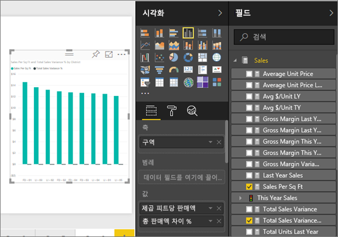
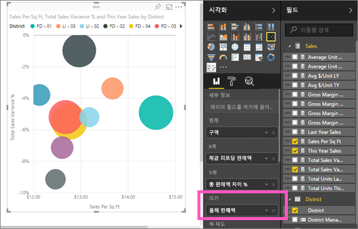
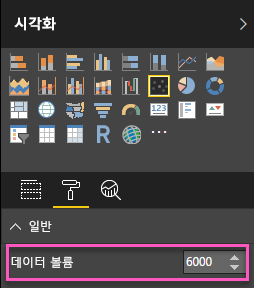
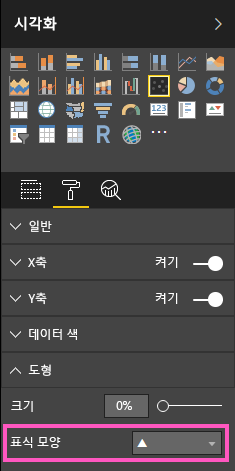
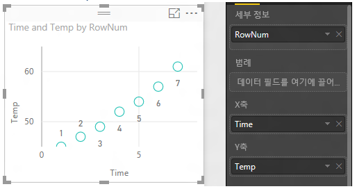
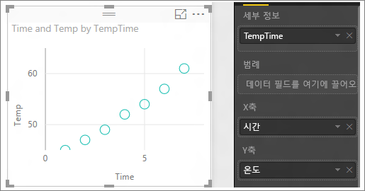

# Power BI의 분산형 차트 및 거품형 차트
분산형 차트에는 항상 가로 축을 따라 하나의 숫자 데이터 집합을 표시하고 세로 축을 따라 다른 숫자 값 집합을 표시하는 두 개의 값 축이 있습니다. 차트에서 x 및 y 숫자 값의 교차점에 점이 표시되고 이러한 값이 단일 데이터 요소로 결합됩니다. 데이터에 따라 가로 축에 균등 또는 불균등하게 이러한 데이터 요소를 배포할 수 있습니다.

거품형 차트는 데이터 요소를 거품으로 바꾸며 거품 *크기*로 데이터의 추가 차원을 나타냅니다.

데이터 요소의 수를 설정할 수 있습니다.  

## 분산형 차트 또는 거품형 차트를 사용해야 하는 경우
### 다음과 같은 경우 분산형 차트를 사용하는 것이 좋습니다.
* 2개(분산형) 또는 3개(거품형) **숫자** 값 간의 관계를 표시하려는 경우.
* 두 개의 숫자 그룹을 일련의 xy 좌표로 그리려는 경우.
* 가로 축 눈금을 변경하려는 경우 꺾은선형 차트 대신.    
* 가로 축을 로그 눈금으로 전환하려는 경우.
* 쌍을 이루거나 그룹화된 값 집합을 포함하는 워크시트 데이터를 표시하려는 경우. 분산형 차트에서는 그룹화된 값에 대한 자세한 정보를 표시하기 위해 축의 개별 눈금을 조정할 수 있습니다.
* 선형 또는 비선형 추세, 클러스터, 이상값 등을 표시하여 큰 데이터 집합의 패턴을 표시하려는 경우.
* 시간에 관계 없이 많은 수의 데이터 요소를 비교하려는 경우.  분산형 차트에 더 많은 데이터를 포함할수록 더 정확한 비교가 가능합니다.

### 다음과 같은 경우 거품형 차트를 사용하는 것이 좋습니다.
* 데이터에 각각 값 집합을 포함하는 세 가지 데이터 계열이 있는 경우.
* 재무 데이터를 제공하려는 경우.  다양한 거품 크기는 시각적으로 특정 값을 강조 표시하는 데 유용합니다.
* 사분면에 사용하려는 경우.

## 분산형 차트 만들기
이 비디오를 통해 Will이 분산형 차트를 만드는 방법을 본 후 아래 단계에 따라 직접 분산형 차트를 만드세요.

<iframe width="560" height="315" src="https://www.youtube.com/embed/PVcfPoVE3Ys?list=PL1N57mwBHtN0JFoKSR0n-tBkUJHeMP2cP" frameborder="0" allowfullscreen></iframe>

이 지침은 소매 분석 샘플을 사용합니다. 이를 수행하려면 Power BI 서비스(app.powerbi.com) 또는 Power BI Desktop에 대한 [샘플을 다운로드](sample-datasets.md)합니다.   

1. [빈 보고서 페이지](power-bi-report-add-page.md)를 만들려면 노란색 더하기 아이콘을 선택합니다.
 
2. 필드 창에서 다음 필드를 선택합니다.
   - **판매액** > **제곱 피트당 판매액**
   - **판매액** > **전체 판매액 분산%**
   - **구역** > **구역**

    

    Power BI 서비스를 사용하는 경우 [편집용 보기](service-interact-with-a-report-in-editing-view.md)에서 보고서를 엽니다.

3. 분산형 차트로 변환합니다. 시각화 창에서 분산형 차트 아이콘을 선택합니다.

   .

4. **세부 정보** 에서 **범례** 로 **구역**를 끌어다 놓습니다. 그러면 Y축에 **총 매출 분산 %** 을 그리고 X축에 **평방 미터당 매출**을 그리는 분산형 차트를 표시합니다. 데이터 요소 색은 구역을 나타냅니다.

    

이제 3차원을 추가해보겠습니다.

## 거품형 차트 만들기

1. **필드** 창에서 **판매량** > **올해 판매액** > **값**을 **크기** 영역으로 끌어다 놓습니다. 데이터 요소는 판매 값과 비례하는 볼륨으로 확장합니다.
   
   

2. 거품을 마우스로 가리킵니다. 거품 크기는 **This Year Sales**의 값을 반영합니다.
   
    

3. 거품형 차트에 표시할 데이터 요소의 수를 설정하려면 **시각화** 창의 **형식** 섹션에서 **일반** 카드를 확장하고 **데이터 볼륨**을 조정합니다. 최대 데이터 볼륨 수를 10,000개로 설정할 수 있습니다. 숫자가 클수록 성능을 위해 먼저 테스트하는 것이 좋습니다. 

     

   > [!NOTE]
   > 데이터 요소가 많을수록 로드 시간이 길어질 수 있으므로 제한 값이 높은 보고서를 게시하기로 선택하는 경우 웹 및 모바일에서 보고서를 테스트하고 성능이 사용자의 예상과 일치하도록 해야 합니다. 데이터 요소 수보다 많은 경우 성능 향상을 위해 다양한 형식 요소에서 결과를 테스트해야 합니다.

4. [시각화 색, 레이블, 제목, 배경 등의 서식을 지정](service-getting-started-with-color-formatting-and-axis-properties.md)할 수 있습니다. [액세스 가능성을 향상시키려면](desktop-accessibility.md) 각 줄에 표식 모양을 추가하는 것이 좋습니다. 각 선에 다양한 표식 모양을 사용하면 보고서 사용자가 선(또는 영역)을 보다 쉽게 구분할 수 있습니다. 표식 모양을 선택하려면 **셰이프** 카드를 확장한 다음, 표식 모양을 선택합니다.

      

   표식 모양을 다이아몬드, 삼각형 또는 사각형으로 변경할 수 있습니다.

   

## 고려 사항 및 문제 해결

### **분산형 차트에 하나의 데이터 요소만 있음**
분산형 차트에 X축과 Y축의 모든 값을 집계하는 하나의 데이터 요소만 있나요?  또는 단일 수평선이나 수직선의 모든 값을 집계하나요?

**세부 정보** 영역에 필드를 추가하여 Power BI에 값을 그룹화하는 방법을 알립니다. 필드는 그리려는 각 지점에 고유해야 합니다.  
단순 행 번호 또는 ID 필드와 같습니다.

또는 데이터에 해당 필드가 없는 경우 X 및 Y 값을 지점마다 고유한 항목으로 연결하는 필드를 만듭니다.

새 필드를 만들려면 [Power BI Desktop 쿼리 편집기를 사용하여 인덱스 열을](desktop-add-custom-column.md) 데이터 집합에 추가합니다.  그런 다음 이 열을 시각화의 **세부 정보** 영역에 추가합니다.

## 다음 단계
[Power BI의 시각화 유형](power-bi-visualization-types-for-reports-and-q-and-a.md)

[평가판 등록](https://powerbi.microsoft.com/get-started/)  

궁금한 점이 더 있나요? [Power BI 커뮤니티를 이용하세요.](http://community.powerbi.com/)

