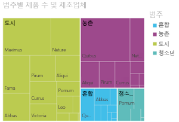
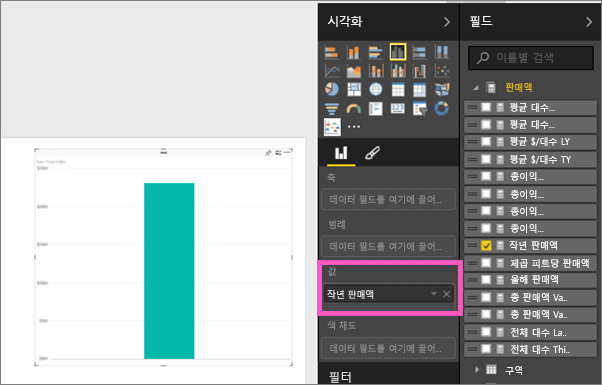
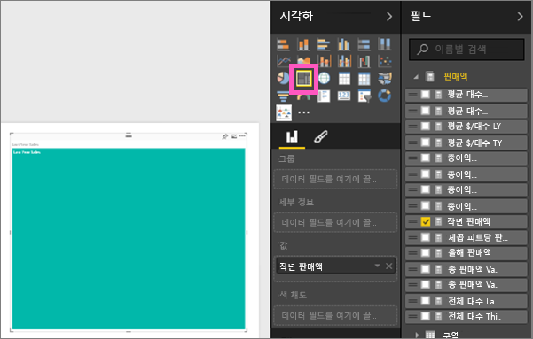
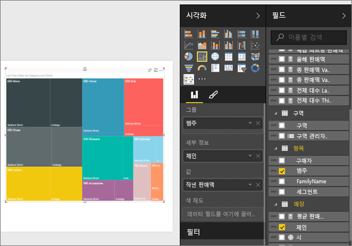
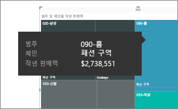
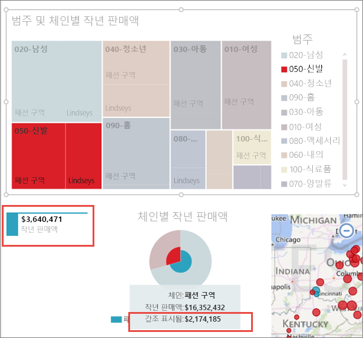

# Power BI의 트리맵
트리맵은 계층 데이터를 중첩된 사각형의 집합으로 표시합니다.  계층의 각 수준은 다른 사각형("잎")를 포함하는 색이 칠해진 사각형("가지"라고도 함)으로 표시됩니다.  각 사각형 안에 공간은 측정된 정량 값을 기반으로 할당되며, 왼쪽 상단(최대)에서 오른쪽 하단(최소)까지 크기 별로 정렬된 사각형으로 표시됩니다.

예를 들어, 내 판매액을 분석하고 있는 경우 **Urban**, **Rural**, **Youth** 및 **Mix** 등 의류 범주의 최상단 사각형(가지)을 가지고 있는 것입니다.  내 범주 사각형에는 해당 범주 내에 의류 제조업체에 대한 작은 사각형(잎)이 있고, 이들 작은 사각형들은 팔린 옷의 수에 따라 크기가 정해지고 음영이 적용됩니다.  위의 **Urban** 가지에서는 많은 Maximus 의류가 판매되었고, Natura와 Fama가 그 다음이며, Leo는 거의 판매되지 않았습니다.  따라서 내 트리맵의 **Urban** 가지는 Maximus(왼쪽 상단 모서리)의 사각형이 가장 크고, Natura 및 Fama가 약간 더 작은 사각형이며, 다른 많은 사각형은 팔린 다른 모든 의류를 나타내며, Leo가 가장 작은 사각형임을 나타냅니다.  각 잎 노드의 크기와 음영을 비교하여 다른 의류 범주에 걸쳐 팔린 항목의 수를 비교할 수 있습니다. 즉, 사각형이 크고 음영이 짙을수록 값이 높습니다.

## 트리맵을 사용하는 경우
다음과 같은 경우 트리맵을 사용하는 것이 좋습니다.

* 많은 양의 계층적 데이터를 표시하는 경우
* 가로 막대형 차트로는 많은 수의 값을 효과적으로 처리할 수 없는 경우
* 각 부분과 전체 간의 비율을 표시하는 경우
* 계층 구조의 각 수준의 범주에 걸쳐 측정값이 분포되는 패턴을 표시하는 경우
* 크기 및 색 구분을 사용하여 특성을 표시하는 경우
* 패턴, 이상값, 가장 중요한 요인 및 예외를 강조하는 경우

### 필수 조건
 - Power BI 서비스 또는 Power BI Desktop
 - 소매점 분석 샘플

## 기본 트리맵 만들기
다른 사람이 먼저 만든 트리맵을 시청하시겠습니까?  Amanda가 트리맵을 만드는 것을 보려면 이 비디오에서 2:10초로 넘어갑니다.

<iframe width="560" height="315" src="https://www.youtube.com/embed/IkJda4O7oGs" frameborder="0" allowfullscreen></iframe>

또는 고유한 트리맵을 만듭니다. 이 지침은 소매 분석 샘플을 사용합니다. 이를 수행하려면 Power BI 서비스(Desktkop 아님)에 로그인하여 **데이터 가져오기 \> 샘플 \> 소매 분석 샘플 \> 연결 \> 대시보드로 이동**을 선택합니다. 보고서에 시각화를 만들려면 데이터 집합 및 보고서에 대한 편집 권한이 필요합니다. 다행히 Power BI 샘플은 편집 가능합니다. 그러나 다른 사용자가 보고서를 공유하는 경우 새 시각화를 추가할 수 없습니다.

1. “총 매장” 타일을 선택하여 소매 분석 샘플 보고서를 엽니다.    
2. [편집용 보기](service-interact-with-a-report-in-editing-view.md)를 열고 **판매액** > **작년 판매액** 측정값을 선택합니다.   
      
3. 차트를 트리맵으로 변환합니다.  
      
4. **항목** > **범주**를 **그룹** 웰로 끌어다 놓습니다. Power BI는 총 판매액을 반영하는 사각형의 크기와 범주를 나타내는 색으로 구성된 트리맵을 만듭니다.  기본적으로 범주별로 총 판매액의 상대 크기를 시각적으로 설명하는 계층을 만들었습니다.  **Mens** 범주는 판매액이 가장 높고 **Hosiery** 범주는 가장 낮습니다.   
      
5. **저장소** > **체인**을 **세부 정보** 웰로 끌어다 놓아 트리맵을 완료합니다. 이제 범주 및 체인 별로 작년 판매액을 비교할 수 있습니다.   
   
   
   > [!NOTE]
   > 색 채도와 세부 정보는 동시에 사용할 수 없습니다.
   > 
   > 
5. **체인** 영역을 마우스로 가리키면 **범주**의 해당 부분에 대한 도구 설명이 표시됩니다.  예를 들어, **040 Juniors** 사각형의 **Lindseys** 에 마우스로 가리키면 Juniors 범주의 Lindsey의 부분에 대한 도구 설명이 나타납니다.  
   
6. [트리맵을 대시보드 타일로 추가합니다(시각적 개체 고정)](service-dashboard-tiles.md). 
7. [보고서를 저장합니다](service-report-save.md).

## 강조 표시 및 교차 필터링
필터 창 사용 방법에 대한 자세한 내용은 [보고서에 필터 추가](power-bi-report-add-filter.md)를 참조하세요.

보고서 페이지에서 다른 시각화 요소를 상호 간에 강조 표시하고 필터링하는 트리맵에서 범주 또는 세부 정보를 강조 표시하며 그 반대의 경우도 마찬가지입니다. 이를 수행하려면 동일한 페이지에 몇 가지 시각적 개체를 추가하거나 다른 시각적 개체를 가진 보고서 페이지에 트리맵을 복사하여 붙여넣습니다.

1. 트리맵에서 범주 또는 범주 내에서 체인 중 하나를 선택합니다.  이는 페이지의 다른 시각화 요소를 상호 간에 강조 표시합니다. 예를 들어, **050-Shoes**를 선택하면 작년의 신발 판매액이 $2,174,185이며 Fashions Direct의 신발 판매액이 $3,640,471임을 보여줍니다.  
   

2. **지난 해 체인별 판매액** 원형 차트에서 **Fashions Direct** 조각을 선택하여 트리맵을 교차 필터링합니다.  
       

3. 차트를 상호 간에 강조 표시하고 필터링하는 방법을 관리하려면 [Power BI 보고서의 시각화 상호 작용](service-reports-visual-interactions.md)을 참조하세요.

## 다음 단계
[시각화를 대시보드에 고정](service-dashboard-pin-tile-from-report.md)  
[Power BI - 기본 개념](service-basic-concepts.md)  

궁금한 점이 더 있나요? [Power BI 커뮤니티를 이용하세요.](http://community.powerbi.com/)  

