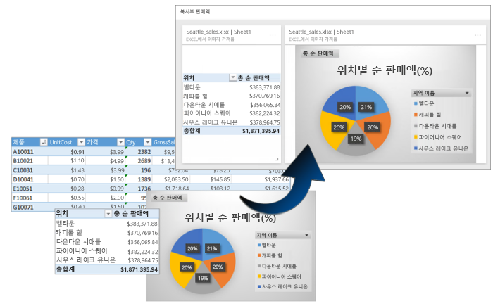
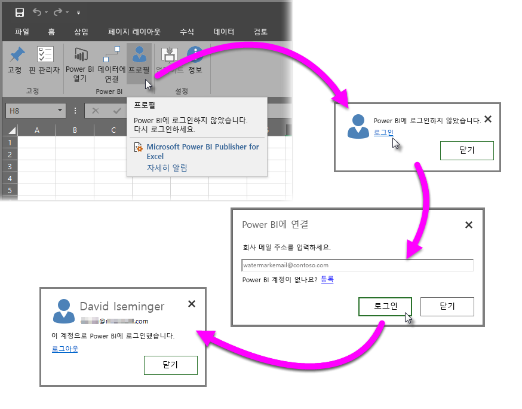
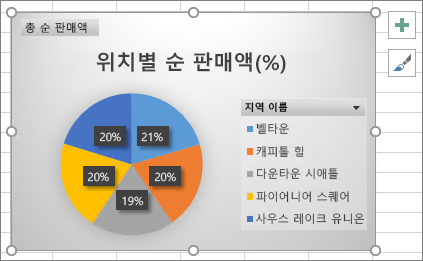
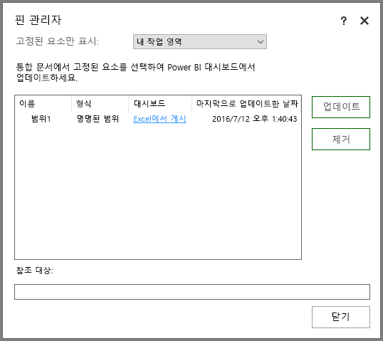
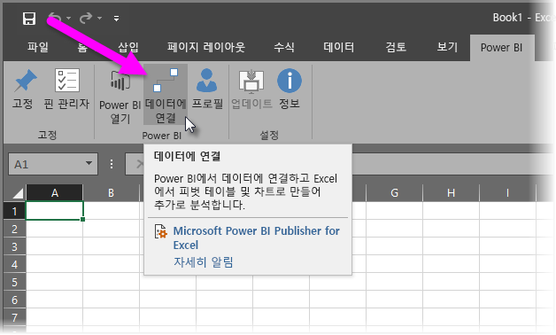
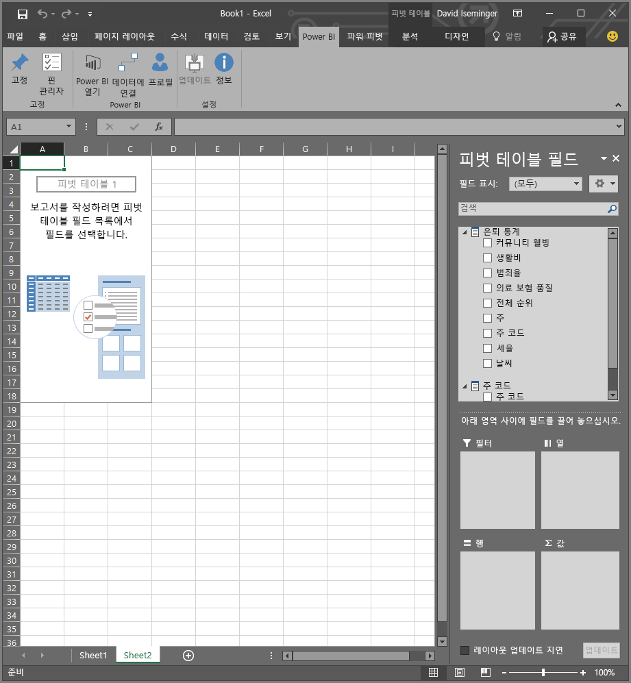

# Excel용 Power BI 게시자
Microsoft의 **Power BI publisher for Excel**을 사용하면 피벗 테이블, 차트 및 범위와 같은 Excel의 가장 중요한 정보를 스냅숏으로 나타낸 후 Power BI의 대시보드에 고정할 수 있습니다.

무엇을 고정할 수 있을까요? Excel 워크시트의 어떤 것도 가능합니다. 간단한 시트 또는 테이블, 피벗 테이블 또는 피벗 차트, 그림 및 이미지, 텍스트에서 셀 범위를 선택할 수 있습니다.

고정할 수 없는 항목: 파워 뷰 시트에서 3D 맵 또는 시각화는 고정할 수 없습니다. 고정할 수 있는 요소도 있지만 슬라이서 또는 시간 표시 막대 필터 등은 고정할 수 없습니다.

Excel의 요소를 고정하면 새 타일이 Power BI의 기존 또는 새 대시보드에 추가됩니다. 새 타일은 스냅숏이므로 동적이 아니지만 여전히 업데이트할 수 있습니다. 예를 들어 이미 고정된 피벗 테이블 또는 차트를 변경하면 Power BI의 대시보드 타일은 자동으로 업데이트되지 않지만 **핀 관리자**를 사용하여 고정된 요소를 업데이트할 수 있습니다. **핀 관리자**에 대해서는 다음 섹션에서 자세히 알아보겠습니다.

## 다운로드 및 설치
Excel용 Power BI 게시자는 데스크톱 버전의 Microsoft Excel 2007 이상에서 다운로드하고 설치할 수 있는 추가 기능입니다.

[Excel용 Power BI 게시자 다운로드](http://go.microsoft.com/fwlink/?LinkId=715729)

게시자가 설치되면 Excel에 새 **Power BI** 리본이 표시됩니다. 여기에서 Power BI에 로그인(또는 로그아웃)하고, 대시보드에 요소를 고정하고, 이미 고정된 요소를 관리할 수 있습니다.

**Power BI publisher for Excel** 추가 기능은 기본적으로 사용되도록 설정되어 있지만 특정 이유로 인해 Excel에서 Power BI 리본 탭이 보이지 않을 경우 직접 사용하도록 설정해야 합니다. **파일** > **옵션** > **추가 기능** > **COM 추가 기능**을 클릭합니다. **Microsoft Power BI Publisher for Excel**을 선택합니다.

## 대시보드에 범위 고정
워크시트에서 셀 범위를 선택하고 Power BI에서 기존 또는 새 대시보드의 해당 범위까지 스냅숏을 고정할 수 있습니다. 여러 개의 대시보드에 동일한 스냅숏을 고정할 수도 있습니다.

시작하려면 Power BI에 로그인되어 있는지 확인해야 합니다.

1. Excel의 **Power BI** 리본 탭에서 **프로필**을 선택합니다. 이미 Power BI에 로그인한 경우 현재 로그인된 계정을 표시하는 대화 상자가 나타납니다. 그것이 사용하려는 계정인 경우 범위를 고정하는 다음 단계로 이동합니다. 다른 Power BI 계정을 사용하려는 경우 로그아웃선택합니다. 로그인하지 않은 경우 다음 단계(2 단계)로 이동합니다.
   
   
2. 로그인하지 않은 경우, Excel의 **Power BI** 리본 탭에서 **프로필**을 선택할 때 나타나는 **로그인** 링크를 선택하고, 사용하려는 Power BI 계정의 전자 메일 주소의 **Power BI에 연결** 대화 상자 유형에서 **로그인**을 선택합니다.
   
   

로그인되면 다음 단계를 따라 범위를 대시보드에 고정합니다.

1. Excel에서 **Power BI** 리본 탭을 선택하면 **핀** 리본 단추가 나타납니다.
2. Excel 통합 문서에서 범위를 선택합니다.
3. **Power BI** 리본에서 **핀** 단추를 클릭하여 **대시보드 대화 상자에 고정**을 표시합니다. Power BI에 로그인되어 있지 않은 경우 로그인하라는 메시지가 표시됩니다. **작업 영역** 드롭다운 목록에서 작업 영역을 선택합니다. 고유한 대시보드에 고정하려면 **내 작업 영역**을 선택하도록 확인합니다. 그룹 작업 영역에서 대시보드를 고정하려면 드롭다운 목록에서 그룹을 선택합니다.
4. 기존 대시보드에 고정할지 또는 새 대시보드에 만들지를 결정합니다.
5. **확인**을 클릭하여 선택 항목을 대시보드에 고정합니다.
6. **대시보드에 고정**의 작업 영역에서 기존 대시보드를 선택하거나 새 대시보드를 만든 다음 **확인**을 클릭합니다.
   
   

## 대시보드에 차트 고정
차트를 클릭하고 고정 을 클릭하면 됩니다.

## 고정된 요소 관리
**핀 관리자**를 사용하여 Power BI에서 고정된 요소와 연결된 타일을 업데이트(새로 고침)할 수 있습니다. 또한 Power BI의 대시보드에 이미 고정된 요소 간의 고정을 제거할 수도 있습니다.

대시보드에 타일을 업데이트하려면 **핀 관리자**에서 하나 이상의 요소를 선택하고 **업데이트**를 선택합니다.

Excel의 고정된 요소와 대시보드의 연결된 타일 간 매핑을 제거하려면 **제거**를 선택합니다. **제거**를 선택해도 Excel 워크시트에서 요소가 제거되거나 대시보드에서 연결된 타일이 삭제되지는 *않습니다*. 둘 간의 고정 또는 매핑을 제거합니다. 제거된 요소는 더 이상 **핀 관리자**에 나타나지 않습니다. 요소를 다시 고정하는 경우 새 타일로 나타납니다.

대시보드에서 고정된 요소(타일)를 제거하려면 Power BI에서 수행해야 합니다. 삭제하려는 타일에서 **열기 메뉴** 아이콘 을 선택하고 **타일 삭제**   를 선택합니다.

## Power BI에서 데이터에 연결
**Power BI publisher for Excel**의 2016년 7월 릴리스부터(위에 연결된 현재 릴리스 포함), Power BI 서비스의 데이터에 직접 연결하고 피벗 테이블 및 피벗 차트를 사용하여 Excel에서 해당 데이터를 분석합니다. 이 기능을 통해 가장 중요한 데이터를 Power BI 데이터와 Excel을 함께 사용하여 쉽게 분석할 수 있습니다.

향상된 기능은 다음과 같습니다.

* Power BI에서 데이터에 연결하는 데 필요한 모든 드라이버는 각 릴리스마다 자동으로 업데이트되기 때문에, 직접 드라이버를 설치하거나 관리할 필요가 없습니다.
* 더 이상 .odc 파일을 다운로드하여 연결할 필요가 없습니다. 사용하려는 보고서 또는 데이터 집합을 선택하면 **Power BI publisher for Excel**이 자동으로 연결합니다.
* 이제 동일한 통합 문서에서 여러 개의 연결 및 피벗 테이블을 만들 수 있습니다.
* 오류가 개선되었고 기본 Excel 메시지를 사용하는 대신 **Power BI publisher for Excel**과 관련되어 나타납니다.

### Excel에서 Power BI 데이터에 연결하는 방법
**Power BI publisher for Excel**을 사용하여 Power BI 데이터를 사용하려면 다음과 같은 간단한 단계를 수행합니다.

1. Power BI에 로그인되어 있는지 확인합니다. 로그인(또는 다른 계정으로 로그인)하는 방법을 설명하는 단계는 이 문서의 앞부분에 나와 있습니다.
2. 사용하려는 계정으로 Power BI에 로그인한 후 Excel의 **Power BI** 리본 탭에서 **데이터에 연결**을 선택합니다.
   
   
3. Excel은 HTTPS 연결을 통해 Power BI에 연결되고 표시 하는 **Power BI에서 데이터에 연결** 대화 상자를 표시하여, 여기에서 데이터를 선택하려는 *작업 영역* (아래 이미지의 1), **보고서** 또는 **데이터 집합**(2) 중에서 연결하려는 *데이터 유형*, 그리고 연결하는 사용 가능한 보고서 또는 데이터 집합을 선택할 수 있는 드롭다운(3)을 선택할 수 있습니다.
   
   
4. 선택사항을 지정하고 **Power BI에서 데이터에 연결** 대화 상자에서 **연결**을 선택하면 Excel은 피벗 테이블을 준비하고 **피벗 테이블 필드** 창을 표시하며, 여기에서 연결 된 Power BI 데이터에서 필드를 선택하고 데이터를 분석하는 데 도움이 되는 표나 차트를 만들 수 있습니다.
   
   

Power BI에 데이터가 없는 경우, Excel은 이를 감지하고 샘플 데이터를 만들어 연결하도록 해줍니다.

이번 **Power BI publisher for Excel**의 릴리스에는 고려할 몇 가지 사항이 있습니다.

* **공유 데이터** - 사용자와 공유해왔지만 Power BI에서 직접 표시되지 않는 데이터는 **데이터에 연결**에서 사용할 수 없습니다.
* **SSAS 온-프레미스** - 선택한 데이터 집합이 온-프레미스 SSAS(SQL Server Analysis Services)에서 비롯되고 Power BI의 데이터 집합이 데이터 전반에서 DirectQuery를 사용하는 경우, **Power BI publisher for Excel**은 Power BI를 거치지 *않고* 온-프레미스 네트워크 연결을 통해 해당 데이터에 연결합니다. 그렇기 때문에 이러한 데이터 집합에 연결하려는 사용자는 온-프레미스 네트워크에 연결해야 하고 데이터가 저장된 Analysis Services 인스턴스에서 사용되는 인증 메서드를 통해 해당 데이터에 대한 액세스가 인증됩니다.
* **필수 드라이버** - **Power BI publisher for Excel**은 이 기능에 필요한 모든 드라이버를 자동으로 설치 합니다. 자동으로 설치된 드라이버 중 Analysis Services용 Excel OLE DB 드라이버는 사용자(또는 기타 다른 이유로)에 의해 제거될 경우, Power BI 데이터에 연결되지 않습니다.
* **데이터 집합에 측정값이 있어야 합니다.** – Excel에서 측정값이 피벗 테이블의 값으로 처리되고 데이터가 제대로 분석되려면 데이터 집합에 모델 측정값이 정의되어 있어야 합니다. [측정값](desktop-measures.md)에 대해 자세히 알아보세요.
* **그룹 지원** – 지정된 그룹의 외부 사람과 공유된 데이터 집합은 지원되지 않으며, 연결할 수 없습니다.
* **무료 구독 및 Pro 구독** – 그룹과 관련된 활동은 Power BI 무료 사용자에게 지원되지 않기 때문에, 해당 사용자의 작업 영역에서는 그룹에 공유된 보고서나 데이터 집합을 볼 수 없습니다.
* **공유 보고서 또는 데이터 집합** – 다른 이가 공유해 준 보고서 또는 데이터 집합에 연결할 수 없습니다.
* **데이터 모델 대신 테이블 사용** – 데이터 모델 없이 Excel의 테이블만을 가져와서 만든 데이터 집합 및 보고서는 현재 지원되지 않으며, 연결할 수 없습니다.

설득력 있는 차트나 데이터의 범위와 같은 다른 시각적 개체를 만들면, 이 문서의 앞부분에 설명된 대로 Power BI에서 이를 대시보드에 쉽게 고정할 수 있습니다.

## 관련 문서
Excel과 Power BI를 함께 사용하여, 충분히 활용할 수 있는 여러 가지 방법이 있습니다. 자세한 내용은 다음 문서를 참조하세요.

* [Excel에서 분석](service-analyze-in-excel.md)
* [Excel에서 분석 문제 해결](desktop-troubleshooting-analyze-in-excel.md)

