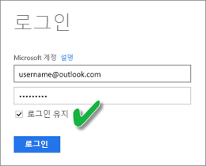

# OneDrive 또는 SharePoint Online에 있는 .CSV 파일에서 만든 데이터 집합 새로 고침
## 장점은 무엇인가요?
OneDrive 또는 SharePoint Online의 .csv 파일에 연결하면 Power BI에 데이터 집합이 생성됩니다. .csv 파일에서 데이터를 Power BI의 데이터 집합으로 가져옵니다. Power BI는 자동으로 파일에 연결되고 Power BI에서 데이터 집합의 변경 내용을 새로 고칩니다. OneDrive 또는 SharePoint Online에서 .csv 파일을 편집하는 경우 한 번 저장하면 해당 변경 내용이 Power BI에서 일반적으로 약 1시간 내에 표시됩니다. 데이터 집합에 기반한 Power BI의 시각화는 자동으로 업데이트됩니다.

파일이 비즈니스용 OneDrive 또는 SharePoint Online의 공유 폴더에 있는 경우 다른 사용자가 동일한 파일을 작업할 수 있습니다. 한 번 저장되면 변경 내용은 Power BI에서 일반적으로 1시간 내에 자동으로 업데이트됩니다.

대부분의 조직에서는 데이터에 대한 데이터베이스를 자동으로 쿼리한 다음 .csv 파일에 저장하는 프로세스를 매일 실행합니다. 매일 생성되는 다른 이름을 가진 새 파일에 비해 파일이 OneDrive 또는 SharePoint Online에 저장되고 동일한 파일이 매일 덮어쓰여지는 경우 Power BI에서 해당 파일에 연결할 수 있습니다. OneDrive 또는 SharePoint Online의 파일이 업데이트된 후에 곧 파일에 연결한 데이터 집합이 동기화됩니다. 데이터 집합에 기반한 시각화도 자동으로 업데이트됩니다.

## 무엇이 지원되나요?
쉼표로 구분된 값 파일은 간단한 텍스트 파일이므로 외부 데이터 원본 및 보고서에 연결이 지원되지 않습니다. 쉼표로 구분된 파일에서 만든 데이터 집합에 새로 고침을 예약할 수 없습니다. 그러나 파일이 OneDrive 또는 SharePoint Online에 있으면 Power BI는 데이터 집합을 사용하여 파일 변경 내용을 매시간 자동으로 동기화합니다.

## OneDrive 또는 비즈니스용 OneDrive. 차이점은 무엇인가요?
개인 OneDrive와 비즈니스용 OneDrive가 모두 있으면 비즈니스용 OneDrive의 Power BI에 연결하려는 파일을 유지하는 것이 좋습니다. 그 이유는 다음과 같습니다. 로그인하려면 두 개의 계정을 사용할 가능성이 있습니다.

Power BI에서 로그인하는 데 사용한 동일한 계정이 비즈니스용 OneDrive에 로그인하는 데 사용하는 계정이기 때문에 Power BI에서 비즈니스용 OneDrive에 연결하는 작업은 일반적으로 원활합니다. 하지만 개인 OneDrive를 사용하여 다른 [Microsoft 계정](http://www.microsoft.com/account/default.aspx)으로 로그인할 가능성이 있습니다.

Microsoft 계정으로 로그인하는 경우 로그인 상태 유지를 선택해야 합니다. Power BI에서 Power BI은 데이터 집합과 업데이트를 동기화할 수 있습니다.

Microsoft 계정 자격 증명이 변경되어 Power BI의 데이터 집합과 동기화할 수 없는 OneDrive에서 .csv 파일을 변경한 경우 파일에 연결하고 개인 OneDrive에서 다시 가져와야 합니다.

## 오류가 발생할 때
OneDrive에 있는 .csv 파일의 데이터가 변경되고 해당 변경 내용이 Power BI에 반영되지 않는 경우 Power BI가 OneDrive에 연결할 수 없기 때문일 수 있습니다. 파일에 연결하고 다시 가져오기를 시도합니다. 로그인할지 묻는 메시지가 표시되면 **로그인 상태 유지**를 선택해야 합니다.

## 다음 단계
[새로 고침 문제 해결 도구](service-gateway-onprem-tshoot.md)
[새로 고침 문제 해결 시나리오](refresh-troubleshooting-refresh-scenarios.md)

궁금한 점이 더 있나요? [Power BI 커뮤니티에 질문합니다.](https://community.powerbi.com/)

