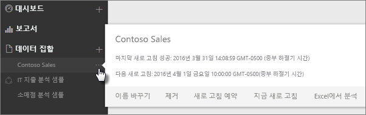
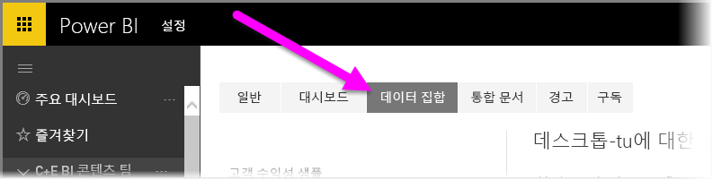
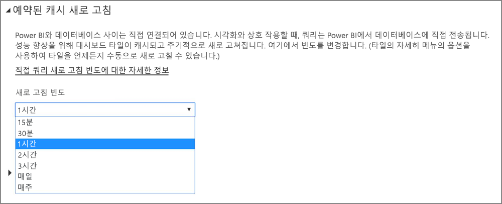

# Power BI에서 데이터 새로 고침
항상 최신 데이터를 가져오는 것은 올바른 결정을 내리는 데 중요한 경우가 많습니다. 일부 데이터에 연결하여 업로드하기 위해 Power BI에서 이미 데이터 가져오기를 사용했으며, 일부 보고서와 대시보드를 만들었습니다. 이제, 데이터가 최신이고 가장 좋은 상태임을 확인해야 합니다.

대부분의 경우, 이 작업은 수행할 필요가 없습니다. Salesforce 또는 Marketo 콘텐츠 팩 등에서 나온 일부 데이터는 자동으로 새로 고쳐집니다. 연결에서 라이브 연결 또는 DirectQuery를 사용하는 경우 데이터는 최신으로 업데이트됩니다. 하지만, 외부 온라인 또는 온-프레미스 데이터 원본에 연결된 Excel 통합 문서나 Power BI 데스크톱 파일을 사용하는 경우, Power BI가 보고서 및 대시보드의 데이터를 새로 고칠 수 있도록 수동으로 새로 고치거나 새로 고침 일정을 설정해야 합니다.

몇 가지 다른 경우와 함께 이 문서는 Power BI에서 데이터 새로 고침이 실제로 어떻게 작동하는지, 새로 고침 일정을 설정해야 할지 여부, 그리고 데이터를 성공적으로 새로 고치기 위해 무엇이 준비되어야 하는지에 대한 이해를 돕기 위한 것입니다.

## 데이터 새로 고침 이해
새로 고침을 설정하기 전에, 새로 고치는 것이 무엇인지와 데이터를 가져오는 위치를 이해해야 합니다.

데이터 원본은 보고서와 대시보드에서 탐색하는 데이터의 실제 출처입니다. 예를 들어, Google 분석 또는 QuickBooks 등과 같은 온라인 서비스, Azure SQL 데이터베이스와 같은 클라우드의 데이터베이스 또는 조직 내 로컬 컴퓨터나 데이터베이스의 데이터베이스나 파일입니다.  이들은 모두 데이터 원본입니다. 데이터 원본 유형은 데이터의 새로 고침 방식에 따라 결정합니다. 데이터 원본의 각 유형에 대한 새로 고침은 잠시 후 [새로 고칠 수 있는 대상은 무엇인가?](#what-can-be-refreshed)섹션에서 자세히 살펴보겠습니다.

*데이터 집합* 은 콘텐츠 팩, 파일에 연결하여 데이터를 업로드하기 위해 데이터 가져오기를 사용하거나 라이브 데이터 원본에 연결할 때 Power BI에 자동으로 생성됩니다. Power BI 데스크톱 및 Excel 2016에서, 데이터 가져오기를 사용할 때와 마찬가지로 Power BI 서비스에 파일을 바로 게시할 수도 있습니다.

각 경우에서 데이터 집합이 만들어지고 Power BI 서비스의 내 작업 영역 또는 그룹, 컨테이너에 표시됩니다. 데이터 집합의**줄임표(...)** 를 선택하면 보고서의 데이터를 탐색하고, 설정을 편집하고, 새로 고침을 설정할 수 있습니다.

데이터 집합은 하나 이상의 데이터 원본에서 데이터를 가져올 수 있습니다. 예를 들어, Power BI 데스크톱을 사용하여 조직 내 SQL 데이터베이스에서 데이터를 가져오고, OData 피드 온라인에서 다른 데이터를 가져올 수 있습니다. 그런 다음 Power BI에 파일을 게시하면, 하나의 데이터 집합이 만들어지지만 SQL 데이터베이스와 OData 피드 모두에 대한 데이터 원본을 가지게 됩니다.

데이터 집합은 데이터 원본, 데이터 원본 자격 증명, 그리고 대부분의 경우 데이터 원본에서 복사한 데이터의 하위 집합을 포함합니다. 보고서 및 대시보드에서 시각화를 만들면, 데이터 집합의 데이터를 볼 수 있거나, Azure SQL 데이터베이스와 같은 라이브 연결의 경우 데이터 집합은 데이터 원본에서 바로 볼 수 있는 데이터를 정의합니다. Analysis Services에 대한 라이브 연결의 경우 데이터 집합 정의는 Analysis Services에서 직접 가져옵니다.

> *데이터를 새로 고칠 경우 데이터 원본에서 Power BI에 저장된 데이터 집합의 데이터를 업데이트합니다. 이 새로 고침은 증분이 아닌 전체 새로 고침입니다.*
> 
> 

지금 새로 고침을 사용하거나 새로 고침 일정을 설정하여 데이터 집합의 데이터를 새로 고칠 때마다, Power BI는 데이터 집합의 정보를 사용하여 정의된 데이터 원본에 연결하고, 업데이트된 데이터에 대해 쿼리한 다음, 업데이트된 데이터를 데이터 원본에 로드합니다. 데이터를 기반으로 한 보고서 또는 대시보드의 모든 시각화는 자동으로 업데이트됩니다.

진행하기 전에 알아야 하는 다른 내용이 있습니다.

> *데이터 집합을 얼마나 자주 새로 고치거나 라이브 데이터를 얼마나 자주 보는가에 관계 없이 먼저 최신화되어야 하는 것은 데이터 원본의 데이터입니다.*
> 
> 

대부분의 조직에서는 일반적으로 하루에 한 번 저녁에 데이터를 처리합니다. 온-프레미스 데이터베이스에 연결하는 Power BI 데스크톱 파일에서 만들어진 데이터 집합에 대한 새로 고침 일정을 예약하면, IT 부서가 저녁 한 번 해당 SQL 데이터베이스에서 처리를 실행한 후에만, 하루 한 번만 실행되도록 예약된 새로 고침을 설정할 수 있습니다. 예를 들어, 데이터베이스 처리가 실행된 후이지만, 작업에 착수하기 전의 경우가 이에 해당합니다. 물론, 항상 이렇지는 않습니다. Power BI는 자주 업데이트되거나 심지어 실시간인 데이터 원본에 연결 하는 여러 방법을 제공합니다.

## 새로 고침의 유형
Power BI 내에서 발생하는 새로 고침의 네 가지 주요 유형입니다. 패키지 새로 고침, 모델/데이터 새로 고침, 타일 새로 고침 및 시각적 컨테이너 새로 고침입니다.

### 패키지 새로 고침
Power BI 서비스와 OneDrive, 또는 SharePoint Online 간의 Power BI Desktop 또는 Excel, 파일을 동기화합니다. 원래 데이터 원본에서 데이터를 끌어오지 않습니다. Power BI의 데이터 집합은 OneDrive 또는 SharePoint Online에서 파일에 포함된 내용으로 업데이트됩니다.

### 모델/데이터 새로 고침
원래 데이터 원본의 데이터로 Power BI 서비스 내의 데이터 집합을 새로 고치는 경우 참조합니다. 예약된 새로 고침 또는 지금 새로 고침 중 하나를 사용하여 수행합니다. 이렇게 하려면 온-프레미스 데이터 원본에 대한 게이트웨이가 필요합니다.

### 타일 새로 고침
데이터가 변경되면 타일 새로 고침은 대시보드에서 타일 시각적 개체에 대한 캐시를 업데이트합니다. 15분마다 발생합니다. 대시보드의 오른쪽 위에서 **줄임표(...)** 를 선택하고 **대시보드 타일 새로 고침**을 선택하여 타일 새로 고침을 강제로 적용할 수도 있습니다.

일반적인 타일 새로 고침 오류에 대한 자세한 내용은 [타일 오류 문제 해결](refresh-troubleshooting-tile-errors.md)을 참조하세요.

### 시각적 컨테이너 새로 고침
데이터가 변경되면 시각적 컨테이너를 새로 고치는 작업은 보고서 내의 캐시된 보고서 시각적 개체를 업데이트합니다.

## 새로 고칠 수 있는 대상은 무엇인가?
Power BI에서는 데이터 가져오기를 사용하여 로컬 드라이브, OneDrive 또는 SharePoint Online의 파일로부터 데이터를 가져오거나, Power BI 데스크톱으로부터 보고서를 게시하거나, 조직의 클라우드의 데이터베이스에 직접 연결할 수 있습니다. Power BI의 거의 모든 데이터를 새로 고칠 수 있지만, 새로 고침 여부는 데이터 집합의 생성 방법과 데이터 원본이 연결된 대상에 따라 달라집니다. 이들 각각이 데이터를 어떻게 새로 고치는지 살펴보겠습니다.

본론으로 들어가기 전에, 몇 가지 중요한 정의를 알아두어야 합니다.

**자동 새로 고침**  - 이는 데이터 집합을 정기적으로 새로 고치기 위한 사용자 구성이 없다는 것을 의미합니다. 데이터 새로 고침 설정은 Power BI에 의해 구성됩니다. 온라인 서비스 공급자의 경우, 새로 고침은 일반적으로 하루 한 번 실행됩니다. OneDrive에서 로드된 파일의 경우, 자동 새로 고침은 외부 데이터 원본에서 가져오지 않은 데이터에 대해 거의 매 시간마다 실행됩니다. 다른 일정 새로 고침 설정을 구성하고 수동으로 새로 고칠 있는 경우, 이 작업은 필요하지 않을 수 있습니다.

**사용자 구성 수동 또는 예약 새로 고침** – 이는 지금 새로 고침을 사용하여 데이터 집합을 수동으로 새로 고치거나 데이터 집합의 설정에서 예약 새로 고침 예약을 사용하여 새로 고침 일정을 설정할 수 있음을 의미합니다. 이 새로 고침 유형은 Power BI 데스크톱 파일과 외부 온라인 및 온-프레미스 데이터 원본에 연결된 Excel 통합 문서에 필요합니다.

> [!NOTE]
> 예약된 새로 고침을 위해 시간을 구성하면 시작하기 전에 최대 1시간까지 지연될 수 있습니다.
> 
> 

**라이브/DirectQuery** – 즉, Power BI와 데이터 원본 사이는 라이브로 연결되어 있습니다. 온-프레미스 데이터 원본의 경우 관리자는 엔터프라이즈 게이트웨이 내에서 구성된 데이터 원본이 필요하지만 사용자 상호 작용은 필요하지 않습니다.

> [!NOTE]
> 성능 향상을 위해 대시보드는 DirectQuery를 사용하여 연결된 데이터와 함께 자동으로 업데이트됩니다. 타일의 **자세히** 메뉴를 사용하면 타일을 언제든지 수동으로 새로 고칠 수 있습니다.
> 
> 

## OneDrive 또는 SharePoint Online의 로컬 파일 및 파일
데이터 새로 고침은 Power BI 데스크톱 파일과 외부 온라인 및 온-프레미스 데이터 원본에 연결된 Excel 통합 문서에 대해 지원됩니다. Power BI 서비스 내에서 데이터 집합에 대한 데이터를 새로 고칩니다. 로컬 파일을 업데이트하지 않습니다.

OneDrive 또는 SharePoint Online의 파일을 보관하고 Power BI의 파일에 연결하면 상당한 수준의 유연성을 제공합니다. 그러나 그러한 유연성으로 인해, 가장 이해하기 어려운 원인 중 하나가 됩니다. OneDrive 또는 SharePoint Online에 저장된 파일에 대한 예약된 새로 고침은 패키지 새로 고침과 다릅니다. [새로 고침의 유형](#types-of-refresh) 섹션에서 자세히 알아볼 수 있습니다.

### Power BI Desktop 파일

| **데이터 원본** | **자동 새로 고침** | **사용자 구성 수동 또는 예약 새로 고침** | **필수 게이트웨이** |
| --- | --- | --- | --- |
| 데이터 가져오기(리본에 있음)는 모든 나열된 온라인 데이터 원본에 연결하여 데이터를 쿼리하는 데 사용됩니다. |아니요 |예 |아니요(아래 참조) |
| 데이터 가져오기는 Analysis Services 데이터베이스에 연결하여 라이브로 탐색하는 데 사용됩니다. |예 |아니요 |예 |
| 데이터 가져오기는 지원되는 온-프레미스 DirectQuery 데이터 원본에 연결되고 탐색하는 데 사용됩니다. |예 |아니요 |예 |
| 데이터 가져오기는 Azure SQL 데이터베이스, Azure SQL 데이터 웨어하우스, Azure HDInsight Spark에 연결하여 데이터를 쿼리하는 데 사용됩니다. |예 |예 |아니요 |
| 데이터 가져오기는 Hadoop 파일(HDFS) 및 Microsoft Exchange를 제외한 모든 나열된 온-프레미스 데이터 원본에 연결하여 데이터를 쿼리하는 데 사용됩니다. |아니요 |예 |예 |

> [!NOTE]
> [**Web.Page**](https://msdn.microsoft.com/library/mt260924.aspx) 함수를 사용하는 경우 2016년 11월 18일 이후에 데이터 집합 또는 보고서를 다시 게시한 경우 게이트웨이가 필요합니다.
> 
> 

자세한 내용은 [OneDrive에 있는 Power BI Desktop 파일로부터 만들어진 데이터 집합 새로 고침](refresh-desktop-file-onedrive.md)을 참조하세요.

### Excel 통합 문서

| **데이터 원본** | **자동 새로 고침** | **사용자 구성 수동 또는 예약 새로 고침** | **필수 게이트웨이** |
| --- | --- | --- | --- |
| Excel 데이터 모델에 로드되지 않은 워크시트의 데이터 테이블입니다. |예, 매시간 *(OneDrive/SharePoint Online만 해당)* |수동으로만 *(OneDrive/SharePoint Online만 해당)* |아니요 |
| Excel 데이터 모델(연결된 테이블)의 테이블에 연결된 워크시트의 데이터 테이블입니다. |예, 매시간 *(OneDrive/SharePoint Online만 해당)* |수동으로만 *(OneDrive/SharePoint Online만 해당)* |아니요 |
| 파워 쿼리*는 모든 나열된 온라인 데이터 원본에 연결하여 데이터를 쿼리하고 데이터를 Excel 데이터 모델로 로드하는 데 사용됩니다. |아니요 |예 |아니요 |
| 파워 쿼리*는 Hadoop 파일(HDFS) 및 Microsoft Exchange를 제외한 모든 나열된 온-프레미스 데이터 원본에 연결하여 데이터를 쿼리하고 데이터를 Excel 데이터 모델로 로드하는 데 사용됩니다. |아니요 |예 |예 |
| 파워 피벗은 모든 나열된 온라인 데이터 원본에 연결하여 데이터를 쿼리하고 데이터를 Excel 데이터 모델로 로드하는 데 사용됩니다. |아니요 |예 |아니요 |
| 파워 피벗은 모든 나열된 온-프레미스 데이터 원본에 연결하여 데이터를 쿼리하고 데이터를 Excel 데이터 모델로 로드하는 데 사용됩니다. |아니요 |예 |예 |

*\* 파워 쿼리는 2016 Excel의 데이터 가져오기 및 변환이라고 합니다.*

자세한 내용은 [OneDrive에서 Excel 통합 문서로부터 만들어진 데이터 집합 새로 고침](refresh-excel-file-onedrive.md)을 참조하세요.

### OneDrive 또는 SharePoint Online에서 쉼표로 구분된 값(.csv) 파일

| **데이터 원본** | **자동 새로 고침** | **사용자 구성 수동 또는 예약 새로 고침** | **필수 게이트웨이** |
| --- | --- | --- | --- |
| 간단하게 쉼표로 구분된 값 |예, 시간별 |수동만 |아니요 |

자세한 내용은 [OneDrive에서 쉼표로 구분된 값(.csv) 파일로부터 만들어진 데이터 집합 새로 고침](refresh-csv-file-onedrive.md)을 참조하세요.

## 콘텐츠 팩
Power BI의 콘텐츠 팩에는 두 가지 유형이 있습니다.

Adobe Analytics, SalesForce, Dynamics CRM Online와 같은 **온라인 서비스의 콘텐츠 팩**입니다. 온라인 서비스로부터 만들어진 데이터 집합은 하루에 한 번 자동으로 새로 고쳐집니다. 필요하지 않을 경우, 수동으로 새로 고치거나 새로 고침 일정을 설정할 수 있습니다. 온라인 서비스는 클라우드에 있기 때문에, 게이트웨이가 필요하지 않습니다.

**조직 콘텐츠 팩**: 조직의 사용자에 의해 만들어 공유했습니다. 콘텐츠 팩 소비자는 새로 고침 일정을 설정하거나 수동으로 새로 고칠 수 없습니다. 콘텐츠 팩 작성자만 콘텐츠 팩의 데이터 집합에 대해 새로 고침을 설정할 수 있습니다. 새로 고침 설정은 데이터 집합으로 상속됩니다.

### 온라인 서비스의 콘텐츠 팩

| **데이터 원본** | **자동 새로 고침** | **사용자 구성 수동 또는 예약 새로 고침** | **필수 게이트웨이** |
| --- | --- | --- | --- |
| 데이터 가져오기 &gt; 서비스의 온라인 서비스 |예 |예 |아니요 |

### 조직 콘텐츠 팩
조직 콘텐츠 팩 내에 포함된 데이터 집합에 대한 기능을 새로 고침은 데이터 집합에 따라 다릅니다. 로컬 파일, OneDrive 또는 SharePoint Online과 관련하여 위의 정보를 참조하세요.

자세한 내용은 [조직 콘텐츠 팩 소개](service-organizational-content-pack-introduction.md)를 참조하세요.

## 온-프레미스 데이터 원본에 라이브 연결 및 DirectQuery
온-프레미스 데이터 게이트웨이를 사용하면 Power BI에서 온-프레미스 데이터 원본에 쿼리를 실행할 수 있습니다. 시각화와 상호 작용할 때, 쿼리는 Power BI에서 데이터베이스에 직접 전송됩니다. 그런 다음 업데이트된 데이터가 반환되고 시각화가 업데이트됩니다. Power BI와 데이터베이스가 직접 연결되어 있기 때문에, 새로 고침 일정을 설정할 필요가 없습니다.

DirectQuery와 달리 라이브 연결을 사용하여 SSAS(SQL Service Analysis Services) 데이터 원본에 연결하면 SSAS 원본에 대한 라이브 연결이 보고서 로드 시에도 캐시에 대해 실행될 수 있습니다. 이 동작은 보고서의 로드 성능을 향상시킵니다. **새로 고침** 단추를 사용하여 SSAS 데이터 원본의 최신 데이터를 요청할 수 있습니다. SSAS 데이터 원본 소유자는 보고서가 필요한 최신 상태를 유지할 수 있도록 데이터 집합에 대해 예약된 캐시 새로 고침 빈도를 구성할 수 있습니다. 

온-프레미스 데이터 게이트웨이로 데이터 원본을 구성하면 해당 데이터 원본을 예약된 새로 고침 옵션으로 사용할 수 있습니다. 개인 게이트웨이를 사용하는 대신입니다.

> [!NOTE]
> 라이브 또는 DirectQuery 연결에 데이터 집합을 구성한 경우 한 시간마다 또는 데이터와 상호 작용에서 발생할 때 데이터 집합이 새로 고쳐집니다. Power BI 서비스의 *예정된 캐시 새로 고침* 옵션에서 *새로 고침 빈도*를 수동으로 조정할 수 있습니다.
> 
> 

| **데이터 원본** | **라이브/DirectQuery** | **사용자 구성 수동 또는 예약 새로 고침** | **필수 게이트웨이** |
| --- | --- | --- | --- |
| Analysis Services 테이블 형식 |예 |예 |예 |
| Analysis Services 다차원 |예 |예 |예 |
| SQL Server |예 |예 |예 |
| SAP HANA |예 |예 |예 |
| Oracle |예 |예 |예 |
| Teradata |예 |예 |예 |

자세한 내용은 [온-프레미스 데이터 게이트웨이](service-gateway-onprem.md)를 참조하세요.

## 클라우드의 데이터베이스
DirectQuery를 사용하여 클라우드의 Power BI와 데이터베이스 사이는 직접 연결되어 있습니다. 시각화와 상호 작용할 때, 쿼리는 Power BI에서 데이터베이스에 직접 전송됩니다. 그런 다음 업데이트된 데이터가 반환되고 시각화가 업데이트됩니다. 그리고 Power BI 서비스와 데이터 원본 모두가 클라우드에 있기 때문에, 개인 게이트웨이가 필요하지 않습니다.

시각화에서 사용자 상호 작용이 없는 경우, 데이터는 한 시간마다 자동으로 새로 고쳐집니다. *예정된 캐시 새로 고침* 옵션을 사용하여 해당 새로 고침 빈도 변경하거나 새로 고침 빈도를 설정할 수 있습니다.

빈도를 설정하려면 Power BI 서비스의 오른쪽 위 모퉁이에서 **기어** 아이콘을 선택한 다음 **설정**을 선택합니다.

빈도를 조정하려는 데이터 집합을 선택할 수 있는 **설정** 페이지가 나타납니다. 해당 페이지에서 위에 있는 **데이터 집합** 탭을 선택합니다.

데이터 집합을 선택하면 오른쪽 창에서 해당 데이터 집합에 대한 옵션 컬렉션이 표시됩니다. DirectQuery/라이브 연결의 경우 다음 이미지에 나와 있는 것처럼 연결된 드롭다운 메뉴를 사용하여 새로 고침 빈도를 15분에서 매주 사이로 설정할 수 있습니다.

| **데이터 원본** | **라이브/DirectQuery** | **사용자 구성 수동 또는 예약 새로 고침** | **필수 게이트웨이** |
| --- | --- | --- | --- |
| SQL Azure Data Warehouse |예 |예 |아니요 |
| HDInsight의 Spark |예 |예 |아니요 |

자세한 내용은 [Azure 및 Power BI](service-azure-and-power-bi.md)를 참조하세요.

## 실시간 대시보드
실시간 대시보드는 Microsoft Power BI REST API 또는 Microsoft Stream Analytics을 사용하여 데이터가 최신 상태인지 확인합니다. 실시간 대시보드는 사용자가 새로 고침을 구성할 필요가 없기 때문에, 이 문서에서는 다루지 않습니다.

| **데이터 원본** | **자동** | **사용자 구성 수동 또는 예약 새로 고침** | **필수 게이트웨이** |
| --- | --- | --- | --- |
| Power BI Rest API 또는 Microsoft Stream Analytics을 사용하여 개발된 사용자 지정 앱 |예, 라이브 스트리밍 |아니요 |아니요 |

자세한 내용은 [Power BI에서 실시간 대시보드 만들기](https://msdn.microsoft.com/library/mt267603.aspx)를 참조하세요.

## 예약된 새로 고침 구성
예약된 새로 고침을 구성하는 방법을 알아보려면 [예약된 새로 고침 구성](refresh-scheduled-refresh.md)을 참조하세요.

## 일반 데이터 새로 고침 시나리오
Power BI에서 데이터 새로 고침에 대해 가장 좋은 학습 방법은 예를 살펴보는 것입니다. 다음은 일반적인 데이터 새로 고침 시나리오 중 일부입니다.

### 데이터의 테이블이 포함된 Excel 통합 문서
몇 가지 데이터의 테이블이 포함된 Excel 통합 문서가 있지만, 그 중 어떤 테이블도 Excel 데이터 모델에 로드되지 않습니다. 데이터 가져오기를 사용하여 로컬 드라이브의 통합 문서 파일을 Power BI에 업로드하고 대시보드를 만듭니다. 그러나 이제 로컬 드라이브의 몇 개의 통합 문서의 테이블을 일부 변경했고, 새 데이터로 Power BI의 대시보드를 업데이트하려 합니다.

하지만, 이 시나리오에서는 새로 고침이 지원되지 않습니다. 대시보드에 대한 데이터 집합을 새로 고치려면 통합 문서를 다시 업로드해야 합니다. 그러나 통합 문서 파일을 OneDrive 또는 SharePoint Online에 배치하는 것이 가장 좋은 방법입니다.

OneDrive 또는 SharePoint Online에 있는 파일에 연결하면 보고서와 대시보드는 파일에 있는 그대로 데이터를 표시합니다. 이 경우, 이는 Excel 통합 문서입니다. Power BI는 업데이트에 대한 매시간 마다 파일을 자동으로 검사합니다. 통합 문서(OneDrive 또는 SharePoint Online에 저장됨)를 변경한 경우, 이러한 변경 내용은 한 시간 내에 대시보드 및 보고서에 반영됩니다. 새로 고침을 전혀 설정하지 않아도 됩니다. 그러나 Power BI에서 업데이트를 즉시 확인해야 하는 경우, 지금 새로 고침을 사용하여 데이터 집합을 수동으로 새로 고칠 수 있습니다.

자세히 알아보려면 [Power BI의 Excel 데이터](service-excel-workbook-files.md) 또는 [OneDrive의 Excel 통합 문서에서 만들어진 데이터 집합 새로 고침](refresh-excel-file-onedrive.md)을 참조하세요.

### Excel 통합 문서를 회사의 SQL 데이터베이스에 연결
로컬 컴퓨터에 SalesReport.xlsx 라는 Excel 통합 문서를 있다고 가정해봅시다. Excel의 파워 쿼리는 회사 서버의 SQL 데이터베이스에 연결하고 데이터 모델에 로드된 판매 데이터에 대해 쿼리하는 데 사용되었습니다. 매일 아침, 통합 문서를 열어 PivotTables를 업데이트하도록 새로 고침을 누릅니다.

이제 Power BI에서 판매 데이터를 탐색하고, 데이터 가져오기를 사용하여 로컬 드라이브에 연결하여 SalesReport.xlsx 통합 문서를 업로드합니다.

이 경우, SalesReport.xlsx 데이터 집합의 데이터를 수동으로 새로 고치거나 새로 고침 일정을 설정할 수 있습니다. 실제로 회사의 SQL 데이터베이스에서 데이터를 가져오기 때문에, 게이트웨이를 다운로드하여 설치해야 합니다. 게이트웨이를 설치하고 구성했으면, SalesReport 데이터 집합의 설정으로 이동하여 데이터 원본에 로그인해야 합니다. 하지만 이 작업을 한 번만 수행하면 됩니다. 그러면 Power BI가 SQL 데이터베이스에 연결하여 업데이트된 데이터를 가져올 수 있도록 새로 고침 일정을 설정할 수 있습니다. 보고서와 대시보드도 자동으로 업데이트됩니다.

> [!NOTE]
> Power BI 서비스의 데이터 집합 내에서 데이터를 업데이트합니다. 로컬 파일은 새로 고침의 일환으로 업데이트되지 않습니다.
> 
> 

자세한 내용은 [Power BI의 Excel 데이터](service-excel-workbook-files.md), [Power BI Gateway - Personal](service-gateway-personal-mode.md), [온-프레미스 데이터 게이트웨이](service-gateway-onprem.md), [로컬 드라이브에 있는 Excel 통합 문서로부터 만들어진 데이터 집합 새로 고침](refresh-excel-file-local-drive.md)을 참조하세요.

### OData 피드의 데이터가 포함된 Power BI 데스크톱 파일
이 경우, Power BI 데스크톱에서 데이터 가져오기를 사용하여 OData 피드에 연결하여 인구 데이터를 가져옵니다.  Power BI 데스크톱에서 몇 개의 보고서를 만든 다음, WACensus라고 파일 이름을 정하고 회사의 공유 폴더에 저장합니다. 그런 다음 Power BI 서비스에 파일을 게시합니다.

이 경우, WACensus 데이터 집합의 데이터를 수동으로 새로 고치거나 새로 고침 일정을 설정할 수 있습니다. 데이터 원본의 데이터가 OData 피드에서 온라인으로 가져오기 때문에, 게이트웨이를 설치할 필요는 없지만, WACensus 데이터 집합의 설정으로 이동하여 OData 데이터 원본에 로그인해야 합니다. 그런 다음 Power BI가 OData 피드에 연결하여 업데이트된 데이터를 가져올 수 있도록 새로 고침 일정을 설정할 수 있습니다. 보고서와 대시보드도 자동으로 업데이트됩니다.

자세한 내용은 [Power BI 데스크톱에서 게시](desktop-upload-desktop-files.md), [로컬 드라이브에 있는 Power BI 데스크톱 파일로부터 만들어진 데이터 집합 새로 고침](refresh-desktop-file-local-drive.md), [OneDrive에서 Power BI 데스크톱 파일로부터 만들어진 데이터 집합 새로 고침](refresh-desktop-file-onedrive.md)을 참조하세요.

### 조직 내 다른 사용자의 콘텐츠 팩 공유
조직 콘텐츠 팩에 연결되었습니다. 여기에는 대시보드, 여러 보고서, 데이터 집합이 있습니다.

이 시나리오에서는 데이터 집합에 대한 새로 고침을 설정할 수 없습니다. 콘텐츠 팩을 만든 데이터 분석가는 사용된 데이터 원본에 따라 데이터 집합이 새로 고쳐지는지 확인하는 일을 담당합니다.

콘텐츠 팩의 대시보드 및 보고서가 업데이트되지 않는 경우 콘텐츠 팩을 만든 데이터 분석가에게 문의해야 합니다.

자세한 내용은 [조직 콘텐츠 팩 소개](service-organizational-content-pack-introduction.md), [조직 콘텐츠 팩 작업](service-organizational-content-pack-copy-refresh-access.md)을 참조하세요.

### Salesforce와 같은 온라인 서비스 공급자의 콘텐츠 팩
Power BI에서 Salesforce와 같은 온라인 서비스 공급자에서 데이터를 연결하고 가져오기 위해 데이터 가져오기를 사용했습니다. 여기서는 할 수 있는 일이 많지 않습니다. Salesforce 데이터 집합은 자동으로 하루에 한 번 새로 고치도록 예약됩니다. 

대부분 온라인 서비스 공급자와 마찬가지로, Salesforce는 일반적으로 하루에 한 번 밤에 데이터를 업데이트합니다. Salesforce 데이터 집합을 수동으로 새로 고치거나 새로 고침 일정을 설정할 수 있지만, Power BI가 자동으로 데이터 집합을 새로 고치고 보고서 및 대시보드도 업데이트되기 때문에 필요한 경우가 아니라면 설정할 필요가 없습니다.

자세한 내용은 [Power BI용Salesforce 콘텐츠 팩](service-connect-to-salesforce.md)을 참조하세요.

## 문제 해결
무언가 잘못된 경우, 이는 일반적으로 Power BI가 데이터 원본에 로그인할 수 없기 때문이거나 데이터 집합이 온-프레미스 데이터 원본에 연결되고 게이트웨이가 오프라인 상태이기 때문입니다. Power BI가 데이터 원본에 로그인할 수 있는지 확인합니다. 데이터 소스에 로그인할 때 사용하는 암호를 변경하거나 Power BI가 데이터 원본에서 로그아웃된 경우, 데이터 원본 자격 증명에서 다시 데이터 원본에 로그인을 시도해야 합니다.

문제 해결에 대한 자세한 내용은 [새로 고침 문제 해결 도구](service-gateway-onprem-tshoot.md) 및 [새로 고침 문제해결 시나리오](refresh-troubleshooting-refresh-scenarios.md)를 참조하세요.

## 다음 단계
[새로 고침 문제 해결을 위한 도구](service-gateway-onprem-tshoot.md)  
[새로 고침 시나리오 문제 해결](refresh-troubleshooting-refresh-scenarios.md)  
[Power BI 게이트웨이 - 개인](service-gateway-personal-mode.md)  
[온-프레미스 데이터 게이트웨이](service-gateway-onprem.md)  

궁금한 점이 더 있나요? [Power BI 커뮤니티에 질문합니다.](http://community.powerbi.com/)

