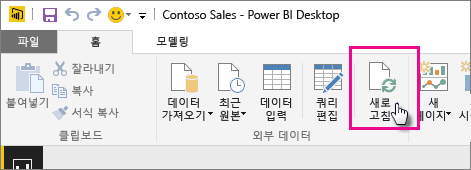

# 로컬 드라이브에 있는 Power BI Desktop 파일로부터 만들어진 데이터 세트 새로 고침

## 무엇이 지원되나요?

Power BI에서 지금 새로 고침 및 새로 고침 예약은 다음 데이터 원본에 연결하고 데이터를 로드하는 데 데이터 가져오기/쿼리 편집기를 사용하는 로컬 드라이브에서 가져온 Power BI Desktop 파일에서 만든 데이터 세트에 지원됩니다.

### Power BI 게이트웨이 - 개인

- Power BI Desktop의 데이터 가져오기 및 쿼리 편집기에 표시된 모든 온라인 데이터 원본
- Hadoop 파일(HDFS) 및 Microsoft Exchange를 제외하고 Power BI Desktop의 데이터 가져오기 및 쿼리 편집기에 표시되는 모든 온-프레미스 데이터 원본입니다.

<!-- Refresh Data sources-->
[!INCLUDE [refresh-datasources](./includes/refresh-datasources.md)]

> [!NOTE]
> 게이트웨이는 Power BI가 온-프레미스 데이터 원본에 연결하고 데이터 세트를 새로 고치기 위해 설치되고 실행됩니다.
>
>

홈 리본에서 **새로 고침**을 선택하여 Power BI Desktop에서 일회성인 수동 새로 고침을 수행할 수 있습니다. 여기에서 **새로 고침**을 선택하면 *파일*의 모델에 있는 데이터는 원래 데이터 원본에서 업데이트된 데이터로 새로 고쳐집니다. 완전히 Power BI Desktop 애플리케이션 자체에서 가져온 이러한 종류의 새로 고침은 Power BI에서 수동 또는 예약된 새로 고침과 다르기 때문에 차이를 이해하는 것이 중요합니다.

로컬 드라이브에서 Power BI Desktop 파일을 가져올 때 모델에 대한 다른 정보와 함께 데이터가 Power BI 서비스에서 데이터 세트에 로드됩니다. Power BI 서비스에서 보고서의 기반이 되기 때문에 (Power BI Desktop이 아닌) Power BI 서비스에서 데이터 세트에 있는 데이터를 새로 고치려고 합니다. 데이터 원본이 외부이기 때문에 **지금 새로 고침**을 사용하여 데이터 세트를 수동으로 새로 고치거나 **새로 고침 예약**을 사용하여 새로 고침 일정을 설정할 수 있습니다.

데이터 세트를 새로 고칠 때 Power BI는 업데이트된 데이터에 대해 쿼리하기 위해 로컬 드라이브의 파일에 연결하지 않습니다. 데이터 세트의 정보를 사용하여 업데이트된 데이터에 대해 쿼리하기 위해 데이터 원본에 직접 연결한 다음, 데이터 세트에 로드합니다.

> [!NOTE]
> 새로 고친 데이터 세트의 데이터는 로컬 드라이브에 있는 파일에 다시 동기화되지 않습니다.
>
>

## 새로 고침을 예약하려면 어떻게 해야 하나요?

새로 고침 일정을 설정하면 Power BI는 업데이트된 데이터에 대한 쿼리에 데이터 세트의 연결 정보 및 자격 증명을 사용하여 데이터 원본에 직접 연결한 다음, 업데이트된 데이터를 데이터 세트에 로드합니다. 또한 Power BI 서비스에 있는 데이터 세트에 기반한 보고서 및 대시보드의 모든 시각화는 업데이트됩니다.

예약된 새로 고침을 설정하는 방법에 대한 세부 정보는 [예약된 새로 고침 구성](refresh-scheduled-refresh.md)을 참조하세요.

## 오류가 발생할 때

무언가 잘못된 경우, 이는 일반적으로 Power BI가 데이터 원본에 로그인할 수 없기 때문이거나 데이터 세트가 온-프레미스 데이터 원본에 연결된 경우 게이트웨이가 오프라인 상태이기 때문입니다. Power BI가 데이터 원본에 로그인할 수 있는지 확인합니다. 데이터 소스에 로그인할 때 사용하는 암호를 변경하거나 Power BI가 데이터 원본에서 로그아웃된 경우, 데이터 원본 자격 증명에서 다시 데이터 원본에 로그인을 시도해야 합니다.

**새로 고침 실패 알림 전자 메일을 내게 보내기** 를 체크된 상태로 남겨두어야 합니다. 예약된 새로 고침이 실패하는 경우 바로 알아야 합니다.

## 문제 해결

경우에 따라 데이터 새로 고침이 예상대로 진행되지 않을 수 있습니다. 일반적으로 이것은 게이트웨이와 관련된 문제입니다. 게이트웨이 문제 해결 문서에서 도구 및 알려진 문제를 살펴 보세요.

- [온-프레미스 데이터 게이트웨이 문제 해결](service-gateway-onprem-tshoot.md)
- [Power BI 게이트웨이 - 개인 문제 해결](service-admin-troubleshooting-power-bi-personal-gateway.md)

궁금한 점이 더 있나요? [Power BI 커뮤니티에 질문합니다.](http://community.powerbi.com/)

