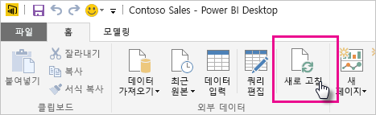

# OneDrive 또는 SharePoint Online에 저장된 데이터 집합 새로 고침
OneDrive 또는 SharePoint Online에서 Power BI 서비스로 파일을 가져오면 **Power BI Desktop**에서 수행하는 작업이 Power BI 서비스와 동기화를 유지할 수 있습니다.

## OneDrive 또는 SharePoint Online에 있는 Power BI Desktop 파일을 저장하는 이점
OneDrive 또는 SharePoint Online에서 **Power BI Desktop** 파일을 저장하는 경우 파일의 모델에 로드한 데이터를 데이터 집합에 가져오고 파일에서 만든 보고서는 제공된 Power BI의 **보고서**에 로드됩니다. 새 측정값을 추가하거나 열 이름을 변경하고 시각화를 편집하는 등 OneDrive 또는 SharePoint Online에서 파일을 변경한 경우 파일을 저장하면 일반적으로 약 1시간 내에 Power BI 서비스에서 업데이트됩니다.

홈 리본에서 새로 고침을 선택하여 Power BI Desktop에서 바로 일회성인 수동 새로 고침을 수행할 수 있습니다. 여기에서 새로 고침을 선택하면 *파일의* 모델에 있는 데이터는 원래 데이터 원본에서 업데이트된 데이터로 새로 고쳐집니다. 완전히 Power BI Desktop 응용 프로그램 자체에서 가져온 이러한 종류의 새로 고침은 Power BI에서 수동 또는 예약된 새로 고침과 다르기 때문에 차이를 이해하는 것이 중요합니다.

OneDrive 또는 SharePoint Online에서 Power BI Desktop 파일을 가져올 때 모델에 대한 다른 정보와 함께 데이터가 Power BI에서 데이터 집합에 로드됩니다. Power BI 서비스의 보고서가 기반해 있기 때문에 (Power BI Desktop가 아닌) Power BI 서비스에서 데이터 집합에 있는 데이터를 새로 고치려고 합니다. 데이터 원본이 외부이기 때문에 **지금 새로 고침**을 사용하여 데이터 집합을 수동으로 새로 고치거나 **새로 고침 예약**을 사용하여 새로 고침 일정을 설정할 수 있습니다.

데이터 집합을 새로 고칠 때 Power BI는 업데이트된 데이터에 대해 쿼리하기 위해 OneDrive 또는 SharePoint Online의 파일에 연결하지 않습니다. 데이터 집합의 정보를 사용하여 업데이트된 데이터에 대해 쿼리하기 위해 데이터 원본에 직접 연결한 다음 데이터 집합에 로드합니다. 새로 고친 데이터 집합의 데이터는 OneDrive 또는 SharePoint Online에 있는 파일에 다시 동기화되지 않습니다.

## 무엇이 지원되나요?
Power BI에서 지금 새로 고침 및 새로 고침 예약은 다음 데이터 원본에 연결하고 데이터를 로드하는 데 데이터 가져오기/쿼리 편집기를 사용하는 로컬 드라이브에서 가져온 Power BI Desktop 파일에서 만든 데이터 집합에 지원됩니다.

### Power BI 게이트웨이 - 개인
* Power BI Desktop의 데이터 가져오기 및 쿼리 편집기에 표시된 모든 온라인 데이터 원본
* Hadoop 파일(HDFS) 및 Microsoft Exchange를 제외하고 Power BI Desktop의 데이터 가져오기 및 쿼리 편집기에 표시되는 모든 온-프레미스 데이터 원본입니다.

<!-- Refresh Data sources-->
[!INCLUDE [refresh-datasources](./includes/refresh-datasources.md)]

> [!NOTE]
> 게이트웨이는 Power BI가 온-프레미스 데이터 원본에 연결하고 데이터 집합을 새로 고치기 위해 설치되고 실행됩니다.
> 
> 

## OneDrive 또는 비즈니스용 OneDrive. 차이점은 무엇인가요?
개인 OneDrive와 비즈니스용 OneDrive가 모두 있으면 비즈니스용 OneDrive의 Power BI에 가져오려는 파일을 유지하는 것이 좋습니다. 그 이유는 다음과 같습니다. 로그인하려면 두 개의 계정을 사용할 가능성이 있습니다.

Power BI에서 로그인하는 데 사용한 동일한 계정이 비즈니스용 OneDrive에 로그인하는 데 사용하는 계정이기 때문에 Power BI에서 비즈니스용 OneDrive에 연결하는 작업은 일반적으로 원활합니다. 하지만 개인 OneDrive를 사용하여 다른 [Microsoft 계정](http://www.microsoft.com/account/default.aspx)으로 로그인할 가능성이 있습니다.

Microsoft 계정으로 로그인 하는 경우 로그인 상태 유지를 선택해야 합니다. Power BI는 Power BI Desktop의 파일에서 Power BI에서 데이터 집합을 사용하여 업데이트를 동기화할 수 있습니다.  
    

Microsoft 계정 자격 증명이 변경되어 Power BI의 데이터 집합 및 보고서와 동기화할 수 없는 OneDrive에서 파일을 변경한 경우 개인 OneDrive에서 파일에 연결하고 해당 파일을 다시 업로드해야 합니다.

## 새로 고침을 예약하려면 어떻게 해야 하나요?
새로 고침 일정을 설정하면 Power BI는 업데이트된 데이터에 대한 쿼리에 데이터 집합의 연결 정보 및 자격 증명을 사용하여 데이터 원본에 직접 연결한 다음 업데이트된 데이터를 데이터 집합에 로드합니다. 또한 Power BI 서비스에 있는 데이터 집합에 기반한 보고서 및 대시보드의 모든 시각화는 업데이트됩니다.

새로 고침 예약을 설치하는 방법에 대한 세부 정보는 [새로 고침 예약 구성](refresh-scheduled-refresh.md)을 참조하세요.

## 오류가 발생할 때
무언가 잘못된 경우, 이는 일반적으로 Power BI가 데이터 원본에 로그인할 수 없기 때문이거나 데이터 집합이 온-프레미스 데이터 원본에 연결된 경우 게이트웨이가 오프라인 상태이기 때문입니다. Power BI가 데이터 원본에 로그인할 수 있는지 확인합니다. 데이터 소스에 로그인할 때 사용하는 암호를 변경하거나 Power BI가 데이터 원본에서 로그아웃된 경우, 데이터 원본 자격 증명에서 다시 데이터 원본에 로그인을 시도해야 합니다.

Onedrive에서 Power BI Desktop 파일을 변경하고 저장한 후에 해당 변경 내용이 Power BI에서 약 1시간 내에 반영되지 않은 경우 Power BI가 OneDrive에 연결하지 못하기 때문일 수 있습니다. OneDrive에서 파일에 다시 연결해봅니다. 로그인할지 묻는 메시지가 표시되면 로그인 상태 유지를 선택해야 합니다. Power BI는 OneDrive에 연결하여 파일과 동기화할 수 없기 때문에 파일을 다시 가져와야 합니다.

**새로 고침 실패 알림 전자 메일을 내게 보내기** 를 체크된 상태로 남겨두어야 합니다. 예약된 새로 고침이 실패하는 경우 바로 알아야 합니다.

## 문제 해결
경우에 따라 데이터 새로 고침이 예상대로 진행되지 않을 수 있습니다. 일반적으로 이것은 게이트웨이와 관련된 문제입니다. 게이트웨이 문제 해결 문서에서 도구 및 알려진 문제를 살펴 보세요.

[온-프레미스 데이터 게이트웨이 문제 해결](service-gateway-onprem-tshoot.md)

[Power BI 게이트웨이 - 개인 문제 해결](service-admin-troubleshooting-power-bi-personal-gateway.md)

궁금한 점이 더 있나요? [Power BI 커뮤니티에 질문합니다.](http://community.powerbi.com/)

