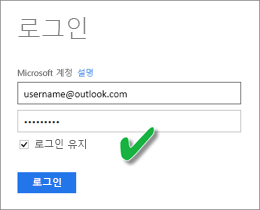
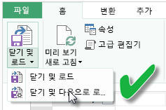
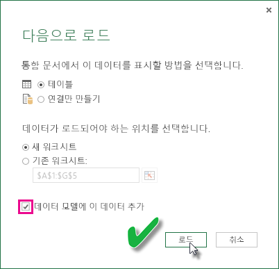

---
title: Excel 통합 문서로부터 만들어진 데이터 세트 새로 고침 - 클라우드
description: OneDrive 또는 SharePoint Online에 있는 Excel 통합 문서로부터 만들어진 데이터 세트 새로 고침
author: davidiseminger
ms.reviewer: kayu
ms.service: powerbi
ms.subservice: powerbi-service
ms.topic: conceptual
ms.date: 06/06/2019
ms.author: davidi
LocalizationGroup: Data refresh
ms.openlocfilehash: 21b7b93b4e522a8e6a49d22b54c9ddd83cb5e042
ms.sourcegitcommit: f77b24a8a588605f005c9bb1fdad864955885718
ms.translationtype: HT
ms.contentlocale: ko-KR
ms.lasthandoff: 12/02/2019
ms.locfileid: "74699624"
---
# OneDrive 또는 SharePoint Online에 있는 Excel 통합 문서로부터 만들어진 데이터 세트 새로 고침

로컬 컴퓨터나 비즈니스 또는 SharePoint Online용 OneDrive와 같은 클라우드 스토리지에 저장된 Excel 통합 문서를 가져올 수 있습니다. Excel 파일에 대한 클라우드 스토리지 사용의 이점을 살펴보겠습니다. Excel 파일을 Power BI로 가져오는 방법에 대한 자세한 내용은 [Excel 통합 문서 파일에서 데이터 가져오기](service-excel-workbook-files.md)를 참조하세요.

## 장점은 무엇인가요?

OneDrive 또는 SharePoint Online에서 파일을 가져오면 Excel에서 수행하는 작업이 Power BI 서비스와 동기화를 유지할 수 있습니다. 파일의 모델에 로드한 데이터는 데이터 세트에 가져오고 파일에서 만든 보고서는 Power BI의 보고서에 로드됩니다. 새 측정값을 추가하거나 열 이름을 변경하고 시각화를 편집하는 등 OneDrive 또는 SharePoint Online에서 파일을 변경한 경우 한 번 변경하면 해당 변경 내용이 Power BI에 일반적으로 약 1시간 내에 업데이트됩니다.

개인 OneDrive에서 Excel 통합 문서를 가져올 때 워크시트의 테이블 및/또는 Excel 데이터 모델에 로드된 데이터 및 데이터 모델의 구조와 같은 통합 문서의 데이터를 Power BI의 새 데이터 세트로 가져옵니다. 모든 Power View 시각화는 보고서에서 다시 만들어집니다. Power BI는 매 시간 마다 업데이트를 확인하기 위해 OneDrive 또는 SharePoint Online의 통합 문서에 자동으로 연결합니다. 통합 문서가 변경되면 Power BI는 Power BI 서비스에서 데이터 세트 및 보고서를 새로 고칩니다.

Power BI 서비스에서 데이터 세트를 새로 고칠 수 있습니다. 데이터 세트를 수동으로 새로 고치거나 새로 고침을 예약할 때 Power BI는 업데이트된 데이터를 쿼리하는 외부 데이터 원본에 직접 연결한 다음, 데이터 세트에 로드합니다. Power BI 내에서 데이터 세트를 새로 고치면 OneDrive 또는 SharePoint Online에서 통합 문서의 데이터는 새로 고쳐지지 않습니다. 

## 무엇이 지원되나요?

Power BI에서 **지금 새로** 고침 및 **새로 고침 예약**은 다음 데이터 원본에 연결하고 데이터를 로드하는 데 데이터 가져오기/쿼리 편집기를 사용하는 로컬 드라이브에서 가져온 Power BI Desktop 파일에서 만든 데이터 세트에 지원됩니다.  

### Power BI 게이트웨이 - 개인

* Power BI Desktop의 데이터 가져오기 및 쿼리 편집기에 표시된 모든 온라인 데이터 원본
* Hadoop 파일(HDFS) 및 Microsoft Exchange를 제외하고 Power BI Desktop의 데이터 가져오기 및 쿼리 편집기에 표시되는 모든 온-프레미스 데이터 원본입니다.

<!-- Refresh Data sources-->
[!INCLUDE [refresh-datasources](./includes/refresh-datasources.md)]

> [!NOTE]
> 게이트웨이는 Power BI가 온-프레미스 데이터 원본에 연결하고 데이터 세트를 새로 고치기 위해 설치되고 실행됩니다.
>
>

## OneDrive 또는 비즈니스용 OneDrive. 차이점은 무엇인가요?

개인 OneDrive와 비즈니스용 OneDrive가 모두 있으면 비즈니스용 OneDrive의 Power BI에 가져오려는 파일을 유지하는 것이 좋습니다. 그 이유는 다음과 같습니다. 로그인하려면 두 개의 계정을 사용할 가능성이 있습니다.

Power BI에서 로그인하는 데 사용한 동일한 계정이 비즈니스용 OneDrive에 로그인하는 데 사용하는 계정이기 때문에 Power BI에서 비즈니스용 OneDrive에 연결하는 작업은 일반적으로 원활합니다. 하지만 개인 OneDrive를 사용하여 다른 [Microsoft 계정](https://account.microsoft.com)으로 로그인할 가능성이 있습니다.

Microsoft 계정으로 로그인하는 경우 **로그인 유지**를 선택해야 합니다. 그런 다음, Power BI는 Power BI Desktop의 파일에 있는 모든 업데이트를 Power BI의 데이터 세트와 동기화할 수 있습니다.  

Microsoft 계정 자격 증명이 변경되어 Power BI의 데이터 세트 및 보고서와 동기화할 수 없는 OneDrive에서 파일을 변경한 경우 개인 OneDrive에서 파일에 연결하고 해당 파일을 다시 업로드해야 합니다.

## Excel 파일에 연결하기 위한 옵션

비즈니스용 OneDrive 또는 SharePoint Online에서 Excel 통합 문서에 연결할 때 Power BI의 통합 문서에 있는 내용을 가져오는 방법은 두 가지 옵션이 있습니다.

[**Power BI로 Excel 데이터 가져오기**](service-excel-workbook-files.md#import-or-connect-to-an-excel-workbook-from-power-bi) – 비즈니스용 OneDrive 또는 SharePoint Online에서 Excel 통합 문서를 가져올 경우 위에서 설명한 대로 작동합니다.

[**Power BI에서 Excel 연결, 관리 및 보기**](service-excel-workbook-files.md#one-excel-workbook--two-ways-to-use-it) – 이 옵션을 사용할 때 Power BI에서 비즈니스용 OneDrive 또는 SharePoint Online의 통합 문서에 바로 연결합니다.

이 방식으로 Excel 통합 문서에 연결하면 데이터 세트가 Power BI에서 생성되지 않습니다. 그러나 통합 문서는 &gt; 이름 옆의 Excel 아이콘을 사용하여 보고서의 Power BI 서비스에 표시됩니다. Excel Online과 달리 Power BI에서 통합 문서에 연결할 때 통합 문서가 Excel 데이터 모델에 데이터를 로드하는 외부 데이터 원본에 연결된 경우 새로 고침 일정을 설정할 수 있습니다.

이러한 방식으로 새로 고침 일정을 설정하는 경우 유일한 차이점은 데이터가 Power BI의 데이터 세트가 아닌 OneDrive 또는 SharePoint Online의 통합 문서 데이터 모델로 이동한다는 점입니다.

## 데이터를 Excel 데이터 모델에 로드하려면 어떻게 해야 하나요?

파워 쿼리(Excel 2016에서 **가져오기 및 변환**)를 사용하여 데이터 원본에 연결할 때 데이터를 로드하기 위한 몇 가지 옵션이 있습니다. 데이터 모델에 데이터를 로드하려면 **다음으로 로드** 대화 상자에서 **데이터 모델에 이 데이터 추가** 옵션을 선택해야 합니다.

> [!NOTE]
> 여기의 이미지는 Excel 2016을 보여줍니다.
>
>

**탐색기**에서 **다음으로 로드...** 를 클릭합니다.  

또는 **탐색기**에서 **편집**을 클릭하는 경우 쿼리 편집기를 엽니다. 여기서 **닫기 및 다음으로 로드...** 를 클릭할 수 있습니다.  

그런 다음 **다음으로 로드**에서 **데이터 모델에 이 데이터 추가**를 선택해야 합니다.  

### 파워 피벗에서 외부 데이터 가져오기를 사용할 경우 어떻게 되나요?

문제가 되지 않습니다. 파워 피벗을 사용하여 온-프레미스 또는 온라인 데이터 원본에서 데이터에 연결하고 쿼리할 때마다 데이터는 데이터 모델에 자동으로 로드됩니다.

## 새로 고침을 예약하려면 어떻게 해야 하나요?

새로 고침 일정을 설정하면 Power BI는 업데이트된 데이터에 대한 쿼리에 데이터 세트의 연결 정보 및 자격 증명을 사용하여 데이터 원본에 직접 연결한 다음, 업데이트된 데이터를 데이터 세트에 로드합니다. 또한 Power BI 서비스에 있는 데이터 세트에 기반한 보고서 및 대시보드의 모든 시각화는 업데이트됩니다.

예약된 새로 고침을 설정하는 방법에 대한 세부 정보는 [예약된 새로 고침 구성](refresh-scheduled-refresh.md)을 참조하세요.

## 오류가 발생할 때

무언가 잘못된 경우, 이는 일반적으로 Power BI가 데이터 원본에 로그인할 수 없기 때문이거나 데이터 세트가 온-프레미스 데이터 원본에 연결된 경우 게이트웨이가 오프라인 상태이기 때문입니다. Power BI가 데이터 원본에 로그인할 수 있는지 확인합니다. 데이터 소스에 로그인할 때 사용하는 암호를 변경하거나 Power BI가 데이터 원본에서 로그아웃된 경우, 데이터 원본 자격 증명에서 다시 데이터 원본에 로그인을 시도해야 합니다.

**새로 고침 실패 알림 전자 메일을 내게 보내기**를 체크된 상태로 남겨두어야 합니다. 예약된 새로 고침이 실패하는 경우 바로 알아야 합니다.

## 중요한 참고 사항

새로 고침은 파워 피벗에 연결하고 쿼리된 OData 피드에 지원되지 않습니다. OData 피드를 데이터 원본으로 사용하는 경우 파워 쿼리를 사용합니다.

## 문제 해결

경우에 따라 데이터 새로 고침이 예상대로 진행되지 않을 수 있습니다. 일반적으로 이것은 게이트웨이와 관련된 문제입니다. 게이트웨이 문제 해결 문서에서 도구 및 알려진 문제를 살펴보세요.

- [온-프레미스 데이터 게이트웨이 문제 해결](service-gateway-onprem-tshoot.md)
- [Power BI 게이트웨이 - 개인 문제 해결](service-admin-troubleshooting-power-bi-personal-gateway.md)

궁금한 점이 더 있나요? [Power BI 커뮤니티를 이용하세요.](https://community.powerbi.com/)

