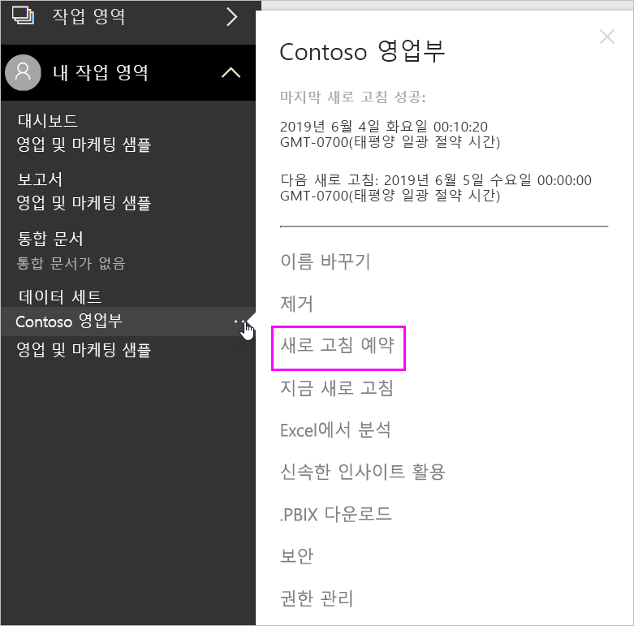
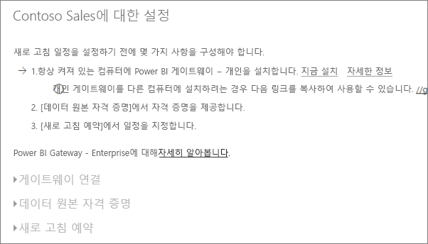
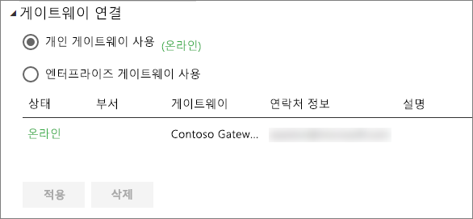
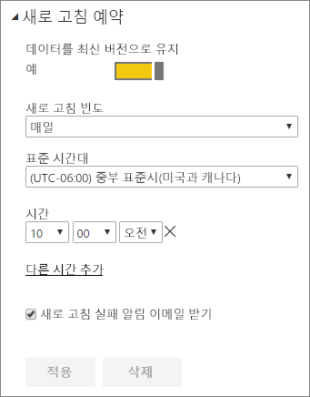

# 예약된 새로 고침 구성

>[!NOTE]
>두 달 동안 비활성 상태이면 데이터 집합에 대해 예약된 새로 고침이 일시 중지됩니다. 자세한 내용은 이 문서의 뒷부분에 있는 [*새로 고침 예약*](#schedule-refresh) 섹션을 참조하세요.
> 
> 

지금 새로 고침 및 새로 고침 예약을 사용하여 데이터 집합이 예약된 새로 고침을 지원하는 경우, 새로 고침을 성공시키기 위해 중요한 몇 가지 요구 사항 및 설정이 있습니다. **게이트웨이 연결**, **데이터 원본 자격 증명**, **새로 고침 예약**입니다. 각각에 대해 좀 더 자세히 살펴보겠습니다.

[Power BI Gateway – Personal](service-gateway-personal-mode.md) 및 [온-프레미스 데이터 게이트웨이](service-gateway-onprem.md) 모두에 사용할 수 있는 옵션을 설명합니다.

새로 고침 예약 화면을 가져오려면 다음을 수행할 수 있습니다.

1. **데이터 집합**에 나열된 데이터 집합 옆에 있는 **줄임표(...)** 를 선택합니다.
2. **새로 고침 예약**을 선택합니다.
   
    

## 게이트웨이 연결
개인 또는 엔터프라이즈인지, 게이트웨이가 온라인 상태이고 사용할 수 있는지 여부에 따라 다른 옵션이 여기에 표시됩니다.

사용할 수 있는 게이트웨이가 없는 경우 **게이트웨이 설정**이 비활성화됩니다. 또한 개인 게이트웨이를 설치하는 방법을 나타내는 메시지가 표시됩니다.

개인 게이트웨이를 구성한 경우 온라인 상태이면 선택할 수 있습니다. 사용할 수 없는 경우 오프라인으로 표시됩니다.

또한 엔터프라이즈 게이트웨이를 사용할 수 있는 경우 선택할 수 있습니다. 계정이 지정된 게이트웨이에 대해 구성된 데이터 원본의 사용자 탭에 표시된 경우 사용할 수 있는 엔터프라이즈 게이트웨이가 표시됩니다.

## 데이터 원본 자격 증명
### Power BI 게이트웨이 - 개인
개인 게이트웨이를 사용하여 데이터를 새로 고치는 경우 백 엔드 데이터 원본에 연결하는 데 사용되는 자격 증명을 제공해야 합니다. 온라인 서비스에서 콘텐츠 팩에 연결되어 있는 경우 예약된 새로 고침을 위해 연결하도록 입력한 자격 증명을 사용합니다.

데이터 원본에서 새로 고침을 처음 사용하는 경우 해당 데이터 집합에 로그인해야 합니다. 한 번 입력하면, 해당 자격 증명은 데이터 집합과 함께 유지됩니다.

> [!NOTE]
> 일부 인증 방법의 경우, 데이터 원본에 로그인하는 데 사용한 암호가 만료되거나 변경되면 데이터 원본 자격 증명의 데이터 원본에 대해서도 변경해야 합니다.
> 
> 

무언가 잘못된 경우, 문제는 대개 Windows에 로그인하여 서비스를 시작하지 못했기 때문에 게이트웨이가 오프라인 상태이거나, 업데이트된 데이터를 쿼리하기 위해 Power BI가 데이터 원본에 로그인 수 없는 경우와 관련이 있습니다. 새로 고칠 수 없는 경우, 데이터 집합의 설정을 확인합니다. 게이트웨이 서비스가 오프라인 상태인 경우, 게이트웨이 상태는 오류로 나타납니다. Power BI가 데이터 원본에 로그인할 수 없는 경우, 데이터 원본 자격 증명에 오류가 표시됩니다.

### 온-프레미스 데이터 게이트웨이
온-프레미스 데이터 게이트웨이를 사용하여 데이터를 새로 고치는 경우 게이트웨이 관리자가 데이터 원본에 정의한 대로 자격 증명을 제공할 필요가 없습니다.

> [!NOTE]
> 데이터 새로 고침을 위해 온-프레미스 SharePoint에 연결할 때 Power BI는 *익명*, *기본* 및 *Windows(NTLM/Kerberos)* 인증 메커니즘만 지원합니다. Power BI는 온-프레미스 SharePoint 데이터 원본의 데이터 새로 고침에 *ADFS* 또는 임의의 양식 기반 인증을 지원합니다.
> 
> 

## 새로 고침 예약
예약된 새로 고침 섹션에서 데이터 집합을 새로 고치는 빈도 및 시간 슬롯을 정의합니다. 일부 데이터 원본은 구성에 사용할 수 있는 게이트웨이를 필요로 하지 않습니다. 다른 경우 게이트웨이가 필요합니다.

설정을 구성하기 위해 **데이터를 최신 상태로 유지**를 **예**로 설정해야 합니다.

> [!NOTE]
> Power BI 서비스는 예약된 새로 고침 시간의 **15분** 내에 데이터 새로 고침을 시작하는 것을 목표로 합니다.
> 
> 

> [!NOTE]
> 두 달 동안 비활성 상태이면 데이터 집합에 대해 예약된 새로 고침이 일시 중지됩니다. 데이터 집합을 기반으로 하는 대시보드 또는 보고서를 방문한 사용자가 없는 경우 데이터 집합은 비활성 상태로 간주됩니다. 이때 데이터 집합 소유자에게 예약된 새로 고침이 일시 중지되었음을 나타내는 전자 메일이 전송되고 데이터 집합의 새로 고침 일정이 **사용 안 함**으로 표시됩니다. 예약된 새로 고침을 다시 시작하려면 데이터 집합을 기반으로 하는 대시보드 또는 보고서를 다시 방문하면 됩니다.
> 
> 

## 무엇이 지원되나요?
특정 데이터 집합은 예약된 새로 고침을 위해 다른 게이트웨이에 대해 지원됩니다. 다음은 제공되는 지원에 대한 참조입니다.

### Power BI 게이트웨이 - 개인
**Power BI Desktop**

* Power BI Desktop의 데이터 가져오기 및 쿼리 편집기에 표시된 모든 온라인 데이터 원본
* Hadoop 파일(HDFS) 및 Microsoft Exchange를 제외하고 Power BI Desktop의 데이터 가져오기 및 쿼리 편집기에 표시되는 모든 온-프레미스 데이터 원본입니다.

**Excel**

> [!NOTE]
> Excel 2016 이상에서 파워 쿼리는 이제 데이터 가져오기 및 변환에서 리본 메뉴의 데이터 섹션에 나열되어 있습니다.
> 
> 

* 파워 쿼리에 표시된 모든 온라인 데이터 원본.
* Hadoop 파일(HDFS) 및 Microsoft Exchange를 제외하고 파워 쿼리에 표시되는 모든 온-프레미스 데이터 원본.
* 파워 피벗에 표시된 모든 온라인 데이터 원본.\*
* Hadoop 파일(HDFS) 및 Microsoft Exchange를 제외하고 파워 피벗에 표시되는 모든 온-프레미스 데이터 원본.

<!-- Refresh Data sources-->
[!INCLUDE [refresh-datasources](./includes/refresh-datasources.md)]

## 문제 해결
경우에 따라 데이터 새로 고침이 예상대로 진행되지 않을 수 있습니다. 일반적으로 이것은 게이트웨이와 관련된 문제입니다. 게이트웨이 문제 해결 문서에서 도구 및 알려진 문제를 살펴 보세요.

[온-프레미스 데이터 게이트웨이 문제 해결](service-gateway-onprem-tshoot.md)

[Power BI 게이트웨이 - 개인 문제 해결](service-admin-troubleshooting-power-bi-personal-gateway.md)

## 다음 단계
[Power BI에서 데이터 새로 고침](refresh-data.md)  
[Power BI 게이트웨이 - 개인](service-gateway-personal-mode.md)  
[온-프레미스 데이터 게이트웨이](service-gateway-onprem.md)  
[온-프레미스 데이터 게이트웨이 문제 해결](service-gateway-onprem-tshoot.md)  
[Power BI 게이트웨이 - 개인 문제 해결](service-admin-troubleshooting-power-bi-personal-gateway.md)  

궁금한 점이 더 있나요? [Power BI 커뮤니티에 질문합니다.](http://community.powerbi.com/)

