# Power BI 공유 데이터 세트 기반의 페이지가 매겨진 보고서 만들기

Power BI Desktop에서 만든 데이터 세트를 Power BI 보고서 작성기 페이지를 매긴 보고서의 데이터 원본으로 사용할 수 있습니다. 이 시나리오를 다음과 같이 가정합니다. Power BI Desktop에서 Power BI 보고서를 만들었습니다. 데이터 모델을 디자인하는 데 많은 시간을 쏟았으며, 모든 종류의 뛰어난 시각적 개체를 사용하여 멋진 Power BI 보고서를 만들었습니다. 보고서에는 많은 행을 포함하는 행렬이 있으므로 모두 보려면 스크롤해야 합니다. 보고서 구독자가 해당 행렬의 모든 행을 표시하는 보고서를 인쇄할 수 있기를 원합니다. Power BI 페이지를 매긴 보고서는 이 요구 사항을 충족할 수 있습니다. 페이지 머리글 및 바닥글과 직접 디자인한 완벽한 페이지 레이아웃을 사용하여 여러 페이지로 이루어진 테이블 또는 행렬을 인쇄합니다. 이 보고서는 Power BI Desktop 보고서를 보완할 것입니다. 두 보고서가 불일치하는 부분 없이 정확히 동일한 데이터를 기반으로 하도록 동일한 데이터 세트를 사용합니다.

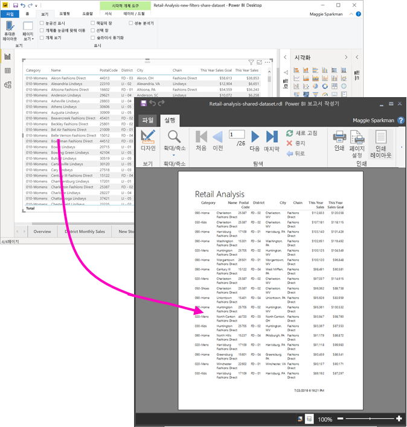

데이터 세트가 프리미엄 용량의 작업 영역에 있을 필요는 없으며, 해당 작업 영역의 멤버가 아니어도 됩니다. 데이터 세트의 [빌드 권한](service-datasets-build-permissions.md)만 있으면 됩니다. 페이지를 매긴 보고서를 게시하려면 Power BI Pro 라이선스가 필요합니다. 또한 최소한 프리미엄 용량의 작업 영역에 대한 기여자 역할이 있어야 합니다.

## 필요한 작업

다음은 Power BI 보고서 작성기에서 공유 데이터 세트를 사용하는 데 필요한 사항과 필요하지 않은 사항의 목록입니다.

- Power BI 보고서 작성기. [Power BI 보고서 작성기를 다운로드하여 설치](https://go.microsoft.com/fwlink/?linkid=2086513)합니다.
- Power BI 데이터 세트에 액세스하려면 데이터 세트의 빌드 권한이 있어야 합니다. [빌드 권한](service-datasets-build-permissions.md)을 참조하세요.
- 보고서 작성기에서 페이지를 매긴 보고서를 만드는 경우 Power BI Pro 라이선스가 필요하지 않습니다. 
- 페이지를 매긴 보고서를 게시하려면 Power BI Pro 라이선스가 필요합니다. 또한 최소한 프리미엄 용량의 작업 영역에 대한 기여자 역할이 있어야 합니다. 
- 선택 사항: 이 문서를 따르려는 경우 Power BI Desktop [소매점 분석 샘플 .pbix](https://download.microsoft.com/download/9/6/D/96DDC2FF-2568-491D-AAFA-AFDD6F763AE3/Retail%20Analysis%20Sample%20PBIX.pbix) 파일을 다운로드하고 Power BI Desktop에서 연 다음, 많은 열이 있는 테이블을 추가합니다. **서식** 창에서 **합계**를 끕니다. 그런 다음, Power BI 서비스의 작업 영역에 게시합니다.

    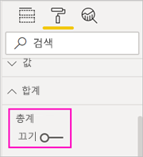

## Power BI 데이터 세트에 연결

1. Power BI 보고서 작성기를 엽니다.
1. 보고서 작성기의 오른쪽 위에서 **로그인**을 선택하여 Power BI 계정에 로그인합니다.
1. 보고서 데이터 창에서 **새로 만들기** > **Power BI 데이터 세트 연결**을 선택합니다.

    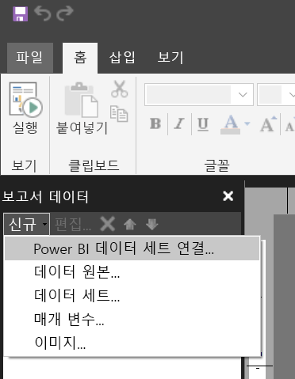

    > [!NOTE]
    > 보고서 작성기 테이블, 행렬 또는 차트 마법사를 사용하여 Power BI 데이터 세트의 데이터 원본 또는 데이터 세트를 만들 수는 없습니다. 데이터 세트를 만든 후에 마법사를 사용하여 데이터 세트를 토대로 테이블, 행렬 또는 차트를 만들 수 있습니다.

1. 데이터 세트 또는 데이터 세트가 있는 작업 영역을 검색하거나 찾은 다음, **선택**합니다.
    보고서 작성기에서 데이터 세트 이름을 채웁니다.

    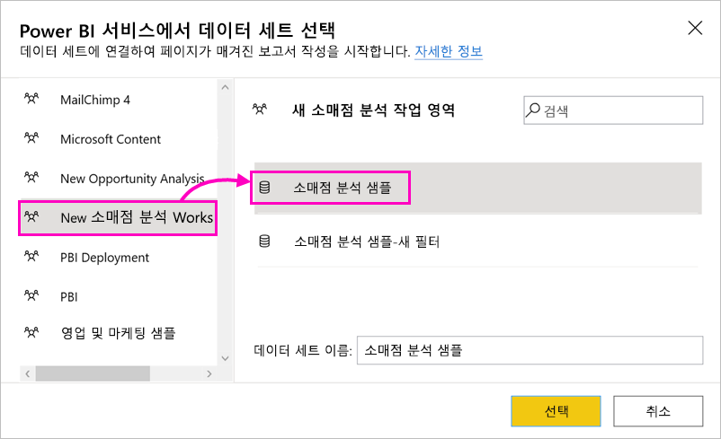
    
1. 데이터 세트는 보고서 데이터 창의 데이터 원본 아래에 나열됩니다.

    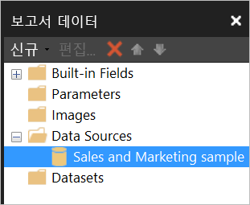

    동일한 페이지를 매긴 보고서에서 여러 Power BI 데이터 세트 및 기타 데이터 원본에 연결할 수 있습니다.

## 데이터 세트에 대한 쿼리 가져오기

Power BI 보고서와 보고서 작성기 보고서의 데이터를 동일하게 유지하려는 경우 데이터 세트에 연결하는 것만으로는 충분하지 않습니다. 해당 데이터 세트를 토대로 빌드된 쿼리도 필요합니다.

1. Power BI Desktop에서 Power BI 보고서(.pbix)를 엽니다.
1. 페이지를 매긴 보고서에 사용하려는 모든 데이터가 포함된 테이블이 보고서에 있는지 확인합니다.

1. **보기** 리본에서 **성능 분석기**를 선택합니다.

    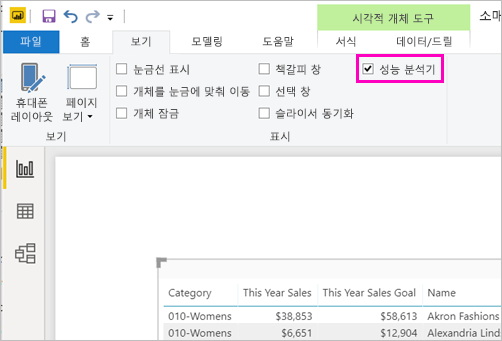

1. **성능 분석기** 창에서 **기록 시작**을 선택한 다음, **시각적 개체 새로 고침**을 선택합니다.

    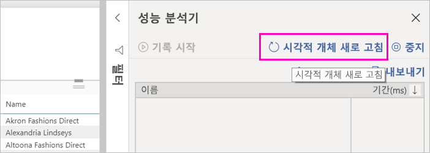

1. 테이블 이름 옆에 있는 더하기 기호( **+** )를 확장하고 **쿼리 복사**를 선택합니다. 이 쿼리는 Power BI 보고서 작성기의 데이터 세트에 필요한 DAX 수식입니다.

    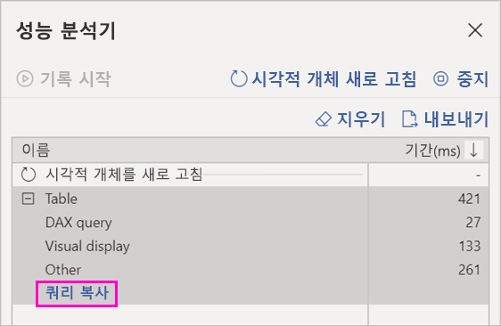

## 쿼리를 사용하여 데이터 세트 만들기

1. Power BI 보고서 작성기로 돌아갑니다.
1. **데이터 원본**에서 데이터 세트를 마우스 오른쪽 단추로 클릭하고 **데이터 세트 추가**를 선택합니다.

    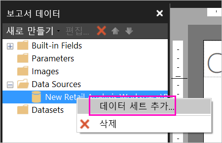

1. 데이터 세트 속성에서 이름을 지정하고 **쿼리 디자이너**를 선택합니다.

4. **DAX**가 선택되었는지 확인하고 **디자인 모드** 아이콘의 선택을 취소합니다.

    

1. 위쪽 상자에 Power BI Desktop에서 복사한 쿼리를 붙여넣습니다.

1. **쿼리 실행**(빨간색 느낌표, !)을 선택하여 쿼리가 작동하는지 확인합니다. 

    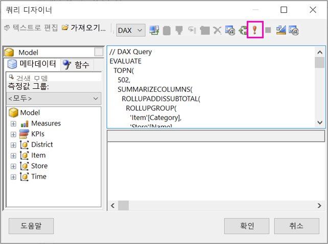

    아래쪽 상자에 쿼리 결과가 표시됩니다.

    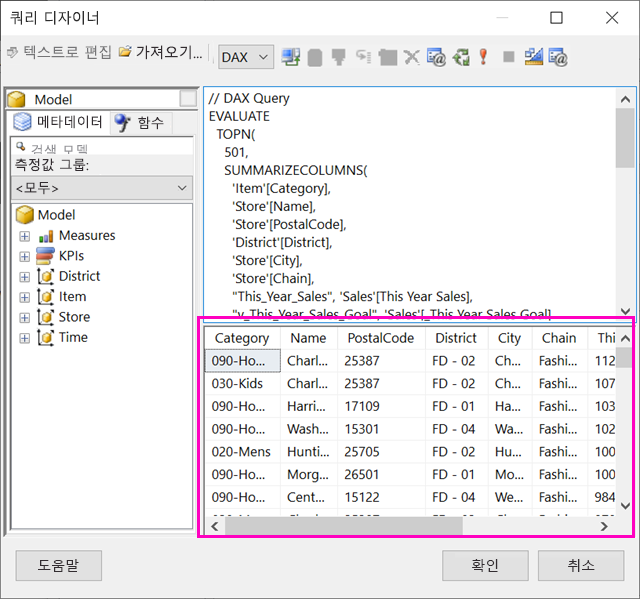

1. **확인**을 선택합니다.

    **데이터 세트 속성** 대화 상자의 **쿼리** 창에 쿼리가 표시됩니다.

    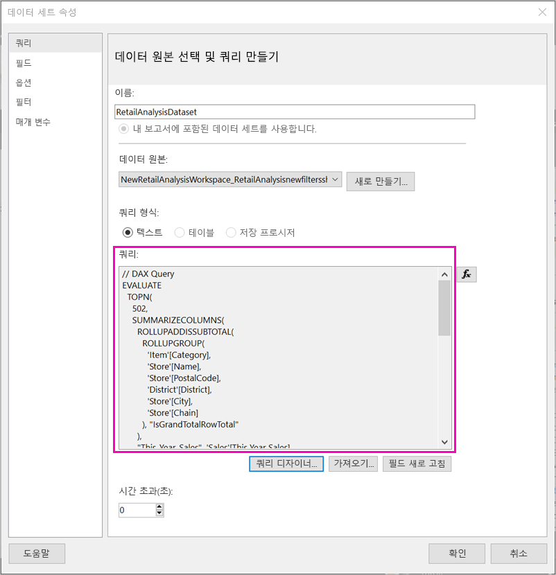

1. **확인**을 선택합니다.

    이제 보고서 데이터 창에 해당 필드 목록이 포함된 새 데이터 세트가 표시됩니다.

    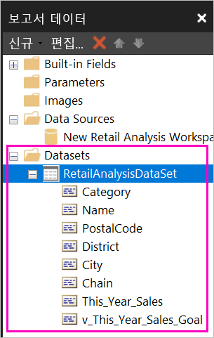

## 보고서에 테이블 만들기

테이블을 만드는 한 가지 빠른 방법은 테이블 마법사를 사용하는 것입니다.

1. **삽입** 리본에서 **테이블** > **테이블 마법사**를 선택합니다.

    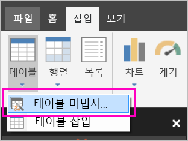

1. DAX 쿼리를 사용하여 만든 데이터 세트를 선택하고 **다음**을 클릭합니다.

    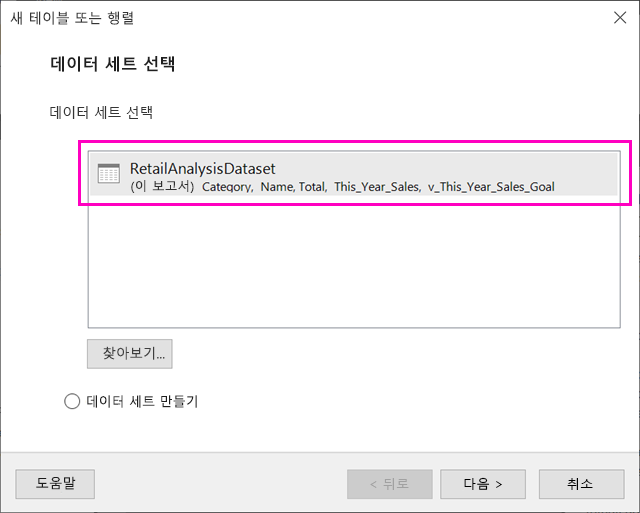

1. 플랫 테이블을 만들려면 **사용 가능한 필드**에서 원하는 필드를 선택합니다. 원하는 첫 번째 필드를 선택하고 Shift 키를 누른 채 마지막 필드를 선택하면 한 번에 여러 필드를 선택할 수 있습니다.

    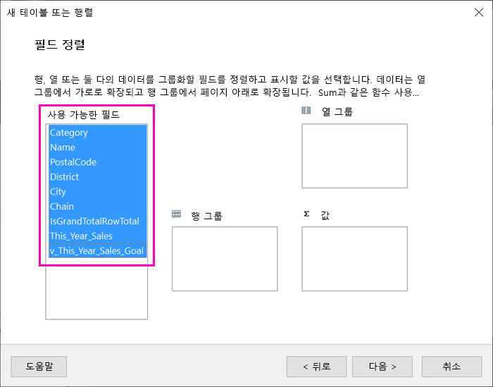

1. 필드를 **값** 상자로 끌어오고 **다음**을 클릭합니다.

    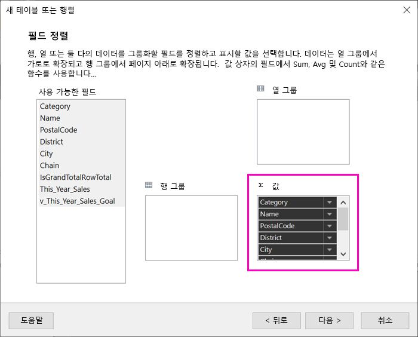

1. 원하는 레이아웃 옵션을 선택하고 **다음**을 클릭합니다.

1. **마침**을 선택합니다.
    디자인 뷰에 테이블이 표시됩니다.

    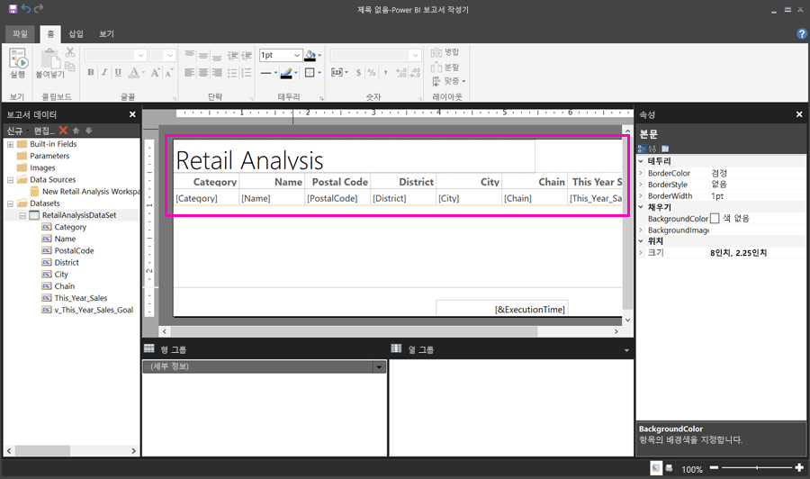

1. **제목을 추가하려면 클릭**을 선택하고 제목을 추가합니다.

1. **실행**을 선택하여 보고서를 미리 봅니다.

    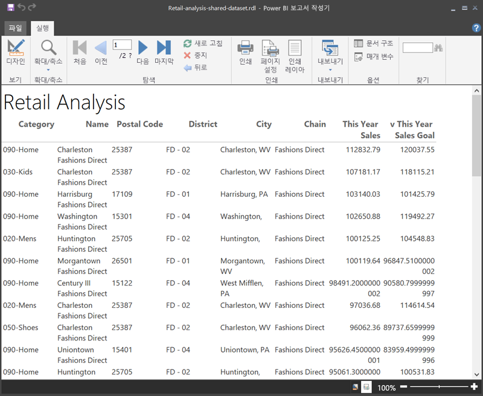

1. **인쇄 레이아웃**을 선택하여 보고서가 인쇄되는 모양을 확인합니다. 

    이 보고서 레이아웃에는 몇 가지 작업이 필요합니다. 열과 여백으로 인해 테이블이 두 페이지 너비가 되기 때문에 54페이지가 있습니다.

    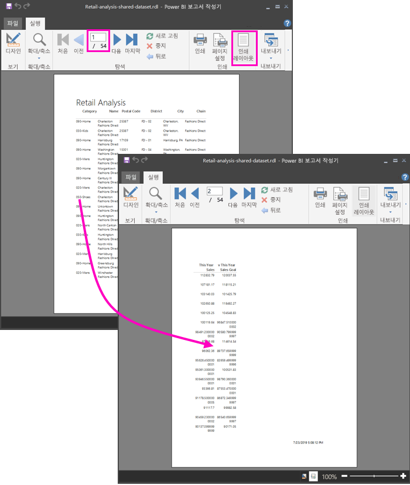

## 보고서 형식 지정

테이블을 한 페이지에 맞출 수 있는 여러 가지 서식 옵션이 있습니다. 

1. 속성 창에서 페이지 여백을 좁힐 수 있습니다. 속성 창이 보이지 않으면 **보기** 리본에서 **속성** 확인란을 선택합니다.

1. 테이블이나 제목이 아닌 보고서를 선택합니다.
1. **보고서 속성** 창의 **페이지**에서 **여백**을 펼친 다음, 각 항목을 **0.75in**로 변경합니다.

    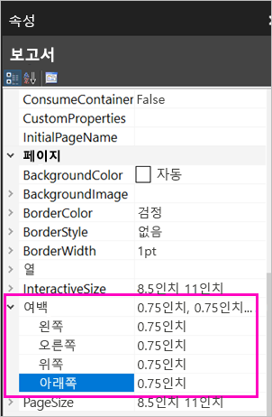

1. 열을 더 좁게 만들 수도 있습니다. 열 테두리를 선택하고 오른쪽 가장자리를 왼쪽으로 끕니다.

    

1. 또 다른 옵션은 숫자 값이 올바른 서식으로 표시되도록 하는 것입니다. 숫자 값이 포함된 셀을 선택합니다. 
    > [!TIP]
    > Shift 키를 누른 상태로 다른 셀을 선택하면 한 번에 둘 이상의 셀에 서식을 지정할 수 있습니다.

    

1. **홈** 리본의 **숫자** 섹션에서 **기본값** 형식을 **통화** 등의 숫자 형식으로 변경합니다.

    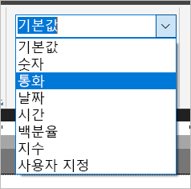

1. 셀의 서식을 확인할 수 있도록 **자리 표시자** 스타일을 **샘플 값**으로 변경합니다. 

    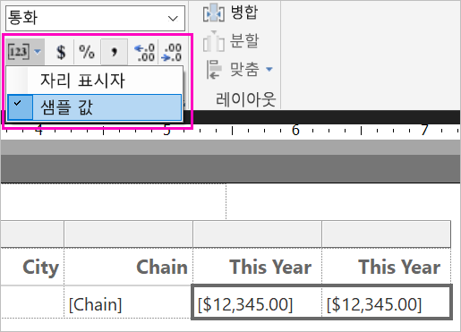

1. 해당하는 경우 **숫자** 섹션에서 소수를 줄여 공간을 더 절약합니다.

### 빈 페이지 제거

여백과 테이블 열을 좁게 만든 경우에도 페이지마다 뒤에 공백 페이지가 표시될 수 있습니다. 이유가 무엇일까요? 바로 수학 때문입니다. 

설정한 페이지 여백에 보고서 ‘본문’의 너비를 더한 값이 보고서 형식의 너비보다 작아야 합니다. 

예를 들어 보고서가 8.5” X 11” 형식이고 양쪽 여백을 각각 0.75로 설정했다고 가정합니다. 두 여백을 합치면 1.5”가 되므로 본문의 너비는 7”보다 작아야 합니다.

1. 보고서 디자인 화면의 오른쪽 가장자리를 선택하고 끌어 눈금자에서 원하는 숫자보다 줄입니다. 

    > [!TIP]
    > **본문** 속성에서 이 값을 더 정확하게 설정할 수 있습니다. **크기**에서 **너비** 속성을 설정합니다.

    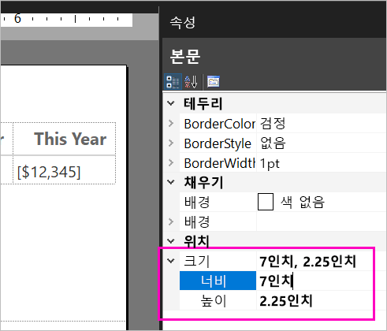

1. **실행**을 선택하여 보고서를 미리 보고, 빈 페이지를 제거했는지 확인합니다. 이제 보고서에 원래의 54페이지 대신 26페이지만 있습니다. 성공!

    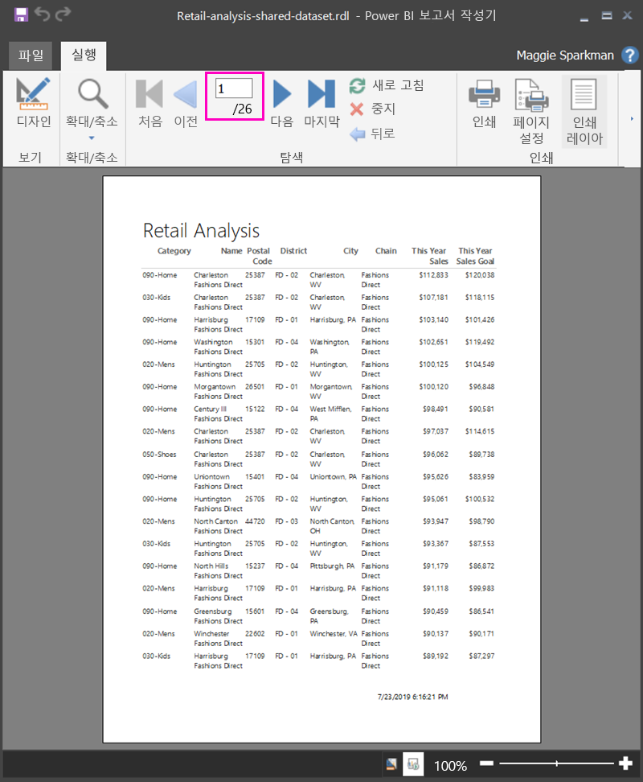

## 제한 사항 및 고려 사항 

- Analysis Services에 대한 라이브 연결을 사용하는 데이터 세트의 경우 공유 데이터 세트 대신 기본 Analysis Services 연결을 사용하여 직접 연결할 수 있습니다.
- 승격 또는 공인 인증을 사용하는 데이터 세트는 사용 가능한 데이터 세트 목록에 나타나지만 이러한 데이터 세트로 표시되지 않습니다. 

## 다음 단계

- [Power BI Premium에서 페이지를 매긴 보고서란?](paginated-reports-report-builder-power-bi.md)