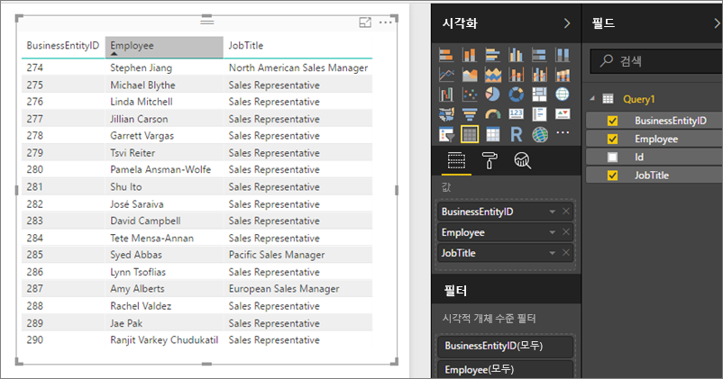

# Power BI Report Server에서 OData 피드로 공유 데이터 세트에 액세스
OData 피드로 Power BI Desktop에서 공유 데이터 세트에 액세스할 수 있습니다.

1. OData 피드 URL을 사용하여 OData 원본에 연결합니다.
   
    
2. Power BI Desktop으로 데이터를 가져온 후 쿼리 편집기에서 수정할 수 있습니다.
   
    
3. 이제 보고서 디자인에서 데이터를 사용할 수 있습니다.
   
    

개방형 형식 열을 설정하고 필요에 맞게 파워 쿼리에서 그에 따라 열 형식을 지정할 수 있도록 **고급 옵션**을 사용해야 합니다.

[Power BI Desktop에서 OData 피드에 연결](../desktop-connect-odata.md)에 대해 자세히 알아보세요.

궁금한 점이 더 있나요? [Power BI 커뮤니티에 질문합니다.](https://community.powerbi.com/)

