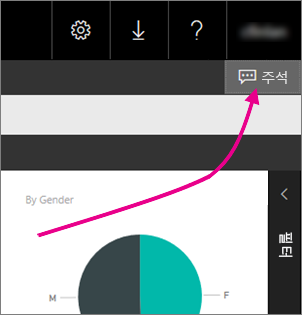
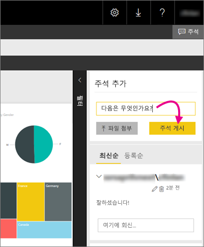

# 보고서 서버의 보고서에 주석 추가 - Power BI Report Server

보고서 서버의 웹 포털 내에 있는 Power BI 보고서를 비롯한 보고서에 주석을 추가할 수 있습니다. 주석은 보고서와 함께 유지되며 적절한 권한이 있는 모든 사용자는 보고서에 대한 주석을 볼 수 있습니다. 자세한 내용은 아래 [사용 권한](#permissions) 섹션을 참조하세요.

## 주석 추가 또는 보기

1. 보고서 서버에서 페이지가 매겨진 보고서 또는 Power BI 보고서를 엽니다.
2. 오른쪽 위 모퉁이에서 **설명**을 선택합니다.

    

    주석 창에서 기존 주석을 볼 수 있습니다.
3. 주석을 작성한 다음 **댓글 게시**를 선택합니다.

    

    웹 포털의 창에 이전 주석과 함께 현재 주석이 표시됩니다. Power BI 모바일 앱의 보고서에는 표시되지 않습니다.

   > [!TIP]
   > 알고 계십니까? [Power BI 모바일 앱에서 Power BI에 주석을 달고](../consumer/mobile/mobile-annotate-and-share-a-tile-from-the-mobile-apps.md) 주석이 달린 보고서를 다른 사용자와 공유할 수 있습니다.

## 권한

권한에 따라 다음을 수행할 수 있습니다.

* 주석을 보이지 않게 합니다.
* 모든 주석을 보고 직접 게시, 편집 및 삭제합니다.
* 모든 주석을 보고 직접 게시, 편집 및 삭제하며 다른 사람의 것도 삭제합니다.

## 다음 단계
* [Power BI Report Server란?](get-started.md)  

궁금한 점이 더 있나요? [Power BI 커뮤니티에 질문합니다.](https://community.powerbi.com/)

