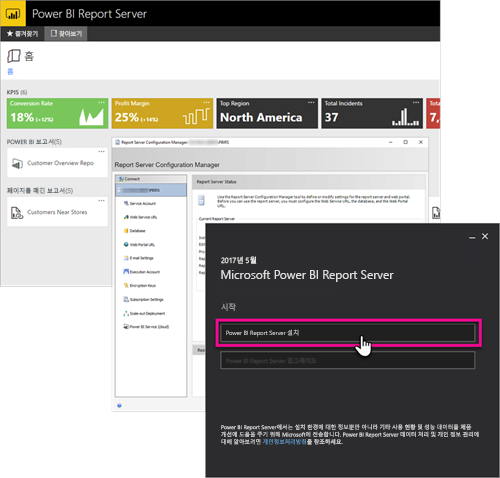

# 관리 개요, Power BI Report Server
이 아티클은 Power BI, 모바일 및 페이지가 매겨진 보고서를 저장하고 관리하는 온-프레미스 위치인 Power BI Report Server의 관리 개요입니다. 이 문서에서는 Power BI Report Server를 계획, 배포 및 관리하는 개념을 소개하고 추가 정보 링크를 제공합니다.

## 설치 및 마이그레이션
사용하기 시작하려면 Power BI Report Server를 설치해야 합니다. 이 작업을 처리하는 방법을 설명하는 아티클이 있습니다.

Power BI Report Server를 설치, 업그레이드 또는 마이그레이션하도록 시작하기 전에 보고서 서버에 대한 [시스템 요구 사항](system-requirements.md)을 살펴봅니다.

### 설치
새 Power BI Report Server를 배포하는 경우 다음 문서를 사용하면 도움이 될 수 있습니다. 

[Power BI Report Server 설치](install-report-server.md)

### 마이그레이션
SQL Server Reporting Services를 현재 위치 업그레이드할 수 없습니다. Power BI Report Server를 만들려는 기존 SQL Server Reporting Services 인스턴스가 있는 경우 마이그레이션해야 합니다. 다른 이유로 마이그레이션을 수행할 수도 있습니다. 자세한 내용은 마이그레이션 문서를 검토합니다.

[Report Server 설치 마이그레이션](migrate-report-server.md)

## Report Server 구성
Report Server를 구성할 때 여러 가지 옵션이 있습니다. SSL을 사용하시겠습니까? 이메일 서버를 구성하시겠습니까? Power BI 서비스와 통합하여 시각화를 고정하시겠습니까?

대부분의 구성은 Report Server 구성 관리자 내에서 발생합니다. 자세한 내용은 [구성 관리자](https://docs.microsoft.com/sql/reporting-services/install-windows/reporting-services-configuration-manager-native-mode) 설명서를 확인합니다.

## 보안
보안 및 보호는 모든 조직에 중요합니다. [보안](https://docs.microsoft.com/sql/reporting-services/security/reporting-services-security-and-protection) 설명서를 통해 인증, 권한 부여, 역할 및 사용 권한에 대해 알아볼 수 있습니다.

## 다음 단계
[Power BI Report Server 설치](install-report-server.md)  
[보고서 서버 제품 키 확인](find-product-key.md)  
[Power BI Report Server에 최적화된 Power BI Desktop 설치](install-powerbi-desktop.md)  
[보고서 작성기 다운로드](https://www.microsoft.com/download/details.aspx?id=53613)  
[SSDT(SQL Server Data Tools) 다운로드](http://go.microsoft.com/fwlink/?LinkID=616714)

궁금한 점이 더 있나요? [Power BI 커뮤니티에 질문합니다.](https://community.powerbi.com/)

