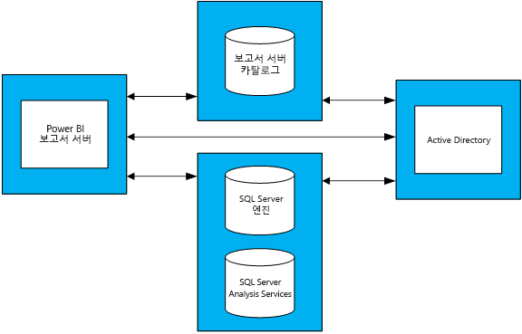

# Power BI Report Server에 대한 용량 계획 지침
Power BI Report Server는 셀프 서비스 BI 및 엔터프라이즈 보고 솔루션으로써 고객이 방화벽을 넘어 온-프레미스에 배포할 수 있습니다. 이 기능은 SQL Server Reporting Services의 온-프레미스 서버 플랫폼과 Power BI Desktop의 대화형 보고 기능을 결합했습니다. 기업 내에서 분석 및 보고 사용량이 지나치게 증가하면 엔터프라이즈 사용자의 기본 사항에 맞게 조정하는 데 필요한 하드웨어 인프라 및 소프트웨어 라이선스를 위한 예산 편성이 어려울 수 있습니다. 이 문서는 보고서 서버에 대한 다양한 워크로드의 다양한 부하 테스트 실행 결과를 공유하여 Power BI 보고서 서버의 용량 계획에 대한 지침을 제공하려고 합니다. 조직의 보고서, 쿼리 및 사용 패턴이 광범위하게 다른 반면 사용되는 실제 테스트 및 실행되는 방법에 대한 자세한 설명 등 이 문서에 표시되는 결과는 Power BI Report Server를 배포하는 초기 단계 계획 프로세스에 있는 모든 사용자에게 참조 사항으로 제공됩니다.

## 실행 요약
Power BI Report Server에 대해 두 가지 유형의 워크로드를 실행했습니다. 각 워크로드는 다양한 웹 포털 작업을 수행하는 작업과 여러 종류의 보고서를 렌더링하는 작업으로 이루어져 있습니다. 

* "Power BI Report Heavy" 워크로드에서 가장 자주 실행된 작업(즉, 시간 중 60%에서 실행된 작업)은 Power BI 보고서를 렌더링하는 작업입니다.
* "Paginated Report Heavy" 워크로드에서 가장 자주 실행된 작업은 페이지가 매겨진 보고서를 렌더링하는 작업입니다.

다음 표는 Power BI Report Server에 4개의 서버 토폴로지가 있고 한 번에 5% 미만의 사용자가 보고서 서버에 액세스한다는 가정 하에서 Power BI Report Server에서 99% 이상의 안정적으로 처리할 수 있는 최대 사용자 수를 설명합니다. 

| 워크로드 | 8개 코어/32GB RAM | 16개 코어/64GB RAM |
| --- | --- | --- |
| **Power BI Report Heavy**(>60%) |사용자 1,000명 |사용자 3,000명 |
| **Paginated (RDL) Report Heavy**(>60%) |사용자 2,000명 |사용자 3,200명 |

각 실행에서 가장 많이 사용되는 리소스는 CPU였습니다. 이로 인해 Power BI Report Server에 대한 코어 수를 늘리면 메모리 또는 하드 디스크 공간의 크기를 늘리는 경우보다 시스템의 안정성이 향상됩니다. 

## 테스트 방법론
사용된 테스트 토폴로지는 특정 벤더의 물리적 하드웨어가 아니라 Microsoft Azure Virtual Machines에 기반했습니다. 모든 컴퓨터는 미국 지역에서 호스팅되었습니다. 온-프레미스 및 공용 클라우드 모두에서 하드웨어 가상화의 일반적인 추세를 반영합니다. 

### Power BI Report Server 토폴로지
Power BI Report Server 배포는 다음과 같은 가상 컴퓨터의로 구성되었습니다.

* Active Directory Domain Controller: SQL Server 데이터베이스 엔진, SQL Server Analysis Services 및 Power BI Report Server에서 모든 요청을 안전하게 인증해야 합니다.
* SQL Server 데이터베이스 엔진 및 SQL Server Analysis Services: 렌더링하는 경우 사용할 보고서의 모든 데이터베이스를 저장한 위치였습니다.
* Power BI Report Server
* Power BI Report Server 데이터베이스 메모리, CPU, 네트워크 및 디스크 리소스를 SQL Server 데이터베이스 엔진과 경쟁하지 않아도 되도록 보고서 서버 데이터베이스는 Power BI Report Server가 아닌 다른 컴퓨터에서 호스팅됩니다.

토폴로지에 사용된 각 가상 컴퓨터의 철저한 구성은 부록 1.1 Power BI Report Server 토폴로지 및 부록 1.2 Power BI Report Server 가상 컴퓨터 구성을 참조하세요.

### 테스트
부하 테스트 실행에 사용되는 테스트는 [Reporting Services LoadTest](https://github.com/Microsoft/Reporting-Services-LoadTest)라는 GitHub 프로젝트에서 공개적으로 제공됩니다. 사용자는 이 도구를 사용하여 SQL Server Reporting Services 및 Power BI Report Server의 성능, 안정성, 확장성 및 복구 가능성 특성을 알아볼 수 있습니다. 이 프로젝트는 테스트 사례의 4개 그룹으로 구성됩니다.

* Power BI 보고서 렌더링 테스트 시뮬레이션
* 모바일 보고서 렌더링 테스트 시뮬레이션
* 소규모 및 대규모 페이지가 매겨진 보고서 렌더링 테스트 시뮬레이션 및 
* 다양한 유형의 웹 포털 작업 수행 테스트 시뮬레이션 

모든 테스트는 종단 간 작업(예: 보고서 렌더링, 새 데이터 원본 만들기 등)을 수행하기 위해 작성되었습니다. (API를 통해) 보고서 서버에 하나 이상의 웹 요청을 수행하여 달성합니다. 실제 상황에서 사용자는 이러한 종단 간 작업 중 하나를 완료하기 위해 몇 가지 중간 작업을 수행해야 합니다. 예를 들어 사용자가 보고서를 렌더링하려면 웹 포털으로 이동하고, 보고서가 있는 폴더로 이동하고, 렌더링할 보고서를 클릭합니다. 테스트가 종단 간 작업을 달성하는 데 필요한 모든 작업을 수행하지 않는 반면 대부분의 Power BI Report Server에서 발생하는 부하를 여전히 적용합니다. GitHub 프로젝트를 탐색하여 수행되는 다양한 작업뿐만 아니라 사용되는 다양한 종류의 보고서에 대해 자세히 알아볼 수 있습니다.

### 워크로드
테스트에 사용되는 Power BI Report Heavy 및 Paginated Report Heavy라는 2가지 워크로드 프로필이 있습니다. 다음 표에서는 Report Server에 대해 실행되는 요청의 분포를 설명합니다.

| 활동 | Power BI Report Heavy, 발생 빈도 | Paginated Report Heavy, 발생 빈도 |
| --- | --- | --- |
| **Power BI 보고서 렌더링** |60% |10% |
| **Rendering paginated (RDL) 보고서** |30% |60% |
| **모바일 보고서 렌더링** |5% |20% |
| **웹 포털 작업** |5% |10% |

### 사용자 부하
각 테스트 실행이 경우 두 워크로드 중 하나에 지정된 빈도에 따라 테스트를 실행합니다. 테스트는 Report Server에 대한 20개의 동시 사용자 요청으로 시작합니다. 사용자 부하는 안정성이 99% 목표 아래로 떨어질 때까지 점진적으로 증가되었습니다.

## 결과
### 동시 사용자 용량
앞서 설명한 대로 테스트는 Report Server에 대한 20개의 동시 사용자 요청으로 시작했습니다. 동시 사용자 수는 모든 요청의 1%가 실패할 때까지 점진적으로 증가되었습니다. 다음 표의 결과는 서버에서 1% 미만의 실패율인 최대 부하를 처리할 수 있는 동시 사용자 요청 수를 알려줍니다.

| 워크로드 | 8개 코어/32GB | 16개 코어/64GB |
| --- | --- | --- |
| **Power BI Report Heavy** |동시 사용자 50명 |동시 사용자 150명 |
| **Paginated Report Heavy** |동시 사용자 100명 |동시 사용자 160명 |

### 총 사용자 용량
Microsoft에는 여러 팀이 사용한 Power BI Report Server의 프로덕션 배포가 있습니다. 이 환경의 실제 사용량을 분석하는 경우 지정된 시점에(매일 최대 부하에서도) 동시 사용자 수가 전체 사용자의 5%를 초과하지 않는 경향이 있음을 관찰할 수 있습니다. 이 동시성 비율 5%를 벤치마크로 사용하여 Power BI Report Server 총 사용자가 99% 안정성으로 처리될 수 있음을 추정했습니다.

| 워크로드 | 8개 코어/32GB | 16개 코어/64GB |
| --- | --- | --- |
| **Power BI Report Heavy** |사용자 1,000명 |사용자 3,000명 |
| **Paginated Report Heavy** |사용자 2,000명 |사용자 3,200명 |

### 결과 보기
부하 테스트의 결과를 보려는 보고서를 선택합니다.

| 워크로드 | 8개 코어/32GB | 16개 코어/64GB |
| --- | --- | --- |
| **Power BI Report Heavy** |[보기 - 8개 코어](https://msit.powerbi.com/view?r=eyJrIjoiMDhhNGY4NGQtNGRhYy00Yzk4LTk2MzAtYzFlNWI5NjBkMGFiIiwidCI6IjcyZjk4OGJmLTg2ZjEtNDFhZi05MWFiLTJkN2NkMDExZGI0NyIsImMiOjV9) |[보기 - 16개 코어](https://msit.powerbi.com/view?r=eyJrIjoiNDBiODk1OGUtYTAyOC00MzVhLThmZmYtNzVjNTFjNzMwYzkwIiwidCI6IjcyZjk4OGJmLTg2ZjEtNDFhZi05MWFiLTJkN2NkMDExZGI0NyIsImMiOjV9) |
| **Paginated Report Heavy** |[보기 - 8개 코어](https://msit.powerbi.com/view?r=eyJrIjoiNDFiZWYzMTktZGIxNS00MzcwLThjODQtMmJkMGRiZWEzNjhlIiwidCI6IjcyZjk4OGJmLTg2ZjEtNDFhZi05MWFiLTJkN2NkMDExZGI0NyIsImMiOjV9) |[보기 - 16개 코어](https://msit.powerbi.com/view?r=eyJrIjoiOTU0YjJkYTgtNDg4Yy00NzlhLWIwMGYtMzg4YWI2MjNmOTZjIiwidCI6IjcyZjk4OGJmLTg2ZjEtNDFhZi05MWFiLTJkN2NkMDExZGI0NyIsImMiOjV9) |

<iframe width="640" height="360" src="https://msit.powerbi.com/view?r=eyJrIjoiMDhhNGY4NGQtNGRhYy00Yzk4LTk2MzAtYzFlNWI5NjBkMGFiIiwidCI6IjcyZjk4OGJmLTg2ZjEtNDFhZi05MWFiLTJkN2NkMDExZGI0NyIsImMiOjV9" frameborder="0" allowFullScreen="true"></iframe>

<iframe width="640" height="360" src="https://msit.powerbi.com/view?r=eyJrIjoiNDBiODk1OGUtYTAyOC00MzVhLThmZmYtNzVjNTFjNzMwYzkwIiwidCI6IjcyZjk4OGJmLTg2ZjEtNDFhZi05MWFiLTJkN2NkMDExZGI0NyIsImMiOjV9" frameborder="0" allowFullScreen="true"></iframe>

<iframe width="640" height="360" src="https://msit.powerbi.com/view?r=eyJrIjoiNDFiZWYzMTktZGIxNS00MzcwLThjODQtMmJkMGRiZWEzNjhlIiwidCI6IjcyZjk4OGJmLTg2ZjEtNDFhZi05MWFiLTJkN2NkMDExZGI0NyIsImMiOjV9" frameborder="0" allowFullScreen="true"></iframe>

<iframe width="640" height="360" src="https://msit.powerbi.com/view?r=eyJrIjoiOTU0YjJkYTgtNDg4Yy00NzlhLWIwMGYtMzg4YWI2MjNmOTZjIiwidCI6IjcyZjk4OGJmLTg2ZjEtNDFhZi05MWFiLTJkN2NkMDExZGI0NyIsImMiOjV9" frameborder="0" allowFullScreen="true"></iframe>

## 요약
각 부하 테스트 실행의 경우 CPU는 Power BI Report Server 컴퓨터에서 최대 부하 시점에 가장 많이 사용되는 리소스였습니다. 이로 인해 늘려야 하는 첫 번째 리소스는 코어 수입니다. 또는 토폴로지에서 Power BI Report Server를 호스팅하는 더 많은 서버를 추가하여 확장을 고려할 수 있습니다.

이 문서에 나온 결과는 특정 방식으로 반복되는 데이터의 특정 집합을 사용하는 보고서의 특정 집합을 실행하는 작업에서 파생되었습니다. 유용한 참조 사항이지만 사용량이 Power BI Report Server의 보고서, 쿼리, 사용 패턴 및 배포에 따라 달라진다는 점을 기억하세요.

## 부록
### 1 토폴로지
**1.1 Power BI Report Server 토폴로지**

다양한 구성에서 Power BI Report Server 동작에만 초점을 맞추려면 (Power BI Report Server를 호스팅하는 컴퓨터를 제외한) 컴퓨터의 각 형식에 대한 VM 구성이 수정되었습니다. 각 컴퓨터는 Premium Storage 디스크에서 2세대(v2) D 시리즈 컴퓨터에 따라 프로비전되었습니다. https://azure.microsoft.com/en-us/pricing/details/virtual-machines/windows/의 “일반적인 용도” 섹션에서 각 VM 크기에 대한 자세한 정보를 확인할 수 있습니다.

| 가상 컴퓨터 형식 | 프로세서 | 메모리 | Azure VM 크기 |
| --- | --- | --- | --- |
| **Active Directory 도메인 액세스** |2개 코어 |7GB |Standard_DS2_v2 |
| **SQL Server 데이터베이스 엔진 및 Analysis Services** |16개 코어 |56GB |Standard_DS5_v2 |
| **Report Server 데이터베이스** |16개 코어 |56GB |Standard_DS5_v2 |

**1.2 Power BI Report Server Virtual Machine 구성** 

Power BI Report Server를 호스팅하는 Virtual Machine에 다른 구성의 프로세서 및 메모리가 사용되었습니다. 다른 VM과 달리 이 컴퓨터는 Premium Storage 디스크에서 3세대(v3) D 시리즈 컴퓨터에 따라 프로비전되었습니다. https://azure.microsoft.com/en-us/pricing/details/virtual-machines/windows/의 “일반적인 용도” 섹션에서 이 VM 크기에 대한 자세한 정보를 확인할 수 있습니다.

| 가상 컴퓨터 | 프로세서 | 메모리 | Azure VM 크기 |
| --- | --- | --- | --- |
| **Power BI Report Server(소규모)** |8개 코어 |32GB |Standard_D8S_v3 |
| **Power BI Report Server(대규모)** |16개 코어 |64GB |vStandard_D16S_v3 |

### 2 LoadTest 도구 실행
Power BI Report Server의 Microsoft Azure 배포에 대해 Reporting Services LoadTest 도구를 실행하려는 경우 다음 단계를 수행합니다.

1. GitHub(https://github.com/Microsoft/Reporting-Services-LoadTest))에서 Reporting Services LoadTest 프로젝트를 복제합니다.
2. 프로젝트 디렉터리에서 RSLoadTests.sln이라는 솔루션 파일을 찾을 수 있습니다. Visual Studio 2015 이상에서 이 파일을 엽니다.
3. Microsoft Azure에서 Power BI Report Server 배포에 대해 이 도구를 실행할지 아니면 Power BI Report Server 배포에 대해 이 도구를 실행할지를 결정합니다. 고유한 배포에 대해 실행하려는 경우 5단계로 이동합니다.
4. https://github.com/Microsoft/Reporting-Services-LoadTest#create-a-sql-server-reporting-services-load-environment-in-azure의 지침에 따라 Azure에서 Power BI Report Server 환경을 만듭니다.
5. 환경 배포를 완료하면 https://github.com/Microsoft/Reporting-Services-LoadTest#load-test-execution의 지침에 따라 테스트를 실행합니다.

궁금한 점이 더 있나요? [Power BI 커뮤니티에 질문합니다.](https://community.powerbi.com/)

