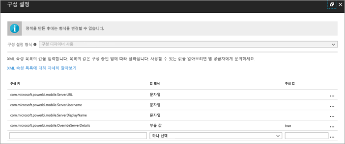
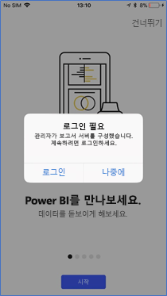
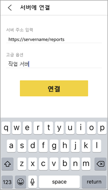
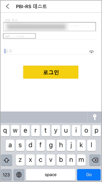

# 원격으로 보고서 서버에 대한 Power BI iOS 모바일 앱 액세스 권한 구성

이 아티클에서는 조직의 MDM 도구를 사용하여 보고서 서버에 대한 Power BI iOS 모바일 앱 액세스 권한을 구성하는 방법을 설명합니다. 이를 구성하기 위해 IT 관리자는 앱에 푸시하는 데 필요한 정보가 포함된 앱 구성 정책을 만듭니다. 

 보고서 서버 연결이 이미 구성되어 있으므로 Power BI iOS 모바일 앱 사용자가 조직의 보고서 서버에 보다 쉽게 연결할 수 있습니다. 

## MDM 도구에서 앱 구성 정책 만들기 

관리자의 경우 앱 구성 정책을 만들기 위해 Microsoft Intune에서 수행하는 단계는 다음과 같습니다. 앱 구성 정책을 빌드하는 단계 및 환경은 기타 MDM 도구에서 다를 수 있습니다. 

1. MDM 도구를 연결합니다. 
2. 새로운 앱 구성 정책을 만들고 이름을 지정합니다. 
3. 이 앱 구성 정책을 배포할 사용자를 선택합니다. 
4. 키-값 쌍을 만듭니다. 

다음 표에서는 쌍을 자세히 설명합니다.

|키  |형식  |설명  |
|---------|---------|---------|
| com.microsoft.powerbi.mobile.ServerURL | 문자열 | 보고서 서버 URL   http/https로 시작해야 함 |
| com.microsoft.powerbi.mobile.ServerUsername | 문자열 | [선택 사항]   서버 연결에 사용할 사용자 이름입니다.   존재하지 않는 경우 앱은 연결의 사용자 이름을 입력하라는 메시지를 수신합니다.| 
| com.microsoft.powerbi.mobile.ServerDisplayName | 문자열 | [선택 사항]   기본값은 "보고서 서버"입니다.   서버를 표시하기 위해 앱에서 사용되는 식별 이름입니다. | 
| com.microsoft.powerbi.mobile.OverrideServerDetails | 부울 값 | 기본값은 True입니다.  "True"로 설정하면 모바일 디바이스에 이미 있는 모든 보고서 서버 정의를 재정의합니다. 이미 구성된 기존 서버는 삭제됩니다.   또한 True로 설정된 재정의는 사용자가 해당 구성을 제거하지 않도록 방지합니다.   기존 설정을 그대로 두고 "False"로 설정하여 푸시된 값을 추가합니다.   모바일 앱에 동일한 서버 URL이 이미 구성되어 있는 경우 앱 구성을 그대로 유지합니다. 앱은 사용자에게 동일한 서버에 대한 인증을 다시 요청하지 않습니다. |

Intune을 사용하여 구성 정책 설정하는 예제는 다음과 같습니다.

## 보고서 서버에 연결하는 최종 사용자

 배포 목록에 대한 앱 구성 정책을 게시한다고 가정해 보겠습니다. 해당 배포 목록의 사용자와 디바이스가 iOS 모바일 앱을 시작하면 다음과 같은 환경을 갖게 됩니다. 

1. 보고서 서버를 사용하여 해당 모바일 앱을 구성한다는 메시지가 표시되면 **로그인**을 누릅니다.

    

2.  **서버에 연결** 페이지에서 보고서 서버 세부 정보가 이미 입력되었습니다. **연결**을 누릅니다.

    

3. 인증하기 위해 암호를 입력한 다음, **로그인**을 누릅니다. 

    

이제 보고서 서버에 저장된 KPI 및 Power BI 보고서를 확인하고 상호 작용할 수 있습니다.

## 다음 단계
[관리자 개요](admin-handbook-overview.md)  
[Power BI Report Server 설치](install-report-server.md)  

궁금한 점이 더 있나요? [Power BI 커뮤니티에 질문합니다.](https://community.powerbi.com/)

