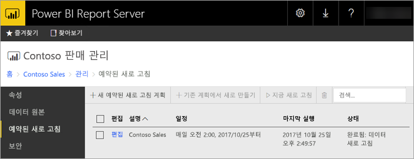
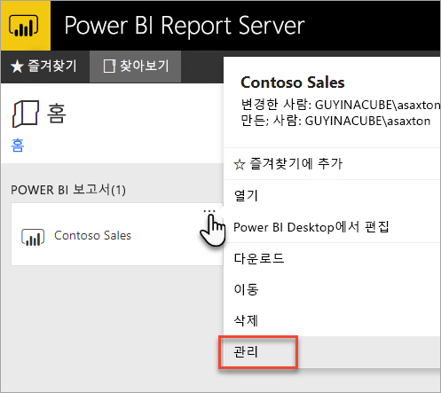
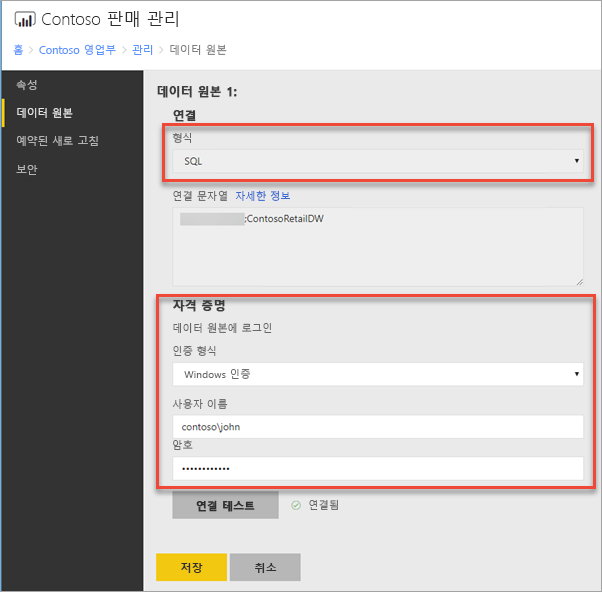
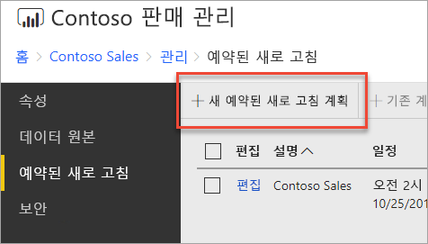
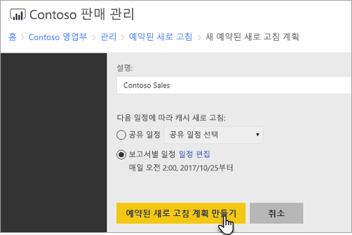
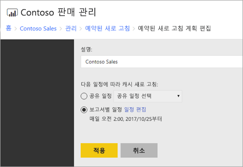

# Power BI 보고서 예약된 새로 고침을 구성하는 방법
Power BI 보고서에서 데이터를 새로 고치려면 예약된 새로 고침 계획을 만들어야 합니다. 이 작업은 Power BI 보고서의 *관리* 영역 내에서 수행됩니다.

## 데이터 원본 자격 증명 구성
데이터 새로 고침 예약 계획을 만들기 전에 Power BI 보고서에서 사용된 **각 데이터 원본**에 대한 자격 증명을 설정해야 합니다.

1. 웹 포털에서 Power BI 보고서를 마우스 오른쪽 단추로 클릭하고 **관리**를 선택합니다.
   
    
2. 왼쪽 메뉴에서 **데이터 원본** 탭을 선택합니다.
3. 표시되는 각 데이터 원본의 경우 해당 데이터 원본에 연결할 때 사용할 인증 유형을 선택합니다. 적절 한 자격 증명을 입력합니다.
   
    

## 새로 고침 예약 계획 만들기
다음 단계를 수행하여 예약된 새로 고침 계획을 만듭니다.

1. 웹 포털에서 Power BI 보고서를 마우스 오른쪽 단추로 클릭하고 **관리**를 선택합니다.
   
    
2. 왼쪽 메뉴에서 **예약된 새로 고침** 탭을 선택합니다.
3. **예약된 새로 고침** 페이지에서 **새 예약된 새로 고침 계획**을 선택합니다.
   
    
4. **새 예약된 새로 고침 계획** 페이지에서 설명을 입력하고 데이터 모델을 새로 고치려는 시점에 대한 일정을 설정합니다.
5. 완료되면 **예약된 새로 고침 계획 만들기**를 선택합니다.
   
    

## 새로 고침 예약 계획 수정
예약된 새로 고침 계획을 수정하는 것은 만드는 작업과 비슷합니다.

1. 웹 포털에서 Power BI 보고서를 마우스 오른쪽 단추로 클릭하고 **관리**를 선택합니다.
   
    
2. 왼쪽 메뉴에서 **예약된 새로 고침** 탭을 선택합니다.
3. **예약된 새로 고침** 페이지에서 관리하려는 새로 고침 계획 옆의 **편집**을 선택합니다.
   
    
4. **예약된 새로 고침 계획 편집** 페이지에서 설명을 입력하고 데이터 모델을 새로 고치려는 시점에 대한 일정을 설정합니다.
5. 완료되면 **적용**을 선택합니다.
   
    

## 새로 고침 예약 계획의 상태 보기
웹 포털에서 새로 고침 예약 계획의 상태를 봅니다.

1. 웹 포털에서 Power BI 보고서를 마우스 오른쪽 단추로 클릭하고 **관리**를 선택합니다.
   
    
2. 왼쪽 메뉴에서 **예약된 새로 고침** 탭을 선택합니다.
3. **예약된 새로 고침** 페이지에서 가장 오른쪽 열은 계획의 상태를 표시합니다.
   
   | **상태** | **설명** |
   | --- | --- |
   | 새 예약된 새로 고침 계획 |계획이 생성되었지만 실행되지 않습니다. |
   | 새로 고침 |새로 고침 프로세스를 시작했습니다. |
   | Analysis Server에 대한 스트리밍 모델 |보고서 서버 카탈로그 데이터베이스에서 호스팅된 Analysis Services 인스턴스로 모델을 복사합니다. |
   | 데이터 새로 고침 |모델 내에서 데이터를 새로 고칩니다. |
   | 모델에서 자격 증명 제거 |모델에서 데이터 원본에 연결하는 데 사용되는 자격 증명을 제거했습니다. |
   | 카탈로그에 모델 저장 |데이터 새로 고침이 완료되고 새로 고친 모델이 보고서 서버 카탈로그 데이터베이스에 다시 저장되고 있습니다. |
   | 완료됨: 데이터 새로 고침 |새로 고침이 완료됩니다. |
   | 오류: |새로 고치는 동안 오류가 발생했고 오류가 표시됩니다. |

현재 상태를 보려면 웹 페이지를 새로 고쳐야 합니다. 상태는 자동으로 변경되지 않습니다.

## 다음 단계
일정 만들기 및 수정에 대해 자세히 알아보려면 [일정 만들기, 수정 및 삭제](https://docs.microsoft.com/sql/reporting-services/subscriptions/create-modify-and-delete-schedules)를 참조하세요.

예약된 새로 고침 문제를 해결하는 방법에 대한 자세한 내용은 [Power BI Report Server에서 예약된 새로 고침 문제 해결](scheduled-refresh-troubleshoot.md)을 참조하세요.

궁금한 점이 더 있나요? [Power BI 커뮤니티에 질문합니다.](https://community.powerbi.com/)

