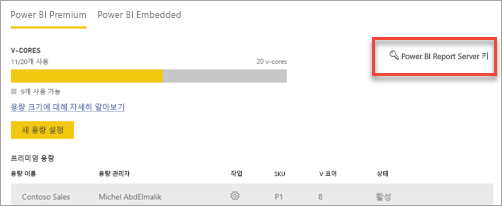
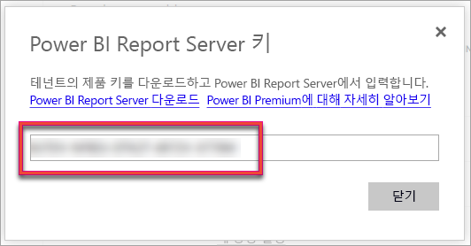
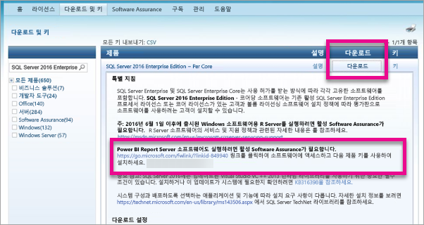

# 보고서 서버 제품 키를 확인하는 방법
프로덕션 환경에서 서버를 설치하기 위해 Power BI Report Server 제품 키를 찾는 방법에 대해 알아봅니다.

<iframe width="640" height="360" src="https://www.youtube.com/embed/6CQnf-NGtpU?rel=0&amp;showinfo=0" frameborder="0" allowfullscreen></iframe>

Power BI Report Server를 다운로드하고 SQL Server Enterprise Software Assurance 계약에 동의합니다. 또는 Power BI 프리미엄을 구입합니다. 프로덕션 환경에 서버를 설치하려면 제품 키가 필요합니다. 제품 키는 어디에 있습니까? 

제품 키 구매한 제품에 따라 두 위치 중 한 곳에 있습니다.

## 구매한 Power BI 프리미엄
Power BI Premium을 구입한 경우 Power BI 관리자 포털의 **용량 설정** 탭 내에서 Power BI Report Server 제품 키에 대한 액세스를 갖습니다. 전역 관리자 또는 Power BI 서비스 관리자 역할에 할당된 사용자만 사용 가능합니다.

**Power BI Report Server 키**를 선택하면 제품 키를 포함하는 대화 상자가 표시됩니다. 복사하고 설치와 함께 사용할 수 있습니다.

## 구매한 Software Assurance 계약
SQL Server Enterprise SA 규약이 있는 경우 [볼륨 라이선스 서비스 센터](https://www.microsoft.com/Licensing/servicecenter/)에서 제품 키를 가져올 수 있습니다. 최신 버전 SQL Server용 최신 서비스 팩 아래에서 확인합니다. 이곳에 없는 경우 최신 SQL Server 버전의 RTM 릴리스 아래에서 확인합니다.

> [!NOTE]
> 키 섹션이 아니라 다운로드 섹션을 확인해야 합니다
> 
> 

## 다음 단계
[Power BI Report Server 설치](install-report-server.md)  
[Power BI Report Server에 최적화된 Power BI Desktop 설치](install-powerbi-desktop.md)  
[보고서 작성기 다운로드](https://www.microsoft.com/download/details.aspx?id=53613)  
[SSDT(SQL Server Data Tools) 다운로드](http://go.microsoft.com/fwlink/?LinkID=616714)

궁금한 점이 더 있나요? [Power BI 커뮤니티에 질문합니다.](https://community.powerbi.com/)

