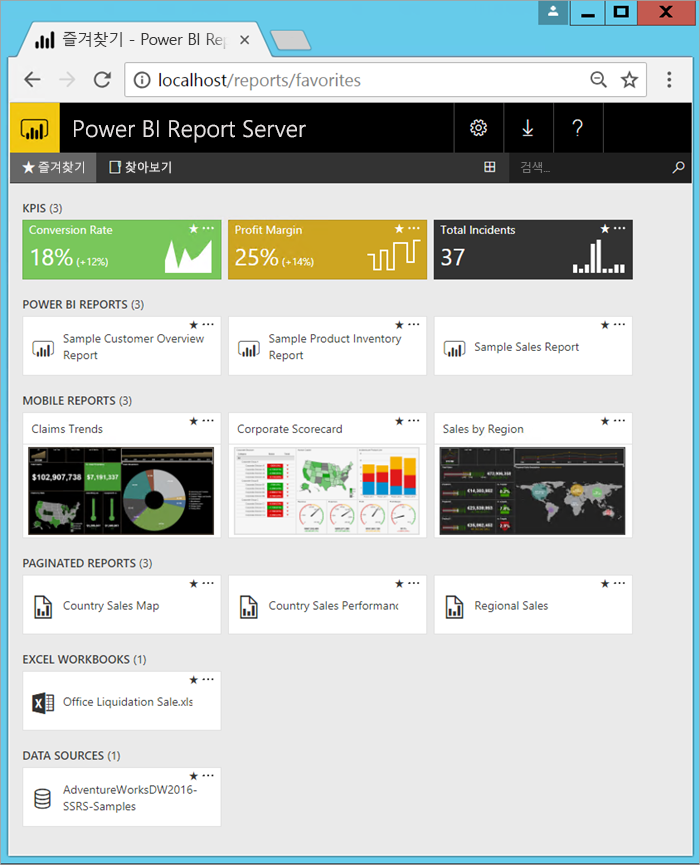

# Power BI Report Server란?

Power BI Report Server는 Power BI 보고서, 페이지를 매긴 보고서, 모바일 보고서 및 KPI를 만드는 도구와 함께 보고서 및 KPI를 표시하고 관리하는 웹 포털이 있는 온-프레미스 보고서 서버입니다. 사용자는 웹 브라우저 또는 모바일 장치에서 보거나 받은 편지함에서 메일로 보는 등의 다양한 방법으로 해당 보고서에 액세스할 수 있습니다.

## Power BI Report Server 비교 
Power BI Report Server는 SQL Server Reporting Services 및 Power BI 온라인 서비스와 비슷하지만 방식이 서로 다릅니다. Power BI 서비스와 마찬가지로 Power BI Report Server는 Power BI 보고서(.PBIX) 및 Excel 파일을 호스트합니다. Reporting Services와 마찬가지로 Power BI Report Server는 온-프레미스이며 페이지를 매긴 보고서(.RDL)를 호스트합니다. Power BI Report Server는 Reporting Services의 상위 집합입니다. Reporting Services에서 수행할 수 있는 모든 작업은 Power BI 보고서에 대한 지원과 함께 Power BI Report Server 등에서 수행할 수 있습니다. 자세한 내용은 [Power BI Report Server 및 Power BI 서비스 비교](compare-report-server-service.md)를 참조하세요.

## Power BI Report Server 라이선싱
Power BI Report Server는 Software Assurance와 함께 [Power BI Premium](../service-premium.md) 및 [SQL Server Enterprise Edition](https://www.microsoft.com/sql-server/sql-server-2017-editions)의 두 가지 라이선스를 통해 사용할 수 있습니다. Power BI Premium 라이선스를 사용하면 하이브리드 배포 혼합 클라우드 및 온-프레미스를 만들 수 있습니다.  

## 웹 포털
Power BI Report Server에 대한 진입점은 최신 브라우저에서 볼 수 있는 보안 웹 포털입니다. 여기서 모든 보고서 및 KPI에 액세스할 수 있습니다. 웹 포털의 콘텐츠는 기존 폴더 계층 구조에서 구성됩니다. 폴더에서 콘텐츠는 Power BI 보고서, 모바일 보고서, 페이지가 매겨진 보고서와 KPI 및 Excel 통합 문서, 공유 데이터 집합 및 공유 데이터 원본 등의 형식으로 구성되어 보고서에 대한 문서 블록으로 사용합니다. 즐겨찾기에 태그를 지정하여 즐겨찾기를 단일 폴더에서 볼 수 있습니다. 웹 포털에서 KPI를 만들 수 있습니다. 

권한에 따라 웹 포털에서 콘텐츠를 관리할 수 있습니다. 보고서 처리를 예약하고, 요청 시 보고서에 액세스하고, 게시된 보고서를 구독할 수 있습니다. 웹 포털에 사용자 고유의 사용자 지정 [브랜딩](https://docs.microsoft.com/sql/reporting-services/branding-the-web-portal)을 적용할 수도 있습니다. 

[Power BI Report Server 웹 포털](https://docs.microsoft.com/sql/reporting-services/web-portal-ssrs-native-mode)에 대해 자세히 알아보세요.

## Power BI 보고서
보고서 서버에 최적화된 Power BI Desktop 버전으로 Power BI 보고서(.PBIX)를 만듭니다. 그런 다음, 자체 환경의 웹 포털에서 보고서를 게시하고 봅니다.

Power BI 보고서는 데이터 모델의 다양한 결과 및 인사이트를 나타내는 시각화가 포함된 다각적인 데이터 모델 보기입니다.  보고서는 단일 시각화나 여러 페이지의 시각화를 포함할 수 있습니다. 역할에 따라 보고서를 읽고 탐색할 수도 있고 다른 사용자를 위해 보고서를 만들 수도 있습니다.

[Power BI Report Server에 최적화된 Power BI Desktop](quickstart-create-powerbi-report.md) 설치

## 페이지가 매겨진 보고서
페이지를 매긴 보고서(.RDL)는 시각화가 포함된 문서 스타일 보고서로서, 이 보고서에서는 테이블을 가로 및 세로로 확장하여 모든 데이터를 표시하고 필요에 따라 여러 페이지에 걸쳐 표시됩니다. PDF 및 Word 파일과 같이 유용한 고정 레이아웃의 완벽한 픽셀 문서를 인쇄에 최적화하도록 만듭니다.

[SSDT(SQL Server Data Tools)](https://docs.microsoft.com/sql/reporting-services/tools/reporting-services-in-sql-server-data-tools-ssdt)에서 [보고서 작성기](https://docs.microsoft.com/sql/reporting-services/report-builder/report-builder-in-sql-server-2016) 또는 보고서 디자이너를 사용하여 최신 보고서를 만들 수 있습니다.

## Reporting Services 모바일 보고서
모바일 보고서는 온-프레미스 데이터에 연결되고 보유한 다양한 장치 및 방법에 맞게 조정되는 반응형 레이아웃을 포함합니다. SQL Server 모바일 보고서 게시자를 사용하여 이 보고서를 만듭니다.

[Reporting Services 모바일 보고서](https://docs.microsoft.com/sql/reporting-services/mobile-reports/create-mobile-reports-with-sql-server-mobile-report-publisher)에 대해 자세히 알아보세요. 

## Report Server 프로그래밍 기능
Power BI Report Server 프로그래밍 기능을 활용하여 API를 사용하는 보고 기능을 확장하고 사용자 지정하여 사용자 지정 응용 프로그램에서 데이터 및 보고서 처리를 통합하거나 확장합니다.

더 많은 [Report Server 개발자 설명서](https://docs.microsoft.com/sql/reporting-services/reporting-services-developer-documentation)가 있습니다.

## 다음 단계
[Power BI Report Server 설치](install-report-server.md)  
[보고서 작성기 설치](https://docs.microsoft.com/sql/reporting-services/install-windows/install-report-builder)  

궁금한 점이 더 있나요? [Power BI 커뮤니티에 질문합니다.](https://community.powerbi.com/)

