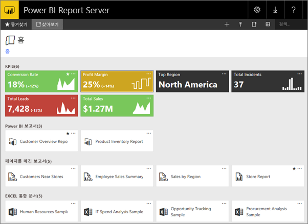
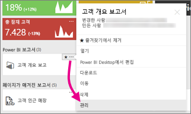
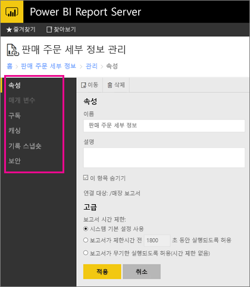

# 웹 포털에서 콘텐츠 관리 
Power BI Report Server 웹 포털은 Power BI, 모바일, 페이지가 매겨진 보고서 및 KPI를 보고, 저장하고 관리하는 온-프레미스 위치입니다.

모든 최신 브라우저에서 웹 포털을 볼 수 있습니다. 웹 포털의 폴더에서 보고서 및 KPI를 구성하고 즐겨찾기로 표시할 수 있습니다. 거기에 Excel 통합 문서를 저장할 수도 있습니다. 웹 포털에서 보고서를 만드는 데 필요한 도구를 시작할 수 있습니다.

* Power BI Desktop을 사용하여 만든 **Power BI 보고서**: 웹 포털 및 Power BI 모바일 앱에서 확인합니다.
* 보고서 작성기에서 만든 **페이지를 매긴 보고서**: 최신 수준의 고정 레이아웃 문서가 인쇄에 최적화되었습니다.
* 웹 포털에서 바로 만든 **KPI**.

웹 포털에서 Report Server 폴더를 찾거나 특정 보고서를 검색할 수 있습니다. 보고서 기록에서 보고서, 해당 일반 속성 및 캡처된 보고서의 과거 복사본을 볼 수 있습니다. 사용 권한에 따라 보고서를 구독하여 파일 시스템에 전자 메일 받은 편지함이나 공유 폴더로 전달하도록 할 수도 있습니다.

## 웹 포털 역할 및 사용 권한
웹 포털 애플리케이션은 브라우저에서 실행됩니다. 웹 포털, 페이지, 링크 및 옵션을 시작하면 Report Server에서 가진 사용 권한에 따라 표시된 항목이 달라집니다. 모든 사용 권한을 가진 역할을 할당받는 경우 Report Server를 관리하기 위한 애플리케이션 메뉴 및 페이지의 전체에 대한 액세스 권한이 있어야 합니다. 보고서를 확인하고 실행할 수 있는 사용 권한이 있는 역할을 할당받는 경우 해당 활동에 필요한 메뉴 및 페이지만 표시됩니다. 다양한 Report Server 및 단일 Report Server의 다양한 보고서 및 폴더에 대해서도 다른 역할이 할당될 수 있습니다.

## 웹 포털 시작
1. 웹 브라우저를 엽니다.
   
    [지원되는 웹 브라우저 및 버전](browser-support.md) 목록을 참조하세요.
2. 주소 표시줄에 웹 포털 URL을 입력합니다.
   
    기본적으로 URL은 <em>http://[ComputerName]/reports</em>입니다.
   
    특정 포트를 사용하도록 Report Server를 구성할 수 있습니다. 예: <em>http://[ComputerName]:80/reports</em> 또는 <em>http://[ComputerName]:8080/reports</em>
   
    웹 포털에서 항목을 이러한 범주로 그룹화했음을 확인할 수 있습니다.
   
   * KPI
   * 모바일 보고서
   * 페이지가 매겨진 보고서
   * Power BI Desktop 보고서
   * Excel 통합 문서
   * 데이터 세트
   * 데이터 소스
   * 리소스

## 웹 포털에서 항목 관리
Power BI Report Server에서는 웹 포털에 저장한 항목을 세부적으로 제어할 수 있습니다. 예를 들어, 개별로 페이지가 매겨진 보고서에서 구독, 캐싱, 스냅숏 및 보안을 설정할 수 있습니다.

1. 항목의 오른쪽 위 모서리에서 줄임표(...)를 선택하고 **관리**를 선택합니다.
   
    
2. 설정하려는 속성 또는 다른 기능을 선택합니다.
   
    
3. **적용**을 선택합니다.

[웹 포털에서 구독 작업](https://docs.microsoft.com/sql/reporting-services/working-with-subscriptions-web-portal)에 대한 자세한 내용을 알아봅니다.

## 다음 단계
[Power BI Report Server란?](get-started.md)

궁금한 점이 더 있나요? [Power BI 커뮤니티에 질문합니다.](https://community.powerbi.com/)

