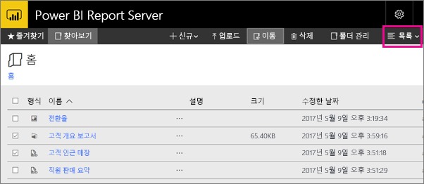

# Power BI Report Server 웹 포털 탐색
Power BI Report Server 웹 포털은 Power BI, 모바일, 페이지가 매겨진 보고서 및 KPI를 보고, 저장하고 관리하는 온-프레미스 위치입니다.

모든 최신 브라우저에서 웹 포털을 볼 수 있습니다. 웹 포털의 폴더에서 보고서 및 KPI를 구성하고 즐겨찾기로 표시할 수 있습니다. 거기에 Excel 통합 문서를 저장할 수도 있습니다. 웹 포털에서 보고서를 만드는 데 필요한 도구를 시작할 수 있습니다.

* Power BI Desktop을 사용하여 만든 **Power BI 보고서**: 웹 포털 및 Power BI 모바일 앱에서 확인합니다.
* 보고서 작성기에서 만든 **페이지가 매겨진** 보고서: 최신 수준의 고정 레이아웃 문서가 인쇄에 최적화되었습니다.
* 웹 포털에서 바로 만든 **KPI**.

웹 포털에서 Report Server 폴더를 찾거나 특정 보고서를 검색할 수 있습니다. 보고서 기록에서 보고서, 해당 일반 속성 및 캡처된 보고서의 과거 복사본을 볼 수 있습니다. 사용 권한에 따라 보고서를 구독하여 파일 시스템에 전자 메일 받은 편지함이나 공유 폴더로 전달하도록 할 수도 있습니다.

## 웹 포털 작업
다음 항목을 포함하여 많은 작업에 웹 포털을 사용할 수 있습니다.

* 보고서를 보기, 검색, 인쇄 및 구독합니다.
* 폴더 계층 구조를 만들고, 보호하고, 유지하여 서버에서 항목을 구성합니다.
* 보고서 실행 속성, 보고서 기록 및 보고서 매개 변수를 구성합니다.
* 공유 일정 및 일정 및 데이터 원본을 만들어서 일정 및 데이터 소스 연결을 보다 잘 관리할 수 있습니다.
* 데이터 기반 구독을 만들어서 여러 받는 사람에게 보고서를 전달합니다.
* 연결된 보고서를 만들어서 다른 방법으로 기존 보고서를 다시 사용하고 목적을 다시 정합니다.
* Power BI Desktop (Report Server), 보고서 작성기 및 모바일 보고서 게시자와 같은 일반 도구를 다운로드하고 엽니다.
* [KPI를 만듭니다](https://docs.microsoft.com/sql/reporting-services/working-with-kpis-in-reporting-services).
* 사용자 의견을 보내거나 기능을 요청합니다.
* [웹 포털 브랜딩](https://docs.microsoft.com/sql/reporting-services/branding-the-web-portal)
* [KPI 작업](https://docs.microsoft.com/sql/reporting-services/working-with-kpis-in-reporting-services)
* [공유 데이터 집합 작업](https://docs.microsoft.com/sql/reporting-services/work-with-shared-datasets-web-portal)

## 웹 포털 역할 및 사용 권한
웹 포털은 브라우저에서 실행되는 웹 응용 프로그램입니다. 웹 포털, 페이지, 링크 및 옵션을 시작하면 Report Server에서 가진 사용 권한에 따라 표시된 항목이 달라집니다. 모든 사용 권한을 가진 역할을 할당받는 경우 Report Server를 관리하기 위한 응용 프로그램 메뉴 및 페이지의 전체에 대한 액세스 권한이 있어야 합니다. 보고서를 확인하고 실행할 수 있는 사용 권한이 있는 역할을 할당받는 경우 해당 활동에 필요한 메뉴 및 페이지만 표시됩니다. 다양한 Report Server 및 단일 Report Server의 다양한 보고서 및 폴더에 대해서도 다른 역할이 할당될 수 있습니다.

## 웹 포털 시작
1. 웹 브라우저를 엽니다.
   
    [지원되는 웹 브라우저 및 버전](browser-support.md) 목록을 참조하세요.
2. 주소 표시줄에 웹 포털 URL을 입력합니다.
   
    기본적으로 URL은 *http://[ComputerName]/reports*입니다.
   
    특정 포트를 사용하도록 Report Server를 구성할 수 있습니다. 예: *http://[ComputerName]:80/reports* 또는 *http://[ComputerName]:8080/reports*
   
    웹 포털에서 항목을 이러한 범주로 그룹화했음을 확인할 수 있습니다.
   
   * KPI
   * 모바일 보고서
   * 페이지가 매겨진 보고서
   * Power BI Desktop 보고서
   * Excel 통합 문서
   * 데이터 집합
   * 데이터 소스
   * 리소스

## Power BI Desktop 보고서 만들기 및 편집(.pbix 파일)
웹 포털에서 Power BI Desktop 보고서에 대한 사용 권한을 보고, 업로드하고, 만들고, 구성하고, 관리할 수 있습니다.

### Power BI Desktop 보고서 만들기
1. **새로 만들기** > **Power BI 보고서**를 선택합니다.
   
    
   
    Power BI Desktop 앱을 엽니다.
   
    
2. Power BI 보고서를 만듭니다. 자세한 내용은 [빠른 시작: Power BI 보고서](quickstart-create-powerbi-report.md)를 참조하세요.
3. Report Server에 보고서를 업로드합니다.

### 기존 Power BI Desktop 보고서 편집
1. 보고서 타일 > **Power BI Desktop에서 편집**의 오른쪽 위 모서리에서 줄임표(**...**)를 선택합니다.
   
    
   
    Power BI Desktop 앱을 엽니다.
2. 내용을 변경하고 저장합니다... [방법?]

## 페이지가 매겨진 보고서 만들기 및 편집(.rdl 파일)
웹 포털에서 페이지가 매겨진 보고서에 대한 사용 권한을 보고, 업로드하고, 만들고, 구성하고, 관리할 수 있습니다.

### 페이지가 매겨진 보고서 만들기
1. **새로 만들기** > **페이지가 매겨진 보고서**를 선택합니다.
   
    보고서 작성기 앱이 열립니다.
   
    
2. 페이지가 매겨진 보고서를 만듭니다. 자세한 내용은 [빠른 시작: 페이지가 매겨진 보고서](quickstart-create-paginated-report.md)를 참조하세요.
3. Report Server에 보고서를 업로드합니다.

### 페이지가 매겨진 기존 보고서 편집
1. 보고서 타일 > **보고서 작성기에서 편집**의 오른쪽 위 모서리에서 줄임표(...)를 선택합니다.
   
    
   
    보고서 작성기 앱이 열립니다.
2. 내용을 변경하고 저장합니다.

## Excel 통합 문서를 업로드하고 구성합니다.
웹 포털에서 Power BI Desktop 보고서 및 Excel 통합 문서에 대한 사용 권한을 업로드하고, 구성하고, 관리할 수 있습니다. 웹 포털 내에서 함께 그룹화될 예정입니다.

통합 문서는 다른 리소스 파일과 비슷하게 Power BI Report Server 내에 저장됩니다. 통합 문서 중 하나를 선택하면 데스크톱에 로컬로 다운로드됩니다. Report Server에 다시 업로드하여 변경한 내용을 저장할 수 있습니다.

## 웹 포털에서 항목 관리
Power BI Report Server에서는 웹 포털에 저장한 항목을 세부적으로 제어할 수 있습니다. 예를 들어, 개별로 페이지가 매겨진 보고서에서 구독, 캐싱, 스냅숏 및 보안을 설정할 수 있습니다.

1. 항목의 오른쪽 위 모서리에서 줄임표(...)를 선택하고 **관리**를 선택합니다.
   
    
2. 설정하려는 속성 또는 다른 기능을 선택합니다.
   
    
3. **적용**을 선택합니다.

[웹 포털에서 구독 작업](https://docs.microsoft.com/sql/reporting-services/working-with-subscriptions-web-portal)에 대한 자세한 내용을 알아봅니다.

## 즐겨찾는 보고서 및 KPI 태그
즐겨찾기에 추가하려는 보고서 및 KPI를 태그로 지정할 수 있습니다. 웹 포털 및 Power BI 모바일 앱 모두에서 단일 즐겨찾기 폴더에 수집되기 때문에 쉽게 찾을 수 있습니다. 

1. 즐겨찾기에 추가하려는 KPI 또는 보고서의 오른쪽 위 모퉁이에서 줄임표(**...**)를 선택하고 **즐겨찾기에 추가**를 선택합니다.
   
    
2. 웹 포털의 즐겨찾기 페이지에서 다른 즐겨찾기와 함께 보려는 **즐겨찾기**를 웹 포털 리본에서 선택합니다.
   
    
   
    이제 Power BI 모바일 앱에서 Power BI 서비스의 즐겨 찾는 대시보드에 함께 다음과 같은 즐겨찾기가 표시됩니다.
   
    

## 웹 포털에서 항목 숨기기 및 보기
웹 포털에서 항목을 숨길 수 있고 숨겨진 항목을 표시하도록 선택할 수 있습니다.

### 항목 숨기기
1. 항목의 오른쪽 위 모서리에서 줄임표(...)를 선택하고 **관리**를 선택합니다.
   
    
2. **이 항목 숨기기**를 선택합니다.
   
    
3. **적용**을 선택합니다.

### 숨겨진 항목 보기
1. 오른쪽 위 모서리 > **숨겨진 항목 표시**에서 **타일**(또는 **목록**)을 선택합니다.
   
    항목이 나타납니다. 회색으로 표시되지만 열고 편집할 수 있습니다.
   
    

## 항목 검색
검색 팀을 입력할 수 있으며 액세스할 수 있는 모든 항목이 표시됩니다. 결과는 KPI, 보고서, 데이터 집합 및 기타 항목으로 분류됩니다. 그런 다음 결과를 조작하고 즐겨찾기를 추가할 수 있습니다.  

## 목록 보기에서 항목 이동 또는 삭제
기본적으로 웹 포털은 타일 보기에 해당 콘텐츠를 표시합니다.

한 번에 여러 항목을 쉽게 이동하거나 삭제하는 목록 보기로 전환할 수 있습니다. 

1. **타일** > **목록**을 선택합니다.
   
    
2. 항목을 선택한 다음 **이동** 또는 **삭제**를 선택합니다.

## 다음 단계
[사용자 안내서](user-handbook-overview.md)  
[빠른 시작: 페이지가 매겨진 보고서](quickstart-create-paginated-report.md)  
[빠른 시작: Power BI 보고서](quickstart-create-powerbi-report.md)

궁금한 점이 더 있나요? [Power BI 커뮤니티에 질문합니다.](https://community.powerbi.com/)

