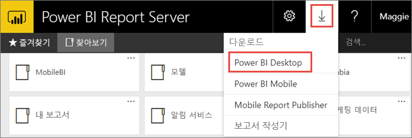
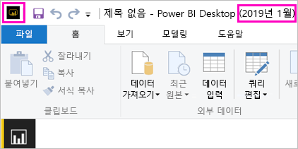
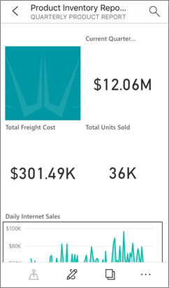

# Power BI Report Server에 최적화된 Power BI Desktop 설치
Power BI Report Server에 최적화된 Power BI Desktop을 설치하는 방법에 대해 자세히 알아봅니다.

Power BI Report Server에 대한 Power BI 보고서를 만들려면 Power BI Report Server에 최적화된 Power BI Desktop을 다운로드하여 설치해야 합니다. 이 릴리스는 Power BI 서비스와 함께 사용되는 Power BI Desktop과 다릅니다. 예를 들어 Power BI 서비스용 Power BI Desktop 버전은 릴리스된 후에만 Power BI Report Server 버전에서 사용할 수 있는 미리 보기 기능을 포함합니다. 이 릴리스를 사용하면 보고서 서버가 알려진 버전의 보고서 및 모델과 상호 작용할 수 있습니다. 

다행스럽게도 Power BI Desktop 및 Power BI Report Server에 최적화된 Power BI Desktop을 같은 컴퓨터에 모두 설치할 수 있습니다.

## Power BI Desktop 다운로드 및 설치

Power BI Report Server에 최적화된 최신 버전의 Power BI Desktop을 유지하는 가장 쉬운 방법은 보고서 서버의 웹 포털에서 시작하는 것입니다.

1. 보고서 서버 웹 포털에서 **다운로드** 화살표 > **Power BI Desktop**을 선택합니다.

    

    또는 Microsoft 다운로드 센터에서 [Microsoft Power BI Desktop](https://go.microsoft.com/fwlink/?linkid=2055039)(Power BI Report Server에 최적화 - 2019년 1월)으로 바로 이동합니다.

2. 다운로드 센터 페이지에서 **다운로드**를 선택합니다.

3. 컴퓨터에 따라 다음 중에서 선택합니다. 

    - **PBIDesktopRS.msi**(32비트 버전) 또는

    - **PBIDesktopRS_x64.msi**(64비트 버전).

1. 설치 프로그램을 다운로드한 후에는 Power BI Desktop(2019년 1월) 설치 마법사를 실행합니다.

2. 설치가 끝나면 **지금 Power BI Desktop 시작**을 선택합니다.
   
    그러면 자동으로 시작되어 사용할 준비가 됩니다.

## 올바른 버전을 사용하는지 확인
올바른 Power BI Desktop을 사용하는지 쉽게 확인할 수 있습니다. Power BI Desktop 내에서 시작 화면 또는 제목 표시줄을 확인하세요. 제목 표시줄은 릴리스 월과 연도를 표시합니다. 또한 Power BI 로고 색은 역으로 노란색 바탕에 검은색이 아닌 검은색 바탕에 노란색입니다.

Power BI 서비스용 Power BI Desktop 버전은 제목 표시줄에 월 및 연도가 없습니다.

## 파일 확장명 연결
동일한 머신에 Power BI Desktop 및 Power BI Report Server에 최적화된 Power BI Desktop을 모두 설치한 경우 가장 최근에 설치된 Power BI Desktop이 .pbix 파일과 연결됩니다. 따라서 .pbix 파일을 두 번 클릭하면 가장 최근에 설치된 Power BI Desktop을 시작합니다.

Power BI Desktop을 설치한 다음, Power BI Report Server에 최적화된 Power BI Desktop을 설치한 경우 기본적으로 Power BI Report Server에 최적화된 Power BI Desktop에 있는 모든 pbix 파일이 열립니다. pbix 파일을 열 때 Power BI Desktop을 시작하도록 기본값으로 설정하려는 경우 [Microsoft Store에서 Power BI Desktop](http://aka.ms/pbidesktopstore)을 다시 설치합니다.

먼저 사용하려는 버전의 Power BI Desktop을 열 수 있습니다. 그런 다음 Power BI Desktop 내에서 파일을 엽니다.

Power BI Report Server 내에서 Power BI 보고서를 편집하거나 웹 포털에서 새 Power BI 보고서를 만들면 올바른 버전의 Power BI Destop이 열립니다.

## 고려 사항 및 제한 사항
Power BI Report Server, Power BI 서비스(http://app.powerbi.com)) 및 Power BI 모바일 앱의 Power BI 보고서는 거의 동일한 역할을 담당하지만 몇 가지 다른 기능이 있습니다.

### 브라우저에서
Power BI Report Server 보고서는 다음을 비롯한 모든 시각화를 지원합니다.

* 사용자 지정 시각적 개체

Power BI Report Server 보고서는 다음 항목을 지원하지 않습니다.

* R 시각적 개체
* ArcGIS 맵
* 현재 위치
* Power BI Desktop 미리 보기 기능

### Power BI 모바일 앱에서
Power BI Report Server 보고서는 [Power BI 모바일 앱](../consumer/mobile/mobile-apps-for-mobile-devices.md)에서 다음을 비롯한 모든 기본 기능을 지원합니다.

* [전화 보고서 레이아웃](../desktop-create-phone-report.md): Power BI 모바일 앱에 보고서를 최적화할 수 있습니다. 휴대폰에서 최적화된 보고서에는 특수 아이콘  및 레이아웃이 포함됩니다.
  
    

Power BI Report Server 보고서는 Power BI 모바일 앱에서 다음과 같은 기능을 지원하지 않습니다.

* R 시각적 개체
* ArcGIS 맵
* 사용자 지정 시각적 개체
* 현재 위치
* 지역 필터링 또는 막대 코드

## 이전 버전의 Power BI Report Server에 대한 Power BI Desktop

보고서 서버가 이전 버전이면 해당 버전의 Power BI Desktop이 필요합니다. 이전 버전은 다음과 같습니다.

- Microsoft Power BI Desktop([Power BI Report Server에 최적화됨 - 2018년 8월](https://www.microsoft.com/download/details.aspx?id=57271))

## 다음 단계
Power BI Desktop을 설치했으므로 Power BI 보고서를 작성하기 시작할 수 있습니다.

[Power BI Report Server용 Power BI 보고서 만들기](quickstart-create-powerbi-report.md)  
[Power BI Report Server란?](get-started.md)

궁금한 점이 더 있나요? [Power BI 커뮤니티에 질문합니다.](https://community.powerbi.com/)

