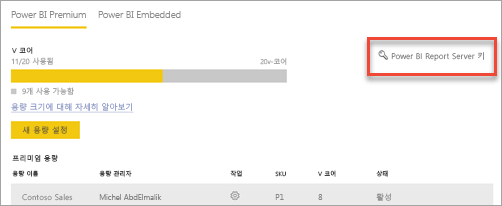
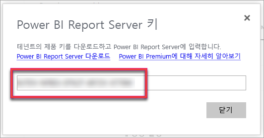
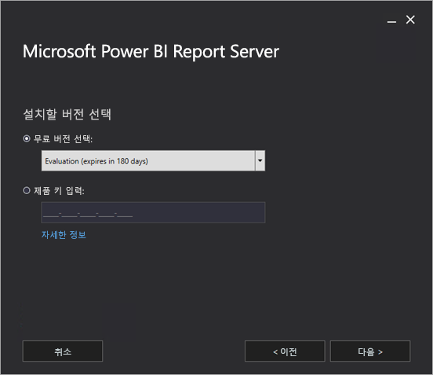
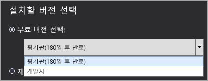
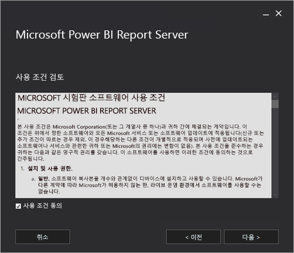
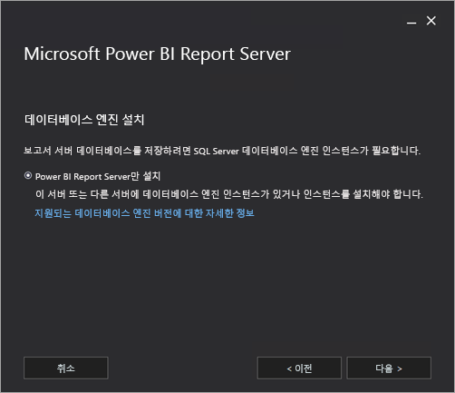
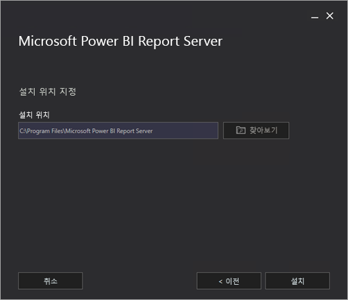
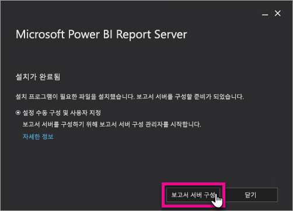
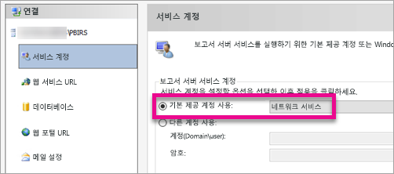
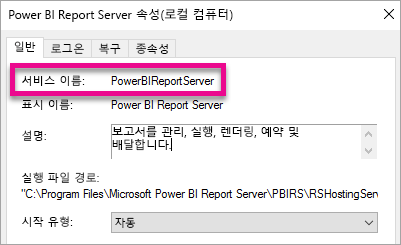

# Power BI Report Server 설치

Power BI Report Server를 설치하는 방법을 알아봅니다.

 **다운로드** 

Power BI Report Server를 다운로드하려면 [Power BI Report Server를 사용하여 온-프레미스 보고](https://powerbi.microsoft.com/report-server/)로 이동하고 **평가판 다운로드**를 선택합니다. 

## 시작하기 전에
Power BI Report Server를 설치하기 전에 [Power BI Report Server를 설치하기 위한 하드웨어 및 소프트웨어 요구 사항](system-requirements.md)을 검토하는 것이 좋습니다.

### Power BI Report Server 제품 키

#### Power BI 프리미엄
Power BI 프리미엄을 구입한 경우 Power BI 관리자 포털의 **프리미엄 설정** 탭 내에서 Power BI Report Server 제품 키에 대한 액세스를 갖습니다. 전역 관리자 또는 Power BI 서비스 관리자 역할에 할당된 사용자만 사용 가능합니다.

**Power BI Report Server 키**를 선택하면 제품 키를 포함하는 대화 상자가 표시됩니다. 복사하고 설치와 함께 사용할 수 있습니다.

#### SQL Server Enterprise SA(Software Assurance)
SQL Server Enterprise SA 규약이 있는 경우 [볼륨 라이선스 서비스 센터](https://www.microsoft.com/Licensing/servicecenter/)에서 제품 키를 가져올 수 있습니다.

## 보고서 서버 설치
Power BI Report Server를 간단히 설치할 수 있습니다. 몇 가지 단계를 거쳐 파일을 설치할 수 있습니다.

설치 시에 SQL Server 데이터베이스 엔진 서버를 사용할 필요가 없습니다. 설치 후에 Reporting Services를 구성하려면 해당 항목이 필요합니다.

1. PowerBIReportServer.exe의 위치를 확인하고 설치 관리자를 시작합니다.
2. **Power BI Report Server 설치**를 선택합니다.
   
    
3. 설치할 버전을 선택하고 **다음**을 선택합니다.
   
    
   
    드롭다운에서 Evaluation 또는 Developer 버전을 선택할 수 있습니다.
   
    
   
    그렇지 않은 경우 Power BI 서비스 또는 볼륨 라이선스 서비스 센터에서 획득한 서버에 대한 제품 키를 입력할 수 있습니다. 제품 키를 가져오는 방법에 대한 자세한 내용은 [시작하기 전에](#before-you-begin) 섹션을 참조하세요.
4. 사용 약관 및 조건을 읽고 동의한 후 **다음**을 선택합니다.
   
    
5. Report Server 데이터베이스를 저장할 수 있는 데이터베이스 엔진이 있어야 합니다. **다음**을 선택하여 Report Server만을 설치합니다.
   
    
6. Report Server의 설치 위치를 지정합니다. **설치**를 선택하여 계속합니다.
   
    
   
    기본 경로는 C:\Program Files\Microsoft Power BI Report Server입니다.

1. 성공적으로 설치한 후에 **Report Server 구성**을 선택하여 Reporting Services 구성 관리자를 시작합니다.
   
    

## Report Server 구성

설치 시에 **Report Server 구성**을 선택하면 Reporting Services 구성 관리자에 표시됩니다. 자세한 내용은 [Reporting Services 구성 관리자](https://docs.microsoft.com/sql/reporting-services/install-windows/reporting-services-configuration-manager-native-mode)를 참조하세요.

[Report Server 데이터베이스를 만들어서](https://docs.microsoft.com/sql/reporting-services/install-windows/ssrs-report-server-create-a-report-server-database) Reporting Services의 초기 구성을 완료해야 합니다. SQL Server 데이터베이스 서버는 이 단계를 완료해야 합니다.

### 다른 서버에 데이터베이스 만들기
다른 컴퓨터의 데이터베이스 서버에서 Report Server 데이터베이스를 만드는 경우 Report Server의 서비스 계정을 데이터베이스 서버에서 인식되는 자격 증명으로 변경해야 합니다. 

기본적으로 Report Server는 가상 서비스 계정을 사용합니다. 다른 서버에 데이터베이스를 만들려고 하는 경우 연결 권한 적용 단계에서 다음과 같은 오류가 나타날 수 있습니다.

`System.Data.SqlClient.SqlException (0x80131904): Windows NT user or group '(null)' not found. Check the name again.`

이 오류를 해결하려면 서비스 계정을 네트워크 서비스 또는 도메인 계정으로 변경하면 됩니다. 서비스 계정을 네트워크 서비스로 변경하면 Report Server에 대한 컴퓨터 계정의 컨텍스트에서 권한이 적용됩니다.

자세한 내용은 [Report Server 서비스 계정 구성](https://docs.microsoft.com/sql/reporting-services/install-windows/configure-the-report-server-service-account-ssrs-configuration-manager)을 참조하세요.

## Windows 서비스
Windows 서비스는 설치의 일부로 생성됩니다. **Power BI Report Server**로 표시됩니다. 서비스 이름은 **PowerBIReportServer**입니다.

## 기본 URL 예약
URL 예약은 접두사, 호스트 이름, 포트 및 가상 디렉터리로 구성됩니다.

| 부분 | 설명 |
| --- | --- |
| 접두사 |기본 접두사는 HTTP입니다. 이전에 SSL(Secure Sockets Layer) 인증서를 설치한 경우 설치 마법사에서는 HTTPS 접두사를 사용하는 URL 예약을 만들려고 합니다. |
| 호스트 이름 |기본 호스트 이름은 강력한 와일드 카드(+)입니다. Report Server가 `http://<computername>/reportserver`, `http://localhost/reportserver` 또는`http://<IPAddress>/reportserver.`을 비롯하여 컴퓨터로 확인되는 호스트 이름에 지정된 포트에서 HTTP 요청을 수락하도록 지정합니다. |
| 포트 |기본 포트는 80입니다. 포트 80이 아닌 포트를 사용하는 경우 브라우저 창에서 웹 포털을 열 때 명시적으로 URL에 추가해야 합니다. |
| 가상 디렉터리 |기본적으로 가상 디렉터리는 Report Server 웹 서비스 및 웹 포털의 보고서에서 ReportServer라는 형식으로 만들어집니다. Report Server 웹 서비스의 경우 기본 가상 디렉터리는 **reportserver**입니다. 웹 포털의 경우 기본 가상 디렉터리는 **reports**입니다. |

전체 URL 문자열의 예는 다음과 같을 수 있습니다.

* `http://+:80/reportserver`은 Report Server에 대한 액세스를 제공합니다.
* `http://+:80/reports`은 웹 포털에 대한 액세스를 제공합니다.

## 방화벽
원격 컴퓨터에서 Report Server에 액세스하면 방화벽이 있는 경우 방화벽 규칙을 구성했는지 확인하려고 합니다.

웹 서비스 URL 및 웹 포털 URL에 대해 구성된 TCP 포트를 열어야 합니다. 기본적으로 TCP 포트 80에서 구성됩니다.

## 추가 구성
* 보고서 항목을 Power BI 대시보드에 고정할 수 있도록 Power BI 서비스와 통합을 구성하려면 [Power BI 서비스와 통합](https://docs.microsoft.com/sql/reporting-services/install-windows/power-bi-report-server-integration-configuration-manager)을 참조하세요.
* 구독 처리를 위해 이메일을 구성하려면 [이메일 설정](https://docs.microsoft.com/sql/reporting-services/install-windows/e-mail-settings-reporting-services-native-mode-configuration-manager) 및 [Report Server에서 이메일 전달](https://docs.microsoft.com/sql/reporting-services/subscriptions/e-mail-delivery-in-reporting-services)을 참조하세요.
* 보고서를 보고 관리하기 위해 보고서 컴퓨터에 액세스할 수 있도록 웹 포털을 구성하려면 [Report Server 액세스를 위한 방화벽 구성](https://docs.microsoft.com/sql/reporting-services/report-server/configure-a-firewall-for-report-server-access) 및 [원격 관리를 위한 Report Server 구성](https://docs.microsoft.com/sql/reporting-services/report-server/configure-a-report-server-for-remote-administration)을 참조하세요.

## 다음 단계
[관리자 개요](admin-handbook-overview.md)  
[보고서 서버 제품 키를 확인하는 방법](find-product-key.md)  
[Power BI Report Server에 최적화된 Power BI Desktop 설치](install-powerbi-desktop.md)  
[Reporting Services 설치 확인](https://docs.microsoft.com/sql/reporting-services/install-windows/verify-a-reporting-services-installation)  
[Report Server 서비스 계정 구성](https://docs.microsoft.com/sql/reporting-services/install-windows/configure-the-report-server-service-account-ssrs-configuration-manager)  
[Report Server URL 구성](https://docs.microsoft.com/sql/reporting-services/install-windows/configure-report-server-urls-ssrs-configuration-manager)  
[Report Server 데이터베이스 연결 구성](https://docs.microsoft.com/sql/reporting-services/install-windows/configure-a-report-server-database-connection-ssrs-configuration-manager)  
[Report Server 초기화](https://docs.microsoft.com/sql/reporting-services/install-windows/ssrs-encryption-keys-initialize-a-report-server)  
[Report Server에서 SSL 연결 구성](https://docs.microsoft.com/sql/reporting-services/security/configure-ssl-connections-on-a-native-mode-report-server)  
[Windows 서비스 계정 및 사용 권한 구성](https://docs.microsoft.com/sql/database-engine/configure-windows/configure-windows-service-accounts-and-permissions)  
[Power BI Report Server에 대한 브라우저 지원](browser-support.md)

궁금한 점이 더 있나요? [Power BI 커뮤니티에 질문합니다.](https://community.powerbi.com/)

