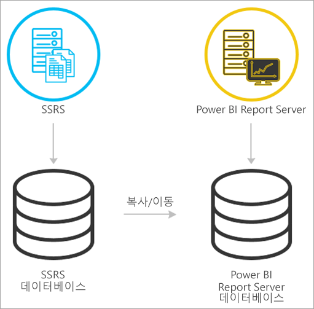
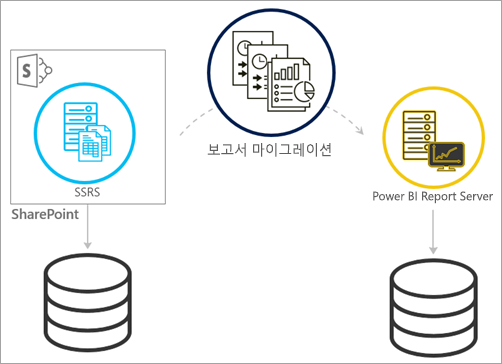
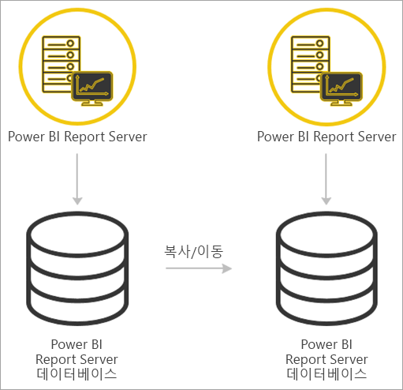

# <a name="migrate-a-report-server-installation"></a>Report Server 설치 마이그레이션
Power BI Report Server의 인스턴스로 기존 SSRS(SQL Server Reporting Services) 인스턴스를 마이그레이션하는 방법에 대해 알아봅니다.

마이그레이션은 응용 프로그램 데이터 파일을 새 Power BI Report Server 인스턴스로 이동하는 것으로 정의됩니다. 설치를 마이그레이션하는 일반적인 이유는 다음과 같습니다.

* SQL Server Reporting Services를 Power BI Report Server로 이동하려고 합니다.
  
  > [!NOTE]
  > SQL Server Reporting Services에서 Power BI Report Server로 업그레이드할 수 없습니다. 마이그레이션이 필요합니다.
  > 
  > 
* 대규모 배포 또는 업데이트 요구 사항이 있습니다.
* 설치의 하드웨어 또는 토폴로지를 변경하고 있습니다.
* 업그레이드를 막는 오류가 발생했습니다.

## <a name="migrating-to-power-bi-report-server-from-ssrs-native-mode"></a>SSRS(기본 모드)에서 Power BI Report Server로 마이그레이션
SSRS(기본 모드) 인스턴스에서 Power BI Report Server로 마이그레이션하는 작업은 몇 가지 단계로 구성됩니다.



> [!NOTE]
> SQL Server 2008 Reporting Services 이상은 마이그레이션을 지원합니다.
> 
> 

* 데이터베이스, 응용 프로그램 및 구성 파일을 백업합니다.
* 암호화 키를 백업합니다.
* 보고서를 호스팅하는 Report Server 데이터베이스를 복제합니다.
* Power BI Report Server를 설치합니다. 동일한 하드웨어를 사용하는 경우 SSRS 인스턴스와 동일한 서버에서 Power BI Report Server를 설치할 수 있습니다. Power BI Report Server를 설치하는 방법에 자세한 정보는 [Power BI Report Server 설치](install-report-server.md)를 참조하세요.

> [!NOTE]
> Power BI Report Server의 인스턴스 이름은 *PBIRS*입니다.
> 
> 

* Report Server 구성 관리자를 사용하여 Report Server를 구성하고 복제된 데이터베이스에 연결합니다.
* SSRS(기본 모드) 인스턴스에 필요한 정리를 수행합니다.

## <a name="migration-to-power-bi-report-server-from-ssrs-sharepoint-integrated-mode"></a>SSRS(SharePoint 통합 모드)에서 Power BI Report Server로 마이그레이션합니다.
SSRS(SharePoint 통합 모드)에서 Power BI Report Server로 마이그레이션하는 작업은 기본 모드처럼 즉시 수행되지 않습니다. 이러한 단계에서 몇 가지 지침을 제공하는 반면 이러한 단계 외부에서 관리해야 하는 SharePoint 내에 다른 파일 및 자산이 있을 수 있습니다.



SharePoint에서 Power BI Report Server로 특정 Report Server 콘텐츠를 마이그레이션해야 합니다. 여기에서는 사용자 환경에 Power BI Report Server를 이미 설치했다고 가정합니다. Power BI Report Server를 설치하는 방법에 자세한 정보는 [Power BI Report Server 설치](install-report-server.md)를 참조하세요.

SharePoint 환경에서 Power BI Report Server로 Report Server 콘텐츠를 복사하려는 경우 **rs.exe**와 같은 도구를 사용하여 콘텐츠를 복사해야 합니다. SharePoint에서 Power BI Report Server로 Report Server 콘텐츠를 복사하기 위한 스크립트의 샘플은 아래와 같습니다.

> [!NOTE]
> 샘플 스크립트는 SharePoint 2010 이상 및 SQL Server 2008 Reporting Services 이상에서 작동해야 합니다.
> 
> 

### <a name="sample-script"></a>샘플 스크립트
```
Sample Script
rs.exe
-i ssrs_migration.rss -e Mgmt2010
-s http://SourceServer/_vti_bin/reportserver
-v st="sites/bi" -v f="Shared Documents“
-u Domain\User1 -p Password
-v ts=http://TargetServer/reportserver
-v tu="Domain\User" -v tp="Password"
```

## <a name="migrateing-from-one-power-bi-report-server-to-another"></a>Power BI Report Server 간에 마이그레이션
Power BI Reprot Server에서 마이그레이션하는 작업은 SSRS(기본 모드)에서 마이그레이션하는 작업과 동일한 프로세스입니다.



* 데이터베이스, 응용 프로그램 및 구성 파일을 백업합니다.
* 암호화 키를 백업합니다.
* 보고서를 호스팅하는 Report Server 데이터베이스를 복제합니다.
* Power BI Report Server를 설치합니다. Power BI Report Server를 마이그레이션하는 것과 동일한 서버에 설치할 수 *없습니다*. Power BI Report Server를 설치하는 방법에 자세한 정보는 [Power BI Report Server 설치](install-report-server.md)를 참조하세요.

> [!NOTE]
> Power BI Report Server의 인스턴스 이름은 *PBIRS*입니다.
> 
> 

* Report Server 구성 관리자를 사용하여 Report Server를 구성하고 복제된 데이터베이스에 연결합니다.
* 이전 Power BI Report Server 설치에 필요한 정리를 수행합니다.

## <a name="next-steps"></a>다음 단계
[관리자 안내서](admin-handbook-overview.md)  
[빠른 시작: Power BI Report Server 설치](quickstart-install-report-server.md)  
[rs.exe 유틸리티 및 웹 서비스를 사용하는 스크립트](https://docs.microsoft.com/sql/reporting-services/tools/script-with-the-rs-exe-utility-and-the-web-service)

궁금한 점이 더 있나요? [Power BI 커뮤니티에 질문합니다.](https://community.powerbi.com/)

