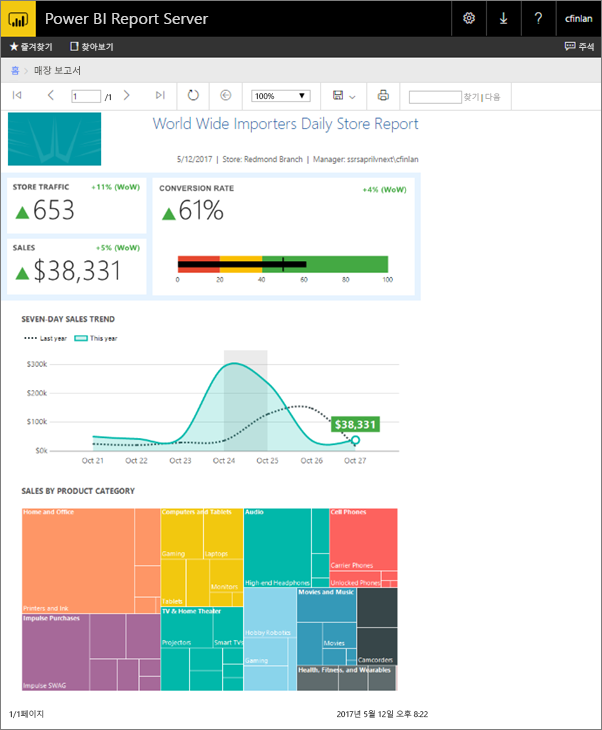
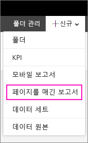
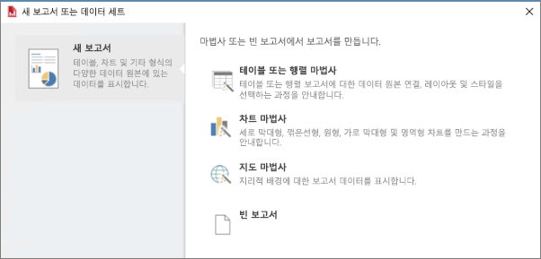
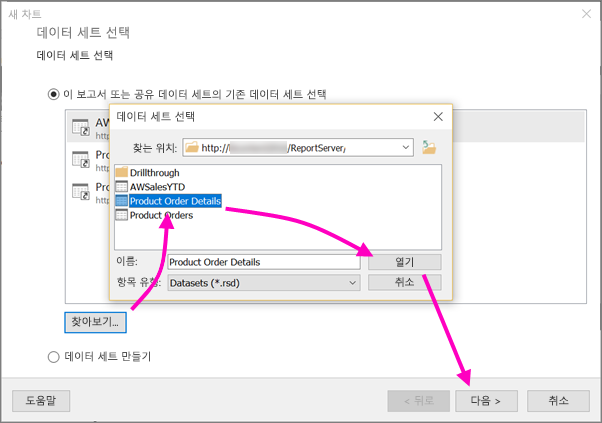
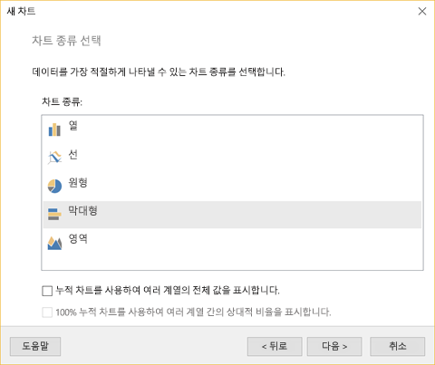
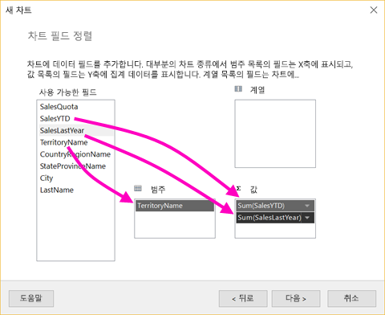
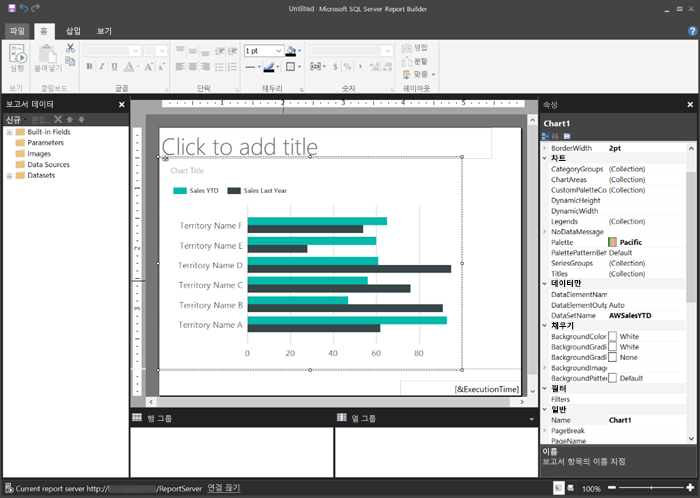
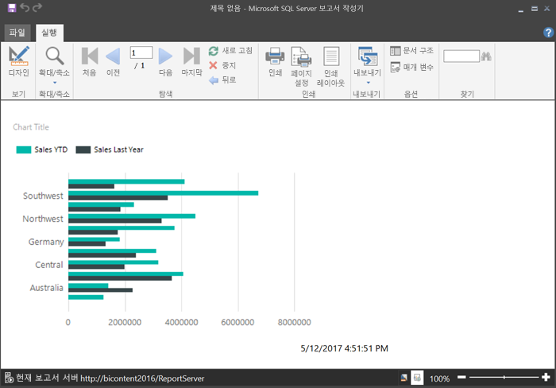
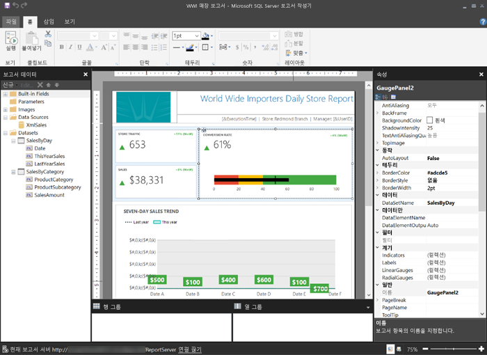

# 빠른 시작: Power BI Report Server에 페이지가 매겨진 보고서 만들기
이름에서 알 수 있듯이 여러 페이지에서 페이지가 매겨진 보고서를 실행할 수 있습니다. 고정된 형식으로 만들어졌으며 정확한 사용자 지정을 제공합니다. 페이지가 매겨진 보고서는 .rdl 파일입니다.

SSRS(SQL Server Reporting Services) 웹 포털의 경우와 마찬가지로 Power BI Report Server 웹 포털에서 페이지가 매겨진 보고서를 저장하고 관리할 수 있습니다. SSDT(SQL Server Data Tools)의 보고서 작성기 또는 보고서 디자이너에서 만들고 편집한 다음 웹 포털에 게시합니다. 그런 다음 조직의 보고서 판독기는 해당 모바일 장치의 브라우저 또는 Power BI 모바일 앱에서 해당 보고서를 볼 수 있습니다.

보고서 작성기나 보고서 디자이너에서 페이지가 매겨진 보고서를 만든 경우 Power BI Report Server에 페이지가 매겨진 보고서를 만들 준비가 되었습니다. 그렇지 않은 경우 작업을 시작하는 빠른 단계는 다음과 같습니다.

## 1단계: 보고서 작성기 설치 및 시작
SSRS 서버에 보고서를 만들기 위해 보고서 작성기를 이미 설치했을 수 있습니다. Power BI Report Server에 보고서를 만들기 위해 동일한 버전 이상의 보고서 작성기를 사용할 수 있습니다. 설치하지 않은 경우 프로세스가 쉽습니다.

1. Power BI Report Server 웹 포털에서 **새로 만들기** > **페이지가 매겨진 보고서**를 선택합니다.
   
    
   
    보고서 작성기를 아직 설치하지 않은 경우 이를 통해 지금 설치 프로세스를 수행합니다.
2. 설치된 후 보고서 작성기는 **새 보고서 또는 데이터 집합** 화면에 열립니다.
   
    
3. 생성하려는 종류의 보고서에 대한 마법사를 선택합니다.
   
   * 테이블 또는 행렬
   * 차트
   * 맵
   * 비어 있음
4. 차트 마법사를 시작해 보겠습니다.
   
    차트 마법사는 보고서에서 기본 차트를 만드는 단계를 설명합니다. 여기에서 무제한에 가까운 방법으로 보고서를 사용자 지정할 수 있습니다.

## 2단계: 차트 마법사 설명
차트 마법사는 보고서에서 시각화를 만드는 기본 단계를 설명합니다.

페이지가 매겨진 보고서는 Microsoft SQL Server와 Microsoft Azure SQL Database 및 Oracle, Hyperion 등과 같은 다양한 데이터 소스에 연결할 수 있습니다. [페이지가 매겨진 보고서에서 지원하는 데이터 소스](connect-data-sources.md)에 대해 참고하세요.

차트 마법사의 첫 번째 페이지, **데이터 집합 선택**에서 데이터 집합을 만들거나 서버에 대한 공유 데이터 집합을 선택할 수 있습니다. *데이터 집합*은 외부 데이터 원본에 대한 쿼리에서 보고서 데이터를 반환합니다.

1. **찾아보기** > 서버에서 공유 데이터 집합 선택 > **열기** > **다음**을 선택합니다.
   
    
   
     데이터 집합을 만들어야 하나요? [공유 또는 포함된 데이터 집합 만들기](https://docs.microsoft.com/sql/reporting-services/report-data/create-a-shared-dataset-or-embedded-dataset-report-builder-and-ssrs)를 참조하세요.
2. 이 경우에는 차트 유형에서 가로 막대형 차트를 선택합니다.
   
    
3. **범주**, **시리즈** 및 **값** 상자에 끌어 놓아서 필드를 정렬합니다.
   
    
4. **다음** > **마침**을 선택합니다.

## 3단계: 보고서 디자인
이제 보고서 디자인 보기입니다. 데이터는 사용자 데이터가 아닌 자리 표시자 데이터입니다.

* 데이터를 보려면 **실행**을 선택합니다.
  
     
* 디자인 보기로 돌아가려면 **디자인**을 선택합니다.

방금 만든 차트를 수정하여 레이아웃, 값, 범례 등 무엇이든지 변경할 수 있습니다.

계기, 테이블, 행렬, 테이블, 맵 등 모든 종류의 다른 시각화를 추가할 수 있습니다. 여러 페이지에서 머리글과 바닥글을 추가할 수 있습니다. [보고서 작성기 자습서](https://docs.microsoft.com/sql/reporting-services/report-builder-tutorials)를 참조하여 사용해보세요.

## 4단계: Report Server에 보고서 저장
보고서가 준비되면 Power BI Report Server에 저장합니다.

1. **파일** 메뉴에서 **다음 이름으로 저장**을 선택하고 보고서 서버에 저장합니다. 
2. 이제 브라우저에서 볼 수 있습니다.
   
    

## 다음 단계
SQL Server Data Tools의 보고서 작성기 및 보고서 디자이너에서 보고서를 디자인하기 위한 많은 유용한 리소스가 있습니다. 보고서 작성기 자습서를 시작하는 것이 좋습니다.

* [보고서 작성기 자습서](https://docs.microsoft.com/sql/reporting-services/report-builder-tutorials)
* [Power BI Report Server 사용자 안내서](user-handbook-overview.md)  

궁금한 점이 더 있나요? [Power BI 커뮤니티에 질문합니다.](https://community.powerbi.com/)

